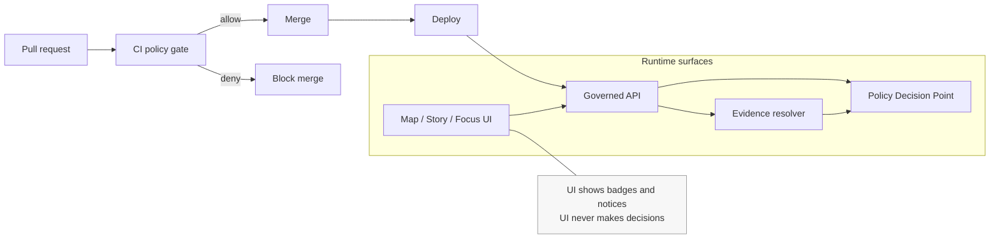

# Policy artifacts

Versioned policy vocabularies, rubrics, fixtures, and playbooks that drive Kansas Frontier Matrix governance in CI and runtime.

**Status:** Draft  
**Owners:** Reviewer/Steward, Policy Engineer  
`DEFAULT: DENY` `ENFORCEMENT: CI + RUNTIME` `EVIDENCE-FIRST` `AUDITED`

## Navigate

- [What this folder is](#what-this-folder-is)
- [Policy enforcement model](#policy-enforcement-model)
- [Minimum governance artifacts](#minimum-governance-artifacts)
- [Controlled vocabularies](#controlled-vocabularies)
- [Policy labels](#policy-labels)
- [Obligations](#obligations)
- [Sensitivity and location protection](#sensitivity-and-location-protection)
- [Licensing and rights enforcement](#licensing-and-rights-enforcement)
- [Change workflow](#change-workflow)
- [Testing and gates](#testing-and-gates)
- [Appendix proposed directory layout](#appendix-proposed-directory-layout)
- [Glossary](#glossary)

> [!WARNING]
> This directory is production-critical. Policy changes can change what KFM is allowed to publish or show. Treat every change as a governed release.

## What this folder is

This folder contains policy artifacts as data inputs and governance documentation, not application code:

- **Controlled vocabularies** used by catalogs and policy decisions.
- **Rubrics** stewards use to classify sensitivity and licensing.
- **Generalization and redaction playbooks** and required review checklists.
- **Fixtures** used to regression-test policy behavior (allow, deny, obligations).

If your repo stores policy-as-code rules elsewhere (for example as OPA Rego), this folder still owns the *human-readable rubrics* and the *machine-readable vocab + fixtures* those rules depend on.

## Policy enforcement model

KFM policy must behave the same way in CI and at runtime. The UI can display policy state, but it does not make policy decisions.



### Enforcement points

- **CI:** schema validation + fixture-driven policy tests block merges.
- **Runtime API:** policy checks before serving data or tiles.
- **Evidence resolver:** policy checks before resolving EvidenceRefs and returning EvidenceBundles.
- **UI:** shows policy badges and obligation notices; does not enforce.

## Minimum governance artifacts

These artifacts must exist (or be added) for KFM to operate governance end-to-end:

- Policy bundle repository (OPA/Rego or equivalent)
- Policy decision test fixtures (allow/deny + obligations)
- Licensing classification rubric
- Sensitivity rubric and generalization guidelines
- Review workflow definition (Promotion Queue + Story Review Queue)
- Audit ledger retention and access policy

This README focuses on the *data-side* policy artifacts: vocab, rubrics, fixtures, and playbooks.

## Controlled vocabularies

Controlled vocabularies must be versioned and treated as contracts.

### policy_label

Starter values:

- public
- public_generalized
- restricted
- restricted_sensitive_location
- internal
- embargoed
- quarantine

> [!NOTE]
> Definitions for each label should live in a versioned rubric document in this folder. Until then, treat the label list as the only stable contract.

### artifact.zone

- raw
- work
- processed
- catalog
- published

### citation.kind

- dcat
- stac
- prov
- doc
- graph
- url (discouraged)

## Policy labels

`policy_label` is required for any promoted DatasetVersion and must be carried through:

- **Catalog metadata** (DCAT/STAC) as a first-class field.
- **Governed API responses** (public-safe label only).
- **EvidenceBundle** policy section.

### Proposed label intent map

This intent map is a proposal for clarity. If the governance council defines different meanings, update this table and fixtures together.

| policy_label | Typical meaning | Public UI visibility | Allowed derivatives |
|---|---|---:|---|
| public | Safe for public access. | Yes | Standard exports/tiles allowed. |
| public_generalized | Public derivative after generalization/redaction of a restricted dataset. | Yes, with notice | Exports/tiles allowed **only** from generalized artifacts. |
| restricted | Not public. Requires authorization. | Hidden by default | Derivatives require explicit review. |
| restricted_sensitive_location | Restricted due to sensitive location risk (archaeology, sensitive species). | Hidden by default | If allowed, publish a separate `public_generalized` version. |
| internal | Visible to project team roles; not public. | Role-gated | Derivatives per rubric. |
| embargoed | Temporarily restricted until date/condition. | Hidden by default | No public derivatives until embargo lifts. |
| quarantine | Failed validation, unclear licensing, or unresolved sensitivity. Not promotable. | Hidden | No derivatives; fix upstream issues first. |

## Obligations

A policy decision is not just allow/deny. It may carry **obligations** that must be applied by the caller (API, evidence resolver, UI).

Examples of obligations:

- `show_notice`: add a user-facing notice (e.g., “Geometry generalized due to policy.”)
- `redact_fields`: remove specified fields from an export/response.
- `aggregate_min_count`: enforce minimum counts before returning results.
- `limit_bbox_precision`: coarsen spatial query precision for public outputs.
- `require_attribution`: ensure license + attribution text is included in exports.

### Obligation handling rules

1. Obligations are evaluated and attached by the policy engine.
2. Enforcement points must **apply** obligations consistently.
3. Fixtures must cover obligation scenarios so regressions are detected.

## Sensitivity and location protection

KFM handles sensitive locations and potentially sensitive personal or community-linked records. Default posture is deny-by-default for sensitive/restricted materials, with optional publication of generalized derivatives.

### Proposed default rules

- Default deny for `restricted` and `restricted_sensitive_location` unless caller role allows.
- If any public representation is allowed, produce a separate `public_generalized` DatasetVersion.
- Never leak restricted metadata in 403/404 responses.
- Do not embed precise coordinates in Story Nodes or Focus Mode outputs unless explicitly allowed.
- Treat redaction/generalization as a first-class transform and record it in provenance.

### Sensitive location release playbook

For sensitive location datasets (archaeology, sensitive species):

1. Classification: use `restricted_sensitive_location`.
2. Dual outputs:
   - restricted precise DatasetVersion
   - `public_generalized` DatasetVersion, only if public representation is allowed
3. Generalization method: choose, document, and implement (grid aggregation, dissolve, etc.).
4. Testing: confirm no precise coordinates leak via tiles, exports, logs, or story/map state.
5. UX notice: UI indicates generalization and the reason.
6. Governance review: council or designated authority approves release criteria.

## Licensing and rights enforcement

Licensing is a policy input, not paperwork.

Rules:

- Promotion requires a license and rights holder for every distribution.
- “Metadata-only reference” is allowed when rights do not allow mirroring.
- Export functions must include attribution and license text automatically.
- Story publishing must be blocked when rights are unclear for included media.

## Change workflow

All policy changes are governed changes.

### Who does what

Baseline roles:

- **Contributor:** proposes; cannot publish.
- **Reviewer/Steward:** owns policy labels and redaction rules; approves promotions and story publishing.
- **Operator:** runs pipelines; cannot override policy gates.
- **Governance council / community stewards:** authority over culturally sensitive materials; sets rules for restricted collections and public representations.

### Change steps

1. Open a PR describing the policy change and its impact.
2. Update vocab/rubrics and fixtures together.
3. Ensure fixtures cover both allow and deny outcomes for affected scenarios.
4. Steward review required for any label/rubric/fixture change.
5. Governance council review required for culturally sensitive or sensitive-location changes.
6. Merge only after CI policy tests pass.

## Testing and gates

Policy must be testable and fail closed.

### Required tests

- Fixture-driven allow/deny tests for every `policy_label`.
- Obligation tests for each obligation type.
- “No restricted leakage” tests:
  - public tiles do not reveal restricted bbox or coordinates
  - public exports exclude coordinate fields when restricted
  - errors do not reveal restricted existence (“ghost metadata”)
- Promotion gate tests:
  - policy_label assigned
  - obligations applied as required
  - default-deny behavior preserved

### Definition of done for a policy change

- [ ] Vocabulary updates are versioned and documented.
- [ ] Rubric changes include rationale and review notes.
- [ ] Fixtures added/updated for all affected scenarios.
- [ ] CI policy tests pass and block merge on regression.
- [ ] Steward approval recorded.
- [ ] Governance council approval recorded when required.
- [ ] Audit/logging fields do not leak restricted metadata.

## Appendix proposed directory layout

This is a proposed layout. Adjust to match the repo, but keep the separation between:

- vocabularies (machine-readable contracts)
- rubrics and playbooks (human review standards)
- fixtures (regression tests)

```text
data/
  policies/
    README.md
    vocab/
      policy_label.v1.json
      artifact_zone.v1.json
      citation_kind.v1.json
    rubrics/
      sensitivity.v1.md
      licensing.v1.md
      generalization_guidelines.v1.md
    fixtures/
      decisions/
        public_read_public.json
        public_read_restricted.json
        steward_read_restricted.json
        public_read_public_generalized.json
    playbooks/
      sensitive_location_release.md
      story_content_governance.md
```

## Glossary

- **PDP:** Policy Decision Point (policy engine process).
- **PEP:** Policy Enforcement Point (CI gate, API, evidence resolver).
- **policy_label:** Coarse access/sensitivity classification applied to DatasetVersion and evidence.
- **obligation:** Required action attached to a policy decision that must be enforced by callers.
- **quarantine:** Non-promotable state due to failed validation, unclear licensing, or unresolved sensitivity.
