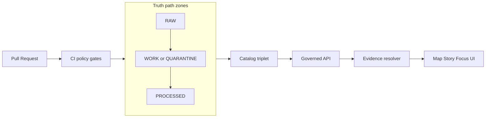

<!-- [KFM_META_BLOCK_V2]
doc_id: kfm://doc/7b4c1f5e-7a57-4c6c-bb59-f4d98b4a3ed4
title: data/policies — Policy artifacts and governance gates
type: standard
version: v1
status: draft
owners: KFM Stewards (TBD)
created: 2026-02-22
updated: 2026-02-22
policy_label: public
related:
  - data/policies/
tags:
  - kfm
  - governance
  - policy
  - policy-as-code
notes:
  - Defines the on-disk home for KFM policy labels, rubrics, obligations, and decision records.
[/KFM_META_BLOCK_V2] -->

<a id="top"></a>

# data/policies

**Purpose:** Versioned policy artifacts (labels, rubrics, obligations, decisions) that make KFM governance *enforceable* in CI and at runtime.


> **WARNING**
> Policies are part of the **trust membrane**: UI surfaces may show badges/notices, but must not bypass the governed API / evidence resolver.

## Quick navigation

- [What lives here](#what-lives-here)
- [How policies are used](#how-policies-are-used)
- [Directory layout](#directory-layout)
- [Controlled vocabulary: `policy_label`](#controlled-vocabulary-policy_label)
- [Roles and responsibilities](#roles-and-responsibilities)
- [Obligations and redaction](#obligations-and-redaction)
- [CI gates and required tests](#ci-gates-and-required-tests)
- [How to change policy safely](#how-to-change-policy-safely)
- [Glossary](#glossary)
- [Appendix: templates](#appendix-templates)

---

## What lives here

### In scope

Artifacts that **must be versioned, reviewable, and testable**, including:

- **Controlled vocabularies** used by pipelines and runtime (e.g., `policy_label`).
- **Rubrics / playbooks** used to classify datasets (licensing, sensitivity, generalization).
- **Obligation catalogs** (what actions the system must take when access is allowed with constraints).
- **Decision records** (dataset/story policy decisions, waivers, embargoes, attested approvals).

### Out of scope

This directory **must not** contain:

- Secrets, tokens, private keys, or credentials (use the secrets manager).
- “Hidden” policy in ad-hoc scripts (policy must be encoded as policy-as-code + artifacts here).
- Raw sensitive data (policy artifacts may describe handling, but must not embed restricted payloads).

> **TIP**
> If you’re unsure whether something belongs here: if it changes “who can see what” or “how data must be transformed before being shown,” it belongs in policy (and must be reviewable + testable).

[Back to top](#top)

---

## How policies are used

KFM policy is evaluated in **two places** with the *same semantics*:

1. **CI** (pre-merge): block unsafe catalog/pipeline/story changes before they ship.
2. **Runtime** (governed API + evidence resolver): authorize and apply obligations/redactions when serving data.



**Policy enforcement points (PEPs)** (conceptual):

- CI: schema validation + policy tests (fail closed).
- Runtime API: checks before serving datasets, features, tiles, exports.
- Evidence resolver: checks before resolving citations/evidence bundles; applies obligations.
- UI: displays badges/notices only (never makes policy decisions).

[Back to top](#top)

---

## Directory layout

> **NOTE**
> This is a **recommended** layout. If your repo already has a different structure, keep this README but adjust the tree to match the source of truth.

```text
data/policies/
├─ README.md
├─ policy_labels.yml                 # Controlled vocabulary for policy_label
├─ rubrics/
│  ├─ sensitivity.md                 # How to classify sensitivity + examples
│  ├─ licensing.md                   # How to classify rights/terms + examples
│  └─ generalization.md              # Geometry/attribute generalization guidelines
├─ obligations/
│  ├─ catalog.yml                    # Allowed obligation types + required fields
│  └─ examples/                      # Small, reviewable obligation examples
├─ decisions/
│  ├─ datasets/                      # Dataset-level policy decisions (by dataset_version_id)
│  ├─ stories/                       # Story publishing policy decisions (if used)
│  └─ exceptions/                    # Time-bound waivers; must cite governance ticket
└─ templates/
   ├─ policy_decision.v1.json        # Template for decision records
   └─ redaction_plan.v1.md           # Template for redaction/generalization plans
```

**Design intent:** keep policy artifacts *close to the governed data* (so diffs are reviewable and promotion gates can validate them), while keeping secrets and runtime credentials elsewhere.

[Back to top](#top)

---

## Controlled vocabulary: `policy_label`

### Starter labels

The `policy_label` field is a **controlled vocabulary**. Starter set:

- `public`
- `public_generalized`
- `restricted`
- `restricted_sensitive_location`
- `internal`
- `embargoed`
- `quarantine`

### Confirmed guardrails

- Restricted and sensitive-location datasets are **default-deny**.
- If a public representation is permitted, publish it as a separate `public_generalized` dataset version.
- Do not embed precise coordinates in stories or Focus responses unless policy explicitly allows it.
- Treat redaction/generalization as a first-class transform and record it in provenance.

### Operational semantics

The table below is **PROPOSED** meaning for each label (update once you adopt a rubric).

| policy_label | Default posture | What can be served | Typical obligations (examples) |
|---|---|---|---|
| `public` | allow | Full public tiles/features/exports | attribution, license display |
| `public_generalized` | allow with constraints | Public artifacts that have been generalized/aggregated | show_notice, generalized geometry, suppressed fields |
| `internal` | allow for trusted roles | Internal preview layers, QA outputs | no public export; log access |
| `restricted` | deny by default | Only to authorized roles | field redaction; audit-only exports |
| `restricted_sensitive_location` | deny by default | Authorized access only; extra leakage tests | no bbox leakage; no coords in public derivatives |
| `embargoed` | deny until date/event | Metadata may be visible; data withheld | automatic release workflow; notice banner |
| `quarantine` | deny / not promotable | Not in runtime surfaces | must include remediation checklist |

> **WARNING**
> `quarantine` is for “needs governance review” states (unclear licensing, sensitivity risk, validation failures). Quarantined items must not be promoted.

[Back to top](#top)

---

## Roles and responsibilities

Baseline roles (to be tailored to your governance charter):

| Role | What they do | What they cannot do |
|---|---|---|
| Public user | Read public layers/stories; ask Focus questions limited to public evidence | Access restricted datasets |
| Contributor | Propose datasets/stories; draft policy decisions; run local checks | Publish/promote without approval |
| Reviewer / Steward | Approve promotions and story publishing; assign policy labels; own redaction rules | Bypass policy gates in CI/runtime |
| Operator | Run pipelines and manage deployments | Override policy decisions |
| Governance council / community stewards | Set rules for culturally sensitive/restricted collections; approve exceptions | Day-to-day pipeline operations |

### RACI snapshot (minimum)

- Dataset onboarding: Contributor + engineers (R), Steward (A), Governance (C when sensitive), Operator (I)
- Promotion: Operator/Data engineer (R), Steward (A), Governance/Security (C when restricted), Contributor (I)
- Story publishing: Contributor/editor (R), Steward (A), Governance/Legal (C when sensitive/rights), Public (I)
- Policy changes: Steward/policy engineer (R), Governance owner (A), Operators/Contributors (C), Users (I)

[Back to top](#top)

---

## Obligations and redaction

A policy decision is not just **allow/deny**. It may also return **obligations**: required actions that *must* be applied by the serving surface.

### Examples of obligation types (PROPOSED catalog)

- `show_notice`: display a banner in UI (e.g., “geometry generalized due to policy”).
- `generalize_geometry`: snap/blur/aggregate geometry before serving.
- `suppress_fields`: remove sensitive attributes from exports/feature inspection.
- `min_count_threshold`: prevent public display when counts are below a threshold.
- `rate_limit`: additional throttling for sensitive endpoints.
- `log_access`: elevated audit logging requirements.

### Redaction/generalization rules

- Redaction/generalization **must be explicit**: record the transform in provenance and ship it as its own dataset version (usually `public_generalized`).
- “Hidden precision” is not acceptable. Generalized outputs must not be trivially reversible (e.g., avoid embedding original coordinates in metadata, logs, or tiles).

### Where obligations must be honored

- Governed API responses (features, tiles, downloads)
- Evidence bundles (citations, Story Nodes, Focus Mode)
- UI (notices and badges)

[Back to top](#top)

---

## CI gates and required tests

Policies are only real if they are enforced by tests that fail closed.

### Minimum CI checks for policy changes

A PR that changes anything under `data/policies/` SHOULD:

- Validate `policy_label` values against the controlled vocabulary.
- Validate decision record schema (if you use decision files).
- Run policy fixtures (allow/deny + obligations) as a required status check.
- Run “no leakage” tests for any public derivative of restricted/sensitive data (examples: no restricted bbox leakage; no coordinate fields in public exports).

> **NOTE**
> Keep failure output readable. A contributor should understand *what to fix* without needing to become a policy expert.

[Back to top](#top)

---

## How to change policy safely

### Policy change workflow

1. **Classify the dataset/story**
   - Licensing/risk review (rights holder, reuse permissions).
   - Sensitivity review (sensitive locations, PII/re-identification risk, cultural restrictions).
2. **Pick a `policy_label`**
   - Prefer least-privilege labels by default; escalate access only with explicit rationale.
3. **Define obligations**
   - If public access is allowed only in a constrained form, define obligations and/or publish a `public_generalized` derivative.
4. **Write a decision record**
   - Who decided, when, why, and what obligations apply.
5. **Add/Update tests**
   - Fixture-driven allow/deny tests for relevant roles.
   - Leakage tests for public artifacts.
6. **Open a PR**
   - Ensure CI gates pass.
7. **Steward / governance approval**
   - Required for restricted, sensitive-location, embargoes, or exceptions.

### Policy change DoD

- [ ] Controlled vocabulary updated (if needed) and documented
- [ ] Decision record exists (or governance ticket referenced)
- [ ] Obligations documented and validated
- [ ] Tests cover allow/deny + obligations for relevant roles
- [ ] No-leakage tests exist for public surfaces
- [ ] Merge results in a policy bundle/version that can be traced in audit logs

[Back to top](#top)

---

## Glossary

- **policy_label**: controlled classification for access + handling.
- **obligation**: required action applied when access is granted with constraints.
- **PDP**: Policy Decision Point (policy engine evaluation).
- **PEP**: Policy Enforcement Point (where the system calls the PDP and enforces outcomes).
- **default deny**: if a rule doesn’t explicitly allow, the answer is “no”.

[Back to top](#top)

---

## Appendix: templates

<details>
<summary><strong>PROPOSED: policy decision record (v1) template</strong></summary>

```json
{
  "kfm_policy_decision_version": "v1",
  "decision_id": "kfm://policy_decision/<uuid>",
  "resource": {
    "kind": "dataset_version",
    "dataset_slug": "<slug>",
    "dataset_version_id": "<yyyy-mm>.<hash>"
  },
  "policy_label": "restricted_sensitive_location",
  "decision": "deny_by_default",
  "obligations": [
    {
      "type": "show_notice",
      "message": "Public geometry has been generalized due to sensitivity."
    }
  ],
  "rationale": "<why this label/obligations>",
  "approvals": [
    {
      "role": "steward",
      "principal": "<id>",
      "approved_at": "YYYY-MM-DDTHH:MM:SSZ"
    }
  ],
  "created_at": "YYYY-MM-DDTHH:MM:SSZ",
  "updated_at": "YYYY-MM-DDTHH:MM:SSZ"
}
```

</details>

<details>
<summary><strong>PROPOSED: obligation catalog entry</strong></summary>

```yaml
- type: show_notice
  required_fields: [message]
  applies_to: [ui, api, evidence_bundle]
  description: Display a human-readable notice about policy handling.
```

</details>
