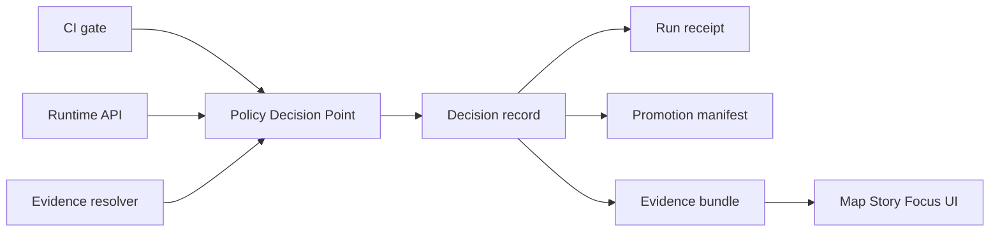

<!-- [KFM_META_BLOCK_V2]
doc_id: kfm://doc/f135e6c7-53ac-4dcf-8495-fe9773161d52
title: Policy decision records
type: standard
version: v1
status: draft
owners: KFM Governance, Policy Stewards
created: 2026-02-24
updated: 2026-02-24
policy_label: internal
related:
  - ../README.md
tags: [kfm, policy, decisions]
notes:
  - Directory README for versioned policy decision records and decision fixtures.
  - References KFM governance guidance dated 2026-02-20.
[/KFM_META_BLOCK_V2] -->

# data/policies/decisions

Versioned **policy decision records** and **decision fixtures** so KFM can **fail closed**, stay **auditable**, and keep **CI and runtime** policy semantics aligned.


---

## Navigation

- [Purpose](#purpose)
- [Where this fits](#where-this-fits)
- [Directory layout](#directory-layout)
- [Decision record format](#decision-record-format)
- [How decisions flow through the system](#how-decisions-flow-through-the-system)
- [How to add or change a decision](#how-to-add-or-change-a-decision)
- [Safety rules](#safety-rules)
- [Glossary](#glossary)

---

## Purpose

This folder exists to make policy decisions **traceable artifacts**:

- **Testable**: fixtures drive allow, deny, and obligation outcomes in CI.
- **Auditable**: decisions are referenced from run receipts, promotion manifests, and evidence bundles.
- **Reproducible**: decisions can be tied back to the policy bundle version and inputs that produced them.

> WARNING
> Treat everything in `data/policies/` as **governed**. If in doubt, fail closed and escalate to a steward.

[Back to top](#data-policies-decisions)

---

## Where this fits

KFM uses policy-as-code with the same semantics in CI and runtime. The system should evaluate policy in a **Policy Decision Point** and enforce it at **Policy Enforcement Points** such as CI, runtime API, and evidence resolution. The UI should display policy outcomes but **must not** decide policy.

[Back to top](#data-policies-decisions)

---

## Directory layout

### Expected structure

This is the **recommended** layout. Adjust it as the repo’s actual module boundaries and CI wiring are finalized.

```text
data/policies/decisions/                           # Policy decision evidence (why rules exist + how decisions are tested)
├─ README.md                                       # Purpose, governance rules, and how to add/update decision records
│
├─ records/                                        # Canonical, versioned decision records (audit + traceability)
│  └─ 2026-02-20_kfm__policy_decision__xyz.json     # Example decision record (date-stamped; stable id)
│
├─ fixtures/                                       # Test vectors tied to decision logic (synthetic; deterministic)
│  ├─ inputs/                                      # Request context samples (user/action/resource/environment)
│  └─ expected/                                    # Expected allow/deny + obligations + reason codes
│
├─ schemas/                                        # Schemas validating records + fixtures (CI-enforced)
│  └─ policy_decision.schema.json                  # Schema for decision records and/or fixture envelopes
│
└─ rubrics/                                        # Human guidance used to justify decisions (reviewer-facing)
   ├─ sensitivity.md                               # Sensitivity rubric (classification + handling expectations)
   └─ licensing.md                                 # Licensing rubric (allowed terms, attribution, redistribution rules)
```

### What belongs here

| Artifact | Purpose | Examples |
|---|---|---|
| Decision records | The “receipt” of a policy evaluation that must be referenceable by ID | `records/*.json` |
| Fixtures | Stable inputs and expected outputs for deterministic tests | `fixtures/inputs/*.json`, `fixtures/expected/*.json` |
| Schemas | Fail-closed validation for decision record shapes | `schemas/*.json` |
| Rubrics | Shared decision guidance for stewards and reviewers | `rubrics/*.md` |

### What must not be here

- Secrets, tokens, private keys, or credentials.
- Raw restricted datasets or raw exports.
- Exact sensitive locations or individual-level PII.
- Unreviewed “one-off exceptions” without an explicit steward approval trail.

[Back to top](#data-policies-decisions)

---

## Decision record format

A decision record is a **small, explicit JSON document** that captures:

- `decision_id`
- `policy_label`
- `decision` as `allow` or `deny`
- `reason_codes` for audit and UX
- `obligations` for redaction and generalization requirements
- `evaluated_at`
- `rule_id`

### Minimal example

```json
{
  "decision_id": "kfm://policy_decision/xyz",
  "policy_label": "restricted",
  "decision": "deny",
  "reason_codes": ["SENSITIVE_SITE", "RIGHTS_UNCLEAR"],
  "obligations": [
    { "type": "generalize_geometry", "min_cell_size_m": 5000 },
    { "type": "remove_attributes", "fields": ["exact_location", "owner_name"] }
  ],
  "evaluated_at": "2026-02-20T12:00:00Z",
  "rule_id": "deny.restricted_dataset.default"
}
```

### Policy labels

The system uses a controlled vocabulary for `policy_label`. Common starter labels include:

- `public`
- `public_generalized`
- `restricted`
- `restricted_sensitive_location`
- `internal`
- `embargoed`
- `quarantine`

> NOTE
> If a dataset cannot be public in its raw form but can be shared safely, prefer producing a separate **public generalized** representation and record that obligation explicitly.

[Back to top](#data-policies-decisions)

---

## How decisions flow through the system

A policy decision should be **referenced**, not re-inferred.



### Traceability checklist

A decision is considered “wired” when:

- A run receipt references the `decision_id`
- A promotion manifest references the `decision_id`
- Evidence resolution returns the policy outcome and any obligations applied
- CI contains fixture-driven tests for allow, deny, and obligation cases

[Back to top](#data-policies-decisions)

---

## How to add or change a decision

### Step 1: Create or update a decision record

1. Add a JSON file under `records/`.
2. Use a stable `decision_id` URI.
3. Include reason codes and obligations that a UI can explain.

### Step 2: Add fixtures

Add at least:

- One **allow** fixture
- One **deny** fixture
- One fixture that produces at least one **obligation**

### Step 3: Validate and test

This repo’s exact commands are not confirmed here yet. Typical patterns:

```bash
# Example only. Replace with repo-specific commands once CI wiring is known.

# 1) Schema validation
# (e.g., ajv validate -s schemas/policy_decision.schema.json -d records/*.json)

# 2) Policy unit tests
# (e.g., opa test -v policy/rego)

# 3) Conftest policy gate
# (e.g., conftest test -p policy/rego data/policies/decisions/fixtures)
```

### Step 4: Review and approval

- Policy changes should be reviewed by a steward (and governance council if culturally sensitive).
- Store approvals as part of the normal audit trail. Do not invent approvals inside records.

[Back to top](#data-policies-decisions)

---

## Safety rules

> WARNING
> Default deny is the baseline posture for restricted and sensitive-location materials.

Minimum safety rules for anything that might be sensitive:

- Do not embed precise coordinates in Story Nodes or Focus Mode outputs unless policy explicitly allows it.
- Treat redaction and generalization as first-class outputs and record them as obligations.
- Do not leak restricted dataset existence via error behavior or metadata.

[Back to top](#data-policies-decisions)

---

## Glossary

- **Decision record**: JSON artifact capturing allow/deny, obligations, and reason codes.
- **PDP**: Policy Decision Point, where policy is evaluated.
- **PEP**: Policy Enforcement Point, where policy is enforced such as CI gate, runtime API, evidence resolver.
- **Obligation**: A required action such as generalize, redact, notify attached to a policy outcome.

[Back to top](#data-policies-decisions)
