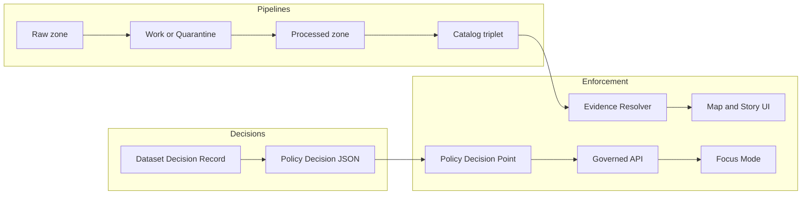

<!-- [KFM_META_BLOCK_V2]
doc_id: kfm://doc/<uuid>
title: Dataset Decision Records
type: standard
version: v1
status: draft
owners: kfm-stewards
created: 2026-02-24
updated: 2026-02-24
policy_label: internal
related:
  - ../../README.md
  - ../README.md
tags: [kfm, policy, decisions, datasets]
notes:
  - Defines how dataset-level governance decisions are recorded as auditable, reviewable artifacts.
  - Replace <uuid> and update related links once repo conventions are confirmed.
[/KFM_META_BLOCK_V2] -->

<a id="top"></a>

# Dataset Decision Records
Governed, reviewable decision artifacts that classify datasets (policy + rights + obligations) and make promotion / publication fail-closed.


## Navigate
- [Purpose](#purpose)
- [Where this fits](#where-this-fits)
- [Directory layout](#directory-layout)
- [What belongs here](#what-belongs-here)
- [What must not go here](#what-must-not-go-here)
- [How to add or update a dataset decision](#how-to-add-or-update-a-dataset-decision)
- [Decision record format](#decision-record-format)
- [Promotion gates checklist](#promotion-gates-checklist)
- [Controlled vocabulary](#controlled-vocabulary)
- [Security and redaction](#security-and-redaction)
- [Policy-as-code expectations](#policy-as-code-expectations)
- [Assumptions and minimum verification](#assumptions-and-minimum-verification)
- [FAQ](#faq)

---

## Purpose
This directory holds **dataset-level governance decisions** that the platform must be able to:
- **audit** (who decided what, when, and why),
- **enforce** (policy labels + obligations applied consistently),
- **validate in CI** (fail closed),
- **trace to evidence** (catalogs/provenance and decision rationale).

Think of these as the dataset analog to ADRs: small, reviewable increments that preserve the **trust membrane**.

> NOTE  
> These files are “policy inputs,” not narrative. Narratives belong in Story Nodes; raw datasets belong in data zones (raw/work/processed/published).

[Back to top](#top)

---

## Where this fits
Dataset decisions sit at the intersection of:
- **Pipelines** (promotion eligibility, QA thresholds, provenance requirements)
- **Policy** (who can see what + obligations like generalization/redaction)
- **Runtime** (governed API, evidence resolver, UI notices/badges)



[Back to top](#top)

---

## Directory layout

> IMPORTANT  
> The exact on-disk layout under this folder is **not confirmed** in repo. The structure below is a **recommended** convention optimized for auditability + machine parsing.

```text
data/policies/decisions/datasets/                   # Dataset-specific policy decisions (human rationale + machine record)
├─ README.md                                       # How dataset decisions are authored, reviewed, and referenced
│
└─ <dataset_slug>/                                 # One folder per dataset (stable slug)
   ├─ decision.md                                  # Human-readable rationale (scope, risks, tradeoffs, evidence links)
   ├─ policy_decision.json                         # Machine-readable decision (policy_label, obligations, reason codes)
   ├─ approvals.yml                                # Optional explicit approvals (if governance requires sign-off)
   │
   └─ versions/                                    # Optional: version-scoped decisions (only if policy varies by version)
      └─ <dataset_version_id>/
         ├─ decision.md                            # Version-specific rationale (what changed and why)
         ├─ policy_decision.json                   # Version-specific machine decision (labels/obligations/reasons)
         └─ approvals.yml                          # Optional approvals for this version
```

If you prefer “one file per decision,” keep the same three artifacts but encode the dataset_slug/dataset_version_id in filenames.

[Back to top](#top)

---

## What belongs here
Acceptable contents in `data/policies/decisions/datasets/`:

- **Dataset Decision Records** (`decision.md`)
  - dataset identity (slug, version if applicable)
  - policy label selection and rationale
  - rights/license determination for each distribution class
  - sensitivity assessment + *obligations* (e.g., generalize geometry, remove fields)
  - QA requirements and acceptable thresholds (or pointers to them)
  - evidence links (DCAT/STAC/PROV references) and audit refs
  - review/approval metadata (or pointers)

- **Machine-readable policy decision artifacts** (`policy_decision.json`)
  - the “enforceable” part of the decision (label, allow/deny posture, obligations)

- **Approval artifacts** (`approvals.yml`, optional)
  - only if governance requires explicit sign-off beyond PR approval

[Back to top](#top)

---

## What must not go here
- Raw or processed dataset files (GeoParquet, PMTiles, COGs, CSVs, etc.)
- Secrets (API keys, tokens, service creds)
- Personally identifying information (PII) unless explicitly approved and protected
- Precise coordinates / site details for sensitive locations unless the policy label explicitly permits it
- “Ghost metadata” that reveals restricted dataset existence to unauthorized roles

[Back to top](#top)

---

## How to add or update a dataset decision
1. **Create (or locate) the dataset folder**: `data/policies/decisions/datasets/<dataset_slug>/`
2. **Draft `decision.md`** using the template below.
3. **Create/Update `policy_decision.json`**
   - Choose a `policy_label` from the controlled vocabulary list in this README.
   - Define obligations required for any public-safe representation (generalization/redaction).
4. **If required, add approvals** in `approvals.yml`.
5. **Open a PR**
   - CI must validate: schema + policy tests + decision invariants.
   - Fail closed: missing license, unclear rights, or missing obligations blocks merge.
6. **Review**
   - At minimum: steward review for policy label + obligations.
   - If rights are unclear: block promotion/publishing until resolved.

> TIP  
> Keep decisions small. If a dataset moves from `public` to `public_generalized`, record that as a discrete change with explicit rationale and obligations.

[Back to top](#top)

---

## Decision record format

### Human record: `decision.md`
Use this as the canonical narrative + rationale.

<details>
<summary><strong>Template: decision.md</strong></summary>

```markdown
<!-- [KFM_META_BLOCK_V2]
doc_id: kfm://doc/<uuid>
title: Dataset Decision — <dataset_slug> @ <dataset_version_id or "rolling">
type: standard
version: v1
status: draft|review|published
owners: <team or names>
created: YYYY-MM-DD
updated: YYYY-MM-DD
policy_label: internal
related:
  - kfm://dataset/<dataset_slug>@<dataset_version_id>
tags: [kfm, dataset, decision, policy]
notes:
  - Keep rationale policy-safe; do not leak restricted details.
[/KFM_META_BLOCK_V2] -->

# Dataset Decision — <dataset_slug>

## Summary
One paragraph: what this dataset is, why KFM is ingesting it, and what this decision covers.

## Scope
- Dataset slug: `<dataset_slug>`
- Version: `<dataset_version_id | rolling>`
- Spatial coverage: `<bbox/region name, policy-safe>`
- Temporal coverage: `<start/end, policy-safe>`
- Update cadence: `<cadence>`

## Decision
- policy_label: `<public | public_generalized | restricted | restricted_sensitive_location | internal | embargoed | quarantine>`
- Allowed audiences: `<roles/groups, if applicable>`
- Distributions allowed:
  - `<processed artifacts, tiles, downloads, api query, etc.>`
- Obligations required:
  - `<generalize geometry, remove fields, suppress small counts, etc.>`

## Rationale
Explain why this label and obligations were chosen. Include:
- sensitivity considerations
- rights/licensing considerations
- intended user impact (UI notices, limitations)

## Rights and licensing
For each distribution class, record:
- rights holder
- license or rights statement
- attribution requirements
- any “metadata-only reference” decision (if applicable)

## QA and validation expectations
- Required checks: `<schema/geometry/duplicates/time bounds/etc.>`
- Threshold policy: `<pass/fail cutoffs or pointer to policy file>`
- Quarantine conditions: `<what triggers quarantine>`

## Evidence links
Use resolvable references whenever possible:
- DCAT: `dcat://...`
- STAC: `stac://...`
- PROV / run receipt: `prov://...`
- Docs: `doc://...`

## Approvals / review
- Required roles: `<steward | council | operator>`
- Decision history:
  - YYYY-MM-DD — `<what changed>` — `<who/role>` — `<audit_ref if exists>`
```
</details>

### Machine decision: `policy_decision.json`
Use this for the **Policy Decision Point input** (or as an indexed decision artifact consumed by policy evaluation).

<details>
<summary><strong>Template: policy_decision.json</strong></summary>

```json
{
  "decision_id": "kfm://policy_decision/<id>",
  "dataset_slug": "<dataset_slug>",
  "dataset_version_id": "<dataset_version_id | rolling>",
  "policy_label": "restricted",
  "decision": "deny",
  "reason_codes": ["SENSITIVE_SITE", "RIGHTS_UNCLEAR"],
  "obligations": [
    { "type": "generalize_geometry", "min_cell_size_m": 5000 },
    { "type": "remove_attributes", "fields": ["exact_location", "owner_name"] }
  ],
  "evaluated_at": "YYYY-MM-DDThh:mm:ssZ",
  "rule_id": "<policy_rule_id>"
}
```
</details>

> NOTE  
> Obligations are first-class transforms. If a dataset becomes `public_generalized`, the generalization must be recorded as lineage/provenance, not just as a UI disclaimer.

[Back to top](#top)

---

## Promotion gates checklist
Use this checklist as a **Definition of Done** for any dataset version that is intended to reach runtime surfaces.

- [ ] **Identity & versioning**: deterministic dataset version ID + spec hash
- [ ] **Artifacts**: processed artifacts exist; each has digest; media types recorded
- [ ] **Catalogs**: DCAT/STAC/PROV validate under the chosen profiles
- [ ] **Cross-links**: all links resolve; EvidenceRefs resolve
- [ ] **Policy**: policy label assigned; obligations applied; default-deny tests pass
- [ ] **QA**: validation reports present; failures quarantined
- [ ] **Audit**: run receipt emitted; audit ledger append; approvals captured where required

> WARNING  
> If rights or sensitivity are unclear, the correct outcome is **block** (quarantine/embargo), not “ship and fix later.”

[Back to top](#top)

---

## Controlled vocabulary

### policy_label
Starter list (must be versioned and maintained):
- `public`
- `public_generalized`
- `restricted`
- `restricted_sensitive_location`
- `internal`
- `embargoed`
- `quarantine`

### artifact.zone
Common lifecycle zones:
- `raw`
- `work`
- `processed`
- `catalog`
- `published`

### EvidenceRef schemes
Minimum reference types you should prefer in decision records:
- `dcat://...` (dataset + distributions)
- `stac://...` (collections/items/assets)
- `prov://...` (lineage/run receipts)
- `doc://...` (governed docs)
- `graph://...` (relations, if enabled)

[Back to top](#top)

---

## Security and redaction
Default posture:
- **Default deny** for restricted and sensitive-location datasets.
- If any public representation is allowed, publish a separate **`public_generalized`** derivative (policy-safe geometry + fields).
- Do not leak restricted existence or metadata via differences in errors or UI state.
- Do not embed precise coordinates in Story Nodes or Focus Mode outputs unless policy explicitly allows.

Treat redaction/generalization as:
- an obligation (machine-enforceable),
- a recorded transform in lineage/provenance,
- a visible UI notice (policy-safe wording).

[Back to top](#top)

---

## Policy-as-code expectations
This directory only works if policy semantics are shared across CI and runtime.

Minimum expectations:
- A Policy Decision Point (PDP) evaluates decisions.
- Policy Enforcement Points (PEPs) exist in:
  - CI (schema validation + policy tests block merges)
  - runtime API (policy checks before serving data)
  - evidence resolver (policy checks before resolving evidence)
  - UI (shows badges/notices, but does **not** decide)

[Back to top](#top)

---

## Assumptions and minimum verification
### Assumptions (explicit)
- This folder is intended to be **authoritative** for dataset classification decisions (policy label + obligations).
- CI is expected to enforce fail-closed gates for policy + schema.
- The repo uses catalog triplets (DCAT/STAC/PROV) and evidence resolution patterns.

### Minimum verification steps (convert assumptions → confirmed)
- Locate the repo’s actual CODEOWNERS / review rules for `data/policies/**`.
- Confirm:
  - where OPA/Rego policies live
  - where decision “input data” is loaded from at runtime
  - the canonical schema(s) for `policy_decision.json` and `decision.md` metadata
- Confirm how dataset versions are identified (`dataset_version_id` format + hashing rules).

[Back to top](#top)

---

## FAQ

**Why store decisions as files in git?**  
So that every policy change is reviewable, reversible, and traceable to evidence and approvals.

**Do I put the dataset itself here?**  
No. Only governance decisions and their machine-readable counterparts.

**What if a dataset is partially public?**  
Use `public_generalized` for public-facing derivatives and keep the restricted version gated.

**What if we don’t know the license?**  
Fail closed: quarantine/embargo until rights are resolved.

[Back to top](#top)
