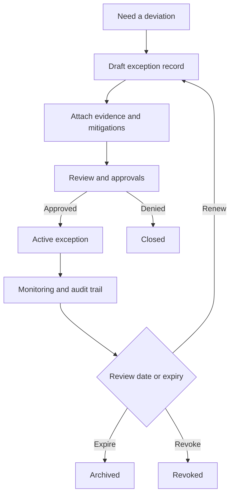

<!-- [KFM_META_BLOCK_V2]
doc_id: kfm://doc/8f8f4e37-5c9f-4f72-8f1a-2ed6b2f3b6df
title: Decision Exceptions
type: standard
version: v1
status: draft
owners: KFM Governance
created: 2026-02-24
updated: 2026-02-24
policy_label: restricted
related:
  - data/policies/decisions/README.md
tags: [kfm, governance, policy, decisions, exceptions]
notes:
  - Defines the canonical format + lifecycle for time-bounded exceptions to policy/decision requirements.
  - This directory is intended to be machine-checkable (schema + policy gate) and human-auditable.
[/KFM_META_BLOCK_V2] -->

# Decision Exceptions

Time-bounded, auditable waivers to specific decision or policy requirements, with explicit risk acceptance and compensating controls.


> [!WARNING]
> Exceptions are **not** the normal path. If the deviation should be permanent, update the underlying policy/decision and add tests.  
> Exceptions **must** be time-bounded. Expired exceptions are treated as **not in effect**.

## Navigate

- [Purpose](#purpose)
- [When to create an exception](#when-to-create-an-exception)
- [Where this fits](#where-this-fits)
- [Directory structure](#directory-structure)
- [Record format](#record-format)
- [Lifecycle](#lifecycle)
- [Approval matrix](#approval-matrix)
- [Validation and gates](#validation-and-gates)
- [Security and sensitivity](#security-and-sensitivity)
- [Templates](#templates)

---

## Purpose

This directory provides a **single, reviewable paper trail** for case-by-case deviations from governed decisions and policies.

An exception record answers:

- **What requirement is being waived**
- **Why the waiver is needed**
- **What scope is affected**
- **What risks are accepted**
- **What mitigations/obligations apply**
- **Who approved it**
- **When it expires**
- **How it is monitored and revoked**

[Back to top](#decision-exceptions)

---

## When to create an exception

Use this folder when you need a **temporary** and **explicitly approved** deviation from an existing rule or decision.

| Scenario | Use an exception record | Do this instead |
|---|---:|---|
| Temporary operational workaround (toolchain drift, transitional migration, backfill) | ✅ | — |
| One dataset needs special handling for a limited time | ✅ | — |
| You want a permanent rule change | ❌ | Update the policy/decision + add tests |
| You want to bypass licensing/sensitivity without review | ❌ | Stop and escalate to governance |
| You need to store secrets or credentials | ❌ | Use the secret manager / vault |
| You need to document an architectural decision | ❌ | Create/update the decision record, not an exception |

[Back to top](#decision-exceptions)

---

## Where this fits

This directory is a child of:

- `data/policies/` — governed, versioned policy inputs
- `data/policies/decisions/` — decision records and their artifacts
- `data/policies/decisions/exceptions/` — **exceptions to those decisions/policies**

Related docs (paths may vary by repo layout):

- `../README.md` — decision records index
- `../../README.md` — policy root / taxonomy

> [!NOTE]
> If an exception impacts **runtime enforcement**, prefer implementing it as **data** consumed by the policy engine (rather than hard-coded “if special-case” logic).

[Back to top](#decision-exceptions)

---

## Directory structure

Recommended layout:

```text
data/policies/decisions/exceptions/                 # Policy exceptions (time-bounded, reviewed, fully evidenced)
├─ README.md                                       # How exceptions work (scope, TTL, approvals, revocation)
│
├─ ex-<exception_id>--<slug>.md                    # Human-readable exception record (why, scope, TTL, compensating controls)
├─ ex-<exception_id>--<slug>.yml                   # Machine-readable exception (targets, obligations, expiry, approvals)
│
└─ _attachments/                                   # Supporting evidence (never secrets; keep bounded)
   └─ ex-<exception_id>/                           # Attachment folder for this exception ID
      ├─ supporting-evidence.pdf                   # Evidence snapshot(s) backing the exception
      ├─ screenshots/                              # Optional screenshots (UI/log excerpts; redact if needed)
      └─ redaction-notes.md                        # Redaction/handling notes (what was removed and why)
```

**Naming convention**

- `exception_id` should be globally unique (UUID preferred).
- `slug` should be short and stable (kebab-case).
- One exception = one file (plus optional attachments folder).

Examples:

- `ex-7f0d2f20-7a42-4f5a-8b8e-8e0f05d03a2a--temporary-receipt-schema-drift.md`
- `ex-19d1d2b2-2a2a-4a2d-91d0-5d6f7e2a1c01--restricted-site-generalization.yml`

[Back to top](#decision-exceptions)

---

## Record format

You can author exception records as either:

- Markdown with YAML front matter (`.md`)
- Pure YAML (`.yml`)

### Required fields

At minimum:

- `exception_id`
- `title`
- `status`
- `policy_label`
- `related` (what decision/policy this exception targets)
- `request` (who/what/why)
- `scope` (what systems/datasets/users are affected)
- `risk` (what can go wrong; severity; likelihood)
- `mitigations` (compensating controls and obligations)
- `start_date`
- `end_date`
- `approvals` (who approved; when)
- `review` (next review date; reviewer)

### Suggested controlled values

**status**

- `draft`
- `in_review`
- `approved`
- `active`
- `expired`
- `revoked`
- `superseded`

**policy_label**

Use the project’s controlled vocabulary. Starter set:

- `public`
- `public_generalized`
- `restricted`
- `restricted_sensitive_location`
- `internal`
- `embargoed`
- `quarantine`

> [!TIP]
> If the exception record contains sensitive detail, mark the record itself `restricted` even if the *affected* dataset has a different label.

[Back to top](#decision-exceptions)

---

## Lifecycle



Lifecycle rules:

- **Active** exceptions must have an **end_date**.
- Renewals must create a **new revision** (edit-in-place only if your repo governance allows; otherwise create `superseded_by` link).
- Expired exceptions are retained for audit, but must not be treated as in force.

[Back to top](#decision-exceptions)

---

## Approval matrix

Adjust to your org, but a sane default:

| Risk level | Examples | Minimum approvers |
|---|---|---|
| Low | temporary tooling drift; non-sensitive metadata formatting | Maintainer + Domain Steward |
| Medium | changes to CI gates; temporary relaxations with compensating controls | Domain Steward + Governance Lead |
| High | any deviation involving restricted/sensitive-location handling; anything that changes runtime access behavior | Governance Lead + Security/Privacy + Domain Steward |

> [!WARNING]
> If the exception touches **sensitive-location** handling, approvals must explicitly state whether public output is allowed and what generalization is required.

[Back to top](#decision-exceptions)

---

## Validation and gates

This directory is designed to be **machine-checkable**.

Recommended CI expectations:

- [ ] Schema validation for exception records (required fields present)
- [ ] `start_date <= end_date`
- [ ] `end_date` present and not beyond allowed max duration (policy-defined)
- [ ] `policy_label` is in controlled vocabulary
- [ ] `approvals` present when status is `approved` or `active`
- [ ] Expired exceptions are flagged in PRs and dashboards
- [ ] If an exception impacts policy enforcement, policy fixtures include allow/deny examples and tests

Local dev (example):

```bash
# TODO: replace with your repo’s actual gate command(s)
make policy-validate
make policy-test
```

> [!NOTE]
> CI and runtime must share the same policy semantics. If CI “passes” but runtime enforces different rules, the checks are not trustworthy.

[Back to top](#decision-exceptions)

---

## Security and sensitivity

Do **not** store secrets, credentials, tokens, or private keys here.

For sensitive datasets and locations:

- Do not include precise coordinates unless policy explicitly allows it.
- Use generalized bounding boxes, coarse place names, or redacted identifiers as needed.
- Ensure the exception includes required **obligations** (e.g., “show notice”, “generalize geometry”, “metadata-only mode”).

If you must include sensitive supporting evidence:

- Put it in `_attachments/ex-<exception_id>/`
- Redact where possible
- Ensure repository access controls match `policy_label`

[Back to top](#decision-exceptions)

---

## Templates

<details>
<summary>Markdown template with YAML front matter</summary>

```markdown
---
exception_id: "7f0d2f20-7a42-4f5a-8b8e-8e0f05d03a2a"
title: "Temporary waiver for <requirement> due to <reason>"
status: draft
policy_label: restricted

related:
  decision_ids: []
  policy_ids: []
  datasets: []
  systems: []

request:
  requested_by: "name-or-team"
  requested_on: "2026-02-24"
  justification: >
    Why this deviation is necessary and why the normal path is not feasible.
  alternatives_considered:
    - "Alternative A"
    - "Alternative B"

scope:
  affected_components:
    - "ci"
    - "pipelines"
    - "api"
    - "ui"
  affected_users_or_roles:
    - "steward"
  blast_radius: >
    What changes and who/what is impacted.

risk:
  summary: "What can go wrong?"
  severity: low
  likelihood: low
  impact_notes: >
    Include privacy, safety, operational, and trust membrane impacts.

mitigations:
  - type: "compensating_control"
    description: "What you will do to reduce risk."
  - type: "obligation"
    description: "What must be displayed/logged/notified."

dates:
  start_date: "2026-02-24"
  end_date: "2026-03-10"
  review_date: "2026-03-03"

monitoring:
  signals:
    - "gate pass rate"
    - "policy deny events"
  rollback_plan: >
    How to revert quickly if the exception causes harm.

approvals:
  - role: "domain_steward"
    name: "TBD"
    approved_on: null
  - role: "governance_lead"
    name: "TBD"
    approved_on: null

audit:
  created_by: "name"
  created_on: "2026-02-24"
  last_updated_on: "2026-02-24"
  supersedes: null
  superseded_by: null
---

## Summary

One paragraph summary.

## Waived requirement

- Link to the exact policy/decision section being waived.

## Compensating controls

- Bullets.

## Evidence

- Link to `_attachments/ex-<exception_id>/...` or other governed evidence.

## Notes

Anything else.
```

</details>

[Back to top](#decision-exceptions)
