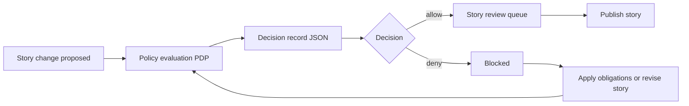

<!-- [KFM_META_BLOCK_V2]
doc_id: kfm://doc/f3b1be47-b3cf-4e51-ab5a-046efda35023
title: Story Policy Decision Records
type: standard
version: v1
status: draft
owners: TBD
created: 2026-02-24
updated: 2026-02-24
policy_label: public
related:
  - kfm://doc/TODO-policy-bundle-home
  - kfm://doc/TODO-story-node-v3-standard
tags: [kfm, policies, decisions, stories]
notes:
  - This README defines what belongs in data/policies/decisions/stories/.
  - Keep this directory append-only; do not “edit history”.
[/KFM_META_BLOCK_V2] -->

# 🧾 Story Policy Decision Records

Machine-readable **allow/deny decisions + obligations** that govern **Story Node** publishing and story-related evidence resolution.


> **NOTE**
> This folder is part of the *trust membrane*: decision artifacts are meant to be **auditable**, **reviewable**, and **reproducible**.
> If you are unsure whether a decision record is safe to store here, **fail closed** and route it to governance review.

---

## Quick navigation

- [Purpose](#purpose)
- [Where this fits](#where-this-fits)
- [What belongs here](#what-belongs-here)
- [What must not go here](#what-must-not-go-here)
- [Decision record contract](#decision-record-contract)
- [Workflow](#workflow)
- [CI gates and definition of done](#ci-gates-and-definition-of-done)
- [Directory layout](#directory-layout)
- [Appendix](#appendix)

---

## Purpose

This directory stores **Story-scoped policy decision records** that:

1. **Prove what the policy engine decided** (allow/deny)
2. Capture **reason codes** for auditability and UX
3. Declare **obligations** (e.g., generalize geometry, remove attributes) that must be applied before a Story Node can be published or exported

These files are used for:

- **Regression fixtures** (CI) to ensure policy semantics match between CI and runtime
- **Review evidence** during Story Review Queue processing
- **Audit trails** for why a story was published, denied, or forced to publish in a generalized/redacted form

[Back to top](#-story-policy-decision-records)

---

## Where this fits

KFM Story Nodes are narrative artifacts bound to map state and citations (markdown + sidecar JSON). Story publishing is **policy-gated**, including evidence resolution requirements and safety constraints.

This folder is *not* where story content lives; it is where **story-related policy decisions** live.

[Back to top](#-story-policy-decision-records)

---

## What belongs here

✅ **Allowed contents**

- **Policy decision records** for story publishing / story evidence resolution, stored as JSON
- **Fixtures** that cover “allow” and “deny” cases with obligations, including edge cases:
  - sensitive-site geometry
  - rights unclear for embedded media
  - restricted datasets referenced by a story
  - attempts to include precise coordinates when not permitted
- Optional: **index/manifest files** *if* you add them later (keep them generated, not hand-edited)

[Back to top](#-story-policy-decision-records)

---

## What must not go here

🚫 **Not allowed**

- OPA/Rego policies (those belong in the **policy bundle repository**)
- Story Node markdown, story sidecar JSON, story images/assets
- Run receipts, PROV bundles, or dataset catalogs (those belong in their respective governed data/catelog/provenance locations)
- Secrets, tokens, credentials, raw PII, or any restricted data payloads
- “Hot” logs or transient runtime dumps (store those in an ops log store, not git)

[Back to top](#-story-policy-decision-records)

---

## Decision record contract

### Required fields

| Field | Type | Meaning | Notes |
|---|---|---|---|
| `decision_id` | string | Stable identifier for this decision | Prefer a KFM URI (`kfm://policy_decision/...`) |
| `policy_label` | string | Primary classification input | e.g., `public`, `restricted` |
| `decision` | string | `allow` or `deny` | Fail closed if unknown |
| `reason_codes` | array[string] | Why the decision was made | Keep non-sensitive; no restricted metadata leaks |
| `obligations` | array[object] | Required transforms before publish/serve | e.g., generalization, attribute removal |
| `evaluated_at` | string | ISO-8601 timestamp | When the PDP evaluated |
| `rule_id` | string | Policy rule that triggered | Helps reproducibility/debug |

### Example decision record (v1)

```json
{
  "decision_id": "kfm://policy_decision/xyz",
  "policy_label": "restricted",
  "decision": "deny",
  "reason_codes": ["SENSITIVE_SITE", "RIGHTS_UNCLEAR"],
  "obligations": [
    { "type": "generalize_geometry", "min_cell_size_m": 5000 },
    { "type": "remove_attributes", "fields": ["exact_location", "owner_name"] }
  ],
  "evaluated_at": "2026-02-20T12:00:00Z",
  "rule_id": "deny.restricted_dataset.default"
}
```

### Obligations: common types

| Obligation `type` | Intent | Typical fields |
|---|---|---|
| `generalize_geometry` | Prevent revealing precise location | `min_cell_size_m` |
| `remove_attributes` | Strip sensitive fields | `fields[]` |
| `deny_export` | Permit view but deny download/export | (policy-defined) |
| `require_attribution` | Ensure license text appears | (policy-defined) |
| `require_content_warning` | UI must show warning banner | (policy-defined) |

> **WARNING**
> If policy returns obligations, the story **must not be published** until the obligations are applied and recorded in provenance (do not “hand-wave” obligations away).

[Back to top](#-story-policy-decision-records)

---

## Workflow



### Practical linkage points

When a Story Node is evaluated:

- The Story Node sidecar carries **policy_label** and review state
- The policy engine emits a **decision record** with **reason codes** + **obligations**
- Publishing should be blocked unless all story citations resolve via the evidence resolver

[Back to top](#-story-policy-decision-records)

---

## CI gates and definition of done

### Required CI checks (fail closed)

- [ ] Every `*.json` in this directory is **schema-valid** under the policy decision schema (v1)
- [ ] `decision` is only `allow` or `deny`
- [ ] `reason_codes` contain **no sensitive payloads** (codes only; no restricted details)
- [ ] Any obligation types used are **recognized** by policy + enforcement layer
- [ ] Fixture suite includes both:
  - [ ] at least one `allow` for `public`
  - [ ] at least one `deny` for `restricted` with obligations

### Minimum definition of done for adding a new fixture

- [ ] Add decision JSON record
- [ ] Add (or update) the policy test that asserts expected decision + obligations
- [ ] Demonstrate one **positive** and one **negative** case for the same control (e.g., location sensitivity)

[Back to top](#-story-policy-decision-records)

---

## Directory layout

### Minimal (required)

```text
data/policies/decisions/stories/
└── README.md
```

### Recommended (expand as needed)

```text
data/policies/decisions/stories/
├── README.md
├── fixtures/
│   ├── allow_public_story.example.json
│   ├── deny_sensitive_site.example.json
│   └── deny_rights_unclear_media.example.json
└── schema/
    └── policy_decision.v1.schema.json   # optional local copy if not centralized elsewhere
```

> **TIP**
> Keep these artifacts small and deterministic. If a decision needs a big context payload, store the context elsewhere and reference it.

[Back to top](#-story-policy-decision-records)

---

## Appendix

### Suggested filename conventions

**Goal:** make diffs readable and keep history append-only.

Examples:

- `fixtures/allow_public_story.example.json`
- `fixtures/deny_sensitive_site.example.json`
- `fixtures/deny_rights_unclear_media.example.json`

If you store real (non-fixture) decisions in git (only if governance approves), prefer date prefixes:

- `2026-02-20__story_<slug>__policy_decision_<shortid>.json`

### Review posture

- Default deny when uncertain
- Prefer publishing **generalized** public derivatives rather than exposing restricted data
- Never embed precise coordinates in stories unless policy explicitly allows

[Back to top](#-story-policy-decision-records)
