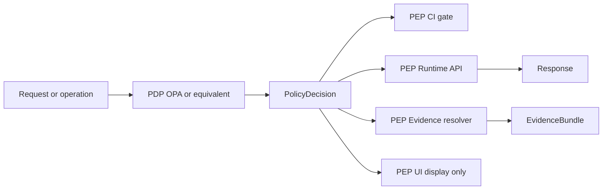

<!-- [KFM_META_BLOCK_V2]
doc_id: kfm://doc/9d34382d-f1e8-4cdc-839c-0a3fb3f1cbae
title: Policy Obligations
type: standard
version: v1
status: draft
owners: TBD
created: 2026-02-24
updated: 2026-02-24
policy_label: public
related:
  - TODO: link to policy bundle root (OPA/Rego) in this repo
  - TODO: link to JSON Schemas for PolicyDecision + Obligation objects
tags: [kfm, policy, obligations]
notes:
  - Obligations are emitted by policy evaluation and must be enforced by CI, runtime API, evidence resolver, and UI.
[/KFM_META_BLOCK_V2] -->

# Policy Obligations
> Machine-readable “must do / must show” actions emitted by policy evaluation and enforced at the KFM trust membrane.


**Path:** `data/policies/obligations/`  
**Owners:** TBD • **Last updated:** 2026-02-24

## Quick links
- [Purpose](#purpose)
- [What is an obligation](#what-is-an-obligation)
- [Contract surfaces](#contract-surfaces)
- [Where obligations are enforced](#where-obligations-are-enforced)
- [Obligation registry](#obligation-registry)
- [Implementing obligations](#implementing-obligations)
- [Testing](#testing)
- [Security and sensitivity](#security-and-sensitivity)
- [Directory layout](#directory-layout)
- [Appendix: examples](#appendix-examples)

---

## Purpose
This directory defines the **obligation contract** used by KFM policy evaluation.

An **obligation** is a machine-readable instruction returned alongside a policy decision (`allow`/`deny`) that **must be satisfied** before data/evidence is served or published. Typical obligations are:

- **Redaction/generalization transforms** (e.g., generalize geometry, remove sensitive fields)
- **Required UX notices** (e.g., “this layer is generalized due to policy”)

### Where this fits
KFM uses a policy-as-code architecture:

- A **Policy Decision Point (PDP)** produces decisions and obligations.
- Multiple **Policy Enforcement Points (PEPs)** must enforce them consistently in **CI and runtime**.
- The **UI displays** policy results (badges/notices) but **never makes policy decisions**.



### Acceptable inputs
- Obligation type definitions (registry and semantics)
- Examples/fixtures for policy decisions that include obligations
- Tests that ensure obligations are emitted and enforced consistently

### Exclusions
- Raw datasets, processed artifacts, or catalog outputs
- Secrets (keys, tokens), private credentials, or user PII
- Runtime logs or audit ledgers (those belong in governed audit storage)

[Back to top](#policy-obligations)

---

## What is an obligation
A policy decision returns:

- **decision**: `allow` or `deny`
- **policy_label**: classification input for evaluation
- **reason_codes**: policy-safe explanation codes (audit + UX)
- **obligations**: required actions (transforms, notices, constraints)

Obligations are mandatory: if a PEP cannot satisfy an obligation, it must **fail closed** (deny the operation or refuse to serve the data).

### Minimal obligation contract
All obligations must include:

- `type` (string; stable identifier)
- additional fields defined by the obligation type

[Back to top](#policy-obligations)

---

## Contract surfaces
Obligations must be treated as a contract, not an implementation detail.

You will typically see obligations on:

1. **PolicyDecision records** (logged/audited and referenced by provenance)
2. **Governed API responses** that include a `policy` object
3. **Evidence bundles** returned by the evidence resolver (used by Story + Focus surfaces)

> TIP: Keep obligation payloads **policy-safe**. If a user can see a decision and its obligations, the payload must not contain restricted values.

[Back to top](#policy-obligations)

---

## Where obligations are enforced
Obligations must be interpreted consistently by all PEPs:

| PEP | Enforces | Notes |
|---|---|---|
| CI gate | validates fixtures and schema; runs policy tests; blocks merges on deny or invalid obligations | CI semantics must match runtime semantics |
| Runtime API | applies redaction/generalization to responses; attaches required license/attribution; returns policy-safe errors | Avoid leaking existence via 403/404 differences |
| Evidence resolver | applies obligations before returning evidence bundles | Used by Story publishing and Focus Mode |
| UI | shows badges/notices; hides restricted controls; displays generalized status | UI never makes policy decisions |

[Back to top](#policy-obligations)

---

## Obligation registry
This table is the human-readable registry of obligation types.

If a machine registry exists in this repo (e.g., `registry.yaml`/`registry.json`), link it here.

### Confirmed obligation types
| `type` | Category | Required fields | Typical enforcement |
|---|---|---|---|
| `generalize_geometry` | Transform | `min_cell_size_m` (number) | pipelines, evidence resolver, API |
| `remove_attributes` | Transform | `fields` (array of strings) | pipelines, evidence resolver, API |
| `show_notice` | UX | `message` (string) | UI, API (as metadata) |

### Proposed obligation types (add only with schema + tests)
| `type` | Category | Rationale |
|---|---|---|
| `require_attribution` | Compliance/UX | Ensure attribution is displayed on exports and UI |
| `attach_license_text` | Compliance | Ensure license text accompanies downloads/exports |
| `suppress_precise_coordinates` | Transform | Prevent coordinates from leaking into Story Nodes/Focus Mode outputs |
| `metadata_only` | Access mode | Allow catalog entry without mirroring restricted assets |

> NOTE: Proposed types are placeholders; do not emit them from policy until implemented and tested end-to-end.

[Back to top](#policy-obligations)

---

## Implementing obligations

### Adding a new obligation type
Checklist (fail closed if any step is missing):

- [ ] Define the canonical `type` string and semantics in this README.
- [ ] Add/update JSON Schema for obligation objects.
- [ ] Add **fixtures**: at least 1 valid and 1 invalid example, including a full PolicyDecision with `obligations`.
- [ ] Update OPA/Rego rules to emit the new obligation.
- [ ] Implement enforcement in:
  - [ ] Runtime API (response shaping)
  - [ ] Evidence resolver (bundle shaping)
  - [ ] UI (notice/badge if applicable)
- [ ] Add tests:
  - [ ] Rego unit tests for the policy rule
  - [ ] Conftest (or equivalent) policy gate in CI
  - [ ] Unit tests for enforcement handlers (API/evidence/UI)
- [ ] Ensure audit/run receipts record the policy decision ID and obligation set.

### Determinism rules (recommended)
- Apply transforms in a deterministic order (example: generalize geometry, then remove attributes, then serialize).
- Never include restricted values inside obligation payloads.
- Obligation payloads must be “policy-safe” to show to a user who is allowed to see the decision.

[Back to top](#policy-obligations)

---

## Testing
Policy tests must run in CI and block merges.

Minimum policy testing requirements:
- allow/deny behavior per role + policy_label
- obligation emission for cases like `public_generalized`
- fixtures covering each obligation type and required fields

Suggested test assets:
- `fixtures/*.json` for input shapes and expected outputs
- `tests/*.rego` for unit tests
- CI job that runs `conftest test ...` (or equivalent) and fails on deny

[Back to top](#policy-obligations)

---

## Security and sensitivity
KFM defaults (as enforced by policy labels and obligations):

- deny by default for sensitive-location and restricted datasets
- if a public representation exists, it should be a separate `public_generalized` dataset version
- do not embed precise coordinates in Story Nodes or Focus Mode outputs unless policy explicitly allows
- treat redaction/generalization as a first-class transform recorded in provenance

Obligations are one mechanism to enforce these rules and to communicate them to the UI and audit trail.

[Back to top](#policy-obligations)

---

## Directory layout
> This is a **recommended** layout. Adjust filenames to match this repo once confirmed.

```
data/policies/obligations/
  README.md                 # this file
  registry.yaml             # machine registry of obligation types (TODO)
  examples/
    policy_decision_deny.json
    policy_decision_public_generalized.json
  schemas/
    obligation.schema.json
    policy_decision.schema.json
  tests/
    obligations_test.rego
```

[Back to top](#policy-obligations)

---

## Appendix: examples

### Example policy decision (template)
```json
{
  "decision_id": "kfm://policy_decision/xyz",
  "policy_label": "restricted",
  "decision": "deny",
  "reason_codes": ["SENSITIVE_SITE", "RIGHTS_UNCLEAR"],
  "obligations": [
    {"type": "generalize_geometry", "min_cell_size_m": 5000},
    {"type": "remove_attributes", "fields": ["exact_location", "owner_name"]}
  ],
  "evaluated_at": "2026-02-20T12:00:00Z",
  "rule_id": "deny.restricted_dataset.default"
}
```

### Example Rego obligation (illustrative)
```rego
# Obligations: if dataset is public_generalized, record obligation for UI notice
obligations[o] {
  input.resource.policy_label == "public_generalized"
  o := {"type": "show_notice", "message": "Geometry generalized due to policy."}
}
```

[Back to top](#policy-obligations)
