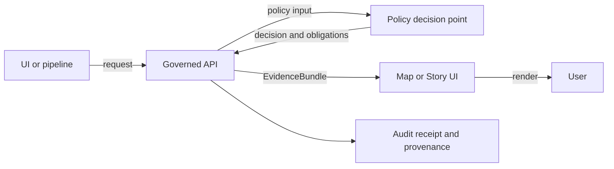

<!-- [KFM_META_BLOCK_V2]
doc_id: kfm://doc/1c214bfc-3ee5-4387-a1be-6122733f7a07
title: Policy Obligations Examples
type: standard
version: v1
status: draft
owners: TBD
created: 2026-02-24
updated: 2026-02-24
policy_label: public
related:
  - data/policies/obligations/
  - data/policies/
tags: [kfm, policies, obligations, fixtures, examples]
notes:
  - Store only synthetic examples; never store restricted coordinates, PII, or rights-restricted media here.
[/KFM_META_BLOCK_V2] -->

# Policy obligations examples

Synthetic, versioned examples of **policy obligations** used in **policy decisions**, **Evidence Bundles**, and **UI notices**.


**Quick links:**
- [Purpose](#purpose)
- [Where this fits](#where-this-fits)
- [What are obligations](#what-are-obligations)
- [Directory layout](#directory-layout)
- [Example registry](#example-registry)
- [How to use these examples](#how-to-use-these-examples)
- [Contribution workflow](#contribution-workflow)
- [Promotion gates](#promotion-gates)
- [Safety rules](#safety-rules)

> **NOTE**
> This directory exists to make policy behavior **testable** and **consistent**. Keep examples small, readable, and synthetic.

## Purpose

This folder contains *example obligations* that can be reused across:

- **Policy-as-code tests** (fixtures that assert allow/deny and the obligations emitted)
- **Governed APIs** (ensuring the Evidence Bundle contract includes obligations)
- **UI rendering** (policy badges and obligation-driven notices)

## Where this fits

Obligations are part of the system’s “trust membrane”:

- Policy evaluation emits a **decision** plus **obligations**.
- Governed APIs surface that output (e.g., in an Evidence Bundle).
- UI displays the results (badges/notices), but **must not** “decide policy” client-side.



## What are obligations

An **obligation** is a *machine-readable requirement or transformation* that must be applied and/or disclosed when policy is evaluated.

In KFM, policy evaluation returns:

- `decision`: `allow` or `deny`
- `policy_label`: a classification input (controlled vocabulary)
- `reason_codes`: why a decision happened (primarily for audit/UX)
- `obligations`: a list of structured objects describing **notices** and/or **required redaction/generalization steps**

### Example policy decision object

> The values below are illustrative; keep fixtures synthetic.

```json
{
  "decision_id": "kfm://policy_decision/example",
  "policy_label": "restricted",
  "decision": "deny",
  "reason_codes": ["SENSITIVE_SITE", "RIGHTS_UNCLEAR"],
  "obligations": [
    {"type": "generalize_geometry", "min_cell_size_m": 5000},
    {"type": "remove_attributes", "fields": ["exact_location", "owner_name"]}
  ],
  "evaluated_at": "2026-02-24T00:00:00Z",
  "rule_id": "deny.restricted_dataset.default"
}
```

### Example obligation emitted for a UI notice

```rego
# If dataset is public_generalized, record obligation for a UI notice
obligations[o] {
  input.resource.policy_label == "public_generalized"
  o := {"type": "show_notice", "message": "Geometry generalized due to policy."}
}
```

## Directory layout

Directory documentation standard (what belongs here, and what does not):

```text
data/policies/obligations/examples/
  README.md
  *.json          # Synthetic fixtures: obligation objects and/or full policy decision objects
  *.md            # Optional notes explaining a fixture set (keep short)
```

### Acceptable inputs

- Small, **synthetic** JSON fixtures representing:
  - a single obligation object, and/or
  - a full policy decision object with `decision`, `policy_label`, `reason_codes`, and `obligations`
- Minimal markdown notes explaining intent or edge cases

### Exclusions

Do **not** store:

- Real restricted locations (exact coordinates), personal data, or rights-restricted media
- Production policy code (Rego) or API contracts (those belong in their own governed locations)
- Large binaries (images, GeoTIFFs, tiles, etc.)

## Example registry

This registry is a *living index* of obligation types. Use it to keep policy, API, and UI aligned.

Legend:
- ✅ **Confirmed**: appears in current governance/source snapshots.
- 🧪 **Proposed**: useful convention, but requires governance acceptance.

| Type | Status | Intent | Minimum fields | Typical consumer |
|---|---:|---|---|---|
| `show_notice` | ✅ | Show an obligation-derived notice (e.g., “generalized due to policy”) | `message` | UI (badge/notice drawer) |
| `generalize_geometry` | ✅ | Ensure geometry is generalized before public delivery | `min_cell_size_m` | Pipeline transform and/or API representation |
| `remove_attributes` | ✅ | Remove sensitive fields from a response or export | `fields[]` | API output filter and/or export pipeline |
| `require_attribution` | 🧪 | Auto-attach attribution/license text in exports | `license`, `attribution_text` | Export service |
| `deny_export` | 🧪 | Forbid export even if some UI view is allowed | `formats[]` | Export service |

> **TIP**
> When you add a *new* `type`, you must also add:
> 1) a fixture here, 2) a policy test that asserts it, and 3) a UI/API mapping for how it is handled.

## How to use these examples

Common usage patterns:

1. **Policy tests**: load fixtures and assert that a given input emits the expected obligations.
2. **Contract tests**: validate that API responses (Evidence Bundles) include `policy.obligations` and that each item is an object.
3. **UI tests**: snapshot the obligation-driven badge/notice rendering (without re-implementing policy logic client-side).

### Minimal contract expectation

If you are returning an Evidence Bundle (or similar), treat the `policy` object as contract-first:

```json
{
  "policy": {
    "decision": "allow",
    "policy_label": "public_generalized",
    "obligations": [{"type": "show_notice", "message": "Geometry generalized due to policy."}]
  }
}
```

## Contribution workflow

1. Add a new `*.json` fixture (synthetic, minimal) in this folder.
2. Update/add the corresponding policy test(s) so CI fails if obligations drift.
3. If the obligation affects UI, add/update the UI mapping (badge/notice copy, iconography, severity).
4. If the obligation affects exports or API filtering, add/update server-side handling.

## Promotion gates

Use this checklist before merging changes that add or modify obligation examples:

- [ ] Example is **synthetic** and contains no restricted coordinates, PII, or rights-restricted media
- [ ] Example uses a **known** `policy_label` value (controlled vocabulary)
- [ ] A policy test asserts the example’s expected `decision` and `obligations`
- [ ] API contract tests cover `policy.obligations` shape
- [ ] UI rendering has a deterministic mapping for each obligation `type`

## Safety rules

- Default-deny when rights or sensitivity are unclear.
- If data must be exposed publicly, prefer creating **policy-consistent derivatives** (e.g., generalized versions) rather than trying to “hide” sensitive details at the last moment.
- Obligations should be written so they can be enforced automatically (pipeline/API), and explained clearly (UI/audit).

---

[Back to top](#policy-obligations-examples)
