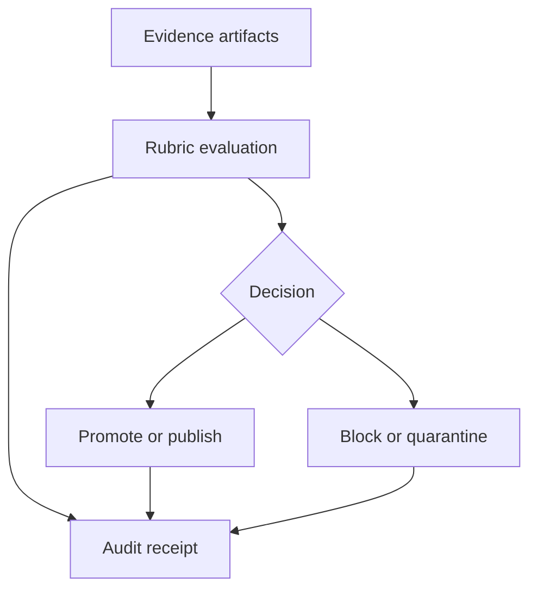

<!-- [KFM_META_BLOCK_V2]
doc_id: kfm://doc/d969d618-6a9c-428c-9df8-caa6209b2167
title: Rubrics — Directory Contract
type: standard
version: v1
status: draft
owners: TBD
created: 2026-02-24
updated: 2026-02-24
policy_label: restricted
related:
  - data/policies/README.md (if present)
tags: [kfm, policy, rubrics, governance]
notes:
  - Defines what belongs in data/policies/rubrics and how rubric artifacts are authored and reviewed.
  - Default-deny: do not publish a rubric without an owner and review trail.
[/KFM_META_BLOCK_V2] -->

# data/policies/rubrics
**Purpose:** Structured, evidence-driven scoring criteria (“rubrics”) used by governed policy gates to make pass/fail/conditional decisions.


> **WARNING (default-deny):** If a rubric’s consumer, scope, or sensitivity is unclear, treat it as **restricted** and block promotion until governance review.

## Quick navigation
- [Purpose](#purpose)
- [Where this fits](#where-this-fits)
- [Directory contract](#directory-contract)
- [Rubric format](#rubric-format)
- [Adding or updating a rubric](#adding-or-updating-a-rubric)
- [Review and promotion gates](#review-and-promotion-gates)
- [Examples](#examples)
- [FAQ](#faq)
- [Appendix](#appendix)

---

## Purpose
Rubrics are **machine- and human-readable** definitions of:
- **What must be true** (criteria) for an artifact to advance (e.g., Raw → Work → Processed → Published).
- **What evidence is acceptable** to prove it (links to receipts, checksums, QA reports, provenance).
- **How to score and decide** (thresholds, fail-closed rules, exceptions policy).

Rubrics are intentionally:
- **Evidence-bound**: criteria must map to verifiable evidence.
- **Policy-aware**: include sensitivity handling and redaction constraints.
- **Auditable**: evaluations should produce an “audit receipt” referencing rubric **id + version**.

[Back to top](#datapoliciesrubrics)

---

## Where this fits
Rubrics sit between **policy intent** and **enforcement gates**.



**Confirmed:** This repository follows a “trust membrane” stance: user-facing claims should be traceable to evidence and policy decisions (see project operating rules in the repo/system instructions).  
**Unknown (needs verification in repo):** the exact runtime that loads these rubrics (CI job, service, policy engine, etc.) and the canonical schema.

[Back to top](#datapoliciesrubrics)

---

## Directory contract

### Location
`data/policies/rubrics/`

### What belongs here
**Acceptable inputs:**
- Rubric definitions (recommended: `*.yaml` or `*.json`)
- Supporting documentation for a rubric (recommended: `*.md`)
- Test fixtures for rubric evaluation (recommended: `tests/` subfolder, if the repo supports it)
- Changelogs for rubric evolution (recommended: `CHANGELOG.md` adjacent to rubric)

**Recommended organization (proposed):**
```
data/policies/rubrics/
  README.md
  registry.yaml                # optional: list of rubrics + metadata (id/version/owner)
  <rubric_id>/
    rubric.v1.yaml
    rubric.v2.yaml
    NOTES.md
    CHANGELOG.md
```

### What must NOT go here
**Exclusions:**
- Raw datasets, extracts, or exports (belongs in data zones, not policy)
- Secrets (API keys, tokens, passwords), private keys, certificates
- Personally identifying information (PII) or sensitive coordinates
- Environment-specific configuration (deploy-time settings belong elsewhere)
- “One-off” manual decisions with no evidence trail

> **TIP:** If a rubric needs a sample, include only **synthetic** or **fully redacted** fixtures.

[Back to top](#datapoliciesrubrics)

---

## Rubric format

### Design principles
A good rubric is:
1. **Unambiguous**: criteria can be interpreted consistently by different reviewers.
2. **Testable**: each criterion maps to a check that can be validated from evidence artifacts.
3. **Fail-closed**: missing evidence defaults to **fail/unknown**, not pass.
4. **Versioned**: rubric changes are explicit, reviewable, and reversible.
5. **Scoped**: clearly states what artifact types and lifecycle zones it applies to.

### Minimal rubric schema (proposed)
If you don’t have a canonical schema yet, start with this minimal, stable set:

- `rubric_id` (string, stable across versions)
- `version` (string/semver or `vN`)
- `title` (string)
- `status` (`draft` | `review` | `published` | `deprecated`)
- `owner` (team/name)
- `policy_label` (`public` | `restricted` | …)
- `scope` (artifact types, lifecycle zones)
- `scoring` (scale + threshold)
- `criteria[]` (each with `id`, `statement`, `evidence_required`, `weight`, `fail_closed`)

### Example template
```yaml
rubric_id: kfm.rubric.data_publication_readiness
version: v1
title: Data Publication Readiness
status: draft
owner: TBD
policy_label: restricted

scope:
  artifact_types:
    - dataset
    - derived_table
  lifecycle_zones:
    - processed
    - published

scoring:
  scale: 0-3              # 0=missing, 1=weak, 2=good, 3=excellent
  pass_threshold: 2.0     # average or weighted score threshold
  fail_closed: true       # if any required criterion lacks evidence → fail

criteria:
  - id: identity_and_license
    statement: Artifact has stable identity, license, and provenance links.
    evidence_required:
      - metadata.identity
      - metadata.license
      - provenance.inputs
      - provenance.transforms
    weight: 2
    required: true
    fail_closed: true
    remediation: Add metadata + provenance receipt before promotion.

  - id: validation_results
    statement: Validation/QA checks meet thresholds for promotion.
    evidence_required:
      - qa.report
      - qa.thresholds
      - checksums.outputs
    weight: 3
    required: true
    fail_closed: true
    remediation: Fix QA failures or adjust thresholds via governance review.

  - id: sensitivity_review
    statement: Sensitivity classification is set and any redaction rules are applied.
    evidence_required:
      - metadata.sensitivity
      - policy.decisions.redaction
    weight: 3
    required: true
    fail_closed: true
    remediation: Run sensitivity review; redact/generalize as required.
```

> **NOTE:** The above is a **starter**. If your policy engine already defines a schema, update this README to match it and add a JSON Schema file alongside the rubrics.

[Back to top](#datapoliciesrubrics)

---

## Adding or updating a rubric

### 1) Create or change a rubric in a small, reversible increment
- Prefer **additive** changes (new version file) over mutating a published version in place.
- Keep criteria **atomic** (one claim, one evidence expectation).

### 2) Update the registry (if used)
If this repo maintains a rubric registry (recommended), add an entry:

| Field | Meaning |
|---|---|
| `rubric_id` | Stable identifier (never reused for a different rubric) |
| `version` | The active version |
| `status` | draft/review/published/deprecated |
| `owner` | Accountable maintainer |
| `scope` | What it applies to |
| `files` | Paths to rubric definitions |

### 3) Add tests or fixtures (if supported)
At minimum, include one fixture showing:
- a **passing** evaluation (complete evidence)
- a **failing** evaluation (missing evidence → fail-closed)
- an **edge case** (ambiguous evidence → unknown/fail)

### 4) Capture the decision trail
For any rubric change that affects promotion outcomes, include:
- a short rationale (in `CHANGELOG.md` or `NOTES.md`)
- references to related ADR/policy docs (if they exist)

[Back to top](#datapoliciesrubrics)

---

## Review and promotion gates

### Rubric publication checklist
- [ ] `owner` set (person/team)
- [ ] `policy_label` set and consistent with sensitivity rules
- [ ] Scope is explicit (artifact type + lifecycle zones)
- [ ] Each criterion has clear evidence requirements
- [ ] Fail-closed behavior is specified
- [ ] Version bump applied (no silent edits to published rubric)
- [ ] Test fixtures updated (if applicable)
- [ ] Change log updated

### Promotion gate behavior (recommended)
A gate should:
- Evaluate with a specific `rubric_id@version`
- Emit an **audit receipt** containing:
  - rubric id + version
  - input evidence references (paths, hashes, or receipt IDs)
  - per-criterion scores
  - final decision + reason codes
- Fail closed on missing evidence

**Unknown (needs verification in repo):** where audit receipts are stored and how they’re referenced from user-facing claims.

[Back to top](#datapoliciesrubrics)

---

## Examples

### Example rubric IDs (illustrative)
These are examples only—adapt to your system’s naming conventions:

- `kfm.rubric.data_publication_readiness`
- `kfm.rubric.pipeline_promotion_gate`
- `kfm.rubric.api_contract_readiness`
- `kfm.rubric.story_node_release_readiness`

### Example decision codes (illustrative)
- `EVIDENCE_MISSING`
- `SCHEMA_INVALID`
- `SENSITIVITY_UNREVIEWED`
- `QA_THRESHOLD_FAIL`
- `LICENSE_UNKNOWN`

[Back to top](#datapoliciesrubrics)

---

## FAQ

### Are rubrics the same as policies?
No. A **policy** states intent (“must not publish PII”). A **rubric** operationalizes intent as **criteria + evidence + scoring**.

### When should I make a new rubric vs. a new version?
- New rubric: fundamentally different purpose/scope.
- New version: same purpose, improved criteria/thresholds.

### Can a rubric allow exceptions?
If exceptions are allowed, they must be:
- explicit in the rubric (or referenced policy doc)
- logged in the audit receipt
- time-bounded and reviewable

[Back to top](#datapoliciesrubrics)

---

## Appendix

### Minimal verification steps
If you’re wiring this directory into a policy engine or CI gate, the smallest checks to convert unknowns to confirmed:
1. Identify the **consumer** of rubric files (CI job/service) and document it here.
2. Confirm the **canonical schema** (JSON Schema or equivalent) and link it.
3. Add a CI check that fails on:
   - duplicate `rubric_id`
   - missing required metadata fields
   - invalid schema / parse errors

---

### References
- Project library index (for bundled reference PDFs): see `KFM_Project_Library_Index.pdf`.
