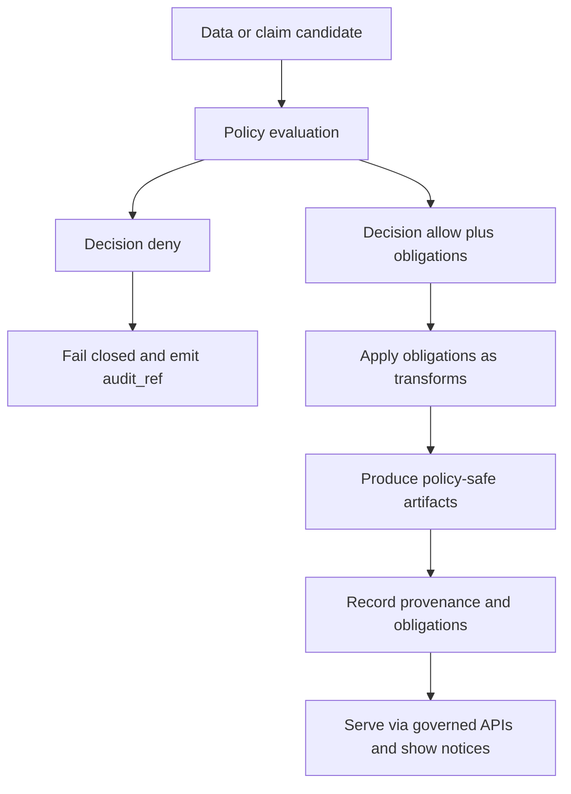

<!-- [KFM_META_BLOCK_V2]
doc_id: kfm://doc/a5c4504b-88ae-40f6-830f-ac64e58aec25
title: Generalization Rubric
type: standard
version: v1
status: draft
owners: governance-stewards
created: 2026-02-24
updated: 2026-02-24
policy_label: internal
related:
  - TODO: link to sensitivity rubric (if/when added)
  - TODO: link to policy bundle (OPA/Rego) location
tags: [kfm, policy, rubric, generalization, redaction, sensitive-location]
notes:
  - Defines how KFM generalizes/redacts data for public-safe representations while preserving traceability.
  - Designed to be enforceable in CI (fixtures) and runtime (policy engine + governed APIs).
[/KFM_META_BLOCK_V2] -->

# Generalization Rubric
**One-line purpose:** A governed, testable rubric for *when* and *how* KFM generalizes data (geometry, time, attributes, counts, and text) to prevent sensitive leakage while preserving evidence traceability.


> **WARNING**
> Generalization is **not** a guarantee of anonymity. It is a governance-controlled mitigation that must be paired with **policy labels**, **allow/deny decisions**, and **auditability**.

---

## Quick navigation
- [Where this fits](#where-this-fits)
- [Core stance](#core-stance)
- [Definitions](#definitions)
- [Generalization levels](#generalization-levels)
- [Rubric matrix](#rubric-matrix)
- [Decision procedure](#decision-procedure)
- [Obligations schema](#obligations-schema)
- [Audit and provenance requirements](#audit-and-provenance-requirements)
- [Validation and CI gates](#validation-and-ci-gates)
- [Examples](#examples)
- [Change control](#change-control)

---

## Where this fits
This document lives at:

```
data/policies/rubrics/generalization.md
```

**Role in the system:** this rubric is a *policy companion* that guides:
- policy labels (classification)
- policy evaluation outputs (allow/deny + obligations)
- pipeline transforms (generalization/redaction)
- UI trust surfaces (“why was this generalized?”)

**Expected neighborhood (PROPOSED):**
```
data/policies/
  rubrics/
    generalization.md        # this file
    sensitivity.md           # TODO (if/when added)
  bundles/
    kfm.rego                 # TODO: policy-as-code bundle home
  fixtures/
    policy_decisions/*.json  # TODO: allow/deny+obligation fixtures
```

**Acceptable inputs (what belongs here)**
- Cross-dataset rules for generalizing **geometry**, **time**, **attributes**, **counts**, **free text**, and **media**.
- Decision matrices that can be turned into **OPA fixtures**, **pipeline transforms**, and **CI checks**.
- Baseline defaults that can be overridden *only* by documented governance decisions.

**Exclusions (what must not go here)**
- Dataset-specific values that are not approved by a steward (keep those in dataset specs and policy fixtures).
- “Security through obscurity” guidance (e.g., hiding precise points in metadata, tiles, or logs).
- Implementation code (put code in the pipeline/transform layer; this file stays normative).

[Back to top](#generalization-rubric)

---

## Core stance
KFM generalization exists to enforce these invariants:

1. **Default deny** for sensitive-location and restricted data surfaces; only publish a public representation if policy explicitly allows it.
2. When a public representation is allowed for sensitive data, **publish it as a separate derivative** (e.g., `public_generalized`) rather than weakening the restricted source.
3. **No sensitive location leaks** across *any* surface (map tiles, Story Nodes, Focus Mode answers, exports, logs).
4. Treat generalization/redaction as a **first-class transform** recorded in provenance and visible in UX.

[Back to top](#generalization-rubric)

---

## Definitions
**Generalization**  
A transformation that reduces precision or specificity (e.g., aggregating points into a grid, dissolving polygons to admin units, rounding timestamps).

**Redaction**  
Removal or masking of fields/values that should not be exposed (e.g., dropping address/owner fields).

**Obligation**  
A required enforcement action returned by policy evaluation (e.g., `generalize_geometry`, `remove_attributes`, `show_notice`). Obligations must be applied consistently in CI and runtime.

**Sensitive location**  
A place whose disclosure could cause harm, including (non-exhaustive) culturally restricted sites, archaeological sites, sensitive species habitats, or vulnerable facilities.


## Controlled vocabulary hooks
KFM generalization is easier to test and enforce when the *inputs and outputs* use controlled vocabularies.

### Policy labels (dataset + derived artifacts)
These labels determine whether a resource can appear on a public surface and what obligations apply:

- `public`
- `public_generalized`
- `restricted`
- `restricted_sensitive_location`
- `internal`
- `embargoed`
- `quarantine`

### Geometry generalization methods
When representing geometry on a public surface, record the method used as `geometry.generalization_method`.

Allowed values (base forms):
- `none`
- `centroid_only`
- `grid_aggregation_` *(parameterized; suffix encodes grid size, e.g., `grid_aggregation_5000m`)*
- `random_offset_` *(parameterized; suffix encodes offset, and should be deterministic/seeded for reproducibility)*
- `dissolve_to_admin_unit`
- `bounding_box_only`

> **NOTE**
> Parameterized methods use a stable suffix so they can be validated in CI and displayed in UX.


[Back to top](#generalization-rubric)

---

## Generalization levels
Generalization is expressed as **levels** per data facet so it can be scored and tested.

### Geometry levels (G)
| Level | Public representation | Typical methods |
|---:|---|---|
| G0 | Full precision geometry | `none` |
| G1 | Simplified geometry (performance-driven) | `none` + simplification (no privacy guarantee) |
| G2 | Aggregated geometry | `grid_aggregation_*`, `dissolve_to_admin_unit` |
| G3 | Coarse geometry | `centroid_only`, `bounding_box_only` |
| G4 | No geometry | omit geometry; metadata-only |

### Time levels (T)
| Level | Public representation |
|---:|---|
| T0 | exact timestamp |
| T1 | rounded to hour |
| T2 | rounded to day |
| T3 | rounded to month/quarter |
| T4 | year-only or suppressed |

### Attribute levels (A)
| Level | Public representation |
|---:|---|
| A0 | all attributes |
| A1 | remove direct identifiers (names, contact, exact addresses) |
| A2 | remove quasi-identifiers (rare combinations, precise IDs) |
| A3 | allowlist only (safe fields) |
| A4 | no attributes (counts/geometry only) |

### Count levels (C)
| Level | Public representation |
|---:|---|
| C0 | exact counts |
| C1 | binned counts (ranges) |
| C2 | suppress small counts (k-threshold) |
| C3 | “presence only” (boolean) |
| C4 | no counts |

> **NOTE**
> KFM expects thresholds (grid size, minimum count k, admin units) to be **explicit, versioned, and recorded** as part of the obligation trail.

[Back to top](#generalization-rubric)

---

## Rubric matrix
Use this matrix to decide the minimum acceptable generalization for a **public** surface.

### A) By policy label
| policy_label | Public access? | Minimum default for public surface | Notes |
|---|---:|---|---|
| `public` | ✅ | G0/T0/A0/C0 | Still must remove accidental PII and enforce story/focus rules. |
| `public_generalized` | ✅ | **G2 or G3** + A1/A3 + C2 | Must show UI notice that geometry was generalized. |
| `restricted` | ❌ | N/A | Only shown to authorized roles; public gets deny. |
| `restricted_sensitive_location` | ❌ | N/A | Default deny; public can only see *separate* generalized derivative if approved. |
| `internal` | ❌ | N/A | Operator/steward only. |
| `embargoed` | ❌ | N/A | Time-limited restriction pending release. |
| `quarantine` | ❌ | N/A | Not promoted; validation/rights unresolved. |

### B) By field class (minimum)
| Field class | High-risk examples | Minimum public-safe handling |
|---|---|---|
| Precise geometry | point of sensitive site, detailed polygon boundary | G2–G4; never G0 in public if sensitivity applies |
| Direct location identifiers | address, parcel ID, owner name | A1–A4 (redact/remove) |
| Free text | letters, oral histories, descriptions with embedded locations | redact sensitive spans; may require summary-only |
| Small-area counts | counts for sparse areas | C2 (k-threshold suppression) and/or coarser G-level |
| Media | photos that reveal locations or identities | policy-controlled; metadata-only or restricted access |

### C) Surface-specific “hard rules”
| Surface | Hard rule |
|---|---|
| **Map tiles** | No restricted bbox leakage; no hidden precise points; policy enforced at tile serving |
| **Story Nodes** | Do not embed precise coordinates unless policy explicitly allows; otherwise use region-level references |
| **Focus Mode** | Must not become a side-channel: automatically generalize/omit sensitive locations and abstain if needed |
| **Exports** | Must not include restricted coordinate fields for public users; must reflect obligations applied |
| **Logs/receipts** | Must be redacted for PII and restricted info; access restricted |

[Back to top](#generalization-rubric)

---

## Decision procedure


### Step-by-step
1. **Classify** the resource with a `policy_label`.
2. **Evaluate policy** for the specific action + role + surface (API query, tile, export, story render, focus response).
3. If **deny** → fail closed, return a policy notice and audit reference.
4. If **allow** → apply obligations *before* the result can cross the trust membrane.
5. **Record** the generalization method and precision loss in provenance, and ensure the UI can display “what was changed and why”.

[Back to top](#generalization-rubric)

---

## Obligations schema
Obligations are the *machine-enforceable* output of the policy engine. Pipelines and APIs must treat obligations as required transforms, not “best effort”.

### Core obligation types

**Example only:** values below are illustrative. Grid size, k-thresholds, and fields to remove must be set by steward-approved policy obligations and recorded in provenance.

```json
[
  {"type":"generalize_geometry","method":"grid_aggregation_5000m","min_cell_size_m":5000},
  {"type":"remove_attributes","fields":["exact_location","owner_name"]},
  {"type":"generalize_time","resolution":"day"},
  {"type":"suppress_small_counts","k":5},
  {"type":"show_notice","message":"Geometry generalized due to policy."}
]
```

### Required obligation logging fields (minimum)
When any generalization/aggregation is applied, record:
- method used (grid size or admin unit)
- loss of precision (e.g., `spatial_uncertainty_m`)
- suppression rules applied (e.g., minimum cell count / k threshold)
- any changes in counts or totals due to aggregation or suppression

> **TIP**
> Prefer **deterministic** generalization (grid aggregation, admin dissolve) so results are reproducible across environments and Story replays.

[Back to top](#generalization-rubric)

---

## Audit and provenance requirements
Generalization is only “governed” if it is traceable.

### Minimum requirements
- Every pipeline run must emit a **run receipt** that includes the policy decision reference and the applied obligations.
- Every public-facing surface must be able to show:
  - policy label
  - “what obligations were applied”
  - audit reference
  - evidence bundle linkage

### UX expectations (trust surfaces)
The Evidence Drawer must display, at minimum:
- dataset version + license
- provenance chain
- **redactions applied (obligations)**
- a policy notice like “geometry generalized due to policy” when applicable

[Back to top](#generalization-rubric)

---

## Validation and CI gates
Generalization must be enforced by tests that **fail closed**.

> **NOTE**
> Policy-as-code must have the same semantics in **CI and runtime**. If CI allows something that runtime denies (or vice versa), governance guarantees are meaningless.

### Required checks (minimum)
- [ ] **Policy fixtures** exist for allow/deny + obligations for the new/changed data surface.
- [ ] CI runs **policy tests** (OPA fixtures) and blocks merge on regressions.
- [ ] CI validates public artifacts:
  - [ ] no restricted bbox leakage in public tiles
  - [ ] no coordinate fields in public exports when restricted
  - [ ] no Story Node embeds precise coordinates unless explicitly allowed
- [ ] Provenance record includes generalization method and uncertainty metadata.

### Suggested checks (strongly recommended)
- [ ] “Reverse engineering” checks (no hidden precise points in metadata, tiles, or logs).
- [ ] Focus Mode evaluation harness includes “no sensitive location leaks” cases.

[Back to top](#generalization-rubric)

---

## Examples

### Example 1: Restricted sensitive-location dataset → public generalized derivative
**Intent:** keep precise geometry restricted; publish a safe public derivative.

**Restricted source**
- `policy_label`: `restricted_sensitive_location`
- geometry: G0 (precise) stored only in restricted artifact zone

**Public derivative**
- `policy_label`: `public_generalized`
- obligations:
  - `generalize_geometry` (grid aggregation or admin dissolve)
  - `remove_attributes` (drop direct identifiers / exact location fields)
  - `suppress_small_counts` (k-threshold)
  - `show_notice`

### Example 2: Story Node referencing a sensitive location
- Story narrative may reference a location at a **regional** level.
- Map view state may zoom to a **broad region** rather than an exact point.
- Focus Mode must generalize/omit precise locations and abstain if the user asks for disallowed specificity.

[Back to top](#generalization-rubric)

---

## Change control
Generalization rules are governance policy.

**Who can change this rubric:** steward + policy engineer; consult governance council/community stewards for culturally sensitive changes.

**Definition of done for changes**
- [ ] Updated rubric text
- [ ] Updated policy fixtures and tests
- [ ] Updated UI notice strings (if applicable)
- [ ] Documented rationale + audit trail entry (ADR or equivalent)

---

<details>
<summary>Appendix: Implementation mapping hints (non-normative)</summary>

- Map `geometry.generalization_method` to parameterized methods:
  - `grid_aggregation_5000m`
  - `random_offset_250m_seeded`
  - `dissolve_to_admin_unit_county`
- Always store the *original* restricted geometry separately; never ship it “hidden” in public artifacts.
- Ensure tile-serving enforces policy (no bypass via static hosting).

</details>
