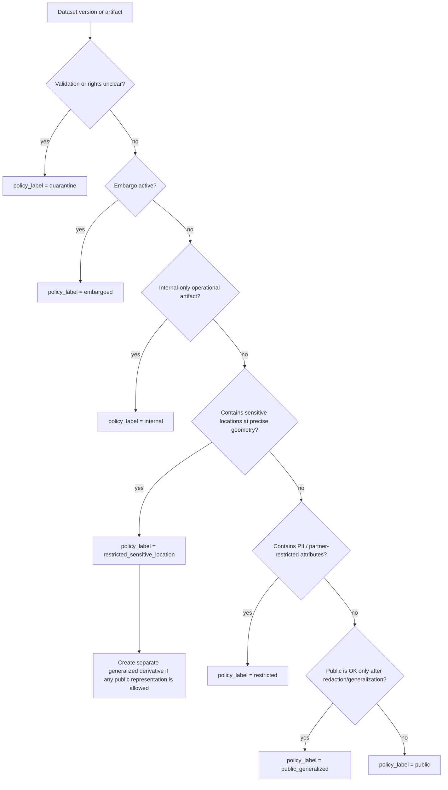

<!-- [KFM_META_BLOCK_V2]
doc_id: kfm://doc/b6989db3-b57f-4cce-a6c9-aafeeccef9c6
title: Sensitivity Rubric
type: standard
version: v1
status: draft
owners: KFM Governance Stewards
created: 2026-02-24
updated: 2026-02-24
policy_label: public
related:
  - kfm://doc/TODO-policy-as-code-architecture
  - docs/governance/REVIEW_GATES.md (if present)
  - data/policies/rubrics/licensing.md (if present)
tags: [kfm, policy, rubric, sensitivity]
notes:
  - Defines controlled vocabulary and decision rubric for kfm:policy_label.
  - Draft: tune thresholds/examples with governance council/community stewards.
[/KFM_META_BLOCK_V2] -->

# Sensitivity rubric
**Purpose:** classify datasets and derived artifacts into a `kfm:policy_label` so that CI + runtime policy enforcement can **fail closed** and public surfaces never leak sensitive content.

**Applies to:** source onboarding, dataset versions, distributions, map layers, Story Nodes, Focus Mode evidence resolution, and API responses.

> [!WARNING]
> When in doubt, classify **more restrictive** and route to governance review. “Default deny” is the safe operating mode.

## Quick navigation
- [Why this exists](#why-this-exists)
- [Controlled vocabulary: `policy_label`](#controlled-vocabulary-policy_label)
- [Rubric decision flow](#rubric-decision-flow)
- [Generalization guidelines](#generalization-guidelines)
- [Sensitive location release playbook](#sensitive-location-release-playbook)
- [Obligations by label](#obligations-by-label)
- [Where to record the decision](#where-to-record-the-decision)
- [Review triggers](#review-triggers)
- [Minimum checks](#minimum-checks)

---

## Why this exists
KFM requires that the **same policy semantics** apply in CI and runtime. Otherwise CI guarantees are meaningless. This rubric is the human-readable companion to policy-as-code (e.g., OPA fixtures/tests).

**Primary outcomes**
1. Every dataset version has an explicit `kfm:policy_label`.
2. Public representations of sensitive material are only served as **separate generalized derivatives** (never as “sometimes redacted” views of the same artifact).
3. Story + Focus Mode outputs never “accidentally” embed restricted coordinates, attributes, or metadata.

---

## Controlled vocabulary: `policy_label`
Use these exact values (case-sensitive) as the starter controlled vocabulary.

| `policy_label` | Meaning (short) | Typical surfaces | Default access |
|---|---|---|---|
| `public` | Safe for broad public distribution at native resolution/attributes. | Public map + stories + downloads. | Public user |
| `public_generalized` | Public **only after** generalization/redaction transforms. | Public map + stories (generalized). | Public user |
| `restricted` | Not public. Requires authorization (PII, partner terms, safety). | Steward/reviewer tools; restricted API endpoints. | Steward / authorized roles |
| `restricted_sensitive_location` | Not public **and** contains sensitive location geometry that could enable harm if exposed. | Restricted storage + governed API only. | Steward / authorized roles |
| `internal` | Operational/internal only (work products, logs, intermediate joins). | Internal tooling, CI artifacts, ops dashboards. | Operators (least privilege) |
| `embargoed` | Time-bound non-public until embargo ends (rights, agreements, safety). | Internal; may become public later. | Steward / authorized roles |
| `quarantine` | Blocked from promotion (failed validation, unclear rights, unresolved sensitivity). | Work/Quarantine zone only. | Operators + stewards |

> [!NOTE]
> `quarantine` is a **workflow stop sign**, not a “privacy level.” It means “do not promote.”

---

## Rubric decision flow
Use this decision flow to choose an initial label. If multiple conditions match, choose the **most restrictive** outcome.

### Decision factors
Use these factors to answer the flowchart questions consistently:

#### A. Sensitive locations
Classify as **`restricted_sensitive_location`** when any of the following is true:
- The dataset includes **precise points/lines/polygons** that represent vulnerable or culturally restricted sites (e.g., archaeological sites, sacred sites, restricted heritage inventories).
- The dataset would enable targeting, looting, vandalism, harassment, or other foreseeable harm if published with precise geometry.

**Default handling:** store precise geometry only in restricted datasets; if public representation is allowed, publish only as a **separate generalized** derivative.

#### B. Personal information or re-identification risk
Classify as **`restricted`** when the dataset includes:
- direct identifiers (names, addresses, phone numbers, emails), or
- quasi-identifiers that can re-identify people when joined, or
- small-cell counts that disclose individuals.

#### C. Rights or access constraints
Use **`embargoed`** when the dataset is permitted for internal processing but **not yet** for publication (time-bounded).
Use **`quarantine`** when rights are unclear or contested and must be resolved before *any* publication.

#### D. Public-safe but needs generalization
Use **`public_generalized`** when:
- the content can be public *only after* removing/obscuring sensitive attributes or reducing spatial/temporal resolution, AND
- you can produce a generalized artifact that cannot be trivially reverse-engineered into the restricted version.

---

## Generalization guidelines
Generalization is a **first-class transform**: it must be applied in pipelines, recorded in lineage (PROV), and surfaced in UI/API notices.

### Principles
- Prefer **separate artifacts** over conditional redaction at query time.
- Ensure generalized outputs **cannot be reverse engineered** into restricted coordinates (no hidden precise points, no “precision in metadata,” no accidental joins back to restricted IDs).
- Enforce policy at **serving time** (API + tile server). Do not rely on “static hosting” as a shortcut for public content.

### Allowed generalization approaches
Choose one or more:
- **Spatial aggregation:** counts/summaries by admin unit (county/tract) or grid.
- **Spatial coarsening:** reduce coordinate precision, snap to grid, or publish bounding boxes instead of points (only if it resists re-identification).
- **Attribute redaction:** drop sensitive columns entirely; replace with categorical bins.
- **Temporal coarsening:** replace exact dates with month/season/year, or use ranges.
- **K-anonymity style rules (conceptual):** avoid publishing small groups where individuals are exposed (implement as QA checks, not “best effort”).

> [!TIP]
> If you can’t explain why your generalized artifact is safe **without** referencing secret details, it’s probably not safe enough.

## Sensitive location release playbook
Use this playbook **whenever** a dataset contains sensitive locations (e.g., archaeology, sensitive species, sacred sites).

1. **Classification:** `restricted_sensitive_location`
2. **Dual outputs:**
   - **Restricted precise** dataset version (authoritative geometry; restricted access)
   - **`public_generalized`** dataset version (only if any public representation is allowed)
3. **Generalization method:** choose and document (e.g., grid aggregation, dissolve).
4. **Testing:** confirm no precise coordinates leak (including through metadata).
5. **UX notice:** UI indicates generalization and reason.
6. **Governance review:** council or designated authority approves release criteria.

---

## Obligations by label
Policy decisions may return **obligations** (things the system must do when access is allowed). Encode obligations in policy-as-code and tests.

| Label | Obligations (must) | UI requirements | API requirements |
|---|---|---|---|
| `public` | None beyond normal attribution/licensing. | Standard evidence drawer + citations. | Standard responses. |
| `public_generalized` | Attach obligation like `show_notice` describing the generalization. | Display “generalized due to policy” notice on layer/story/evidence cards. | Include obligations in evidence bundle response payload. |
| `restricted` | Default deny for public; require authz; no metadata leakage in deny responses. | Clearly show “restricted” badge; do not render previews that leak details. | Return deny without leaking restricted metadata in 403/404. |
| `restricted_sensitive_location` | Same as `restricted` **plus** coordinate suppression in all public contexts. | Never show precise coordinates in Story Nodes/Focus Mode unless explicitly allowed. | Enforce at tile serving and downloads; block bypass. |
| `internal` | Not routable to public surfaces; do not treat as publishable. | Not visible to public UI. | Not exposed in public API. |
| `embargoed` | Deny public until date; record embargo metadata in catalog for stewards. | Optional countdown/message for stewards only. | Deny public; allow steward roles. |
| `quarantine` | Block promotion; require remediation workflow. | Visible only in operator/steward tooling. | No runtime serving. |

---

## Where to record the decision
A sensitivity decision must be recorded in **catalog/provenance contract surfaces** so that runtime can enforce it predictably.

Minimum recording requirements:
- **Source registry:** every upstream source entry includes sensitivity classification intent.
- **DCAT dataset record:** include `kfm:policy_label` on the dataset version.
- **STAC collection/item:** include policy label (and indicate generalized extents where applicable).
- **PROV lineage:** record redaction/generalization as an explicit transform activity, with inputs/outputs and parameters.

---

## Review triggers
Beyond automated checks, the following should trigger a manual governance review:
- Adding a new dataset with culturally sensitive information or Indigenous data sovereignty concerns.
- Adding detailed locations of archaeological/sacred sites or other protected places.
- Exposing new public download/API surfaces that could reveal sensitive information.
- Any change that reclassifies data (public ↔ restricted, or new sensitivity rules).

---

## Minimum checks
Use this checklist before promotion:

### Required (block promotion if missing)
- [ ] `kfm:policy_label` assigned for dataset version and all distributions
- [ ] If label is `public_generalized`, a *separate* generalized artifact exists (not a view)
- [ ] Generalization transform recorded in PROV
- [ ] Policy tests exist (allow/deny + obligations) and run in CI
- [ ] Deny responses do not leak restricted metadata in 403/404 responses

### Recommended (strongly advised)
- [ ] “Reverse engineering” risk assessment documented for generalized artifacts
- [ ] UI badge + notice mapping implemented for obligations
- [ ] Sample Story Node/Focus Mode outputs verified to contain no precise restricted coordinates
- [ ] Operational logs avoid recording restricted payloads/coordinates (as feasible)
