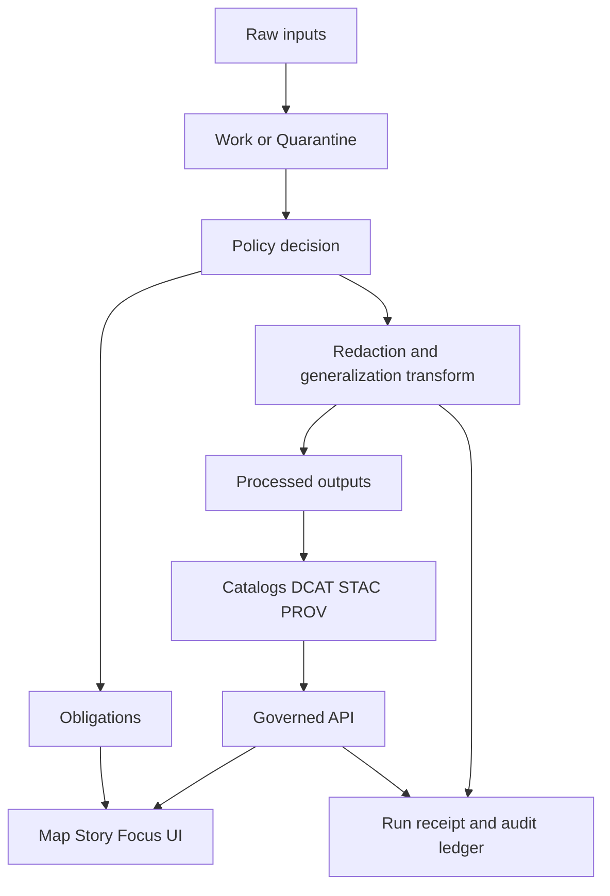

<!-- [KFM_META_BLOCK_V2]
doc_id: kfm://doc/<uuid>
title: Redaction Plan (v1)
type: standard
version: v1
status: draft
owners: <team or names>
created: YYYY-MM-DD
updated: YYYY-MM-DD
policy_label: internal
related:
  - kfm://dataset/<slug>@<dataset_version_id>
tags: [kfm, policy, redaction, template]
notes:
  - This is a governed template. Fill every REQUIRED field or mark as N/A with justification.
  - Do not include restricted details inside this plan if the plan will be shared broadly.
[/KFM_META_BLOCK_V2] -->

# Redaction Plan (v1)
**Purpose:** A governed, auditable plan describing *what* must be withheld, generalized, or transformed — and *how we prove it* — before a dataset (or story) can be served through KFM.

    
> TODO: Replace badge values when instantiated (status/owners/policy_label).

---

## Quick navigation
- [1. Scope and triggers](#1-scope-and-triggers)
- [2. Process overview](#2-process-overview)
- [3. Dataset identity](#3-dataset-identity)
- [4. Roles and approvals](#4-roles-and-approvals)
- [5. Redaction decision matrix](#5-redaction-decision-matrix)
- [6. Spatial sensitivity and geometry rules](#6-spatial-sensitivity-and-geometry-rules)
- [7. Narrative and Focus Mode constraints](#7-narrative-and-focus-mode-constraints)
- [8. Obligations](#8-obligations)
- [9. Verification and “no-leak” tests](#9-verification-and-no-leak-tests)
- [10. Provenance and audit recording](#10-provenance-and-audit-recording)
- [11. Release checklist](#11-release-checklist)
- [Appendix A: Controlled vocabulary](#appendix-a-controlled-vocabulary)
- [Appendix B: Example filled plan](#appendix-b-example-filled-plan)

---

## 1. Scope and triggers

### 1.1 What this plan governs
This plan applies to (check all that apply):

- [ ] Dataset publication (Processed → Published)
- [ ] Public representation of a restricted dataset (e.g., **public_generalized** companion)
- [ ] Map tiles / PMTiles exports
- [ ] Story Nodes that cite this dataset
- [ ] Focus Mode answers that may reference this dataset
- [ ] Audit logs produced by operations involving this dataset (logs may require their own redaction)

### 1.2 Trigger conditions
A redaction plan is REQUIRED when any of the following is true (check all that apply):

- [ ] `policy_label` is **restricted** / **restricted_sensitive_location** / **embargoed** / **quarantine**
- [ ] Dataset contains **sensitive locations** (archaeology, culturally restricted sites, sensitive species)
- [ ] Dataset contains **PII** or quasi-identifiers that enable re-identification
- [ ] Dataset has **rights constraints** requiring limited outputs/derivatives
- [ ] Story content could cause harm if overly specific (targeting, exploitation, sensationalization)

> **NOTE:** If you are unsure, **default to writing a plan** and routing it for steward review.

---

## 2. Process overview



**Design intent:** redaction/generalization is a *first-class transform* (it has parameters, outputs, tests, provenance, approvals), not an informal manual step.

---

## 3. Dataset identity

| Field | Value |
|---|---|
| Dataset slug | `<slug>` |
| Dataset version ID | `<dataset_version_id>` |
| Proposed policy_label | `<public|public_generalized|restricted|restricted_sensitive_location|internal|embargoed|quarantine>` |
| Source / authority | `<source org + EvidenceRef>` |
| Rights / license summary | `<license + rights holder + constraints>` |
| Intended audiences | `<public / internal / steward / partner>` |
| Public representation allowed? | `<yes/no/conditional>` |
| If yes, public representation type | `<public_generalized|aggregation_only|metadata_only>` |

---

## 4. Roles and approvals

### 4.1 RACI
| Activity | Responsible | Accountable | Consulted | Informed |
|---|---|---|---|---|
| Draft this redaction plan | `<name/team>` | `<steward>` | `<gov council/legal/security>` | `<operators>` |
| Implement transforms in pipeline | `<data engineer/GIS>` | `<operator>` | `<steward>` | `<contributors>` |
| Verify “no-leak” tests | `<QA/engineer>` | `<steward>` | `<security>` | `<operators>` |
| Approve release | `<steward>` | `<governance authority>` | `<council>` | `<contributors/public>` |

### 4.2 Approval record
| Role | Principal | Approved? | Approved at | Notes |
|---|---|---:|---|---|
| Steward | `<id>` | ☐ | `<timestamp>` |  |
| Governance council / authority (if applicable) | `<id>` | ☐ | `<timestamp>` |  |
| Legal / rights reviewer (if applicable) | `<id>` | ☐ | `<timestamp>` |  |

---

## 5. Redaction decision matrix

### 5.1 Field-level decisions (REQUIRED)
Fill one row per field (or grouped fields) in the **published** representation.

| Field / attribute | Example value | Sensitivity class | Treatment | Transform parameters | Rationale | Verification test |
|---|---|---|---|---|---|---|
| `<field_name>` | `<example>` | `<public/internal/restricted>` | `<keep/remove/generalize/hash/bucket/noise>` | `<params>` | `<why>` | `<test ref>` |

**Treatment guidance**
- **keep**: field is safe to publish as-is
- **remove**: field must not appear in the published artifact
- **generalize**: reduce precision (e.g., geometry, time, category)
- **hash**: one-way transform for linkage without revealing identifier (use governed salt reference)
- **bucket**: convert to coarser bins (e.g., age range, month, grid cell)
- **noise**: add controlled noise (only with steward approval; document method)

### 5.2 Row-level decisions (optional)
If some records must be removed entirely:

| Filter rule | Reason | Expected count removed | Verification test |
|---|---|---:|---|
| `<SQL/where expression or predicate>` | `<why>` | `<n>` | `<test ref>` |

---

## 6. Spatial sensitivity and geometry rules

### 6.1 Geometry handling (REQUIRED)
| Topic | Rule |
|---|---|
| Exact coordinates | `<allowed? yes/no>` |
| Published geometry type | `<point/line/polygon/none>` |
| Minimum spatial resolution | `<e.g., 5km grid>` |
| Allowed spatial extents | `<bbox policy>` |
| Tiles | `<allowed? public-only? generalized-only?>` |

### 6.2 Sensitive location release playbook (use when applicable)
If this dataset includes sensitive locations:

- [ ] Classify as **restricted_sensitive_location**
- [ ] Produce **dual outputs**:
  - [ ] Restricted (precise) dataset version
  - [ ] Public representation (if allowed) as **public_generalized**
- [ ] Choose and document generalization method:
  - [ ] grid aggregation
  - [ ] dissolve / polygon merge
  - [ ] jitter within cell (only if approved)
  - [ ] suppress rare categories
- [ ] Testing: confirm **no precise coordinates leak**
- [ ] UX notice: UI indicates generalization and reason
- [ ] Governance review: council/authority approves release criteria

---

## 7. Narrative and Focus Mode constraints

### 7.1 Story Nodes
- [ ] Story Nodes MUST NOT embed precise coordinates unless policy explicitly allows.
- [ ] Any map state stored with story content MUST respect the same generalization as published data.
- [ ] Claims MUST cite evidence; if restricted evidence cannot be shown, the narrative must abstain or cite a policy-safe substitute.

### 7.2 Focus Mode
- [ ] Focus Mode MUST “cite or abstain” when evidence is restricted.
- [ ] Abstention messages MUST be policy-safe and MUST NOT leak restricted existence details (“ghost metadata”).
- [ ] Focus Mode exports MUST include `audit_ref` and indicate any redactions applied.

---

## 8. Obligations

Policy evaluation can return obligations — required redaction/generalization steps and UX notices.

### 8.1 Obligations inventory (REQUIRED)
| Obligation type | Parameters | Applies to | Surface | Status |
|---|---|---|---|---|
| `generalize_geometry` | `min_cell_size_m: <n>` | `<dataset/artifact>` | `<tiles/api/story>` | ☐ planned ☐ implemented ☐ verified |
| `remove_attributes` | `fields: [...]` | `<artifact>` | `<api/export>` | ☐ planned ☐ implemented ☐ verified |
| `show_notice` | `message: ...` | `<ui>` | `<map/story/focus>` | ☐ planned ☐ implemented ☐ verified |

### 8.2 Policy decision snapshot (RECOMMENDED)
Capture a policy decision instance (or link to the policy decision artifact) so obligations and reason codes are explicit.

```json
{
  "decision_id": "kfm://policy_decision/<id>",
  "policy_label": "<restricted|restricted_sensitive_location|...>",
  "decision": "<allow|deny>",
  "reason_codes": ["<SENSITIVE_SITE>", "<RIGHTS_UNCLEAR>"],
  "obligations": [
    {"type": "generalize_geometry", "min_cell_size_m": 5000},
    {"type": "remove_attributes", "fields": ["exact_location", "owner_name"]},
    {"type": "show_notice", "message": "Geometry generalized due to policy."}
  ],
  "evaluated_at": "<timestamp>",
  "rule_id": "<rego rule id>"
}
```

---

## 9. Verification and “no-leak” tests

### 9.1 Required verification artifacts
- [ ] **Schema check**: published schema matches contract (no forbidden fields)
- [ ] **Geometry precision check**: no features exceed allowed precision
- [ ] **Tile inspection**: tiles do not leak restricted geometry/attributes
- [ ] **Story publish check**: citations resolve; map state respects redaction
- [ ] **Focus Mode check**: restricted evidence causes abstention; audit logged

### 9.2 Leakage test plan (REQUIRED)
| Test name | What it checks | Tool / script | Pass threshold | Evidence (link) |
|---|---|---|---|---|
| `<no_exact_coords>` | `<no lon/lat fields or point precision>` | `<tool>` | `<100%>` | `<path>` |
| `<no_restricted_fields>` | `<fields removed>` | `<tool>` | `<100%>` | `<path>` |

---

## 10. Provenance and audit recording

### 10.1 Provenance requirements
Redaction/generalization MUST be treated as a first-class transform:
- record algorithm + parameters
- record input/output digests
- link to policy decision ID
- link to approvals (when required)

### 10.2 Audit requirements
Every governed operation involving this dataset should emit a run receipt / audit entry including:
- who / what / when / why
- inputs and outputs by digest
- policy decisions (allow/deny) and obligations applied

> **WARNING:** Audit logs are themselves sensitive; apply log redaction and retention controls.

---

## 11. Release checklist

### 11.1 Minimum definition of done
- [ ] Plan fields completed (or N/A justified)
- [ ] Policy label assigned
- [ ] Obligations implemented and verified
- [ ] “No-leak” tests passing in CI
- [ ] PROV / run receipt emitted and linked
- [ ] Approvals captured (steward + governance authority if applicable)
- [ ] UI policy notice implemented (if required)

---

## Appendix A: Controlled vocabulary

### A.1 policy_label (starter)
- `public`
- `public_generalized`
- `restricted`
- `restricted_sensitive_location`
- `internal`
- `embargoed`
- `quarantine`

---

## Appendix B: Example filled plan
<details>
<summary>Click to expand</summary>

> Provide a fully instantiated example here once the first sensitive-location dataset is onboarded.

</details>
