# 🧱 `<another_dataset_or_product>` — Processed Dataset (`vX.Y.Z`)


> 🧭 **KFM rule of thumb:** this folder is the **authoritative, served-ready** output of a deterministic pipeline — not a scratchpad.  
> 🔒 **No manual edits:** if bytes change, it becomes a **new version folder** (`vX.Y.Z+1`) with updated provenance, catalog records, and QA.

---

## 📌 At-a-glance

| Field | Value |
|---|---|
| **Domain** | `<domain>` (e.g., `hydrology`, `infrastructure`, `demographics`, `landcover`, `history`) |
| **Dataset / Product** | `<another_dataset_or_product>` |
| **Version** | `vX.Y.Z` (SemVer for data products) |
| **Lifecycle stage** | `data/processed/` ✅ |
| **Intended use** | API serving, UI layers (2D/3D), analytics, Story Nodes, Focus Mode |
| **Geographic scope** | `<bbox / county / state / region>` |
| **Temporal coverage** | `<start_date>` → `<end_date>` |
| **Update cadence** | `<one-time | periodic | streaming>` |
| **License** | `<SPDX>` (must be explicit) |
| **Sensitivity / CARE label** | `<public | restricted | tribal-sensitive | pii-risk | ...>` |
| **Primary source(s)** | `<source name + stable URL(s) + access date>` |
| **Pipeline ID** | `<pipeline_name_or_id>` |
| **Build / run ID** | `<run_id>` (should match provenance + audit records) |

---

## 🧾 Recommended citation

Use this when referencing the dataset in reports, Story Nodes, or external publications:

> Kansas Frontier Matrix (KFM). `<another_dataset_or_product>` (Processed dataset), version `vX.Y.Z`. Domain: `<domain>`. Accessed `<YYYY-MM-DD>`. License: `<SPDX>`. Provenance: `<prov_ref>`.

---

## 🗂️ Folder layout (what to expect)

```text
📦 data/processed/<domain>/<another_dataset_or_product>/vX.Y.Z/
├─ 📄 README.md                         # you are here
├─ 📄 CHANGELOG.md                      # human summary of changes for this dataset
│
├─ 📁 data/                             # ✅ primary data artifacts (authoritative outputs)
│  ├─ 🧊 <layer>.geo.parquet            # (example) analytics-ready table
│  ├─ 🗺️ <layer>.pmtiles                 # (example) fast map tiles
│  ├─ 🛰️ <raster>.tif                   # (example) COG (Cloud-Optimized GeoTIFF)
│  └─ ...
│
├─ 📁 metadata/                         # “metadata as code” for this dataset version
│  ├─ 🧾 dataset.contract.yaml          # schema + governance fields + required IDs
│  ├─ 🏷️ fields.schema.json             # column definitions / types / constraints (optional)
│  └─ ...
│
├─ 📁 provenance/                       # chain-of-custody, machine-readable
│  ├─ ⛓ prov.jsonld                     # W3C PROV (Entities / Activities / Agents)
│  ├─ 🔎 evidence_manifest.yaml          # optional: evidence list for narrative outputs
│  └─ ...
│
├─ 📁 qa/                               # validation outputs (must be reproducible)
│  ├─ ✅ validation_report.json
│  ├─ 📊 summary_metrics.json
│  └─ 🧪 checks/                        # per-check artifacts (optional)
│
└─ 📁 exports/                          # optional distribution packs (do not duplicate truth)
   ├─ 📦 oci/                            # optional OCI packaging metadata
   └─ 📱 offline_pack/                   # optional UI offline pack bundle
```

> ✅ **Publish boundary artifacts:** This folder is “done” only when the **catalog + provenance + QA** artifacts exist and match the bytes in `data/`.

---

## 🔁 Data lifecycle (how this folder fits in KFM)

```mermaid
flowchart LR
  A["📥 data/raw/<domain>/ (immutable evidence)"] --> B["🧰 data/work/<domain>/ (intermediate)"]
  B --> C["✅ data/processed/<domain>/ (authoritative outputs)"]
  C --> S["🗺️ STAC (items/collections)"]
  C --> D["🗃️ DCAT dataset entry"]
  C --> P["⛓ PROV lineage bundle"]
  S --> G["🕸️ Graph index (Neo4j)"]
  C --> API["🔌 API layer (contracts + redaction)"]
  API --> UI["🧭 UI (Map + Timeline + Stories)"]
  UI --> F["🤖 Focus Mode (citations + XAI)"]
```



---

## 🧠 What this dataset is (and isn’t)

### ✅ Is
- A **versioned, reproducible** data product ready for:
  - map rendering (2D/3D),
  - timeline exploration,
  - search + discovery,
  - graph linking,
  - AI/Focus Mode answers with citations.

### ❌ Isn’t
- A manually edited working copy.
- A place for “just one quick fix” to a shapefile.
- A substitute for `data/raw/` (raw remains the immutable evidence boundary).

---

## 📐 Contract-first: schemas, IDs, and governance fields

This dataset version **must** have a contract (machine-readable) that answers:
- What are the fields + types?
- What is the CRS / spatial reference?
- What licenses apply?
- What sensitivity rules apply?
- What are the stable IDs used in catalogs + graphs?

<details>
<summary><strong>🧾 Minimal dataset contract (starter template)</strong></summary>

```yaml
dataset_id: "kfm.<domain>.<another_dataset_or_product>.vX_Y_Z"
version: "vX.Y.Z"
title: "<human-friendly title>"
description: "<what it is + what it enables>"
domain: "<domain>"

license: "<SPDX>"
providers:
  - name: "<source org>"
    source_url: "<stable url>"
    retrieved_at: "<YYYY-MM-DD>"

geo:
  crs: "EPSG:4326"
  bbox: [<minx>, <miny>, <maxx>, <maxy>]
  geometry_type: "<Point|LineString|Polygon|Raster|Mixed>"

time:
  start: "<YYYY-MM-DD>"
  end: "<YYYY-MM-DD>"
  cadence: "<static|daily|monthly|streaming>"

governance:
  sensitivity: "<public|restricted|pii-risk|tribal-sensitive|...>"
  care_label: "<Public|Restricted · Tribal Sensitive|...>"
  access: "<open|controlled|internal>"
  redaction_policy_ref: "<path or URL>"

artifacts:
  - path: "data/<file>"
    media_type: "<application/vnd.geo+parquet | application/vnd.pmtiles | image/tiff; profile=cloud-optimized | ...>"
    sha256: "sha256:<digest>"

provenance:
  prov_path: "provenance/prov.jsonld"
  run_id: "<run_id>"
  pipeline_ref: "<pipeline path/commit/tag>"
```
</details>

---

## ⛓ Provenance & evidence (chain-of-custody)

Every processed dataset version should be traceable to:
- the exact raw inputs used,
- the exact pipeline code/config,
- the exact tool versions,
- the exact run that produced the bytes.

### Provenance files
- `provenance/prov.jsonld` should model:
  - **Entities** (raw inputs, intermediate outputs, final dataset files),
  - **Activities** (ETL steps, reprojection, clipping, joins, aggregation),
  - **Agents** (CI bot, maintainer, pipeline service).

### Evidence manifests (optional but powerful)
If this dataset powers a **Story Node** or an AI-derived artifact, include:
- `provenance/evidence_manifest.yaml` listing evidence sources + checksums + how each was used.

---

## 🧪 QA, policy gates, and “fail closed” rules

This dataset should pass checks like:
- ✅ schema validation matches contract
- ✅ license present + allowed
- ✅ sensitivity classification present
- ✅ provenance exists and references the correct inputs/outputs
- ✅ STAC/DCAT entries resolve to the exact artifacts
- ✅ no secrets accidentally committed
- ✅ graph integrity checks (no orphaned catalog/prov nodes)

### CI / Policy-as-code expectations
- Governance rules are encoded (OPA Rego + Conftest) so changes are blocked if requirements aren’t met.
- Telemetry/trace outputs and energy/carbon checks may be enforced in CI (where configured).

<details>
<summary><strong>✅ Suggested QA checklist for maintainers</strong></summary>

- [ ] Contract file present and valid (`metadata/dataset.contract.yaml`)
- [ ] `license` is explicit + matches policy allowlist
- [ ] `sensitivity` and `care_label` set (not “TBD”)
- [ ] Provenance bundle present (`provenance/prov.jsonld`)
- [ ] QA report generated (`qa/validation_report.json`)
- [ ] STAC + DCAT published/updated for this version (see “Catalog integration” below)
- [ ] If packaged as OCI: digest pinned + signature verified
- [ ] If used in Stories: evidence manifest present + citations resolve
</details>

---

## 🗺️ Catalog integration (STAC / DCAT / PROV)

This folder contains the data bytes and local metadata, but **publication** requires the catalogs:

- **STAC**: item/collection describing the assets (spatial + temporal + license + links)
- **DCAT**: dataset-level catalog entry for discovery/harvesting
- **PROV**: lineage record linking source → process → outputs

> 🧠 Treat these as **boundary artifacts** — they’re the “API contract” for downstream indexing, UI, and AI.

---

## 🔌 Access patterns (files, database, API)

### Local / batch usage
- Read GeoParquet with `geopandas`, `duckdb`, or similar.
- Load rasters as COGs in GIS tooling.
- Use PMTiles for high-performance web maps (when applicable).

### PostGIS / Neo4j indexing (platform integration)
- If this dataset is served as a layer, it should be indexed with spatial + temporal metadata.
- Graph nodes should reference catalog/provenance records (no “mystery layers”).

---

## 🧭 UI integration notes (Map + Timeline + Stories + Focus Mode)

This dataset is intended to plug into:
- 🗺️ **2D map viewer** (layers, legends, popups),
- 🌍 **3D globe/terrain** (where applicable),
- ⏳ **timeline slider** (time-filtered rendering),
- 📖 **Story Nodes** (curated narratives backed by evidence),
- 🤖 **Focus Mode** (AI assistant that always cites sources and can show explainability/audit info).

### Layer transparency (the “map behind the map”)
When this dataset is used as a layer, the UI should surface:
- source attribution,
- license,
- provenance summary (e.g., processed date + pipeline),
- governance flags (e.g., “restricted” or “generalized geometry”).

### Offline / field support (optional)
If this dataset is part of an offline pack, store the pack manifest under `exports/offline_pack/` and keep it version-pinned.

---

## 📦 Optional: OCI artifact distribution (ORAS + Cosign)

For large binaries (PMTiles, GeoParquet, COGs), consider packaging as OCI artifacts:
- push/pull with ORAS,
- sign with Cosign,
- reference in catalog metadata (`distribution.oci`),
- attach provenance/SBOM as registry referrers.

<details>
<summary><strong>📦 Example OCI distribution stub (to mirror in STAC/DCAT)</strong></summary>

```yaml
distribution:
  oci:
    registry: "ghcr.io"
    repository: "<org>/kfm/<domain>/<another_dataset_or_product>"
    tag: "vX.Y.Z"
    digest: "sha256:<immutable-digest>"
    artifacts:
      - file: "<layer>.pmtiles"
        media_type: "application/vnd.pmtiles"
      - file: "<layer>.geo.parquet"
        media_type: "application/vnd.geo+parquet"
    referrers:
      - kind: "cosign-signature"
      - kind: "sbom"
      - kind: "prov-jsonld"
```
</details>

---

## 🧬 Versioning policy (SemVer for data)

Use `vX.Y.Z` consistently:
- **X (major):** breaking schema changes, meaning changes, major method changes
- **Y (minor):** additive changes (new columns/layers), expanded coverage, new assets
- **Z (patch):** bugfixes, corrected artifacts, metadata fixes, small pipeline fixes

**Rule:** never overwrite `vX.Y.Z`. Create `vX.Y.(Z+1)` (or higher) and log changes in `CHANGELOG.md`.

---

## 🧯 Known limitations & caveats

- `<list known gaps, assumptions, missing fields, temporal holes, CRS caveats, quality warnings>`
- If data is generalized/redacted for governance, note how.

---

## 👥 Ownership & contacts

| Role | Name/Handle | Contact | Notes |
|---|---|---|---|
| Maintainer | `<name>` | `<email/handle>` | |
| Data Steward (governance) | `<name>` | `<email/handle>` | |
| Source Provider | `<org>` | `<url>` | |

---

## 📚 KFM design references used for this README

> (Keep this list short but complete — it helps reviewers understand which standards this dataset is expected to obey.)

- Kansas Frontier Matrix (KFM) — Data Intake: Technical & Design Guide  
- Kansas Frontier Matrix (KFM) — Comprehensive Architecture, Features, and Design  
- Kansas Frontier Matrix — Comprehensive UI System Overview  
- Kansas Frontier Matrix (KFM) — AI System Overview  
- Kansas Frontier Matrix — Comprehensive Technical Documentation  
- Kansas Frontier Matrix — Latest Ideas & Future Proposals  
- Innovative Concepts to Evolve the Kansas Frontier Matrix (KFM)  
- Additional Project Ideas (including OCI artifact distribution + evidence manifest patterns)  
- Geospatial processing references (GDAL/OGR/PostGIS/Python)  
- Markdown + documentation best practices (templates, checklists, evidence-first writing)  
- AI concepts / data management portfolios (open in Acrobat for embedded resources)  
- Geospatial/WebGL/virtual-worlds portfolio (open in Acrobat for embedded resources)

---

## ✅ Definition of Done (DoD) for publishing `vX.Y.Z`

- [ ] Files placed under `data/` and checksums recorded
- [ ] Contract + schema present under `metadata/`
- [ ] PROV lineage bundle present under `provenance/`
- [ ] QA report present under `qa/`
- [ ] STAC + DCAT updated and validated against policy
- [ ] Governance fields (license, sensitivity, CARE label) set and reviewed
- [ ] If the UI layer is enabled: attribution + provenance panel info is correct
- [ ] If OCI distributed: digest pinned and artifact signed (Cosign)
- [ ] `CHANGELOG.md` updated with human-readable impact summary


