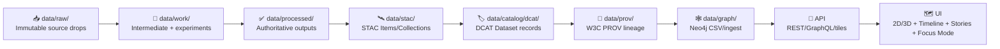

# 🧱 `data/processed/<domain>/` — Processed & Published Domain Outputs


> [!IMPORTANT]
> **No hand edits ✋**  
> Everything in `data/processed/<domain>/` is **pipeline-produced**, reproducible from `data/raw/…` (via `data/work/…`), and is considered **authoritative** once it passes catalog + provenance gates.

---

## 🧭 At a glance

| Item | Value |
|---|---|
| Domain slug | `<domain>` _(replace this)_ |
| Domain owner | `@<maintainer>` _(required)_ |
| Default CRS | `EPSG:4326 (WGS84)` |
| Downstream consumers | ✅ API • ✅ UI (2D/3D) • ✅ Graph • ✅ Focus Mode |
| Data status | **Published (processed)** |
| Sensitivity default | `public` _(override per dataset)_ |
| Update cadence | `ad-hoc / monthly / nightly` _(choose one)_ |

---

## 🧩 What belongs here (and what doesn’t)

### ✅ Put **only** “ready-for-use” artifacts here
- Curated, cleaned, standardized datasets that are **safe to serve** (API/UI) and **safe to cite** (Focus Mode).
- Outputs that are **derived deterministically** from known inputs (with evidence).
- Domain assets in **analysis-friendly** formats (e.g., GeoParquet) and/or **display-friendly** formats (e.g., PMTiles, COG).

### 🚫 Do **not** put these here
- Raw vendor dumps, messy “as-downloaded” files → go in `data/raw/`
- One-off experiments, notebooks, intermediate scratch outputs → go in `data/work/`
- “Mystery layers” with missing provenance/metadata (these fail policy gates)

> [!TIP]
> If you’re unsure whether something is “processed” or “work”:  
> **If it’s expected to power the UI / API / graph**, it belongs in **processed** (and must ship with STAC/DCAT/PROV).

---

## ♻️ Lifecycle: Raw → Work → Processed → Catalogs → Graph → API → UI

KFM treats data promotion as a **managed, auditable pipeline**, not a manual ritual.



> [!WARNING]
> **Ordering is enforced by policy.**  
> Anything that tries to “skip steps” (e.g., update graph/UI without catalogs/provenance) is treated as a governance violation.

---

## 🗂️ Recommended folder layout

This repo supports both “flat” (small/simple) and “dataset-scoped” (preferred) layouts.

### ✅ Preferred: dataset-scoped (scales best)
```text
data/processed/<domain>/
  README.md
  <dataset_slug>/
    vYYYYMMDD/                 # or vX.Y.Z — pick one convention & stick to it
      data/                    # the actual artifacts
        <dataset_slug>.geoparquet
        <dataset_slug>.pmtiles
        <dataset_slug>.tif      # (COG) optional for raster
      checksums.sha256
      manifest.json             # optional but recommended
```

### ✅ Acceptable: flat (small/simple)
```text
data/processed/<domain>/
  README.md
  counties.geojson
  counties.pmtiles
  checksums.sha256
```

---

## 🏷️ Naming & versioning rules

### Domain folder
- `snake_case` only: `hydrology`, `historic_maps`, `boundaries`, `landcover`
- No spaces, no capitals, no “misc”

### Dataset slug
- `snake_case` only, and **stable over time**  
  Example: `surficial_geology`, `river_gauges_usgs`, `historic_topo_1894`

### Versioning (choose one per dataset)
- **Date version**: `vYYYYMMDD` (best for data refreshes)
- **Semantic**: `vX.Y.Z` (best when schema changes are explicit)

> [!NOTE]
> Schema-breaking changes must be accompanied by **contract + catalog updates** (and ideally a new major version).

---

## 📦 Format guidance (performance + interoperability)

| Use case | Recommended artifact | Why |
|---|---|---|
| Fast map display & offline packs 📲 | `*.pmtiles` | Single-file tile container (great for web/mobile) |
| Analytics + AI feature engineering 🧠 | `*.geoparquet` | Columnar, fast, works great with modern tooling |
| Raster imagery/elevation 🌄 | `*.tif` (COG) | Streamable over HTTP; industry standard |
| Small vectors / debugging 🧪 | `*.geojson` | Easy to inspect; don’t use for huge datasets |

> [!TIP]
> Many KFM layers are **dual-format**:  
> **GeoParquet for analysis** + **PMTiles for display/offline** (same dataset, different “serving shape”).

---

## 🧾 Evidence requirements (STAC + DCAT + PROV)

A processed dataset is considered **publishable** when these exist (and validate):

- 🛰️ **STAC** describes assets, geometry, temporal bounds, links
- 🏷️ **DCAT** describes dataset-level catalog metadata (license, publisher, distributions)
- 🧬 **PROV** records lineage (inputs, code version, parameters, run ID, agents)

> [!IMPORTANT]
> **Provenance-first** means:  
> **No STAC/DCAT/PROV → no graph ingestion → no UI exposure → no AI citation.**

### Where metadata typically lives
_Exact paths can vary slightly by repo conventions—follow the canonical project structure._

- STAC: `data/stac/collections/…` and `data/stac/items/…`
- DCAT: `data/catalog/dcat/…`
- PROV: `data/prov/…`

---

## ✅ Integrity & QA gates (what CI/policy expects)

### Minimum checks for any new/updated processed artifact
- [ ] **Checksums exist** (`checksums.sha256`) and match artifacts
- [ ] **CRS** is correct and explicit (default: `EPSG:4326`)
- [ ] **Geometry validity** (no self-intersections; sane bounds)
- [ ] **Stable IDs** where appropriate (feature IDs don’t “randomly reshuffle”)
- [ ] **Schema/contract** validated (fields, types, required columns)
- [ ] **STAC/DCAT/PROV** updated and cross-linked
- [ ] **License present** and consistent across catalogs
- [ ] **Sensitivity classification** present + enforced

<details>
<summary>🧪 Extra checks strongly recommended (click to expand)</summary>

- [ ] Attribute domain checks (e.g., units, ranges, enum constraints)
- [ ] Temporal sanity (no future dates unless intended; interval correctness)
- [ ] Topology checks (if polygons must not overlap, etc.)
- [ ] Regression tests vs previous version (counts, extents, key metrics)
- [ ] Performance checks (tile size, parquet row group sizing, etc.)

</details>

---

## 🔐 Sensitivity, privacy & ethics

KFM supports (and expects) **sensitivity-aware publishing**:
- Some datasets must be **masked, generalized, or access-controlled** (e.g., archaeological sites, private stations, vulnerable species).
- **Processed outputs can still leak info** even if raw data is hidden—treat derived outputs as potentially sensitive too.

Recommended approaches (pick what fits the dataset):
- **Field suppression** (remove columns)
- **Geo-obfuscation** (round/blur coordinates; show approximate areas)
- **Aggregation** (publish by county/grid instead of point-level)
- **Query auditing / inference control** for sensitive aggregates
- **Differential privacy** for publishable statistics (advanced / optional)

> [!WARNING]
> “Open by default” is not the same as “safe by default.”  
> If there’s any chance of harm, **fail closed** and escalate to maintainers.

---

## 🔌 How downstream systems use this folder

### 🗺️ UI (2D/3D + Timeline + Stories + Offline)
- UI layers are expected to be traceable: **“the map behind the map”** is always available.
- Offline packs often bundle **PMTiles + story config** for field use.
- AR and time-navigation experiences rely on **good temporal metadata** and consistent identifiers.

### 🧠 Focus Mode (AI)
- Focus Mode only answers with **citations** to datasets/docs/graph entities.
- If the dataset can’t be traced, Focus Mode should refuse or report uncertainty.

### 🕸️ Graph (Neo4j)
- Graph ingestion is driven by **catalog + evidence**, not ad-hoc scripts.
- Stable IDs and clear relationships keep the knowledge graph coherent.

### 🔌 API boundary (security + governance)
- The UI should not “reach around” to databases/graphs directly.
- All access flows through the API, where policy enforcement and redaction can occur.

---

## ➕ Adding or updating a dataset (standard recipe)

1) **Define scope**
- What question does this dataset answer?
- What’s the domain model (entities/fields/units)?
- What’s the sensitivity classification?

2) **Ingest raw → work**
- Add source drops to `data/raw/<domain>/…`
- Transform in `data/work/<domain>/…` (scripts/notebooks OK here)

3) **Publish to processed**
- Generate artifacts into `data/processed/<domain>/<dataset_slug>/<version>/data/…`
- Create/update `checksums.sha256` (and `manifest.json` if used)

4) **Generate evidence**
- Add/update STAC + DCAT + PROV records that point to the artifacts
- Cross-link them (STAC ↔ DCAT ↔ PROV)

5) **Graph/API/UI integration**
- Only after evidence validates: update graph ingest + API exposure + UI layer config

6) **PR discipline**
- Prefer: “pipeline code + data outputs + evidence artifacts” in one PR
- Expect policy pack to block bypasses or missing provenance

---

## 📚 Dataset index (fill this in!)

> Keep this table accurate — it’s how humans (and tooling) understand what lives here.

| Dataset | Version(s) | Formats | Spatial | Temporal | Sensitivity | Primary use | Notes |
|---|---:|---|---|---|---|---|---|
| `<dataset_slug>` | `vYYYYMMDD` | GeoParquet, PMTiles | `KS statewide` | `1890–1930` | `public` | UI + AI | `<short note>` |
| `<dataset_slug>` | `vX.Y.Z` | COG | `tiles` | `1950` | `restricted` | UI | `geo-obfuscated` |

---

## 🧠 Glossary

- **STAC** — SpatioTemporal Asset Catalog (assets + geometry + time)
- **DCAT** — Data Catalog Vocabulary (dataset catalog/portal metadata)
- **PROV** — W3C provenance (lineage: inputs → process → outputs)
- **COG** — Cloud-Optimized GeoTIFF
- **PMTiles** — Single-file tiled map container (great offline)
- **GeoParquet** — Columnar geospatial parquet for analytics
- **Fail-closed** — If governance metadata is missing/invalid, **deny publish**

---

## 📎 Design basis & project references (for maintainers)

<details>
<summary>📚 Click to expand the doc index</summary>

- 🗄️ Data lifecycle & ingestion: `📚 KFM Data Intake – Technical & Design Guide`
- 🧱 System architecture & policy gates: `KFM – Comprehensive Architecture, Features, and Design`
- 🗺️ UI principles (provenance everywhere): `KFM – Comprehensive UI System Overview`
- 🧠 Focus Mode governance & citations: `KFM – AI System Overview`
- ✨ Roadmap ideas (policy pack, PR→PROV, offline packs): `🌟 Latest Ideas & Future Proposals`
- 🧪 Reproducible engineering: `Scientific Method / Master Coder Protocol`
- 🔐 Privacy of derived outputs: `Data Mining Concepts & Applications`
- 🧠 AI portfolio / programming resources (PDF portfolios; open in Acrobat for full content)

</details>

---

<!--
INTERNAL EVIDENCE NOTES (hidden in GitHub render; kept for traceability in this chat)

Core lifecycle & metadata conventions:
- Raw→Work→Processed→STAC→DCAT→PROV→Graph flow + directory targets:
  :contentReference[oaicite:0]{index=0}

Processed data + “authoritative outputs” concept:
- Managed data promotion / lifecycle:
  :contentReference[oaicite:1]{index=1}

Evidence-first (STAC/DCAT/PROV) + policy gates:
- Catalog standards and governance gates:
  :contentReference[oaicite:2]{index=2}
- CI schema validation for STAC/DCAT/PROV:
  :contentReference[oaicite:3]{index=3}

Policy Pack rules (ordering, API boundary, provenance-first, deterministic ETL):
- Pipeline ordering + API boundary + provenance-first + deterministic ETL:
  :contentReference[oaicite:4]{index=4}

UI provenance & “map behind the map”:
- UI transparency + provenance surfaced:
  :contentReference[oaicite:5]{index=5}
  :contentReference[oaicite:6]{index=6}

Focus Mode cites sources / refuses to fabricate:
  :contentReference[oaicite:7]{index=7}

Dual-format concept + offline packs & timeline:
  

Real-time data treated as many small datasets + provenance still required:
  :contentReference[oaicite:9]{index=9}

Reproducible engineering / CI / deterministic outputs:
  :contentReference[oaicite:10]{index=10}
  :contentReference[oaicite:11]{index=11}

Privacy warning: outputs of data mining can disclose sensitive info; query auditing & differential privacy:
  :contentReference[oaicite:12]{index=12}
  :contentReference[oaicite:13]{index=13}

File-cite markers for this chat session:
  :contentReference[oaicite:14]{index=14} :contentReference[oaicite:15]{index=15} :contentReference[oaicite:16]{index=16} :contentReference[oaicite:17]{index=17} :contentReference[oaicite:18]{index=18} :contentReference[oaicite:19]{index=19} :contentReference[oaicite:20]{index=20} :contentReference[oaicite:21]{index=21} :contentReference[oaicite:22]{index=22} :contentReference[oaicite:23]{index=23} :contentReference[oaicite:24]{index=24}

Legacy-required file-cite markers (from earlier tool notices):
  :contentReference[oaicite:25]{index=25} :contentReference[oaicite:26]{index=26} :contentReference[oaicite:27]{index=27} :contentReference[oaicite:28]{index=28}
-->

