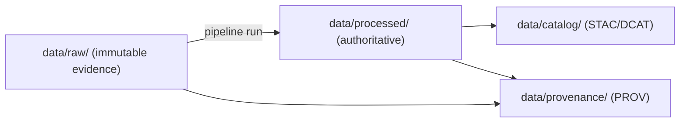

# `data/processed/` ✅ Curated Processed Data (Authoritative)


> [!IMPORTANT]
> **Processed serves truth.** Anything committed here is treated as **authoritative** for KFM and may be loaded into databases / served by governed APIs.
> If it isn’t reproducible from `data/raw/` via repeatable pipelines, it doesn’t belong here.

## What belongs here

`data/processed/` holds the **outputs of pipelines**: cleaned, standardized datasets ready for use by:
- databases (e.g., PostGIS / graph),
- analysis tools,
- map rendering,
- Focus Mode / evidence bundles.

These assets should be safe to treat as “the current best canonical form” inside KFM.

## What does *not* belong here

| ❌ Don’t commit | ✅ Use instead |
|---|---|
| raw source snapshots | `data/raw/` |
| intermediate scratch outputs | `data/work/` (or the pipeline job’s ephemeral storage) |
| ad‑hoc manual edits / one‑off “fixes” | fix the pipeline and re-run; let Git show diffs |
| undocumented datasets | add catalogs + provenance first, then promote |

> [!TIP]
> If you can’t explain **how** a file was produced and **from what raw inputs**, it’s not ready for `data/processed/`.

## Directory layout

Organize by **theme** or **source**, typically mirroring/complementing `data/raw/`.

```text
data/processed/
  <theme-or-source>/
    <dataset_slug>.<ext>
  <theme-or-source>/
    <dataset_slug>.<ext>
  ...
```

Example (illustrative):

```text
data/processed/
  census/
    1900_population.geojson
  imagery/
    landsat_2010_Kansas.tif
  drought_index.geojson
```

## Typical formats

Choose formats that match the data and how KFM will serve/use it.

| Data class | Typical formats | Notes |
|---|---|---|
| Vector (points/lines/polygons) | GeoJSON, Parquet | Prefer canonical CRS; keep attribute dictionaries in metadata. |
| Tabular | CSV, Parquet | UTF‑8; explicit field types & units. |
| Raster/imagery | GeoTIFF (COG where appropriate) | Use STAC for footprints/time coverage; keep processing level. |

## Standardization & normalization rules

Unless there’s a documented exception (in metadata), processed outputs should be normalized to:

- **Encoding:** UTF‑8
- **Time:** ISO‑8601 (timestamps and ranges)
- **Geometry/CRS:** WGS84 (EPSG:4326) by default
- **Attributes:** human-readable field names; units standardized; no unexplained codes

> [!NOTE]
> If a domain needs a different CRS or encoding (e.g., local engineering grids), that’s allowed — but it must be explicitly documented in the catalog metadata.

## Promotion contract

A dataset can be *added or modified* in `data/processed/` **only** via a governed promotion step.

Promotion is “real” only when the dataset ships with:

- ✅ deterministic **checksums** (for artifacts and/or bundles)
- ✅ **validation evidence** (schema, geometry, temporal sanity, domain rules)
- ✅ **license + attribution** captured
- ✅ **catalog records** (DCAT always; STAC and PROV where applicable)
- ✅ **policy labels** (sensitivity / redaction / access constraints)
- ✅ CI gates that enforce “fail‑closed” promotion

### Minimum “Promotion DoD” checklist

- [ ] Processed artifact(s) created by a repeatable pipeline run
- [ ] Provenance chain links **raw → pipeline run → processed**
- [ ] Catalog entries exist and cross‑link to the artifact(s) + provenance
- [ ] Validation gates run and pass
- [ ] Sensitive fields/locations are redacted/generalized when required
- [ ] Links are resolvable (no broken catalog/prov pointers)

## Catalog & lineage cross-links

Processed data is only useful if it’s **discoverable** and **traceable**.

You should expect corresponding records in:

- `data/catalog/` — dataset catalog metadata (STAC/DCAT)
- `data/provenance/` — provenance logs (W3C PROV, typically as JSON/JSON‑LD)

Some earlier drafts refer to legacy aliases like:
- `data/stac/` (STAC)
- `data/catalog/dcat/` (DCAT)
- `data/prov/` (PROV)

> [!IMPORTANT]
> If the catalogs and provenance don’t exist (or don’t link back to this artifact), **do not promote**.

### Minimal linkage model



## Sensitivity & redaction

Some KFM sources can be sensitive (examples include private ownership records, precise archaeological site locations, and certain health/public-safety indicators). Handle sensitivity by:

- labeling datasets/fields with policy tags,
- producing redacted/generalized **derivative datasets** (with explicit provenance),
- enforcing access via the policy boundary (fail‑closed).

> [!CAUTION]
> If sensitivity is uncertain, **pause promotion** and request governance review before committing to `data/processed/`.

## Large files & storage

`data/processed/` is version-controlled as part of the repo’s “single source of truth” philosophy.

When files are too large for normal Git:
- use Git LFS **or**
- store a pointer + checksum + fetch script

…but still treat the artifact as part of `data/processed/` logically (path + identity tracked in Git).

## Adding or updating a dataset (workflow)

1. **Acquire** and store the unmodified snapshot in `data/raw/`
2. **Transform** via a repeatable pipeline (no manual patching)
3. **Validate** (schema / geometry / time / domain rules / policy)
4. **Publish** to `data/processed/`
5. **Emit metadata**: catalog (DCAT/STAC) + provenance (PROV)
6. **Promote via PR**: CI must pass; reviewers verify receipts + cross-links

---

### Quick sanity check (human)

Before merging a PR that touches `data/processed/`, answer:

- Can I trace this file back to a raw source snapshot?
- Do catalog records point to the correct artifact path(s)?
- Is there a provenance record for the producing run?
- Are license/attribution and sensitivity labels present?