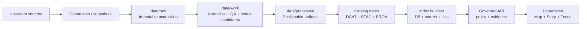

<!-- [KFM_META_BLOCK_V2]
doc_id: kfm://doc/d64ea623-93b5-433f-ab72-44c9f70eba4e
title: data/processed — PROCESSED Zone README
type: standard
version: v1
status: draft
owners: kfm-data-eng; kfm-governance-stewards
created: 2026-02-22
updated: 2026-02-22
policy_label: public
related:
  - data/processed/
tags:
  - kfm
  - data
  - processed
  - promotion-contract
  - provenance
notes:
  - Defines what is allowed in the PROCESSED zone and the minimum evidence required for promotion.
[/KFM_META_BLOCK_V2] -->

# data/processed — PROCESSED Zone
Publishable, versioned artifacts produced by governed pipelines **after** promotion gates.


**Status:** draft  
**Owners:** `kfm-data-eng`, `kfm-governance-stewards`

---

## Quick navigation

- [Purpose](#purpose)
- [Role in the Truth Path](#role-in-the-truth-path)
- [What belongs here](#what-belongs-here)
- [What must not be here](#what-must-not-be-here)
- [Promotion Contract gates](#promotion-contract-gates)
- [Recommended layout](#recommended-layout)
- [Required sidecars](#required-sidecars)
- [Operational rules](#operational-rules)
- [Definition of Done for a dataset version](#definition-of-done-for-a-dataset-version)
- [FAQ](#faq)

---

## Purpose

`data/processed/` is the **publishable** data zone: artifacts here are considered eligible to be served (subject to policy) once the dataset version has passed promotion gates and has complete catalogs/provenance.

> [!IMPORTANT]
> Treat this directory as **release-grade output**, not a scratchpad. If you need to experiment, use `data/work/` or a domain-specific quarantine area.

---

## Role in the Truth Path



---

## What belongs here

Typical content in `data/processed/`:

- **Publishable artifacts** in KFM-approved formats (examples: `GeoParquet`, `PMTiles`, `COG`, text corpora).
- **Checksums** for every processed artifact.
- **Derived runtime metadata** (examples: spatial bounding boxes, temporal ranges, counts).

> [!NOTE]
> “Publishable” does **not** mean “public.” Restricted datasets can be processed and stored here **if** they carry a `policy_label` and have a recorded redaction/generalization plan where applicable.

---

## What must NOT be here

- Raw source snapshots, scrape dumps, unnormalized exports (belongs in `data/raw/`).
- Intermediate transforms, QA drafts, or candidate redactions (belongs in `data/work/`).
- Anything with:
  - failed validation
  - unclear licensing / rights
  - unresolved sensitivity concerns
  - irreproducible acquisition (upstream instability)
  
> [!WARNING]
> **Quarantined items are not promoted.** If licensing/sensitivity is unclear, fail closed and keep it out of `data/processed/`.

---

## Promotion Contract gates

A dataset version **must be blocked** from promotion unless all required artifacts exist and validate. The minimum credible set is Gates **A–F** (Gate **G** is strongly recommended for production posture).

| Gate | What must be true (fail-closed) | Why it matters |
|---|---|---|
| **A — Identity & versioning** | Stable dataset ID; immutable dataset version derived from deterministic spec hash | Makes caching, citation, and reproducibility possible |
| **B — Licensing & rights** | Explicit license; rights holder/attribution requirements captured; unclear license → quarantine | Prevents illegal/unsafe publication |
| **C — Sensitivity & redaction** | `policy_label` assigned; redaction/generalization plan exists and is recorded in provenance (when needed) | Prevents location/safety harm; enforces default-deny |
| **D — Catalog triplet validation** | DCAT + STAC + PROV exist (as applicable), validate against profiles, and cross-links resolve | Enables EvidenceRefs without guessing |
| **E — Run receipt & checksums** | run receipt exists per producing run; inputs/outputs enumerated with checksums; environment recorded | Ensures provenance + tamper evidence |
| **F — Policy + contract tests** | OPA policy tests pass; EvidenceRef resolution works in CI; schemas/contracts validate | Enforces governance at build + runtime |
| **G — Optional but recommended** | SBOM + build provenance; perf smoke checks; a11y smoke checks | Production posture and user trust |

> [!TIP]
> If you’re unsure “is this ready for processed?”, the default answer is **no** until Gates A–F are satisfied.

---

## Recommended layout

KFM typically organizes data by **domain** and **dataset**, with versioned outputs underneath.

```text
data/processed/
└─ <domain_or_authority>/
   └─ <dataset_slug>/
      └─ <dataset_version_id>/                 # immutable release unit
         ├─ artifacts/                         # publishable outputs
         │  ├─ features.parquet                # GeoParquet example
         │  ├─ tiles.pmtiles                   # PMTiles example
         │  └─ raster.tif                      # COG example (or .tif + COG metadata)
         ├─ derived/                           # runtime helpers (bbox, temporal, counts)
         │  └─ runtime_metadata.json
         ├─ checksums/                         # per-artifact digests
         │  └─ sha256sums.txt
         └─ receipts/                          # provenance/run receipts (or links to them)
            └─ run_receipt.json
```

> [!NOTE]
> Your repo may use a different on-disk convention. The non-negotiable is the **behavioral contract**: versioned artifacts + checksums + provenance + policy.

---

## Required sidecars

At minimum, for each `<dataset_version_id>/` you should have:

- `checksums/sha256sums.txt` (or equivalent) that covers **every file** in `artifacts/` and critical metadata.
- A machine-readable `derived/runtime_metadata.json` (or equivalent) that supports runtime needs (bbox, time range, counts).
- A `receipts/run_receipt.json` (or a resolvable pointer to the canonical receipt location).

Example (illustrative) `runtime_metadata.json`:

```json
{
  "dataset_version_id": "YYYY-MM.<spec>",
  "bbox": [-102.05, 36.99, -94.60, 40.00],
  "temporal_range": { "start": "1950-01-01T00:00:00Z", "end": "2024-12-31T23:59:59Z" },
  "counts": { "features": 123456 }
}
```

Example (illustrative) `sha256sums.txt`:

```text
<sha256>  artifacts/features.parquet
<sha256>  artifacts/tiles.pmtiles
<sha256>  derived/runtime_metadata.json
<sha256>  receipts/run_receipt.json
```

---

## Operational rules

### Immutability and versioning

- A `<dataset_version_id>/` directory is an **immutable release**.
- If any artifact content changes, you must:
  - produce a **new** dataset version ID,
  - regenerate checksums,
  - regenerate/attach a new run receipt,
  - update catalogs/provenance accordingly.

### Determinism

Pipelines that produce PROCESSED artifacts should be deterministic:

- dependencies pinned (e.g., container image by digest)
- stable input ordering
- avoid clock-dependent content inside artifacts (timestamps recorded separately)
- reproducible given: raw inputs by digest + pipeline spec hash + environment digest

### Policy-first

- Every processed dataset version must have a `policy_label` and must be evaluated fail-closed.
- If a layer contains sensitive locations, the public-facing output should be generalized or redacted per an explicit plan recorded in provenance.

> [!WARNING]
> Do not “temporarily promote” datasets with unclear rights or sensitivity. Put them in quarantine until resolved.

---

## Definition of Done for a dataset version

A dataset version is “done” (promotion-ready) only when:

- [ ] RAW acquisition is reproducible and documented
- [ ] WORK transforms are deterministic (same inputs → same outputs; same spec → same hash)
- [ ] PROCESSED artifacts exist in approved formats and are digest-addressed
- [ ] Catalog triplet validates and is cross-linked (DCAT + STAC + PROV as applicable)
- [ ] EvidenceRefs resolve and render in the UI evidence drawer
- [ ] Policy label assigned, with documented review/approval where required
- [ ] Changelog entry explains what changed and why

---

## FAQ

### Can restricted datasets be stored in `data/processed/`?
Yes—**if** they are versioned, checksummed, and have complete licensing + policy labeling + provenance. “Processed” means “publishable under policy,” not “public.”

### Where do catalogs (DCAT/STAC/PROV) live?
Wherever the repo’s catalog location is defined (often a sibling tree or a dedicated `catalog/` area). The requirement is that they **exist**, validate, and cross-link back to these processed artifacts.

### Can I hand-edit a processed artifact to fix a typo?
No. Treat processed artifacts as build outputs. Fix the pipeline/spec and produce a new dataset version so checksums + receipts remain trustworthy.

---

<details>
<summary>Appendix: Reviewer checklist (PRs that touch <code>data/processed/</code>)</summary>

- [ ] Are all added/changed artifacts covered by checksums?
- [ ] Is there a run receipt that enumerates inputs/outputs and captures environment digests?
- [ ] Are license + rights explicit and compatible?
- [ ] Is <code>policy_label</code> set, and are any obligations (generalization/redaction) satisfied?
- [ ] Do DCAT/STAC/PROV validate and cross-link?
- [ ] Do EvidenceRefs resolve (at least one in CI)?
- [ ] If this is a large layer: is there a tile-friendly distribution (e.g., PMTiles), not just raw GeoJSON?

</details>

---

_Back to top:_ [↑](#dataprocessed--processed-zone)
