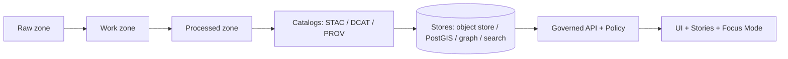

<!--
KANSAS FRONTIER MATRIX (KFM) — GOVERNED ARTIFACT
Path: data/processed/README.md
Zone: Processed (Publishable Truth)
-->

# 🧪 data/processed/ — Processed Zone (Publishable Truth)


This directory contains **canonical, validated, provenance-linked** datasets that are allowed to power the KFM **API/UI/Stories/Focus Mode**.

> [!IMPORTANT]
> **Processed is the only publishable source of truth.**  
> Raw/work artifacts are *inputs* and *intermediates*—they are **not served directly** to users.

---

## ✅ What belongs here

- **Final, standardized outputs** produced by pipelines (repeatable + reproducible).
- Data that has passed **validation gates** (schema, geospatial, temporal, licensing, policy).
- Artifacts that have **checksums** and are fully represented in KFM catalogs (**DCAT/STAC/PROV**).

---

## 🚫 What must NOT belong here

- “Hand-edited” one-off fixes that bypass pipelines.
- Any dataset with **unclear license**, missing attribution, or missing sensitivity classification.
- Sensitive/precise location data published without an approved **redaction/generalization** workflow and a distinct provenance chain.

> [!NOTE]
> If you discover an error: **fix the pipeline and publish a new version**. Don’t mutate history.

---

## 🧭 The KFM truth path (context)



---

## 📦 Directory layout

KFM documentation has described both a **zone-first** and a **domain-first** layout. This README defines the **contract for the processed zone**, regardless of which layout you use.

### Option A — Zone-first (root processed)

```text
data/
├── raw/                     # immutable source drops (read-only)
├── work/                    # intermediate artifacts + QA outputs
├── processed/               # ✅ THIS DIRECTORY
├── stac/                    # STAC collections/items for published assets
├── catalog/
│   └── dcat/                # DCAT dataset records (JSON-LD)
└── prov/                    # PROV bundles (runs + lineage)
```

### Option B — Domain-first (processed per domain)

```text
data/
└── <domain>/
    ├── raw/
    ├── work/
    └── processed/           # same rules as this README
```

> [!TIP]
> If you’re using Option B, copy this README into each domain’s `processed/` folder (or link to it) to keep the contract consistent.

---

## 🧾 Dataset packaging contract (what “publishable” means)

Every dataset in `data/processed/` must be explainable and auditable without guesswork.

### Required artifacts (by policy)

| Artifact | Required | Where it lives | Purpose |
|---|---:|---|---|
| Processed data file(s) | ✅ | `data/processed/...` | The publishable, canonical output used by downstream components |
| Checksums (SHA-256) | ✅ | alongside artifacts | Integrity + reproducibility |
| DCAT dataset record | ✅ | `data/catalog/dcat/...` | License, attribution, coverage, distributions |
| PROV lineage bundle | ✅ | `data/prov/...` | Traceability: raw → transforms → processed |
| STAC collection/items | ✅* | `data/stac/...` | Required for spatial assets (map/timeline) |
| Policy labels / sensitivity class | ✅ | (metadata / policy bundle) | Fail-closed access control + redaction rules |
| Validation report + run record | ✅ | typically `data/work/...` | Evidence that quality gates passed |

\* **STAC is required if the dataset is spatial** (raster/vector/assets).

---

## ✅ Promotion gate checklist (CI enforced)

A processed artifact is **not publishable** unless all gates can prove “allow”.

- [ ] **License present** and compatible with publication
- [ ] **Sensitivity classification present** (public / restricted / sensitive-location / etc.)
- [ ] **Schema checks pass** (types, required fields, constraints)
- [ ] **Geospatial checks pass** (geometry validity, bounds/extent sanity) *(if spatial)*
- [ ] **Temporal checks pass** (timestamps sane, ranges valid)
- [ ] **Checksums computed** (content integrity)
- [ ] **Catalog artifacts exist** and validate: DCAT (+ STAC if spatial + PROV always)
- [ ] **Cross-links resolve** (STAC ↔ DCAT ↔ PROV are navigable/resolvable)
- [ ] **Audit event recorded** (if your pipeline emits an audit ledger entry)
- [ ] **Human approval** required for sensitive datasets

> [!IMPORTANT]
> KFM is **fail-closed**: if policy/validation cannot prove it is safe and complete, promotion must be blocked.

---

## 🔐 Sensitivity & redaction

Some data requires special handling (e.g., private ownership, precise archaeological sites, culturally restricted knowledge).

**Required pattern:**
1. Create a **generalized/redacted derivative** for broad audiences.
2. Store **precise data** under restricted access (policy-labeled) or in a restricted store (implementation-dependent).
3. Maintain **separate provenance chains** for the precise and generalized artifacts (including the redaction/generalization step).

> [!WARNING]
> Never “quietly” blur or drop sensitive fields without recording it in PROV. Redaction is a first-class transformation.

---

## 🔁 Versioning rules (don’t overwrite truth)

- Treat processed artifacts as **append-only by version**.
- When upstream changes or fixes are required:
  - publish a **new DatasetVersion**
  - keep the previous version for traceability and reproducibility

**Recommended on-disk pattern (example):**

```text
data/processed/
└── <dataset_id>/
    └── <version_id>/
        ├── artifact_1.parquet
        ├── artifact_2.geojson
        ├── checksums.sha256
        └── README.md              # dataset-level notes (optional)
```

---

## 🛠️ Adding a new dataset (thin-slice workflow)

1. **Intake**
   - Capture raw inputs (immutable) and record source, license, and retrieval details.
2. **Process**
   - Run pipeline to normalize/validate/enrich in the work zone.
3. **Validate**
   - Produce a validation report (schema/geo/time/profiling) and a run record.
4. **Publish**
   - Write outputs to `data/processed/` + compute checksums.
   - Emit/update catalogs: DCAT (always), STAC (if spatial), PROV (always).
5. **Promote via PR**
   - CI must run validators and block promotion if incomplete.
6. **Serve**
   - API/UI consume *catalogs* and *processed artifacts* through the policy boundary (trust membrane).

---

## 🧯 Common failure modes (and how to avoid them)

<details>
  <summary><strong>“We fixed the data by hand; why is this a problem?”</strong></summary>

Hand edits break reproducibility. KFM expects you to be able to re-run pipelines and regenerate the same processed outputs from raw inputs + pinned code. Fix the pipeline, then publish a new version.

</details>

<details>
  <summary><strong>“Why do we need DCAT/STAC/PROV for everything?”</strong></summary>

Because KFM treats datasets as governed artifacts: discovery (DCAT), geospatial browse/render (STAC), and lineage/auditability (PROV) are part of what makes KFM evidence-first and safe to serve.

</details>

<details>
  <summary><strong>“Where do restricted datasets live?”</strong></summary>

Implementation-dependent. Some teams keep restricted artifacts in the same processed zone but policy-label them strictly; others store restricted artifacts outside the repo/object store. Either way, publishable derivatives must be provenance-linked and policy-controlled.

</details>

---

## 🔗 Related (expected) references

> Paths may vary by repo version.

- `data/stac/` — STAC collections & items  
- `data/catalog/dcat/` — DCAT dataset records  
- `data/prov/` — PROV bundles  
- `src/pipelines/` — ETL + validation jobs  
- `schemas/` — JSON Schemas for catalogs, provenance, receipts, etc.

---

## ✅ Definition of Done (for a processed dataset PR)

- [ ] Processed artifacts added (no raw/work leaks)
- [ ] Checksums present and correct
- [ ] DCAT record present + validated
- [ ] STAC record present + validated (if spatial)
- [ ] PROV bundle present + validated
- [ ] Run record + validation report exist and reference outputs
- [ ] Sensitivity class + policy labels attached
- [ ] CI gates pass and promotion is “real”