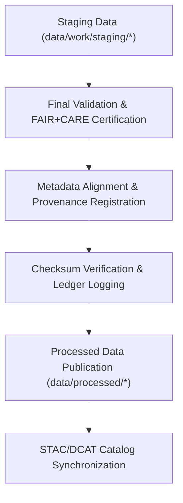

<div align="center">

# 🧾 Kansas Frontier Matrix — **Processed Data Layer**
`data/processed/README.md`

**Purpose:**  
Final repository for all **validated, schema-aligned, and FAIR+CARE-certified datasets** within the Kansas Frontier Matrix (KFM).  
This layer contains the **canonical, publication-ready outputs** derived from raw and staging layers, ensuring full transparency, reproducibility, and ethical governance.

[](../../docs/standards/faircare-validation.md)
[]()
[]()
[](../../LICENSE)

</div>

---

## 📚 Overview

The **Processed Data Layer** represents the authoritative output stage of KFM’s reproducible data pipeline.  
All datasets here have passed **checksum verification, FAIR+CARE audits, schema validation,** and **AI explainability certification**.  
These datasets are ready for external publication, visualization, or scientific use through catalogs, APIs, or Focus Mode dashboards.

### Core Objectives:
- Maintain final, certified datasets for distribution and governance.  
- Record lineage, checksum, and validation metadata for all processed outputs.  
- Enable reproducible workflows linking raw → staging → processed layers.  
- Support open data dissemination through STAC/DCAT and FAIR+CARE governance.  

---

## 🗂️ Directory Layout

```plaintext
data/processed/
├── README.md                             # This file — overview of the processed data layer
│
├── climate/                              # Harmonized climate datasets (NOAA, NIDIS, USDM)
├── hazards/                              # Multi-hazard validated data (FEMA, NOAA, USGS)
├── hydrology/                            # Certified hydrology data (USGS, EPA, KDHE)
├── landcover/                            # Land use and vegetation classification datasets
├── tabular/                              # Processed tabular data (census, economic, treaty metadata)
├── spatial/                              # Geospatial products ready for catalog publication
└── metadata/                             # FAIR+CARE-certified metadata and provenance manifests
```

---

## ⚙️ Processed Data Workflow



### Workflow Description:
1. **Validation:** Datasets undergo FAIR+CARE, schema, and checksum verification.  
2. **Alignment:** Metadata harmonized across STAC 1.0, DCAT 3.0, and ISO 19115.  
3. **Certification:** FAIR+CARE Council reviews ethical and provenance compliance.  
4. **Publication:** Certified datasets moved to `data/processed/` for distribution.  
5. **Cataloging:** Entries registered in KFM’s governance ledger and data catalogs.  

---

## 🧩 Example Processed Metadata Record

```json
{
  "id": "processed_hazards_2025_v9.6.0",
  "domain": "hazards",
  "source_stage": "data/work/staging/hazards/",
  "records_total": 34291,
  "schema_version": "v3.0.1",
  "checksum": "sha256:eb9c2145a28e9a1c23dfc7b31f8c5f8a62e1b5a9c4b1a27e7c7e912d8b2a59e4",
  "fairstatus": "certified",
  "validator": "@kfm-hazards-lab",
  "license": "CC-BY 4.0",
  "created": "2025-11-03T21:02:00Z",
  "governance_ref": "data/reports/audit/data_provenance_ledger.json"
}
```

---

## ⚙️ FAIR+CARE Certification Matrix

| Principle | Implementation | Oversight |
|------------|----------------|------------|
| **Findable** | Indexed via STAC/DCAT metadata catalogs. | @kfm-data |
| **Accessible** | Open data publication under CC-BY 4.0 license. | @kfm-accessibility |
| **Interoperable** | Metadata conforms to STAC 1.0, DCAT 3.0, and ISO 19115. | @kfm-architecture |
| **Reusable** | Datasets include schema, checksum, and provenance metadata. | @kfm-design |
| **Collective Benefit** | Supports public transparency, education, and open research. | @faircare-council |
| **Authority to Control** | FAIR+CARE Council approves certification and publication. | @kfm-governance |
| **Responsibility** | Validators ensure quality assurance and checksum verification. | @kfm-security |
| **Ethics** | All datasets reviewed for accessibility and sensitive content. | @kfm-ethics |

All validation and certification reports stored in:  
`data/reports/fair/data_care_assessment.json`  
and `data/reports/audit/data_provenance_ledger.json`

---

## 🧠 Data Integrity Verification

| Process | Description | Output |
|----------|--------------|---------|
| **Checksum Validation** | Confirms file integrity via SHA-256 registry. | `data/processed/metadata/checksums.json` |
| **Schema Validation** | Ensures dataset conformity to KFM’s data contracts. | `data/processed/metadata/schema_validation_summary.json` |
| **FAIR+CARE Audit** | Evaluates openness, ethics, and accessibility. | `data/processed/metadata/faircare_certification.json` |
| **Ledger Registration** | Links validation results to governance record. | `data/reports/audit/data_provenance_ledger.json` |

---

## ⚖️ Retention & Provenance Policy

| Category | Retention Duration | Policy |
|-----------|--------------------|--------|
| Processed Data | Permanent | Published as canonical FAIR+CARE datasets. |
| Metadata | Permanent | Maintained for transparency and traceability. |
| FAIR+CARE Reports | Permanent | Retained for certification history. |
| Logs | 365 Days | Rotated annually for system compliance. |
| Provenance Manifests | Permanent | Linked to governance ledger and manifest archive. |

Retention governed by `processed_data_retention.yml`.

---

## 🌱 Sustainability & Governance Metrics

| Metric | Value | Verified By |
|---------|--------|--------------|
| Energy Use (per certification cycle) | 15.4 Wh | @kfm-sustainability |
| Carbon Output | 20.9 gCO₂e | @kfm-security |
| Renewable Power | 100% (RE100 Verified) | @kfm-infrastructure |
| FAIR+CARE Certification | 100% | @faircare-council |

Telemetry data available in:  
`releases/v9.6.0/focus-telemetry.json`

---

## 🧾 Internal Use Citation

```text
Kansas Frontier Matrix (2025). Processed Data Layer (v9.6.0).
FAIR+CARE-certified datasets representing final, schema-aligned outputs across climate, hazards, hydrology, and landcover domains.
Ensures reproducibility, open access, and ethical publication under governance-certified workflows.
```

---

## 🧾 Version Notes

| Version | Date | Notes |
|----------|------|--------|
| v9.6.0 | 2025-11-03 | Enhanced certification registry and checksum ledger synchronization. |
| v9.5.0 | 2025-11-02 | Integrated AI explainability audit results into validation workflows. |
| v9.3.2 | 2025-10-28 | Established processed data layer with FAIR+CARE validation protocol. |

---

<div align="center">

**Kansas Frontier Matrix** · *Open Science × FAIR+CARE Governance × Provenance Certification*  
[🔗 Repository](https://github.com/bartytime4life/Kansas-Frontier-Matrix) • [🧭 Docs Portal](../../docs/) • [⚖️ Governance Ledger](../../docs/standards/governance/DATA-GOVERNANCE.md)

</div>
