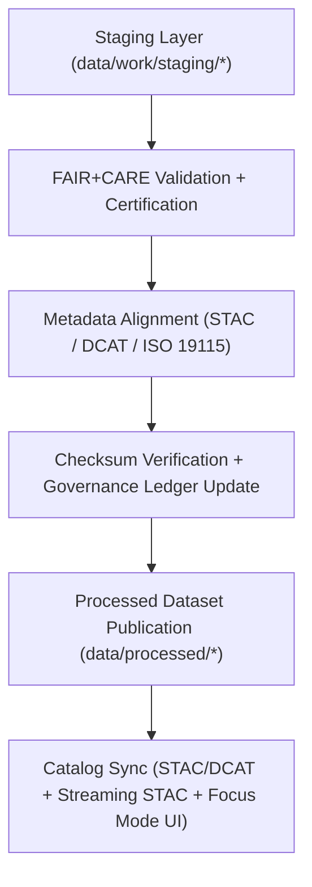

<div align="center">

# 🧾 Kansas Frontier Matrix — **Processed Data Layer**
`data/processed/README.md`

**Purpose:**  
Serve as the **canonical, publication-ready repository** for all **validated, schema-aligned, and FAIR+CARE-certified datasets** in the Kansas Frontier Matrix (KFM).  
All data in this layer are open, ethically governed, and verified for **checksum integrity**, **schema conformity**, and **FAIR+CARE compliance**.

[](../../docs/README.md)
[](../../LICENSE)
[](../../docs/standards/faircare-validation.md)
[]()
[]()

</div>

---

## 📘 Overview
The **Processed Data Layer** is the final, certified stage of KFM’s data pipeline — representing datasets that have passed through **FAIR+CARE audits**, **checksum verification**, **schema validation**, and **AI explainability certification**.  
Each dataset here is ready for **public dissemination, FAIR+CARE reporting, and Focus Mode visualization**.

### Core Objectives
- Ensure validated, reproducible datasets for publication.  
- Maintain metadata traceability and checksum linkage.  
- Provide FAIR+CARE-aligned documentation for each domain.  
- Enable open data reuse via **STAC/DCAT** catalogs (including **Streaming STAC** in v10).  

---

## 🗂️ Directory Layout
```plaintext
data/processed/
├── README.md                 # This file — processed data overview
│
├── climate/                  # Harmonized climate datasets (NOAA, Daymet, NIDIS, USDM)
├── hazards/                  # Multi-hazard validated data (FEMA, NOAA SPC/NCEI, USGS)
├── hydrology/                # Certified hydrology (USGS NWIS, EPA WQP, KDHE)
├── landcover/                # Land use & vegetation classification datasets
├── tabular/                  # Tabular (census, economics, treaty metadata)
├── spatial/                  # Geospatial layers ready for catalog publication
└── metadata/                 # FAIR+CARE-certified metadata & provenance manifests
```

---

## ⚙️ Processed Data Workflow


### Workflow Summary
1. **Validation:** Schema, FAIR+CARE, checksum, and AI ethics checks performed.  
2. **Alignment:** Metadata harmonized across **STAC 1.0**, **DCAT 3.0**, and **ISO 19115**.  
3. **Certification:** FAIR+CARE Council reviews dataset integrity and provenance.  
4. **Publication:** Certified outputs migrated to `data/processed/`.  
5. **Cataloging:** Entries registered to STAC/DCAT, **Streaming STAC**, and governance ledgers.  

---

## 🧩 Example Processed Metadata Record
```json
{
  "id": "processed_hazards_2025_v10.0.0",
  "domain": "hazards",
  "source_stage": "data/work/staging/hazards/",
  "records_total": 34987,
  "schema_version": "v3.1.0",
  "checksum": "sha256:eb9c2145a28e9a1c23dfc7b31f8c5f8a62e1b5a9c4b1a27e7c7e912d8b2a59e4",
  "fairstatus": "certified",
  "validator": "@kfm-hazards-lab",
  "license": "CC-BY 4.0",
  "created": "2025-11-09T21:02:00Z",
  "governance_ref": "data/reports/audit/data_provenance_ledger.json"
}
```

---

## 🧠 FAIR+CARE Governance Matrix
| Principle | Implementation | Oversight |
|---|---|---|
| **Findable** | Indexed through STAC/DCAT catalogs and manifests. | `@kfm-data` |
| **Accessible** | CC-BY 4.0-licensed datasets available for download. | `@kfm-accessibility` |
| **Interoperable** | Cross-compatible metadata (STAC/DCAT/ISO 19115). | `@kfm-architecture` |
| **Reusable** | Provenance, schema, and checksums ensure reproducibility. | `@kfm-design` |
| **Collective Benefit** | Public access supports education and climate resilience. | `@faircare-council` |
| **Authority to Control** | FAIR+CARE Council certifies processed datasets. | `@kfm-governance` |
| **Responsibility** | Validation logs and checksums verified per release. | `@kfm-security` |
| **Ethics** | Redacted sensitive data and transparent authorship. | `@kfm-ethics` |

Validation reports:
- `data/reports/fair/data_care_assessment.json`  
- `data/reports/audit/data_provenance_ledger.json`

---

## ⚙️ Data Integrity & Validation Processes
| Process | Description | Output |
|---|---|---|
| **Checksum Verification** | Verifies dataset integrity via SHA-256. | `metadata/checksums.json` |
| **Schema Validation** | Confirms schema compliance with Data Contract v3. | `metadata/schema_validation_summary.json` |
| **FAIR+CARE Audit** | Evaluates ethics, accessibility, and reuse. | `metadata/faircare_certification.json` |
| **Ledger Registration** | Records validation results in governance registry. | `data/reports/audit/data_provenance_ledger.json` |

---

## ⚖️ Retention & Provenance Policy
| Record Type | Retention Duration | Policy |
|---|---|---|
| Processed Data | Permanent | Canonical datasets under open license. |
| Metadata | Permanent | Maintained for transparency and lineage. |
| FAIR+CARE Reports | Permanent | Immutable certification trail. |
| Validation Logs | 365 Days | Rotated annually per compliance guidelines. |
| Provenance Manifests | Permanent | Linked to ledger and SBOM manifests. |

Retention governed by `processed_data_retention.yml`.

---

## 🌱 Sustainability & Telemetry Metrics
| Metric | Target | Verified By |
|---|---|---|
| Energy Use (per certification) | ≤ 14.0 Wh | `@kfm-sustainability` |
| Carbon Output | ≤ 18.0 gCO₂e | `@kfm-infrastructure` |
| Renewable Energy Source | 100% (RE100 Verified) | `@kfm-infrastructure` |
| FAIR+CARE Compliance | 100% Certified | `@faircare-council` |

Telemetry metrics logged in:  
`../../releases/v10.0.0/focus-telemetry.json`

---

## 🧾 Internal Use Citation
```text
Kansas Frontier Matrix (2025). Processed Data Layer (v10.0.0).
FAIR+CARE-certified final data products representing verified, schema-aligned outputs for climate, hazards, hydrology, and landcover domains.
Ensures transparency, reproducibility, and ethical data governance under ISO and MCP-DL frameworks.
```

---

## 🕰️ Version History
| Version | Date | Author | Summary |
|---|---|---|---|
| v10.0.0 | 2025-11-09 | `@kfm-data` | Upgraded to v10: Streaming STAC support, tightened sustainability targets, telemetry schema v2, governance paths updated. |
| v9.7.0 | 2025-11-06 | `@kfm-data` | ISO/STAC/DCAT metadata harmonized; telemetry and governance paths refreshed. |
| v9.6.0 | 2025-11-03 | `@kfm-data` | Enhanced checksum & certification registry with ledger sync. |
| v9.5.0 | 2025-11-02 | `@kfm-architecture` | Added AI explainability verification and FAIR+CARE telemetry workflows. |
| v9.3.2 | 2025-10-28 | `@kfm-core` | Established processed layer baseline under FAIR+CARE framework. |

---

<div align="center">

**Kansas Frontier Matrix**  
*Open Science × FAIR+CARE Governance × Provenance Certification*  
© 2025 Kansas Frontier Matrix — CC-BY 4.0 / ODC Attribution License  

[Back to Data Architecture](../README.md) · [Governance Charter](../../docs/standards/governance/DATA-GOVERNANCE.md) · [FAIR+CARE Summary](../reports/fair/faircare_summary.json)

</div>