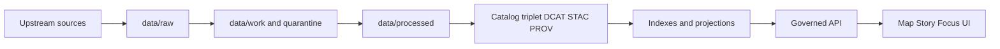

# data/processed — PROCESSED zone (publishable artifacts)

**Purpose:** Canonical, publishable dataset artifacts + digests, ready to power catalogs, indexes, and governed runtime surfaces (Map / Story / Focus).

**Status:** Draft (vNext) • **Owners:** Data Stewards (policy) + Pipeline Engineering (implementation)

**Badges:** `ZONE=PROCESSED` `CANONICAL=YES` `IMMUTABLE=BY_DIGEST` `PROMOTION=FAIL_CLOSED` `RUNTIME=GOVERNED`

- Jump to: [What belongs here](#what-belongs-here) · [Truth path context](#truth-path-context) · [Folder layout](#folder-layout) · [Artifact expectations](#artifact-expectations) · [Immutability & digests](#immutability--digests) · [Promotion contract checks](#promotion-contract-checks) · [How to add a dataset version](#how-to-add-a-new-processed-dataset-version) · [Security & sensitivity](#security--sensitivity) · [Appendix](#appendix-example-layout)

## What belongs here

`data/processed/` is the **PROCESSED** zone in the KFM truth path. It contains **publishable artifacts** (e.g., GeoParquet, PMTiles, COG, text corpora) with **checksums/digests**, plus the **derived metadata** needed by runtime builders (catalogs, indexes, tiles, query services).

These artifacts are the *inputs* to the catalog + provenance surfaces and to any rebuildable projections (PostGIS tables, search indexes, graph DBs, etc.).

> [!IMPORTANT]
> If it isn’t promotable (policy/rights/QA unclear), it does **not** belong here.
> Keep it in `data/work/` (quarantine) until gates pass.

### What is *not* allowed here

- Raw vendor/source drops (those belong in `data/raw/`)
- Intermediate scratch outputs, staging joins, notebooks (those belong in `data/work/`)
- Secrets, credentials, private keys, API tokens
- Anything that bypasses policy labeling / obligations (redaction/generalization)

[Back to top](#dataprocessed--processed-zone-publishable-artifacts)

## Truth path context



[Back to top](#dataprocessed--processed-zone-publishable-artifacts)

## Folder layout

### Naming

This directory is organized by **dataset slug** and **dataset version**.

- **`<dataset_slug>`**: stable, human-readable identifier for the dataset (do **not** change once public).
- **`<dataset_version_id>`**: immutable release identifier (often includes a date + deterministic hash suffix).

Recommended path pattern:

```
data/processed/<dataset_slug>/<dataset_version_id>/
```

Example pattern (illustrative):

```
data/processed/noaa_ncei_storm_events/2026-02.abcd1234/events.parquet
```

### Recommended contents per dataset version

A *promoted* dataset version typically includes:

- One or more **artifacts** (data + tiles + rasters + text corpora as applicable)
- A **promotion manifest** describing the release (dataset_version_id, spec_hash, artifacts + digests, policy label, approvals)
- The **catalog triplet** (DCAT / STAC / PROV) with cross-links so EvidenceRefs resolve
- **QA outputs** (validation report + digests), if applicable

Minimal recommended layout:

```
data/processed/
  <dataset_slug>/
    <dataset_version_id>/
      # Artifacts (publishable)
      <name>.parquet
      <name>.pmtiles
      <name>.tif
      <name>.jsonl

      # Promotion + provenance
      promotion.manifest.json
      run_receipt.json

      # Catalogs (triplet)
      dcat.jsonld
      stac/
        collection.json
        items/
          <item_id>.json
      prov/
        bundle.jsonld

      # QA (optional but typical)
      qa/
        validation_report.json
        validation_report.sha256
```

> [!TIP]
> The exact artifact set depends on the dataset.
> The contract is: **every artifact referenced by catalogs or the promotion manifest must exist and must have a digest**.

[Back to top](#dataprocessed--processed-zone-publishable-artifacts)

## Artifact expectations

### Common artifact formats

| Artifact | Typical use | Notes |
|---|---|---|
| GeoParquet (`.parquet`) | analytics + feature queries | include geometry + time fields |
| PMTiles (`.pmtiles`) | fast map rendering | single-file vector tiles (CDN-friendly) |
| COG (`.tif`) | rasters | tiled + overviews for range reads |
| Text corpora (`.jsonl`, `.txt`) | governed narrative / NLP | treat as policy-labeled datasets too |

> [!NOTE]
> “Approved formats” can evolve.
> Prefer formats with strong ecosystem support and stable, machine-readable metadata.

### Time-awareness

If the dataset is temporal, processed artifacts should preserve time axes needed by the UI and APIs (event time, transaction time, and valid time when applicable). Keep time fields explicit and documented.

[Back to top](#dataprocessed--processed-zone-publishable-artifacts)

## Immutability & digests

This zone is **immutable-by-digest**:

- Every file that matters must have a **SHA-256 digest** recorded in at least one contract surface:
  - promotion manifest (`artifacts[*].digest`)
  - DCAT distribution(s)
  - STAC asset(s)
  - PROV entities
- **Never mutate** an artifact in-place after promotion.
  - If content changes, emit a new `<dataset_version_id>` and write into a new directory.
  - Old versions remain addressable for reproducibility and “what changed?” diffs.

Suggested local verification:

```bash
sha256sum path/to/artifact.parquet
# compare to the digest recorded in promotion.manifest.json and catalogs
```

[Back to top](#dataprocessed--processed-zone-publishable-artifacts)

## Promotion contract checks

Anything in `data/processed/` is assumed to be **servable** (directly or indirectly) by governed runtime surfaces.
Therefore, promotion into this directory is **fail-closed**.

### Minimal fail-closed gates (checklist)

- [ ] **Identity & versioning**: deterministic `dataset_version_id` + `spec_hash`; promotion manifest exists.
- [ ] **Artifacts**: processed artifacts exist; each has a digest; paths are predictable; media types recorded.
- [ ] **Catalogs**: DCAT / STAC / PROV are schema-valid under KFM profiles.
- [ ] **Cross-links**: all links resolve; asset hrefs exist; EvidenceRefs resolve.
- [ ] **Policy**: `policy_label` assigned; obligations applied; default-deny tests pass.
- [ ] **QA**: validation report present; failing runs quarantined.
- [ ] **Audit**: run receipt emitted; audit ledger appended; approvals captured where required.

> [!WARNING]
> If any gate fails, do not “fix it live” in `data/processed/`.
> Keep the candidate release in `data/work/` (quarantine), correct the pipeline/config, and promote a new version.

[Back to top](#dataprocessed--processed-zone-publishable-artifacts)

## Determinism & reproducibility expectations

Processed outputs should be reproducible given the same inputs:

- A run should capture environment + parameters (container digest, git commit, params digest).
- `spec_hash` should be computed using canonicalized specs/configs (stable ordering, canonical JSON).
- Promotion should emit a run receipt + promotion manifest as first-class artifacts.

[Back to top](#dataprocessed--processed-zone-publishable-artifacts)

## How to add a new processed dataset version

1. **Stage in work/quarantine**
   - Acquire raw inputs into `data/raw/` (immutable).
   - Run transforms into `data/work/` until validation, licensing, and policy are resolved.

2. **Produce artifacts**
   - Generate publishable artifacts in approved formats (e.g., `.parquet`, `.pmtiles`, `.tif`).
   - Compute SHA-256 digests for each artifact.

3. **Emit provenance + catalogs**
   - Generate the run receipt (inputs + outputs + environment + validation).
   - Generate DCAT / STAC / PROV catalogs and cross-link them.

4. **Create the promotion manifest**
   - Reference every artifact + catalog by path, digest, and media type.
   - Record the policy label and any required approvals.

5. **Run gates**
   - Schema validation (DCAT/STAC/PROV profiles)
   - Link checker (assets, EvidenceRefs)
   - Policy tests (default deny, obligations)
   - QA report review

6. **Promote**
   - Move or copy the version into:
     ```
     data/processed/<dataset_slug>/<dataset_version_id>/
     ```
   - Ensure immutability-by-digest semantics are preserved in your storage backend.

[Back to top](#dataprocessed--processed-zone-publishable-artifacts)

## Security & sensitivity

- Every dataset version must carry a **policy label** and be evaluated by policy-as-code.
- If a dataset is restricted, derive **generalized/redacted** artifacts suitable for the allowed audience and promote *those* (not the sensitive originals).
- Avoid precise locations for culturally restricted sites, vulnerable infrastructure, or private individuals unless policy explicitly allows it.

[Back to top](#dataprocessed--processed-zone-publishable-artifacts)

## Appendix: example layout

<details>
<summary>Example promotion manifest skeleton (v1)</summary>

```json
{
  "kfm_promotion_manifest_version": "v1",
  "dataset_slug": "<dataset_slug>",
  "dataset_version_id": "<dataset_version_id>",
  "spec_hash": "sha256:<spec_hash>",
  "released_at": "YYYY-MM-DDTHH:MM:SSZ",
  "artifacts": [
    { "path": "events.parquet", "digest": "sha256:<...>", "media_type": "application/x-parquet" }
  ],
  "catalogs": [
    { "path": "dcat.jsonld", "digest": "sha256:<...>" },
    { "path": "stac/collection.json", "digest": "sha256:<...>" },
    { "path": "prov/bundle.jsonld", "digest": "sha256:<...>" }
  ],
  "qa": { "status": "pass", "report_digest": "sha256:<...>" },
  "policy": { "policy_label": "<public|restricted|...>", "decision_id": "kfm://policy_decision/<id>" },
  "approvals": []
}
```

</details>

<details>
<summary>Example run receipt skeleton (v1)</summary>

```json
{
  "run_id": "kfm://run/<timestamp>.<suffix>",
  "actor": { "principal": "svc:pipeline", "role": "pipeline" },
  "operation": "<ingest|transform|publish>",
  "dataset_version_id": "<dataset_version_id>",
  "inputs": [{ "uri": "data/raw/<...>", "digest": "sha256:<...>" }],
  "outputs": [{ "uri": "data/processed/<...>", "digest": "sha256:<...>" }],
  "environment": {
    "container_digest": "sha256:<...>",
    "git_commit": "<sha>",
    "params_digest": "sha256:<...>"
  },
  "validation": { "status": "pass", "report_digest": "sha256:<...>" },
  "policy": { "decision_id": "kfm://policy_decision/<id>" },
  "created_at": "YYYY-MM-DDTHH:MM:SSZ"
}
```

</details>
