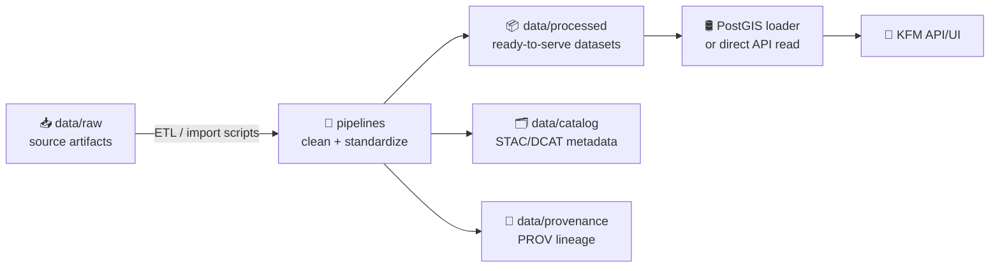

# 📦 `data/processed/` — Curated, Ready-to-Serve Datasets


> **Purpose:** This folder holds **pipeline outputs** — cleaned, standardized datasets that are **ready for the Kansas Frontier Matrix (KFM) API/UI** (or downstream loaders like PostGIS). [oai_citation:0‡Kansas Frontier Matrix (KFM) – Comprehensive Technical Blueprint.pdf](sediment://file_000000006dbc71f89a5094ce310a452d)

---

## 🔎 Quick Links

- 📥 Raw inputs: [`../raw/`](../raw/)
- 🗂️ Dataset metadata (catalog): [`../catalog/`](../catalog/)
- 🧾 Lineage & provenance logs: [`../provenance/`](../provenance/)

---

## ✅ What belongs here?

**Everything in `data/processed/` should be “ready-to-use.”** That means:

- cleaned columns / normalized units ✅
- correct spatial reference / CRS ✅
- consistent date/time formats ✅
- stable identifiers (where applicable) ✅
- stored in a format appropriate to the dataset (GeoJSON/Parquet/GeoTIFF/etc.) ✅ [oai_citation:1‡Kansas Frontier Matrix (KFM) – Comprehensive Technical Blueprint.pdf](sediment://file_000000006dbc71f89a5094ce310a452d)

Typical examples include:
- `data/processed/census/1900_population.geojson` (vector)
- `data/processed/weather/daily_rainfall.parquet` (tabular time series) [oai_citation:2‡Kansas Frontier Matrix (KFM) – Comprehensive Technical Blueprint.pdf](sediment://file_000000006dbc71f89a5094ce310a452d)

---

## 🚫 What does *not* belong here?

### ❌ Manually edited artifacts
Processed data should be **generated by scripts/pipelines**, not hand-modified.

### ❌ Source-of-truth evidence
That belongs in `data/raw/`. Raw files are treated as **preserved evidence** and generally **not edited by pipelines** (read-only in spirit). [oai_citation:3‡Kansas Frontier Matrix (KFM) – Comprehensive Technical Blueprint.pdf](sediment://file_000000006dbc71f89a5094ce310a452d)

### ❌ Mystery datasets
If we can’t explain **where it came from**, **how it was produced**, and **how it should be used**, it doesn’t ship.

---

## 🧭 Directory Structure (Recommended)

Organize by **theme** or **source family** (mirroring or complementing `data/raw/`). [oai_citation:4‡Kansas Frontier Matrix (KFM) – Comprehensive Technical Blueprint.pdf](sediment://file_000000006dbc71f89a5094ce310a452d)

Example layout:

```text
data/processed/
├─ 🧑‍🌾 census/
│  ├─ 1900_population.geojson
│  ├─ 1910_population.geojson
│  └─ schema.json
├─ 🌦️ weather/
│  ├─ daily_rainfall.parquet
│  └─ stations.geojson
├─ 🛰️ imagery/
│  ├─ landsat_2010_kansas.tif
│  └─ landsat_2010_kansas.stac-item.json
└─ 🗺️ boundaries/
   ├─ counties_1900.geojson
   └─ README.md
```

---

## 📌 “Dataset Contract” (What each dataset should ship with)

For each dataset you add here, include:

### 1) The processed artifact(s)
- `.geojson`, `.parquet`, `.csv`, `.tif` (GeoTIFF/COG), etc. [oai_citation:5‡Kansas Frontier Matrix (KFM) – Comprehensive Technical Blueprint.pdf](sediment://file_000000006dbc71f89a5094ce310a452d)

### 2) Metadata in `data/catalog/` (Required)
The pipeline must create/update a catalog record (commonly **STAC Item/Collection**, and optionally **DCAT**). [oai_citation:6‡Kansas Frontier Matrix (KFM) – Comprehensive Technical Blueprint.pdf](sediment://file_000000006dbc71f89a5094ce310a452d) [oai_citation:7‡Kansas Frontier Matrix (KFM) – Comprehensive Technical Blueprint.pdf](sediment://file_000000006dbc71f89a5094ce310a452d)

### 3) Provenance in `data/provenance/` (Required)
Include lineage such as: raw inputs used, script version/commit, run date, and outputs produced (often W3C PROV-style JSON). [oai_citation:8‡Kansas Frontier Matrix (KFM) – Comprehensive Technical Blueprint.pdf](sediment://file_000000006dbc71f89a5094ce310a452d)

> 💡 Expectation: **CI may reject contributions** if processed outputs do not have matching catalog + provenance documentation. [oai_citation:9‡Kansas Frontier Matrix (KFM) – Comprehensive Technical Blueprint.pdf](sediment://file_000000006dbc71f89a5094ce310a452d) [oai_citation:10‡Kansas Frontier Matrix (KFM) – Comprehensive Technical Blueprint.pdf](sediment://file_000000006dbc71f89a5094ce310a452d)

---

## 🔁 Data Flow (How `processed` fits into the system)



- After PR merge, processed datasets become part of KFM and are either loaded into PostGIS or read directly by the API depending on deployment configuration. [oai_citation:11‡Kansas Frontier Matrix (KFM) – Comprehensive Technical Blueprint.pdf](sediment://file_000000006dbc71f89a5094ce310a452d)

---

## 🧰 Adding or Updating a Dataset

### 🪜 Standard workflow
1. **Drop new source** into `data/raw/` (keep it intact; do not “clean” raw by hand). [oai_citation:12‡Kansas Frontier Matrix (KFM) – Comprehensive Technical Blueprint.pdf](sediment://file_000000006dbc71f89a5094ce310a452d)
2. **Run the processing pipeline**:
   - parse/normalize dates
   - convert / standardize CRS
   - normalize units
   - join/merge (if needed)
   - validate expected columns/ranges [oai_citation:13‡Kansas Frontier Matrix (KFM) – Comprehensive Technical Blueprint.pdf](sediment://file_000000006dbc71f89a5094ce310a452d) [oai_citation:14‡Kansas Frontier Matrix (KFM) – Comprehensive Technical Blueprint.pdf](sediment://file_000000006dbc71f89a5094ce310a452d)
3. **Write outputs here**: `data/processed/...` [oai_citation:15‡Kansas Frontier Matrix (KFM) – Comprehensive Technical Blueprint.pdf](sediment://file_000000006dbc71f89a5094ce310a452d)
4. **Update required documentation**:
   - `data/catalog/...` (STAC/DCAT)
   - `data/provenance/...` (PROV lineage) [oai_citation:16‡Kansas Frontier Matrix (KFM) – Comprehensive Technical Blueprint.pdf](sediment://file_000000006dbc71f89a5094ce310a452d) [oai_citation:17‡Kansas Frontier Matrix (KFM) – Comprehensive Technical Blueprint.pdf](sediment://file_000000006dbc71f89a5094ce310a452d)
5. **Commit + PR**
   - CI checks may validate artifacts + verify catalog/provenance presence. [oai_citation:18‡Kansas Frontier Matrix (KFM) – Comprehensive Technical Blueprint.pdf](sediment://file_000000006dbc71f89a5094ce310a452d)

### ♻️ Updates (new years, corrections, reprocessing)
Processed datasets are version-controlled so diffs can be reviewed; updates follow the same pipeline-and-documentation flow. [oai_citation:19‡Kansas Frontier Matrix (KFM) – Comprehensive Technical Blueprint.pdf](sediment://file_000000006dbc71f89a5094ce310a452d)

---

## 🧪 Quality & Validation Guidelines

Recommended checks (lightweight but high-value):

- ✅ Schema sanity: required fields exist, correct types
- ✅ Spatial sanity: coordinates plausible; geometry valid
- ✅ Temporal sanity: time ranges match dataset claim
- ✅ Unit sanity: documented units; normalized where possible
- ✅ Summary stats: record counts, min/max, null rate (in logs or a small report) [oai_citation:20‡Kansas Frontier Matrix (KFM) – Comprehensive Technical Blueprint.pdf](sediment://file_000000006dbc71f89a5094ce310a452d)

---

## 📝 Pipeline Documentation Expectations

Any process that transforms data should be documented clearly:

- document each pipeline stage
- list inputs/outputs per stage
- describe implementation details (scripts/configs) [oai_citation:21‡Scientific Method _ Research _ Master Coder Protocol Documentation.pdf](file-service://file-HTpax4QbDgguDwxwwyiS32)

> 🔐 Tip: Keep pipelines deterministic and rerunnable. If a dataset can’t be reproduced, it’s not “processed” — it’s a surprise.

---

## 🧷 Naming Conventions (Strongly Recommended)

| Item | Convention | Example |
|------|------------|---------|
| Folder names | `lower_snake_case/` | `census/`, `historical_maps/` |
| File names | `lower_snake_case` + meaningful suffixes | `1900_population.geojson` |
| Dates | ISO-ish when relevant | `1880-01-01`, `1900` |
| CRS | Documented in catalog metadata | `EPSG:4326` (or project standard) |

---

## ✅ “Before you PR” Checklist

- [ ] Processed artifact written to `data/processed/...` [oai_citation:22‡Kansas Frontier Matrix (KFM) – Comprehensive Technical Blueprint.pdf](sediment://file_000000006dbc71f89a5094ce310a452d)
- [ ] Matching STAC/DCAT entry added/updated in `data/catalog/...` [oai_citation:23‡Kansas Frontier Matrix (KFM) – Comprehensive Technical Blueprint.pdf](sediment://file_000000006dbc71f89a5094ce310a452d)
- [ ] Matching PROV lineage added/updated in `data/provenance/...` [oai_citation:24‡Kansas Frontier Matrix (KFM) – Comprehensive Technical Blueprint.pdf](sediment://file_000000006dbc71f89a5094ce310a452d)
- [ ] Basic validation performed (schema, geometry, ranges) [oai_citation:25‡Kansas Frontier Matrix (KFM) – Comprehensive Technical Blueprint.pdf](sediment://file_000000006dbc71f89a5094ce310a452d)
- [ ] PR explains source, method, and intended use

---

## 📚 Sources

- KFM data lifecycle + processed/raw definitions, required catalog/provenance, and CI expectations. [oai_citation:26‡Kansas Frontier Matrix (KFM) – Comprehensive Technical Blueprint.pdf](sediment://file_000000006dbc71f89a5094ce310a452d) [oai_citation:27‡Kansas Frontier Matrix (KFM) – Comprehensive Technical Blueprint.pdf](sediment://file_000000006dbc71f89a5094ce310a452d) [oai_citation:28‡Kansas Frontier Matrix (KFM) – Comprehensive Technical Blueprint.pdf](sediment://file_000000006dbc71f89a5094ce310a452d)
- Internal protocol guidance for documenting ETL/pipelines (stages, inputs/outputs, implementation notes). [oai_citation:29‡Scientific Method _ Research _ Master Coder Protocol Documentation.pdf](file-service://file-HTpax4QbDgguDwxwwyiS32)