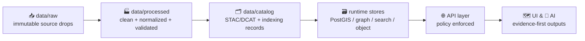

# 🧪 `data/processed/` — Processed Data Zone


Welcome to the **Processed** zone 🏭 — the “clean, standardized, validated” middle layer of the Kansas Frontier Matrix data pipeline.

**Goal:** turn messy, disparate *raw* inputs into **trusted, analysis-ready artifacts** that are:
- ✅ **reproducible** (same inputs + same pipeline = same outputs)
- ✅ **versioned** (no silent overwrites)
- ✅ **traceable** (“the map behind the map” — every output points back to sources)
- ✅ **ready for cataloging** (STAC/DCAT metadata + provenance attachments)
- ✅ **safe to serve** (after governance checks)

---

## 🧭 The Truth Path (Non‑Negotiable)

Processed data exists because we enforce a single governed path:



**No shortcuts.** Nothing jumps from `raw/` straight into databases, tiles, UI, or AI.

---

## ✅ What Belongs Here (and what doesn’t)

### ✅ Belongs in `data/processed/`
- Cleaned and standardized **tables** (typed, normalized, unit-consistent)
- Spatially validated **vector layers** (valid geometry, known CRS, stable IDs)
- Web-ready **raster assets** (COG, pyramids, tile packages) produced from raw rasters
- Derived **analysis layers** (indices, classifications, change detection outputs) with full provenance
- Companion metadata + manifests that make the dataset **auditable**

### ❌ Does *not* belong in `data/processed/`
- Ad-hoc scratch files (use `data/_tmp/` or local workspace)
- Hand-edited “final” datasets (all changes must be in pipeline code/config)
- Secrets, tokens, credentials 🔒
- Unversioned overwrites (“latest.csv”) that destroy history

---

## 📁 Recommended Folder Layout

> This layout is a **contract**: predictable structure = faster pipelines + easier governance + safer serving.

```text
data/processed/
  📦 <dataset_slug>/
    🏷️ <version>/                       # ex: v1.0.0 or 2026-02-03
      📄 README.md                      # dataset-specific notes (optional but recommended)
      📄 manifest.json                  # required: what files are here + counts + hashes
      📄 provenance.jsonld              # required: W3C PROV-ish lineage + source pointers
      📄 checksums.txt                  # required: sha256 for key artifacts
      📄 schema.json                    # required for tabular data; recommended for geo too
      📄 qa_report.json                 # required: validation summary + stats
      📁 data/
        🧾 table.parquet
        🗺️ layer.geoparquet
        🗺️ layer.gpkg
        🖼️ raster.cog.tif
        🧱 tiles.pmtiles
      📁 logs/
        🧰 pipeline_run.log             # optional: keep if useful for auditing
      📁 meta/
        🧾 fields.md                    # optional: human-friendly field dictionary
        🗓️ temporal.md                  # optional: time semantics + caveats
```

---

## 🧱 Dataset Contract (Required Files)

Every processed dataset version **must** include:

| File | Required | Purpose |
|---|---:|---|
| `manifest.json` | ✅ | The authoritative “inventory” of artifacts (names, sizes, hashes, row counts, bbox, time range). |
| `provenance.jsonld` | ✅ | Lineage: raw inputs, pipeline name/version, parameters, processing steps, citations. |
| `checksums.txt` | ✅ | Quick integrity verification (sha256). |
| `qa_report.json` | ✅ | Proof it’s valid: schema checks, geometry checks, null rates, duplicates, CRS, etc. |
| `schema.json` | ✅ (tabular) | A machine-readable contract for downstream loading (DB/tiles/index). |

> Tip 💡: include a dataset-specific `README.md` when there are non-obvious joins, caveats, or domain rules.

---

## 🧾 Formats We Prefer (Interoperable + Web-Friendly)

### Tabular 📊
- ✅ **Parquet** (preferred), optionally partitioned  
- ✅ **CSV** only for *small/simple* exports (avoid for large or typed datasets)
- ✅ **GeoParquet** for large spatial tables (preferred when available)

### Vector 🗺️
- ✅ **GeoPackage (`.gpkg`)** for portable GIS interchange  
- ✅ **GeoParquet** for analytics and fast IO  
- ⚠️ **GeoJSON** only for small layers (large GeoJSON is slow + huge)

### Raster 🛰️
- ✅ **Cloud-Optimized GeoTIFF (COG)** for serving + partial reads  
- ✅ **PMTiles / XYZ tile packages** when pre-tiling is required

---

## 🏷️ Naming & Versioning Rules

### Dataset slugs
Keep dataset slugs:
- lowercase
- hyphenated
- stable over time  
Example: `ks-counties`, `landsat-ndvi`, `historic-newspapers-index`

### Versions
Pick **one** versioning strategy per dataset:
- `vMAJOR.MINOR.PATCH` (semantic versioning) for curated datasets  
- `YYYY-MM-DD` for daily/periodic refreshes  
- `run_<timestamp>_<shortgitsha>` for experimental outputs (avoid publishing)

🚫 Never overwrite an existing version folder.

---

## 🔎 Provenance Rules (“Map Behind the Map”)

Processed outputs must be traceable to:
1) **Source** (where the raw data came from)  
2) **Method** (what pipeline transformed it)  
3) **Parameters** (what configuration produced this output)  
4) **Identity** (who/what ran it + when)  
5) **Integrity** (hashes + row counts + bounding boxes)

### Minimum provenance fields (recommended)
- `dataset_slug`, `version`
- `created_at`, `pipeline_name`, `pipeline_version` (git SHA ok)
- `inputs[]`: path(s) in `data/raw/...` + hashes
- `steps[]`: normalized step list (clean → transform → validate → export)
- `outputs[]`: generated files + hashes
- `citations[]`: URLs/DOIs/agency references (and access date)
- `license`: inherited or derived, with proof

---

## ✅ QA / Validation Expectations

At minimum, **every processed dataset** should pass:

### General
- ✅ schema validation (types, required fields)
- ✅ null-rate report per field
- ✅ duplicate key checks (if an ID exists)
- ✅ range checks for known numeric fields (e.g., lat/long bounds)

### Spatial (if geometry exists)
- ✅ geometry validity (no self-intersections unless allowed)
- ✅ CRS is declared and consistent
- ✅ bounding box is computed + stored
- ✅ topology rules (when relevant) documented or enforced

### Raster
- ✅ CRS, nodata, pixel size documented
- ✅ COG validity checks (internal tiling + overviews)
- ✅ stats/percentiles computed (optional but useful)

---

## 🔁 How to Add or Refresh a Dataset

1. **Ingest raw** into `data/raw/<source>/<date>/...` 📥  
2. **Run pipeline** to generate processed outputs 🏭  
3. **Write manifests + provenance** (auto-generated preferred) 🧾  
4. **Run QA** and store `qa_report.json` ✅  
5. **Promote to catalog** by adding/updating the STAC/DCAT record 🗂️  
6. **Load to runtime** stores via governed loaders 🗃️  
7. **Serve via API** (never direct DB access from UI) 🌐

> If you can’t re-run it, it’s not processed — it’s a one-off.

---

## 🧯 Common Mistakes (Avoid These)

- ❌ Editing a processed file manually “just to fix one value”
- ❌ Storing outputs without hashes
- ❌ Missing CRS / unclear units
- ❌ Publishing “latest” without pinning a version
- ❌ Writing outputs that cannot be linked to raw inputs

---

## ❓FAQ

### “Can I store intermediate pipeline outputs here?”
Prefer **no**. If it’s not intended to be cataloged and validated, use a temp area (`data/_tmp/`) or pipeline workspace.

### “Do we keep *all* processed versions forever?”
Default is **yes** (append-only history). If storage becomes an issue, define a retention policy per dataset *explicitly*.

### “How does this relate to AI answers?”
AI outputs must cite **cataloged/served** artifacts. Processed is upstream of that trust boundary, ensuring everything has lineage before it becomes “answerable.”

---

## 🧠 Design Philosophy

Processed data is where Kansas Frontier Matrix becomes *trustworthy*:
- evidence-first ✅  
- provenance-by-default ✅  
- governed promotion ✅  
- reproducible pipelines ✅

If you’re unsure where something goes, follow the Truth Path diagram above. 🧭