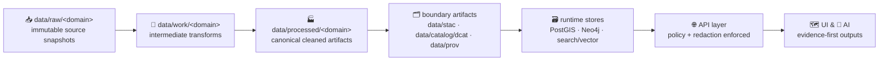

# 🧪 `data/processed/` — Processed Data Zone


Welcome to the **Processed** zone 🏭 — the **canonical cleaned data layer** of the Kansas Frontier Matrix truth path.

Processed exists so the system can rely on **trusted, standardized, reproducible artifacts** instead of one-off “fixed” files.

**Goal:** turn disparate *raw* inputs into **analysis-ready, auditable, governable** artifacts that are:

- ✅ **reproducible** (same inputs + same pipeline + same config → same outputs)
- ✅ **deterministic** (pipelines are non-interactive; no manual steps; stable outputs)
- ✅ **append-only** (no silent overwrites; versioned dataset bundles)
- ✅ **traceable** (“map behind the map” — everything points back to sources)
- ✅ **ready to publish** (via required boundary artifacts: STAC/DCAT/PROV)
- ✅ **safe to serve** (only after governance gates; via the API layer)

---

## 🧭 The Truth Path (Non‑Negotiable)

Processed is **not** the first step and not the last. KFM enforces staged outputs:

- **Raw**: immutable snapshots
- **Work**: intermediate transformations (regenerable)
- **Processed**: canonical outputs (authoritative for internal use)
- **Catalog + Lineage**: boundary artifacts required for publication (STAC/DCAT/PROV)
- **Runtime stores**: accelerators (regenerable from processed + metadata)
- **API**: the only access boundary (policy enforced)
- **UI/AI**: consumes only via API (evidence-first)



**No shortcuts.** Nothing jumps from raw/work/processed straight into databases, tiles, UI, or AI.

---

## ✅ What Belongs Here (and what doesn’t)

### ✅ Belongs in `data/processed/`
Processed is for **canonical, standardized, validated outputs** that downstream systems can rely on:

- Cleaned + standardized **tables** (typed, normalized, unit-consistent)
- Spatially validated **vector layers** (valid geometry, declared CRS, stable IDs)
- Web-ready **raster assets** (e.g., COGs) produced from raw rasters
- Derived **analysis layers** (indices, classifications, change detection) with full lineage
- Companion **bundle artifacts** that make the dataset auditable (manifest/checksums/schema/QA)

### ❌ Does *not* belong in `data/processed/`
- Ad-hoc scratch files (use `data/work/…` or `data/_tmp/…`)
- Hand-edited “final” datasets (**all changes must be in pipeline code/config**)
- Secrets, tokens, credentials 🔒
- Unversioned overwrites (e.g., `latest.csv`) that destroy history

---

## 📁 Canonical Folder Layout (Dataset Bundles)

KFM’s staging convention is domain-scoped under the stage directory:

- `data/raw/<domain>/…`
- `data/work/<domain>/…`
- `data/processed/<domain>/…`

Within `data/processed/<domain>/`, treat each dataset as a **versioned bundle**:

```text
data/processed/
  📦 <domain>/
    📦 <dataset_slug>/
      🏷️ <version>/                       # e.g., v1.0.0 or 2026-02-03
        📄 README.md                      # optional: dataset notes + caveats
        📄 manifest.json                  # required: authoritative inventory
        📄 checksums.txt                  # required: sha256 for key artifacts
        📄 schema.json                    # required for tabular; recommended for geo
        📄 qa_report.json                 # required: validation summary + stats
        📁 data/
          🧾 table.parquet
          🗺️ layer.geoparquet
          🗺️ layer.gpkg
          🛰️ raster.cog.tif
          🧱 tiles.pmtiles
        📁 meta/
          🧾 fields.md                    # optional: human-friendly dictionary
          🗓️ temporal.md                  # optional: time semantics + caveats
        📁 logs/
          🧰 pipeline_run.log             # optional: keep when audit-useful
```

> **Important:** PROV/STAC/DCAT records are **not stored inside this bundle by default**.  
> They are **boundary artifacts** written to canonical locations (see below).

---

## 🧱 Bundle Contract (What a “Processed Dataset Version” Must Contain)

### Required inside the processed bundle
| File | Required | Purpose |
|---|---:|---|
| `manifest.json` | ✅ | Authoritative inventory of artifacts + key stats (counts, hashes, bbox/time if applicable). |
| `checksums.txt` | ✅ | Quick integrity verification (sha256). |
| `qa_report.json` | ✅ | Proof it’s valid: schema checks, null rates, duplicates, geometry/CRS checks, etc. |
| `schema.json` | ✅ (tabular) | Machine-readable contract for downstream loaders (DB/index/tiles). |

### Required boundary artifacts (outside `data/processed/`)
A dataset is **not publishable** until these exist:

| Artifact | Canonical location | Purpose |
|---|---|---|
| STAC Collection/Item(s) | `data/stac/collections/` + `data/stac/items/` | Spatial/temporal cataloging of assets (bbox/time/links/license/provider). |
| DCAT dataset entry | `data/catalog/dcat/` | Discovery + dataset-level metadata (title/description/license/distributions). |
| PROV lineage bundle | `data/prov/` | End-to-end lineage: raw → work → processed; activities; agents; timestamps; parameters. |

> These are the **publication boundary artifacts** and the interface to downstream stages (graph, API, UI).

---

## 🧾 Formats We Prefer (Interoperable + Web-Friendly)

### Tabular 📊
- ✅ **Parquet** (preferred), optionally partitioned
- ✅ **CSV** only for *small/simple* exports (avoid for large/typed datasets)

### Vector 🗺️
- ✅ **GeoPackage (`.gpkg`)** for portable GIS interchange
- ✅ **GeoParquet** for analytics + fast IO
- ⚠️ **GeoJSON** only for small layers

### Raster 🛰️
- ✅ **Cloud-Optimized GeoTIFF (COG)** for serving + partial reads
- ✅ **PMTiles / XYZ tile packages** when pre-tiling is required

---

## 🏷️ Naming & Versioning Rules

### Dataset slugs
Keep dataset slugs:
- lowercase
- hyphenated
- stable over time

Example: `ks-counties`, `landsat-ndvi`, `historic-newspapers-index`

### Versions
Pick **one** strategy per dataset:
- `vMAJOR.MINOR.PATCH` for curated datasets
- `YYYY-MM-DD` for periodic refreshes
- `run_<timestamp>_<shortgitsha>` for experiments (avoid publishing)

🚫 Never overwrite an existing version folder.

---

## 🔎 Determinism + “No Manual Edits” (Hard Rule)

Processed data is only trustworthy if it’s re-creatable.

**Rules**
- No manual steps or interactive prompts in official pipelines.
- Pipelines must be idempotent where feasible (re-running shouldn’t create duplicates if nothing changed).
- If outputs differ, they must be promoted as a **new version** with updated lineage.

> If you can’t re-run it, it’s not processed — it’s a one-off.

---

## 🧬 Provenance & Publication Linkage

Processed bundles must be traceable to:
1) **Source** (raw snapshots and where they came from)
2) **Method** (pipeline name + version/commit)
3) **Parameters** (config used)
4) **Identity** (who/what ran it + when)
5) **Integrity** (hashes + counts + extents)

**Where provenance lives**
- Canonical lineage is recorded in **PROV** bundles under `data/prov/`.
- STAC/DCAT records must link to the processed artifacts and reference license/provider/source info.
- PROV must link raw → work → processed and identify the run/config/commit.

**Recommended: cross-link from the processed bundle**
In `manifest.json` (or a small `links.json`), include:
- `stac_items`: list of STAC item IDs/paths
- `stac_collection`: collection ID/path
- `dcat_entry`: DCAT JSON-LD path
- `prov_bundle`: PROV bundle path
This makes the processed bundle auditable *without* duplicating catalogs.

---

## ✅ QA / Validation Expectations

At minimum, every processed dataset version should have validation evidence in `qa_report.json`.

### General (all)
- ✅ schema validation (types, required fields)
- ✅ null-rate report per field
- ✅ duplicate key checks (if IDs exist)
- ✅ range checks for known numeric fields

### Spatial (if geometry exists)
- ✅ geometry validity
- ✅ CRS declared + consistent
- ✅ bounding box computed + stored
- ✅ topology rules documented or enforced (when relevant)

### Raster
- ✅ CRS/nodata/pixel size documented
- ✅ COG validity checks (tiling + overviews)
- ✅ stats/percentiles computed (optional but useful)

---

## 🔁 How to Add or Refresh a Dataset (Governed Path)

1. **Ingest raw** into `data/raw/<domain>/...` 📥  
2. **Transform in work** into `data/work/<domain>/...` 🧪  
3. **Write processed bundle** into `data/processed/<domain>/<dataset_slug>/<version>/...` 🏭  
4. **Generate bundle artifacts** (`manifest.json`, `schema.json`, `qa_report.json`, `checksums.txt`) 🧾  
5. **Generate boundary artifacts**:
   - STAC → `data/stac/...`
   - DCAT → `data/catalog/dcat/...`
   - PROV → `data/prov/...`
6. **Pass policy + CI gates** (license + sensitivity + schema + provenance completeness) ✅  
7. **Load runtime stores** via governed loaders 🗃️  
8. **Serve only via API** (never direct DB access from UI/AI) 🌐  

---

## 🧯 Common Mistakes (Avoid These)

- ❌ Editing a processed file manually “just to fix one value”
- ❌ Promoting outputs without STAC/DCAT/PROV boundary artifacts
- ❌ Missing license/sensitivity classification (policy will block publication)
- ❌ Missing schemas/QA evidence
- ❌ Publishing “latest” without pinning a version

---

## ❓ FAQ

### “Can I store intermediate pipeline outputs here?”
Prefer **no**. If it’s intermediate or exploratory, it belongs in `data/work/…` (or `data/_tmp/…`).

### “Do we keep *all* processed versions forever?”
Default is **yes** (append-only history). If storage becomes an issue, define an explicit retention policy per dataset.

### “Are runtime databases the source of truth?”
No. Runtime stores are accelerators/caches built from processed + metadata. If needed, they can be regenerated from the truth path.

### “What about AI-generated artifacts?”
Treat them as first-class datasets: store in processed, catalog in STAC/DCAT, and trace in PROV. They must still go through governed APIs.

---

## 🧠 Design Philosophy

Processed is where KFM becomes trustworthy:

- evidence-first ✅  
- provenance-by-default ✅  
- governed promotion ✅  
- deterministic pipelines ✅  
- fail-closed policy gates ✅  

If you’re unsure where something goes, follow the Truth Path diagram. 🧭
