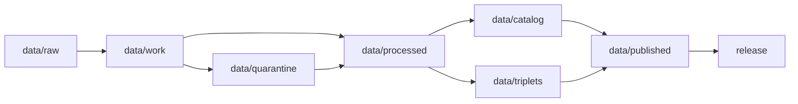

<!-- [KFM_META_BLOCK_V2]
doc_id: kfm://doc/data-processed-readme
title: data/processed/README.md — Processed Data Lifecycle README
version: v0.1
type: readme; data-lifecycle-root; processed-stage-guide
status: draft; PROPOSED; data-root; processed-stage; release-gated; evidence-required
owners: OWNER_TBD — Data steward · Pipeline steward · Source steward · Evidence steward · Catalog steward · Policy steward · Release steward · Docs steward
created: NEEDS VERIFICATION — greenfield stub existed before v0.1 expansion
updated: 2026-06-25
policy_label: public-doc; data; processed; lifecycle; governed; release-gated
tags: [kfm, data, processed, lifecycle, RAW, WORK, QUARANTINE, CATALOG, TRIPLET, PUBLISHED, EvidenceBundle, SourceDescriptor, RunReceipt, ReleaseManifest]
related:
  - ../README.md
  - ../../README.md
  - ../../docs/doctrine/directory-rules.md
  - ../../docs/doctrine/lifecycle-law.md
  - ../../docs/doctrine/trust-membrane.md
  - ../raw/
  - ../work/
  - ../quarantine/
  - ../catalog/
  - ../triplets/
  - ../published/
  - ../proofs/
  - ../receipts/
  - ../registry/
  - ../../release/
  - ../../schemas/
  - ../../policy/
  - ../../pipelines/
  - ../../tools/validators/
notes:
  - "This file replaces a greenfield stub at `data/processed/README.md`."
  - "`data/processed/` is the lifecycle stage for normalized outputs that have moved past RAW/WORK/QUARANTINE but are not yet cataloged, triplet-projected, or published."
  - "Processed data is not public, not authoritative truth, not proof, not release, and not a policy decision by itself."
  - "Promotion from PROCESSED to CATALOG/TRIPLET/PUBLISHED requires validation, provenance, receipts, policy posture, catalog linkage, release state, correction path, and rollback target."
  - "Rollback target for this expansion is previous stub blob SHA `8cc389e21fff1ff7dca545945083efe47e0c4999`."
[/KFM_META_BLOCK_V2] -->

<a id="top"></a>

# data/processed

> Governed lifecycle lane for normalized, validated-enough processed data that is no longer RAW or WORK, but is not yet cataloged, triplet-projected, or published.

<p>
  
  
  
  
  
</p>

**Status:** draft / PROPOSED  
**Path:** `data/processed/README.md`  
**Owning root:** `data/`  
**Lifecycle stage:** `PROCESSED`  
**Exposure posture:** not public by default; public exposure requires governed catalog, release, and published-output linkage  
**Truth posture:** CONFIRMED target was a greenfield stub · CONFIRMED `data/` is the lifecycle data root · CONFIRMED Directory Rules say root folders encode responsibility and lifecycle · NEEDS VERIFICATION for actual child inventory, schemas, validators, receipts, release linkage, and CI enforcement.

**Quick jumps:** [Purpose](#purpose) · [Lifecycle boundary](#lifecycle-boundary) · [Repo fit](#repo-fit) · [Accepted contents](#accepted-contents) · [Exclusions](#exclusions) · [Processed-data requirements](#processed-data-requirements) · [Guardrails](#guardrails) · [Evidence ledger](#evidence-ledger) · [Validation checklist](#validation-checklist) · [Rollback](#rollback)

---

## Purpose

`data/processed/` holds normalized data products generated from admitted sources and intermediate work after extraction, transformation, cleanup, alignment, enrichment, redaction/generalization, or validation steps.

Processed data is a staging outcome, not a publication decision. It may support downstream catalog records, triplet/graph projections, proof bundles, reports, tiles, APIs, or published artifacts, but it does not replace any of those governed outputs.

## Lifecycle boundary

```text
RAW -> WORK / QUARANTINE -> PROCESSED -> CATALOG / TRIPLET -> PUBLISHED
```


```mermaid
flowchart LR
  RAW[data/raw] --> WORK[data/work]
  WORK --> QUAR[data/quarantine]
  WORK --> PROC[data/processed]
  QUAR --> PROC
  PROC --> CAT[data/catalog]
  PROC --> TRIP[data/triplets]
  CAT --> PUB[data/published]
  TRIP --> PUB
  PUB --> REL[release]
```

`data/processed/` is upstream of catalog, triplet, and publication. It must not be used as the normal public surface.

## Repo fit

| Responsibility | Correct home | Rule |
|---|---|---|
| Source-native captured data | `data/raw/` | Not this lane. |
| Scratch/intermediate transforms | `data/work/` | Not this lane. |
| Unsafe, unresolved, rights-unclear, or sensitive holds | `data/quarantine/` | Not this lane. |
| Normalized processed outputs | `data/processed/` | This lane. |
| Catalog records | `data/catalog/` | Downstream discovery/interchange. |
| Triplet/graph projections | `data/triplets/` | Downstream graph projection. |
| Published public-safe outputs | `data/published/` | Downstream after release. |
| Evidence/proof records | `data/proofs/` | EvidenceBundle and proof support. |
| Receipts | `data/receipts/` | RunReceipt, validation, policy, transform, correction, and release receipts. |
| Source registry records | `data/registry/` | SourceDescriptor/source-admission records. |
| Release decisions | `release/` | Publication authority. |
| Schemas and policy | `schemas/`, `policy/` | Separate roots. |
| Pipelines and validators | `pipelines/`, `tools/validators/`, `tests/` | Not this lane. |

## Accepted contents

Processed data may include:

- Normalized tabular, spatial, temporal, textual, raster, vector, or graph-ready data artifacts.
- Derived artifacts generated from governed pipelines after RAW/WORK/QUARANTINE handling.
- Redacted or generalized derivatives that still require catalog/release review before public use.
- Sidecar metadata needed to interpret processed artifacts when it is not a release manifest, proof bundle, policy decision, or catalog record.
- Domain-scoped processed outputs, organized by accepted path convention.
- README files explaining local processed-data boundaries.

## Exclusions

Do not store these under `data/processed/`:

- RAW source files.
- Scratch work files that have not passed minimal processing gates.
- Quarantined or unresolved sensitive/rights material.
- Catalog records such as STAC, DCAT, PROV, or domain catalog records.
- Triplet/graph publication records.
- EvidenceBundle or proof records.
- Receipts.
- SourceDescriptor/source registry records.
- Release decisions, ReleaseManifest records, rollback cards, withdrawal notices, correction notices, signatures, or release changelogs.
- Published public products.
- Schemas, policy rules, validators, tests, packages, pipelines, app/UI/API code.

## Processed-data requirements

PROPOSED until concrete schemas and validators are verified:

| Requirement | Meaning |
|---|---|
| Source trace | Processed output should trace back to SourceDescriptor or source registry context when source authority matters. |
| Run trace | Processing run, transform, validation, and tool/version context should have receipt linkage. |
| Deterministic identity | Processed artifacts should have stable IDs or content digests where practical. |
| Evidence linkage | Claims derived from processed outputs should be backed by EvidenceBundle/proof context downstream. |
| Policy posture | Sensitive, restricted, rights-unclear, or public-risk material must not bypass policy review. |
| Catalog readiness | Processed outputs intended for discovery should promote through `data/catalog/` and `data/triplets/`, not directly to public use. |
| Release readiness | Public use requires release state, published output path, correction path, and rollback target. |

## Guardrails

- Do not expose `data/processed/` directly as a public map, API, UI, download, or model-answer source.
- Do not treat processed data as proof or truth by itself.
- Do not move quarantined material into processed without review and receipt trail.
- Do not publish by copying from processed to public surfaces; promotion is governed state transition.
- Do not mix catalog records, proofs, receipts, release decisions, schemas, policies, or code into this lane.
- Keep domain-specific processed structures responsibility-rooted and reversible.

## Evidence ledger

| Source | Status | Supports | Limits |
|---|---|---|---|
| Previous file | CONFIRMED | Target existed as a greenfield stub. | Did not define PROCESSED-stage boundaries. |
| `data/README.md` | CONFIRMED | `data/` is the lifecycle data root and excludes code, schemas, policy rules, and release decisions. | Does not prove child inventory under `data/processed/`. |
| `docs/doctrine/directory-rules.md` | CONFIRMED doctrine / PROPOSED path specifics | Root folders encode responsibility and data uses lifecycle phases. | Does not prove runtime enforcement. |

## Validation checklist

- [ ] Confirm actual child directories under `data/processed/`.
- [ ] Confirm accepted domain/source path convention.
- [ ] Confirm processed artifact schemas or contracts.
- [ ] Confirm validators and CI checks.
- [ ] Confirm source, run, transform, policy, validation, and correction receipts.
- [ ] Confirm no RAW, WORK, QUARANTINE, CATALOG, TRIPLET, PUBLISHED, proof, receipt, release, schema, policy, or code artifacts are misplaced here.
- [ ] Confirm promotion flow from processed to catalog/triplet/published is governed and reversible.

## Rollback

Rollback is required if this lane becomes a public output root, source-data root, quarantine bypass, proof store, receipt store, catalog root, triplet root, source-registry root, release-decision root, schema root, policy root, validator root, implementation root, public API shortcut, or public exposure shortcut.

Rollback target for this expansion: previous stub blob SHA `8cc389e21fff1ff7dca545945083efe47e0c4999`.

<p align="right"><a href="#top">Back to top</a></p>
