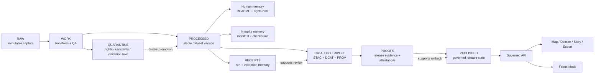

<!-- [KFM_META_BLOCK_V2]
doc_id: kfm://doc/NEEDS-VERIFICATION
title: data/processed/
type: standard
version: v1
status: draft
owners: @bartytime4life
created: NEEDS-VERIFICATION
updated: 2026-04-22
policy_label: NEEDS-VERIFICATION
related: [../README.md, ../raw/README.md, ../work/README.md, ../quarantine/, ../catalog/, ../receipts/, ../proofs/, ../published/README.md, ../../contracts/README.md, ../../schemas/README.md, ../../policy/README.md, ../../tests/README.md, ../../tools/, ../../.github/workflows/README.md]
tags: [kfm, data, processed, lifecycle, dataset-version, readme]
notes: [Owner is carried forward from surfaced KFM repo-facing documentation and should be rechecked against CODEOWNERS before merge. doc_id, created date, policy_label, current branch inventory, workflow enforcement, and emitted artifact depth remain NEEDS VERIFICATION. This README governs the processed zone; it does not make data/processed a public edge.]
[/KFM_META_BLOCK_V2] -->

<a id="top"></a>

# `data/processed/`

Governed processed-zone guide for stable dataset versions, manifests, checksums, and release-adjacent evidence in KFM.

> **Status:** experimental  
> **Doc state:** draft  
> **Owners:** `@bartytime4life` — **NEEDS VERIFICATION** against active `CODEOWNERS` before merge  
> **Path:** `data/processed/README.md`  
> **Repo fit:** [`../README.md`](../README.md) → `data/processed/` → [`../catalog/`](../catalog/) · [`../receipts/`](../receipts/) · [`../proofs/`](../proofs/) · [`../published/README.md`](../published/README.md)  
>
> [](#top)
> [](#top)
> [](#top)
> [](#scope)
> [](#diagram)
> [](#reference-tables)
> [](#review-gates)
> [](#directory-tree)  
>
> **Quick jump:** [Scope](#scope) · [Repo fit](#repo-fit) · [Accepted inputs](#accepted-inputs) · [Exclusions](#exclusions) · [Directory tree](#directory-tree) · [Quickstart](#quickstart) · [Usage](#usage) · [Diagram](#diagram) · [Reference tables](#reference-tables) · [Review gates](#review-gates) · [FAQ](#faq) · [Appendix](#appendix)

> [!IMPORTANT]
> `data/processed/` is **not** the public edge.
>
> In KFM, this zone is where transformed outputs become stable, inspectable **dataset-version candidates**. Public and role-limited surfaces should still consume release-backed scope through governed APIs, catalog closure, policy checks, proof objects, and EvidenceBundle resolution.

> [!NOTE]
> This README keeps four layers separate:
>
> | Layer | Status | Reading rule |
> | --- | --- | --- |
> | KFM lifecycle doctrine | **CONFIRMED** | `RAW → WORK / QUARANTINE → PROCESSED → CATALOG / TRIPLET → PUBLISHED` is the governing flow. |
> | Target path | **CONFIRMED by request** | This file is intended for `data/processed/README.md`. |
> | Current branch inventory | **NEEDS VERIFICATION** | Re-run the inventory commands below in the real checkout before claiming exact children or automation. |
> | Version-pack shape | **PROPOSED** | Use `<theme>/<dataset>/<version>/` unless the active repo proves a stronger convention. |

---

## Scope

`data/processed/` is the processed stage of the KFM data lifecycle.

It exists for stable transformed outputs that are ready to be treated as **dataset versions**, not as scratch outputs and not as public truth by file presence alone. A processed artifact should be reproducible enough to audit, linkable enough to catalog, and bounded enough to review for policy, rights, sensitivity, provenance, and release readiness.

### What this README is for

Use this file to answer:

- What makes an artifact “processed” rather than “work,” “quarantined,” or “published”?
- What minimum files should travel with a stable dataset version?
- How should per-version READMEs relate to manifests, checksums, receipts, proofs, and catalog objects?
- Which sibling surfaces should be linked before promotion or outward release?
- What must stay out of `data/processed/` even when it is convenient to put it here?

### What this README is not for

This file is not a source-specific ingest runbook, schema registry, policy bundle, public API contract, tile-serving contract, or release authorization record.

[Back to top](#top)

---

## Repo fit

`data/processed/` sits at the seam where governed transforms become stable versioned artifacts that can support catalog closure, review, proof attachment, and later promotion.

### Path and adjacency

| Relation | Surface | Status | Why it matters |
| --- | --- | --- | --- |
| Parent | [`../README.md`](../README.md) | **NEEDS VERIFICATION** | Parent lifecycle law for the broader `data/` surface. |
| Upstream | [`../raw/README.md`](../raw/README.md) | **NEEDS VERIFICATION** | Immutable source captures stay there, not here. |
| Upstream | [`../work/README.md`](../work/README.md) | **NEEDS VERIFICATION** | In-progress transforms, repairs, joins, and QA stay there until stable. |
| Upstream hold | [`../quarantine/`](../quarantine/) | **NEEDS VERIFICATION** | Rights-unclear, sensitivity-blocked, invalid, or low-confidence material should fail closed there. |
| Lateral | [`../receipts/`](../receipts/) | **NEEDS VERIFICATION** | Run receipts and validation memory should remain resolvable from processed versions. |
| Lateral | [`../proofs/`](../proofs/) | **NEEDS VERIFICATION** | Release-significant proof, integrity, attestation, and correction evidence should stay discoverable. |
| Downstream | [`../catalog/`](../catalog/) | **NEEDS VERIFICATION** | `STAC + DCAT + PROV` closure should resolve back to the processed version. |
| Downstream | [`../published/README.md`](../published/README.md) | **NEEDS VERIFICATION** | Publication is a governed state transition, not a synonym for “processed.” |
| Shared contract surface | [`../../contracts/README.md`](../../contracts/README.md) | **NEEDS VERIFICATION** | Shared contract authority should not be redefined locally here. |
| Shared schema surface | [`../../schemas/README.md`](../../schemas/README.md) | **NEEDS VERIFICATION** | Schema-home authority should stay explicit rather than fork into zone-local copies. |
| Shared policy surface | [`../../policy/README.md`](../../policy/README.md) | **NEEDS VERIFICATION** | Deny-by-default and release-scope decisions belong in policy, not in README prose. |
| Verification | [`../../tests/README.md`](../../tests/README.md) | **NEEDS VERIFICATION** | Fixture, validation, regression, and runtime-proof checks should exercise this zone. |
| Tooling | [`../../tools/`](../../tools/) | **NEEDS VERIFICATION** | Validators, lints, and packaging helpers may target this zone without redefining it. |
| Governed consumers | [`../../apps/`](../../apps/) | **NEEDS VERIFICATION** | UI and public-safe surfaces should consume governed outputs, not raw storage assumptions. |
| CI / delivery | [`../../.github/workflows/README.md`](../../.github/workflows/README.md) | **NEEDS VERIFICATION** | Workflow docs may describe checks, but active YAML enforcement must be verified in checkout. |

### Repo-fit summary

| Question | Answer |
| --- | --- |
| What belongs here? | Stable processed artifacts, immutable version folders, manifests, checksums, per-version READMEs, rights notes, and resolvable links into catalog / receipt / proof surfaces. |
| What does **not** belong here? | Raw captures, unstable transforms, quarantined material, shared schemas, executable policies, secrets, detached proof packs, or direct-public serving assumptions. |
| What is the downstream contract? | A processed version should be understandable, verifiable, and linkable into `STAC + DCAT + PROV`, receipts, proofs, and release evidence. |
| What still needs verification? | Current branch inventory, exact owner routing, workflow enforcement, canonical schema home, and emitted artifact conventions. |

[Back to top](#top)

---

## Accepted inputs

These artifacts may belong in or immediately beside a processed version pack.

| Accepted input | Why it belongs here | Typical shape |
| --- | --- | --- |
| Immutable processed data artifacts | This zone exists to hold stable transformed outputs. | GeoParquet, Parquet, GeoJSON, GeoTIFF / COG, CSV, vector packages, raster products, or other release-safe processed formats. |
| Dataset version folders | Versioning keeps processed outputs inspectable and correction-safe. | `data/processed/<theme>/<dataset>/<version>/` |
| `manifest.json` | Machine-readable inventory of the version pack. | One manifest per version folder. |
| `SHA256SUMS.txt` | Integrity anchor for version contents. | One checksum file per version folder. |
| `README.md` | Human-readable method, caveat, CRS, rights, and citation memory. | One README per version folder. |
| `LICENSE.txt` or rights note | Keeps release-facing rights context close to the version pack. | SPDX-compatible notice where possible; otherwise explicit rights note. |
| Final QA summaries | Stable validation outputs may need to remain resolvable from the version pack. | Summary report or link to `data/receipts/` / validation artifact. |
| Resolvable sibling links | Processed versions should point to catalog, receipt, and proof surfaces without duplicating their full logic. | Links or references to `STAC + DCAT + PROV`, receipts, proofs, release decisions, and correction records. |

> [!TIP]
> A strong processed pack does two jobs at once: it lets machines validate, compare, and package the version, and it lets humans understand the artifact without relying on tribal memory.

[Back to top](#top)

---

## Exclusions

These do **not** belong in `data/processed/` as the normal case.

| Exclusion | Put it under or behind | Why |
| --- | --- | --- |
| Raw source captures | [`../raw/README.md`](../raw/README.md) | Raw evidence should remain immutable and separately governed. |
| Half-finished transforms | [`../work/README.md`](../work/README.md) | `processed/` is not a scratchpad. |
| Rights-unclear or sensitivity-blocked material | [`../quarantine/`](../quarantine/) | Block first; do not normalize blocked material into “stable.” |
| Shared schemas and vocabularies | [`../../contracts/README.md`](../../contracts/README.md) or [`../../schemas/README.md`](../../schemas/README.md) | Keep contract authority singular and reviewable. |
| Executable policy logic | [`../../policy/README.md`](../../policy/README.md) | Policy should not fork into folder-local prose rules. |
| Secrets, credentials, tokens | environment / secret stores | This zone is versionable evidence, not secret storage. |
| Detached proof packs with no release linkage | [`../proofs/`](../proofs/) | Keep release proof discoverable and traceable by release context. |
| Convenience copies for direct public serving | governed API and release-backed surfaces | Processed storage is not the trust membrane. |
| AI-generated narratives as processed data | governed AI / runtime evidence surfaces | Model output must remain subordinate to evidence, policy, and review state. |
| Derived tiles, scenes, caches, or summaries treated as root truth | governed derivative / delivery surfaces | Derivatives may be useful, but they do not silently replace stronger evidence. |

> [!CAUTION]
> A polished artifact in `data/processed/` is still not a license to skip catalog closure, policy checks, release evidence, or correction lineage.

[Back to top](#top)

---

## Directory tree

### Current surface to verify

Run this in the real checkout before changing any inventory claim from **NEEDS VERIFICATION** to **CONFIRMED**.

```text
data/processed/
└── README.md
```

> [!NOTE]
> The README-only inventory above is a carried-forward starter snapshot from surfaced KFM documentation. It should be rechecked in the active branch before merge.

### Doctrine-aligned starter skeleton

Use this as a starter shape for new processed dataset versions. It is **PROPOSED**, not a claim that every subtree already exists.

```text
data/processed/
├── README.md
└── <theme>/
    └── <dataset>/
        └── <version>/
            ├── README.md
            ├── manifest.json
            ├── SHA256SUMS.txt
            ├── LICENSE.txt
            └── <processed-artifacts...>
```

### Related closure shape

A processed version is easier to review when its siblings resolve cleanly.

```text
data/
├── processed/<theme>/<dataset>/<version>/
├── receipts/
├── catalog/
│   ├── stac/
│   ├── dcat/
│   └── prov/
├── proofs/
└── published/
```

> [!TIP]
> Prefer one obvious version pack over many loosely related files scattered across the tree. The human and machine story should converge on the same dataset version.

[Back to top](#top)

---

## Quickstart

### 1) Inspect the live surface first

Before asserting layout or automation facts, inspect the current checkout and nearest control surfaces.

```bash
find data/processed -maxdepth 4 -print 2>/dev/null | sort
sed -n '1,220p' data/README.md
sed -n '1,220p' .github/workflows/README.md 2>/dev/null || true
sed -n '1,160p' .github/CODEOWNERS 2>/dev/null || true
```

### 2) Create a version pack

Illustrative scaffold only:

```bash
mkdir -p data/processed/<theme>/<dataset>/<version>
touch data/processed/<theme>/<dataset>/<version>/README.md
touch data/processed/<theme>/<dataset>/<version>/manifest.json
touch data/processed/<theme>/<dataset>/<version>/SHA256SUMS.txt
touch data/processed/<theme>/<dataset>/<version>/LICENSE.txt
```

### 3) Write the human-readable README

The per-version `README.md` should answer, at minimum:

1. What the dataset version is.
2. Which sources it derives from.
3. How it was produced.
4. Which CRS / spatial reference it uses.
5. Which units and temporal semantics matter.
6. Which caveats, masks, uncertainty, generalization, or known limits apply.
7. What the license / rights posture is.
8. How to cite it.
9. Where the linked `STAC + DCAT + PROV` objects live.
10. Which receipt / proof surfaces should be checked next.

### 4) Close the machine-readable loop

A processed version is not done when files merely exist. It is closer to done when:

- `manifest.json` inventories the pack.
- `SHA256SUMS.txt` verifies integrity.
- sibling `STAC + DCAT + PROV` objects resolve to the same version.
- receipt / validation references are discoverable.
- proof / release evidence can attach without guesswork.
- no unresolved rights, sensitivity, or quarantine issues remain.

> [!IMPORTANT]
> Keep the human-readable README adjacent to the dataset version, but do not let prose replace machine-checkable manifests, checksums, catalog closure, policy decisions, or proof objects.

[Back to top](#top)

---

## Usage

### Version, do not overwrite

Treat `data/processed/` as a versioned memory surface. New outputs should normally create a new dataset version rather than mutating an old one in place.

### Keep README human and manifest machine

Use the README for explanation and operator memory. Use manifests, checksums, catalog objects, receipts, and proofs for machine-checkable trust.

### Keep unresolved material out

If an artifact still has rights uncertainty, sensitivity uncertainty, invalid geometry, unresolved units, incomplete provenance, or low-confidence extraction, it should not quietly graduate into `processed/`.

### Point back to source context and receipts

A processed artifact should never become an orphan. A reviewer should be able to move from:

```text
version pack -> receipt / validation memory -> catalog closure -> proof / release evidence
```

without guessing.

### Close `STAC + DCAT + PROV` before outward release

Processed storage and outward discoverability are related, but not identical. Version packs should line up cleanly with their catalog triplet before release or publication claims are made.

### Publish by governed transition

Copying files into a folder is not promotion. Public-safe release remains a governance event, not just a storage event.

### Preserve correction lineage

If a processed version is narrowed, superseded, withdrawn, or reissued, the lineage should remain visible rather than being silently overwritten.

[Back to top](#top)

---

## Diagram


```mermaid
flowchart LR
    R[RAW<br/>immutable capture] --> W[WORK<br/>transform + QA]
    W --> Q[QUARANTINE<br/>rights / sensitivity / validation hold]
    W --> P[PROCESSED<br/>stable dataset version]

    P --> H[Human memory<br/>README + rights note]
    P --> I[Integrity memory<br/>manifest + checksums]
    P --> C[CATALOG / TRIPLET<br/>STAC + DCAT + PROV]
    P --> RC[RECEIPTS<br/>run + validation memory]

    C --> PR[PROOFS<br/>release evidence + attestations]
    PR --> PUB[PUBLISHED<br/>governed release state]
    PUB --> API[Governed API]
    API --> UI[Map / Dossier / Story / Export]
    API --> FOCUS[Focus Mode]

    Q -. blocks promotion .-> P
    RC -. supports review .-> C
    PR -. supports rollback .-> PUB
```

> [!WARNING]
> The diagram shows the governed path. It intentionally does not give UI, Focus Mode, or public clients a direct read path into `RAW`, `WORK`, `QUARANTINE`, or unpublished `PROCESSED` candidates.

[Back to top](#top)

---

## Reference tables

### Zone decision matrix

| Zone / state | Core question | What belongs there | Block if |
| --- | --- | --- | --- |
| `raw/` | What exactly arrived? | Source-native payloads, request details, checksums, rights snapshots, unmodified source bytes. | Raw bytes are mutated in place or exposed directly. |
| `work/` | What deterministic transform is happening? | Repair, normalization, OCR, reprojection, QA, joins, redaction transforms. | Transform logic is irreproducible or undocumented. |
| `quarantine/` | What is unresolved or unsafe? | Rights ambiguity, sensitivity ambiguity, failed validation, low-confidence extraction. | Ambiguous material is treated as “almost publishable.” |
| `processed/` | What stable version can now support review? | Immutable processed artifacts, dataset versions, final QA outputs, stable manifests. | The artifact cannot support valid catalog closure or lacks integrity memory. |
| `catalog/` | Can the version be discovered and explained? | Cross-linked `DCAT + STAC + PROV`, outward identifiers, evidence pointers. | Triplet members are missing, broken, or unresolved. |
| `proofs/` | Can release trust be rechecked? | Proof packs, manifests, attestations, integrity reports, correction traces. | Proof is detached from the exact dataset version or release scope. |
| `published/` | May this scope be exposed? | Governed release state through API and trust-visible surfaces, optionally materialized. | Publication is treated as a folder copy instead of a gated transition. |

### Dataset-version pack parts

| Part | Typical location | Why it exists | Status |
| --- | --- | --- | --- |
| Version README | `data/processed/<theme>/<dataset>/<version>/README.md` | Human-readable summary, method, caveats, citation, and links. | **PROPOSED starter shape** |
| Manifest | `data/processed/<theme>/<dataset>/<version>/manifest.json` | Machine-readable inventory and pack memory. | **PROPOSED starter shape** |
| Checksums | `data/processed/<theme>/<dataset>/<version>/SHA256SUMS.txt` | Integrity check for the version contents. | **PROPOSED starter shape** |
| Rights note | `data/processed/<theme>/<dataset>/<version>/LICENSE.txt` | License / rights / reuse clarity. | **PROPOSED starter shape** |
| STAC item / collection | `data/catalog/stac/` or repo-confirmed equivalent | Geospatial asset discovery and asset metadata. | **CONFIRMED doctrine / NEEDS VERIFICATION path** |
| DCAT dataset | `data/catalog/dcat/` or repo-confirmed equivalent | Dataset-facing catalog closure. | **CONFIRMED doctrine / NEEDS VERIFICATION path** |
| PROV bundle | `data/catalog/prov/` or repo-confirmed equivalent | Lineage memory and derivation chain. | **CONFIRMED doctrine / NEEDS VERIFICATION path** |
| Receipts | `data/receipts/` or version-adjacent audited surface | Run receipts, validation reports, replay memory. | **CONFIRMED doctrine / NEEDS VERIFICATION path** |
| Proofs | `data/proofs/` or release bundle | Release trust memory, integrity, attestations, rollback trace. | **CONFIRMED doctrine / NEEDS VERIFICATION path** |

### Boundary matrix

| Surface | Primary job | Must not be confused with |
| --- | --- | --- |
| `data/processed/` | Stable transformed dataset versions. | Public release, catalog closure, policy approval, or canonical raw evidence. |
| `data/receipts/` | Queryable process memory. | Release proof or outward publication. |
| `data/proofs/` | Release-significant evidence. | Run-memory receipts or raw source capture. |
| `data/catalog/` | Outward metadata and lineage closure. | Process memory, release proof, or storage materialization. |
| `data/published/` | Optional materialized release-backed scope. | The act that created trust or the proof that justified it. |
| governed API | Policy-aware access boundary for clients. | Direct folder serving or uncontrolled storage reads. |

[Back to top](#top)

---

## Review gates

### Definition of done for this zone README

- [ ] KFM Meta Block v2 is present and synchronized with the visible document role.
- [ ] Status, owners, badges, and quick jumps are present.
- [ ] Scope is clear and bounded.
- [ ] Repo fit links parent, upstream, lateral, downstream, and shared control surfaces.
- [ ] Accepted inputs are concrete enough to guide contributors.
- [ ] Exclusions prevent raw/work/quarantine leakage and direct-public path assumptions.
- [ ] Directory tree separates current inventory from proposed deeper shape.
- [ ] Mermaid diagram reflects the governed lifecycle.
- [ ] Tables distinguish processed, catalog, receipts, proofs, published, and API boundaries.
- [ ] Remaining unknowns are visible instead of smoothed over.

### Definition of done for a dataset-version pack

- [ ] Version path is explicit: `<theme>/<dataset>/<version>`.
- [ ] Stable artifacts are present and immutable for that version.
- [ ] `README.md` explains sources, method, CRS, units, caveats, rights, citation, and linked evidence.
- [ ] `manifest.json` inventories the version.
- [ ] `SHA256SUMS.txt` verifies the version contents.
- [ ] Rights / license note is present.
- [ ] `STAC + DCAT + PROV` closure resolves to the same version.
- [ ] Receipt and proof references are discoverable.
- [ ] Policy and sensitivity posture are not unresolved.
- [ ] The pack can survive correction review without silent overwrite.
- [ ] No raw, work, or quarantine material is mixed into the version folder.

### Merge-blocking checks worth enforcing

- [ ] No undocumented direct-public storage path is implied.
- [ ] No shared contract or policy authority is redefined under `data/processed/`.
- [ ] No README prose substitutes for missing machine-readable closure.
- [ ] No correction-sensitive artifact is overwritten without visible lineage.
- [ ] No unresolved rights or sensitivity material is promoted by convenience.
- [ ] No AI or derived layer is treated as root truth.

[Back to top](#top)

---

## FAQ

### Is `data/processed/` already public?

No. It is a governed storage zone for stable dataset versions. Public-safe exposure should still happen through governed APIs, release-backed surfaces, and linked evidence objects.

### Can a dataset README replace manifests and catalog closure?

No. The README is for explanation, caveats, and operator memory. It complements machine-checkable artifacts; it does not replace them.

### Should receipts and proofs be copied into every version folder?

Not necessarily. What matters is that the processed version can resolve cleanly into receipt and proof surfaces. Duplication is less important than traceability.

### Are all derived outputs authoritative if they live here?

No. KFM keeps authoritative versus derived distinctions visible. A processed artifact may be stable and versioned without becoming a public truth surface by default.

### Is a `<theme>/<dataset>/<version>` layout mandatory?

Treat it as the preferred starter shape unless a stronger checked-in convention is directly proven in the live repo.

### What happens if a processed artifact later turns out to be wrong?

Do not overwrite it silently. Use correction, supersession, withdrawal, narrowed republication, or rollback flow with visible lineage and proof references.

### Can a lane keep a version-adjacent receipt or validation report here?

Only when it remains clearly receipt-shaped and linkable. Do not bury release proof, policy law, or catalog closure inside processed folders when a sibling governed surface owns that responsibility.

[Back to top](#top)

---

## Appendix

<details>
<summary><strong>Illustrative per-version README skeleton</strong></summary>

```markdown
# <dataset> — <version>

One-line purpose for this exact processed version.

## Summary

What this dataset version contains and why it exists.

## Sources

- Source A
- Source B

## Method summary

Short transform / normalization / derivation summary.

## Spatial reference / CRS

State CRS, projection, axis assumptions, and transformation notes.

## Units and temporal semantics

State units, date/time basis, freshness basis, valid-time / transaction-time assumptions, and interval semantics where relevant.

## Caveats

List known limits, omissions, uncertainty, masking, precision limits, or generalization rules.

## License / rights

State license, restrictions, attribution, review notes, or public-release constraints.

## Citation

Provide the preferred citation or attribution form.

## Linked evidence

- STAC:
- DCAT:
- PROV:
- Receipts:
- Proofs:
- Release / publication decision:
```

</details>

<details>
<summary><strong>Illustrative manifest expectations</strong></summary>

A processed version manifest should be machine-checkable and boring. Keep it stable, explicit, and easy to diff.

```json
{
  "manifest_version": "NEEDS-VERIFICATION",
  "dataset_id": "<theme>/<dataset>",
  "version": "<version>",
  "lifecycle_state": "processed",
  "generated_by": {
    "run_ref": "<receipt-or-run-id>",
    "spec_hash": "<sha256-or-repo-approved-hash>"
  },
  "artifacts": [
    {
      "path": "data/processed/<theme>/<dataset>/<version>/<artifact>",
      "media_type": "<media-type>",
      "sha256": "<digest>",
      "role": "processed-data"
    }
  ],
  "links": {
    "readme": "README.md",
    "checksums": "SHA256SUMS.txt",
    "license": "LICENSE.txt",
    "stac": "<catalog-ref>",
    "dcat": "<catalog-ref>",
    "prov": "<catalog-ref>",
    "receipts": ["<receipt-ref>"],
    "proofs": ["<proof-ref>"]
  }
}
```

</details>

<details>
<summary><strong>Glossary</strong></summary>

| Term | Meaning in this README |
| --- | --- |
| Processed | Stable transformed output suitable for versioning and later release review. |
| Dataset version | A named, immutable version pack for one dataset scope. |
| Catalog closure | The outward `STAC + DCAT + PROV` memory for a version. |
| Receipt | Evidence of intake, validation, transform, or audit activity. |
| Proof | Release-adjacent trust memory such as manifests, attestations, signature checks, or correction evidence. |
| Published | A governed public-safe state, not merely a folder location. |
| Trust membrane | The policy-aware boundary between storage / evidence systems and public or role-limited clients. |
| EvidenceBundle | The resolvable evidence object that outranks generated narrative in KFM. |

</details>

[Back to top](#top)
