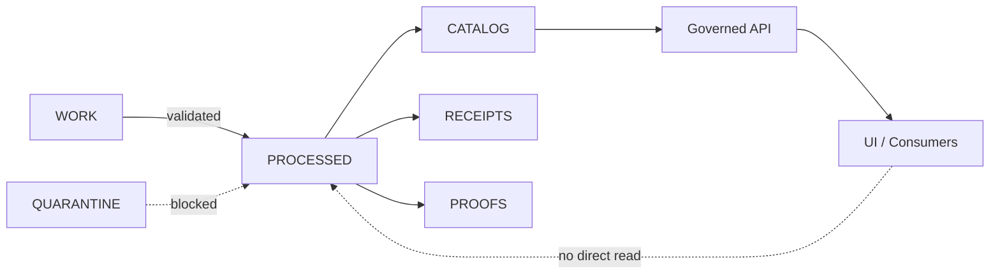

<!-- [KFM_META_BLOCK_V2]
doc_id: kfm://doc/NEEDS-VERIFICATION
title: data/processed/
type: standard
version: v1
status: draft
owners: @bartytime4life
created: NEEDS-VERIFICATION
updated: NEEDS-VERIFICATION
policy_label: NEEDS-VERIFICATION
related: [../README.md, ../raw/README.md, ../work/README.md, ../quarantine/, ../catalog/, ../receipts/, ../proofs/, ../published/README.md, ../../contracts/README.md, ../../schemas/README.md, ../../policy/README.md, ../../tests/README.md, ../../.github/workflows/README.md]
tags: [kfm, data, processed, lifecycle, readme]
notes: [Owner grounded from current public CODEOWNERS coverage for /data/; path role grounded by current public main and the uploaded draft; doc_id, created, updated, and policy_label still need branch-history or project-metadata verification.]
[/KFM_META_BLOCK_V2] -->

<a id="top"></a>
<a id="dataprocessed"></a>

# `data/processed/`

Governed processed-zone guide for stable dataset versions, manifests, and release-adjacent evidence in KFM.

> [!IMPORTANT]
> **Status:** experimental  
> **Doc state:** draft  
> **Owners:** `@bartytime4life`  
> **Path target:** `data/processed/README.md`  
> **Repo fit:** parent [`../README.md`](../README.md) · upstream [`../raw/README.md`](../raw/README.md), [`../work/README.md`](../work/README.md), [`../quarantine/`](../quarantine/) · downstream [`../catalog/`](../catalog/), [`../receipts/`](../receipts/), [`../proofs/`](../proofs/), [`../published/README.md`](../published/README.md), [`../../apps/`](../../apps/)  
> **Quick jump:** [Scope](#scope) · [Repo fit](#repo-fit) · [Inputs](#accepted-inputs) · [Exclusions](#exclusions) · [Tree](#directory-tree) · [Quickstart](#quickstart) · [Usage](#usage) · [Diagram](#diagram) · [Tables](#tables) · [Task list](#task-list) · [FAQ](#faq) · [Appendix](#appendix)  
>       

> [!WARNING]
> `data/processed/` is **not the public edge**.
>
> In KFM, this zone holds **stable dataset versions**, but public and role-limited access still crosses governed APIs, policy evaluation, and evidence-backed release surfaces. Direct UI/runtime reads from this directory should not be treated as a contract.

> [!NOTE]
> This README separates three layers:
>
> - **CONFIRMED public-main evidence:** `data/processed/` exists and currently shows `README.md` only.
> - **CONFIRMED doctrine:** this zone is where stable dataset versions harden.
> - **PROPOSED starter structure:** version-pack layout and file patterns that fit doctrine but are not yet proven as checked-in branch reality.

---

## Scope

This README governs the **processed zone** of the KFM data lifecycle:

```
Source edge → RAW → WORK / QUARANTINE → PROCESSED → CATALOG → PUBLISHED
```

`data/processed/` is the seam where transformation outputs become:

- stable
- versioned
- inspectable
- ready for catalog closure and release evaluation

It does **not** itself imply publication.

### What this README is for

- defining what qualifies as a “processed” artifact
- describing version-pack expectations
- clarifying relationship to catalog, receipts, and proofs
- ensuring processed outputs remain reviewable and replayable

### What this README is not for

- ingest or transform runbooks
- schema authority or contract definition
- policy definition or enforcement logic
- public API documentation

[Back to top](#top)

---

## Repo fit

### Path and lifecycle position

| Relation | Surface | Status | Why it matters |
|---|---|---|---|
| Parent | [`../README.md`](../README.md) | **CONFIRMED** | Defines lifecycle law across all data zones |
| Upstream | [`../raw/README.md`](../raw/README.md) | **CONFIRMED** | Source-native intake remains immutable |
| Upstream | [`../work/README.md`](../work/README.md) | **CONFIRMED** | Transform staging occurs there |
| Upstream | [`../quarantine/`](../quarantine/) | **CONFIRMED (path)** | Blocked material must not enter processed |
| Downstream | [`../catalog/`](../catalog/) | **CONFIRMED (path)** | Catalog closure resolves from processed |
| Downstream | [`../receipts/`](../receipts/) | **CONFIRMED (path)** | Process memory must remain linkable |
| Downstream | [`../proofs/`](../proofs/) | **CONFIRMED (path)** | Release evidence attaches here |
| Downstream | [`../published/README.md`](../published/README.md) | **CONFIRMED** | Publication is a separate governed state |
| Control | [`../../contracts/`](../../contracts/) · [`../../schemas/`](../../schemas/) · [`../../policy/`](../../policy/) | **CONFIRMED** | Authority surfaces must not be redefined locally |
| Consumers | [`../../apps/`](../../apps/) | **CONFIRMED path / INFERRED role** | Governed APIs consume processed outputs |

### Repo-fit summary

| Question | Answer |
|---|---|
| What belongs here? | Stable dataset versions with manifests, checksums, and human-readable context |
| What does not belong here? | Raw data, incomplete transforms, quarantined material, policy/schema authority |
| What is the contract? | A processed version must be verifiable, understandable, and linkable to catalog + evidence surfaces |

[Back to top](#top)

---

## Accepted inputs

| Accepted input | Why it belongs here | Typical shape |
|---|---|---|
| Stable processed artifacts | Core purpose of this zone | GeoJSON, Parquet, CSV, raster formats |
| Version folders | Enables correction-safe lineage | `<theme>/<dataset>/<version>/` |
| `manifest.json` | Machine-readable inventory | One per version |
| `SHA256SUMS.txt` | Integrity anchor | One per version |
| `README.md` | Human-readable explanation | One per version |
| License / rights note | Required for release clarity | SPDX or equivalent |
| QA summaries | Optional final validation evidence | Report or link |
| Links to catalog/receipts/proofs | Maintains traceability | References only |

[Back to top](#top)

---

## Exclusions

| Exclusion | Put it here instead | Why |
|---|---|---|
| Raw captures | `../raw/` | Must remain source-faithful |
| In-progress transforms | `../work/` | Not yet stable |
| Blocked material | `../quarantine/` | Fail-closed first |
| Schema/contract definitions | `../../schemas/`, `../../contracts/` | Authority must remain centralized |
| Policy logic | `../../policy/` | Avoid local rule drift |
| Secrets | secure storage | Not versionable |
| Direct-public copies | governed API layer | Processed ≠ published |

> [!CAUTION]
> “Looks finished” is not sufficient. Stability, traceability, and rights clarity must all be satisfied.

[Back to top](#top)

---

## Directory tree

### Current public state

```text
data/processed/
└── README.md
```

### Doctrine-aligned starter layout

```text
data/processed/
├── README.md
└── <theme>/
    └── <dataset>/
        └── <version>/
            ├── README.md
            ├── manifest.json
            ├── SHA256SUMS.txt
            ├── LICENSE.txt
            └── <artifacts>
```

### Related closure surfaces

```text
data/
├── processed/
├── catalog/{stac,dcat,prov}/
├── receipts/
└── proofs/
```

> [!TIP]
> Prefer **one coherent version pack** over scattered artifacts.

[Back to top](#top)

---

## Quickstart

### Inspect current state

```bash
find data/processed -maxdepth 3 -print | sort
```

### Create a version pack

```bash
mkdir -p data/processed/<theme>/<dataset>/<version>
touch data/processed/<theme>/<dataset>/<version>/README.md
touch data/processed/<theme>/<dataset>/<version>/manifest.json
touch data/processed/<theme>/<dataset>/<version>/SHA256SUMS.txt
```

### Minimum README checklist

- purpose
- sources
- method
- CRS
- units
- caveats
- license
- citation
- links to catalog/receipts/proofs

[Back to top](#top)

---

## Usage

### Version, don’t overwrite

Treat this as immutable version memory.

### Keep human + machine layers separate

- README = explanation
- manifest/checksums = verification

### Keep unresolved material out

If anything is uncertain, route to `work/` or `quarantine/`.

### Maintain traceability

Processed artifacts must resolve back to:

- source context
- receipts
- validation evidence
- catalog closure

### Govern promotion

Moving into `processed/` is a **state transition**, not a file copy.

[Back to top](#top)

---

## Diagram


```mermaid
flowchart LR
    W[WORK] -->|validated| P[PROCESSED]
    Q[QUARANTINE] -. blocked .-> P

    P --> C[CATALOG]
    P --> R[RECEIPTS]
    P --> PF[PROOFS]

    C --> API[Governed API]
    API --> UI[UI / Consumers]

    UI -. no direct read .-> P
```

[Back to top](#top)

---

## Tables

### Processed zone expectations

| Concern | Requirement | Block if |
|---|---|---|
| Stability | Immutable version | Mutable or unclear |
| Integrity | Checksums present | Cannot verify |
| Context | README present | Cannot interpret |
| Rights | License clear | Unknown |
| Closure | Catalog links exist | Cannot resolve outward |
| Traceability | Links to receipts/proofs | Cannot audit |

### Version pack components

| Component | Purpose | Status |
|---|---|---|
| Dataset files | Primary output | CONFIRMED |
| README | Human context | PROPOSED |
| manifest.json | Inventory | PROPOSED |
| SHA256SUMS | Integrity | PROPOSED |
| LICENSE | Rights | PROPOSED |
| STAC/DCAT/PROV | Catalog closure | CONFIRMED |
| Receipts/proofs | Evidence linkage | CONFIRMED |

[Back to top](#top)

---

## Task list

### README-level

- [ ] Meta block verified
- [ ] Lifecycle position clear
- [ ] Exclusions explicit
- [ ] Diagram present
- [ ] No public-path ambiguity

### Version pack

- [ ] Version path exists
- [ ] Artifacts stable
- [ ] README complete
- [ ] manifest + checksums exist
- [ ] license present
- [ ] catalog closure resolves
- [ ] receipts/proofs linkable
- [ ] no unresolved ambiguity

[Back to top](#top)

---

## FAQ

### Is processed public?

No. It is stable, not public.

### Can README replace manifest?

No. It complements, not replaces.

### Should proofs live here?

No. Link to them.

### Can processed be modified?

Prefer new version instead.

### Does this repo currently contain datasets here?

No. Public main shows README only.

[Back to top](#top)

---

## Appendix

<details>
<summary><strong>Example dataset README</strong></summary>

```markdown
# dataset-name — version

## Summary
What this version contains.

## Sources
List sources.

## Method
Transform steps.

## CRS
Projection info.

## Caveats
Limits.

## License
Rights.

## Citation
How to cite.

## Links
STAC / DCAT / PROV / Receipts / Proofs
```

</details>

<details>
<summary><strong>Glossary</strong></summary>

| Term | Meaning |
|---|---|
| Processed | Stable versioned output |
| Catalog closure | STAC + DCAT + PROV |
| Receipt | Process memory |
| Proof | Release evidence |
| Published | Public-safe state |

</details>

[Back to top](#top)
