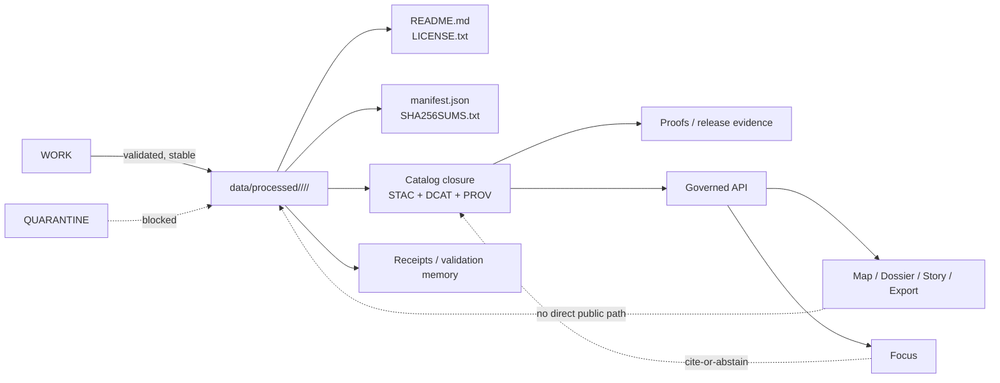

<!-- [KFM_META_BLOCK_V2]
doc_id: kfm://doc/NEEDS-VERIFICATION
title: data/processed/
type: standard
version: v1
status: draft
owners: @bartytime4life
created: NEEDS-VERIFICATION
updated: NEEDS-VERIFICATION
policy_label: NEEDS-VERIFICATION
related: [../README.md, ../raw/README.md, ../work/README.md, ../quarantine/, ../catalog/, ../receipts/, ../proofs/, ../published/README.md, ../../contracts/README.md, ../../schemas/README.md, ../../policy/README.md, ../../tests/README.md, ../../.github/workflows/README.md]
tags: [kfm, data, processed, lifecycle, readme]
notes: [Owner grounded from current public CODEOWNERS coverage for /data/; doc_id, created, updated, and policy_label still need branch-history or project-metadata verification.]
[/KFM_META_BLOCK_V2] -->

<a id="top"></a>

# `data/processed/`

Governed processed-zone guide for stable dataset versions, manifests, and release-adjacent evidence in KFM.

> **Status:** experimental  
> **Doc state:** draft  
> **Owners:** `@bartytime4life`  
> **Path target:** `data/processed/README.md`  
> [](#top)
> [](#top)
> [](#top)
> [](#scope)
> [](#tables)
> [](#directory-tree)
> [](#directory-tree)  
> **Quick jump:** [Scope](#scope) · [Repo fit](#repo-fit) · [Inputs](#accepted-inputs) · [Exclusions](#exclusions) · [Tree](#directory-tree) · [Quickstart](#quickstart) · [Usage](#usage) · [Diagram](#diagram) · [Tables](#tables) · [Task list](#task-list) · [FAQ](#faq) · [Appendix](#appendix)

> [!IMPORTANT]
> `data/processed/` is **not** the public edge.
>
> In KFM terms, this zone is where transformed outputs become **stable, inspectable dataset versions**. Public and role-limited surfaces should still consume release-backed scope through governed APIs and linked evidence objects rather than direct folder exposure.

> [!NOTE]
> This README keeps three layers separate on purpose:
>
> - **CONFIRMED current public-main fact**: `data/processed/` exists, and the currently visible checked-in tree shows `README.md` only.
> - **CONFIRMED doctrine**: `PROCESSED` is where stable dataset versions and release-adjacent artifacts harden.
> - **PROPOSED starter shape**: a per-version pack such as `data/processed/<theme>/<dataset>/<version>/`.

---

## Scope

This README governs the **processed zone** of the `data/` lifecycle.

It explains what belongs in `data/processed/`, what must stay out, how this zone relates to sibling catalog and proof surfaces, and how to keep per-version dataset packs understandable to both machines and humans.

This file is **zone-level** documentation. It does not replace the need for **dataset-level** version READMEs inside individual processed version folders.

### What this README is for

`data/processed/` should answer questions like these:

- What makes an output “processed” rather than “work” or “published”?
- What minimum files should travel with a stable dataset version?
- How should a human-readable dataset README relate to manifests, checksums, and catalog closure?
- What release-facing links should be resolvable from a processed dataset pack?

### What this README is not for

This file is not a source-specific ingest runbook, not a schema registry, not a policy bundle, and not a public API contract.

[Back to top](#top)

---

## Repo fit

`data/processed/` sits at the seam where governed transforms become **stable versioned artifacts** that can support catalog closure, review, proof attachment, and later promotion.

### Path + adjacent surfaces

| Relation | Surface | Status | Why it matters |
| --- | --- | --- | --- |
| Parent | [`../README.md`](../README.md) | **CONFIRMED** | Parent lifecycle law for `data/` as a whole. |
| Lateral | [`../raw/README.md`](../raw/README.md) | **CONFIRMED** | Immutable source captures stay there, not here. |
| Lateral | [`../work/README.md`](../work/README.md) | **CONFIRMED** | In-progress transforms stay there until stable. |
| Lateral | [`../quarantine/`](../quarantine/) | **CONFIRMED (path)** | Rights-unclear, invalid, or blocked material stays there. |
| Lateral | [`../catalog/`](../catalog/) | **CONFIRMED (path)** | STAC / DCAT / PROV closure should resolve back to processed versions. |
| Lateral | [`../receipts/`](../receipts/) | **CONFIRMED (path)** | Ingest and validation memory should be linkable from processed versions. |
| Lateral | [`../proofs/`](../proofs/) | **CONFIRMED (path)** | Release and trust evidence should stay attachable and discoverable. |
| Lateral | [`../published/README.md`](../published/README.md) | **CONFIRMED** | Publication is a governed state transition, not a synonym for “processed.” |
| Upstream | [`../../contracts/README.md`](../../contracts/README.md) | **CONFIRMED** | Shared contract authority should not be redefined locally here. |
| Upstream | [`../../schemas/README.md`](../../schemas/README.md) | **CONFIRMED** | Schema-home and inventory authority should stay explicit rather than fork into zone-local copies. |
| Upstream | [`../../policy/README.md`](../../policy/README.md) | **CONFIRMED** | Deny-by-default and release-scope decisions belong there. |
| Downstream | [`../../apps/`](../../apps/) | **CONFIRMED (path)** | UI and public-safe surfaces should consume governed outputs, not direct storage assumptions. |
| Downstream | [`../../tests/README.md`](../../tests/README.md) | **CONFIRMED** | Validation, fixture, and regression checks should exercise this zone. |
| Downstream | [`../../tools/`](../../tools/) | **CONFIRMED (path)** | Validators, lints, and packaging helpers should target this zone without redefining it. |
| Adjacent control lane | [`../../.github/workflows/README.md`](../../.github/workflows/README.md) | **CONFIRMED / NEEDS VERIFICATION** | The workflow documentation surface is present on public `main`, but checked-in merge-blocking YAML depth is not exposed there today. |

### Repo-fit summary

| Question | Answer |
| --- | --- |
| What belongs here? | Stable processed artifacts, immutable version folders, manifests, checksums, human-readable version READMEs, and resolvable links into catalog / receipt / proof surfaces. |
| What does **not** belong here? | Raw captures, unstable transforms, quarantined material, shared schemas, policy bundles, secrets, or direct-public serving assumptions. |
| What is the downstream contract? | A processed version should be understandable, verifiable, and linkable into `STAC + DCAT + PROV`, receipts, and release evidence. |

[Back to top](#top)

---

## Accepted inputs

These are the kinds of artifacts that belong in, or directly as part of, the processed zone.

| Accepted input | Why it belongs here | Typical shape |
| --- | --- | --- |
| Immutable processed data artifacts | This zone exists to hold stable transformed outputs. | GeoJSON, Parquet, GeoTIFF, CSV, vector packages, other release-safe processed formats |
| Dataset version folders | Versioning keeps processed outputs inspectable and correction-safe. | `data/processed/<theme>/<dataset>/<version>/` |
| `manifest.json` | Machine-readable inventory of the version pack. | One manifest per version folder |
| `SHA256SUMS.txt` | Integrity anchor for version contents. | One checksum file per version folder |
| `README.md` | Human-readable method, caveat, CRS, rights, and citation memory. | One README per version folder |
| `LICENSE.txt` or equivalent rights note | Keeps release-facing rights context close to the version pack. | Machine-readable SPDX-compatible notice where possible |
| Stable QA or release-adjacent outputs | Some final validation artifacts may need to remain resolvable from the version pack. | Summaries, reports, or references to sibling receipt/proof surfaces |
| Resolvable sibling links | Processed versions should point to catalog, receipt, and proof surfaces without duplicating their full logic. | Links or references to STAC / DCAT / PROV / receipts / proofs |

[Back to top](#top)

---

## Exclusions

These do **not** belong in `data/processed/` as the normal case.

| Exclusion | Put it under or behind | Why |
| --- | --- | --- |
| Raw source captures | [`../raw/README.md`](../raw/README.md) | Raw evidence should remain immutable and separately governed. |
| Half-finished transforms | [`../work/README.md`](../work/README.md) | `processed/` is not a scratchpad. |
| Rights-unclear or sensitivity-blocked material | [`../quarantine/`](../quarantine/) | Block first; do not normalize blocked material into “stable.” |
| Shared schemas and vocabularies | [`../../contracts/README.md`](../../contracts/README.md) and [`../../schemas/README.md`](../../schemas/README.md) | Keep contract authority singular. |
| Executable policy logic | [`../../policy/README.md`](../../policy/README.md) | Policy should not fork into folder-local rules. |
| Secrets, credentials, tokens | environment / secret stores | This zone is versionable evidence, not secret storage. |
| Detached proof packs with no release linkage | [`../proofs/`](../proofs/) | Keep release proof discoverable and traceable by release context. |
| “Convenience copies” for direct public serving | governed API and release surfaces | Processed storage is not the trust membrane. |

> [!CAUTION]
> A polished artifact in `data/processed/` is still not a license to skip catalog closure, policy checks, release evidence, or correction lineage.

[Back to top](#top)

---

## Directory tree

### Current public-main path evidence

The current public `main` branch proves this path exists, and the currently visible checked-in inventory is still minimal.

```text
data/processed/
└── README.md
```

### Doctrine-aligned starter skeleton

Use this as a **starter shape**, not as a claim that every subtree already exists in the checked-in repo today.

```text
data/processed/
├── README.md
└── <theme>/
    └── <dataset>/
        └── <version>/
            ├── README.md
            ├── manifest.json
            ├── SHA256SUMS.txt
            ├── LICENSE.txt
            └── <processed-artifacts...>
```

### Related closure shape

The current public `data/` tree already exposes sibling surfaces such as `catalog/`, `proofs/`, `published/`, `quarantine/`, `raw/`, `receipts/`, `registry/`, and `work/`. The closure shape below shows the subset most directly tied to processed version packs.

```text
data/
├── processed/<theme>/<dataset>/<version>/
├── catalog/
│   ├── stac/
│   ├── dcat/
│   └── prov/
├── receipts/
└── proofs/
```

> [!TIP]
> Prefer **one obvious version pack** over many loosely related files scattered across the tree. The human and machine story should both converge on the same dataset version.

[Back to top](#top)

---

## Quickstart

### 1) Inspect the live surface first

Before asserting layout or automation facts, inspect the current checkout.

```bash
find data/processed -maxdepth 4 -print 2>/dev/null | sort
```

### 2) Create a version pack

Illustrative scaffold only:

```bash
mkdir -p data/processed/<theme>/<dataset>/<version>
touch data/processed/<theme>/<dataset>/<version>/README.md
touch data/processed/<theme>/<dataset>/<version>/manifest.json
touch data/processed/<theme>/<dataset>/<version>/SHA256SUMS.txt
touch data/processed/<theme>/<dataset>/<version>/LICENSE.txt
```

### 3) Write the human-readable README

The per-version `README.md` should answer, at minimum:

1. What the dataset version is.
2. Which sources it derives from.
3. How it was produced.
4. Which CRS / spatial reference it uses.
5. Which units and temporal semantics matter.
6. Which caveats or known limits apply.
7. What the license / rights posture is.
8. How to cite it.
9. Where the linked `STAC + DCAT + PROV` objects live.
10. Which receipt / proof surfaces should be checked next.

### 4) Close the machine-readable loop

A processed version is not done when files merely exist. It is closer to done when these are all true:

- `manifest.json` inventories the pack.
- `SHA256SUMS.txt` verifies integrity.
- sibling `STAC + DCAT + PROV` objects resolve to the same version.
- receipt / proof references are discoverable.
- no unresolved rights or quarantine issues remain.

> [!NOTE]
> Keep the human-readable README **adjacent** to the dataset version, but do not let prose replace machine-checkable manifests, checksums, or catalog closure.

[Back to top](#top)

---

## Usage

### Version, do not overwrite

Treat `data/processed/` as a **versioned memory surface**. New outputs should normally create a new dataset version rather than mutating an old one in place.

### Keep README human and manifest machine

Use the README for explanation and operator memory. Use manifests, checksums, and catalog objects for machine-checkable truth.

### Keep unresolved material out

If an artifact still has rights uncertainty, sensitivity uncertainty, invalid geometry, unresolved units, or incomplete provenance, it should not quietly “graduate” into `processed/`.

### Point back to receipts and source context

A processed artifact should never become an orphan. A reviewer should be able to move from version pack -> receipt / validation memory -> catalog closure -> release evidence without guessing.

### Close `STAC + DCAT + PROV` before outward release

Processed storage and outward discoverability are related, but not identical. Version packs should line up cleanly with their catalog triplet before release or publication claims are made.

### Publish by governed transition

Copying files into a folder is not the same thing as promotion. Public-safe release remains a governance event, not just a storage event.

### Preserve correction lineage

If a processed version is later narrowed, superseded, withdrawn, or reissued, the lineage should stay visible rather than being silently overwritten.

[Back to top](#top)

---

## Diagram


```mermaid
flowchart LR
    W[WORK] -->|validated, stable| P[data/processed/<theme>/<dataset>/<version>/]
    Q[QUARANTINE] -. blocked .-> P

    P --> H[README.md<br/>LICENSE.txt]
    P --> I[manifest.json<br/>SHA256SUMS.txt]
    P --> C[Catalog closure<br/>STAC + DCAT + PROV]
    P --> R[Receipts / validation memory]
    C --> PF[Proofs / release evidence]
    C --> API[Governed API]
    API --> UI[Map / Dossier / Story / Export]
    API --> F[Focus]

    UI -. no direct public path .-> P
    F -. cite-or-abstain .-> C
```

[Back to top](#top)

---

## Tables

### Processed-zone matrix

| Concern | What belongs here | Block if... |
| --- | --- | --- |
| Stable transformed output | Final processed artifacts for a named version | The artifact is still mutable, provisional, or unexplained |
| Version memory | A clear `<theme>/<dataset>/<version>` pack | The version cannot be identified or compared later |
| Human-readable context | Per-version README | Prose is missing or contradicts machine-readable closure |
| Integrity | Manifest + checksums | The pack cannot be inventoried or verified |
| Rights context | License / rights note | Rights are unknown, conflicting, or still under review |
| Discoverability | Links into `STAC + DCAT + PROV` | The version cannot be closed cleanly into outward catalog surfaces |
| Traceability | Links into receipts / proofs | Reviewers cannot reconstruct how this version came to exist |
| Release safety | Promotion-ready, not necessarily published | The artifact is being mistaken for public release merely because it is stored here |

### Version pack minimum

| Part | Typical location | Purpose | Posture |
| --- | --- | --- | --- |
| Dataset artifacts | `data/processed/<theme>/<dataset>/<version>/` | Stable processed payload | CONFIRMED doctrine |
| `README.md` | same folder | Human-readable summary, caveats, citation, links | PROPOSED starter shape |
| `manifest.json` | same folder | Inventory and machine-readable pack memory | PROPOSED starter shape |
| `SHA256SUMS.txt` | same folder | Integrity check | PROPOSED starter shape |
| `LICENSE.txt` | same folder | Rights / reuse clarity | PROPOSED starter shape |
| STAC item / collection | sibling catalog surface | Geospatial asset discovery | CONFIRMED doctrine |
| DCAT dataset | sibling catalog surface | Dataset-facing catalog closure | CONFIRMED doctrine |
| PROV bundle | sibling catalog surface | Lineage memory | CONFIRMED doctrine |
| Receipts / proofs | sibling evidence surfaces | Validation and release trust memory | CONFIRMED doctrine |

> [!IMPORTANT]
> A strong processed pack does two jobs at once:
>
> 1. It helps machines validate, compare, and package the version.
> 2. It helps humans understand what they are looking at without consulting tribal memory.

[Back to top](#top)

---

## Task list

### Definition of done for this zone README

- [ ] KFM Meta Block v2 is present and synchronized with the visible document role.
- [ ] States what `data/processed/` is for.
- [ ] States what does **not** belong here.
- [ ] Links to parent and sibling lifecycle surfaces.
- [ ] Separates current public-main path evidence from doctrine-aligned starter shape.
- [ ] Includes at least one meaningful lifecycle diagram.
- [ ] Makes direct-public-path assumptions explicit and rejectable.

### Definition of done for a dataset-version pack

- [ ] Version path is explicit: `<theme>/<dataset>/<version>`.
- [ ] Stable artifacts are present.
- [ ] `manifest.json` exists.
- [ ] `SHA256SUMS.txt` exists.
- [ ] `README.md` explains what it is, sources, method, CRS, units, caveats, license, citation, and linked evidence.
- [ ] Rights / license note is present.
- [ ] `STAC + DCAT + PROV` closure resolves to the same version.
- [ ] Receipt and proof references are discoverable.
- [ ] The pack can survive correction review without silent overwrite.
- [ ] No raw / work / quarantine material is mixed into the version folder.

### Review gates worth enforcing

- [ ] No undocumented direct-public storage path is implied.
- [ ] No shared contract or policy authority is redefined under `data/processed/`.
- [ ] No README prose substitutes for missing machine-readable closure.
- [ ] No correction-sensitive artifact is overwritten without visible lineage.

[Back to top](#top)

---

## FAQ

### Is `data/processed/` already public?

No. It is a governed storage zone for stable dataset versions. Public-safe exposure should still happen through governed APIs, release-backed surfaces, and linked evidence objects.

### Can a dataset README replace manifests and catalog closure?

No. The README is for explanation, caveats, and operator memory. It complements machine-checkable artifacts; it does not replace them.

### Should receipts and proofs be copied into every version folder?

Not necessarily. What matters is that the processed version can resolve cleanly into receipt and proof surfaces. Duplication is less important than traceability.

### Are all derived outputs authoritative if they live here?

No. KFM keeps authoritative versus derived distinctions visible. A processed artifact may be stable and versioned without becoming a public truth surface by default.

### Is a `<theme>/<dataset>/<version>` layout mandatory?

Treat it as the preferred starter shape unless a stronger checked-in convention is directly proven in the live repo.

### Does current public `main` already contain processed version packs?

No. The currently visible public-main inventory for `data/processed/` is README-only. The per-version pack layout shown here is a doctrine-aligned starter shape, not a claim of existing checked-in datasets.

[Back to top](#top)

---

## Appendix

<details>
<summary><strong>Illustrative per-version README skeleton</strong></summary>

```markdown
# <dataset> — <version>

One-line purpose for this exact processed version.

## Summary

What this dataset version contains and why it exists.

## Sources

- Source A
- Source B

## Method summary

Short transform / normalization / derivation summary.

## Spatial reference / CRS

State CRS, projection, axis assumptions, and any transformation notes.

## Units and temporal semantics

State units, date/time basis, freshness basis, and interval semantics where relevant.

## Caveats

List known limits, omissions, uncertainty, masking, or generalization rules.

## License / rights

State license, restrictions, or review notes.

## Citation

Provide the preferred citation or attribution form.

## Linked evidence

- STAC:
- DCAT:
- PROV:
- Receipts:
- Proofs:
```

</details>

<details>
<summary><strong>Glossary</strong></summary>

| Term | Meaning in this README |
| --- | --- |
| Processed | Stable transformed output suitable for versioning and later release review |
| Catalog closure | The outward `STAC + DCAT + PROV` memory for a version |
| Receipt | Evidence of intake, validation, or transform activity |
| Proof | Release-adjacent trust memory such as manifests, checks, or attestable evidence |
| Published | A governed public-safe state, not merely a folder location |

</details>

[Back to top](#top)
