<div align="center">

# 🧾 **Kansas Frontier Matrix — Processed Data Layer**  
`data/processed/README.md`

The **Processed Data Layer** is the canonical, publication-ready dataset repository of the Kansas Frontier Matrix (KFM).  
All contents here have passed:

- ✔ FAIR+CARE governance  
- ✔ Schema validation (Data Contract v3, STAC/DCAT, JSON Schema, SHACL)  
- ✔ Checksum verification (SHA-256; SBOM parity)  
- ✔ Spatial & temporal normalization  
- ✔ Provenance & lineage registration (PROV-O, governance ledger)  
- ✔ AI explainability/fairness review (where applicable)  

These datasets support:

- Focus Mode v3  
- Story Node v3  
- STAC/DCAT catalogs  
- Neo4j graph ingestion  
- Scientific, educational, and ethical open-data use  

</div>

---

## 📘 1. Overview

The **Processed Data Layer** contains **clean, normalized, validated, and certified datasets** that represent the final step before:

- Public release  
- Knowledge graph ingestion  
- Narrative use in Story Nodes  
- Focus Mode reasoning  
- Long-term archive promotion (`data/archive/**`)  

Its responsibilities:

- Guarantee **reproducibility** (deterministic ETL + contracts)  
- Enforce **FAIR+CARE governance** and sovereignty rules  
- Provide **STAC/DCAT-aligned metadata & JSON-LD**  
- Preserve **lineage and integrity** with checksums & SBOM parity  
- Deliver **machine-ready data** for apps, pipelines, and visualization  

---

## 🗂 2. Directory Layout (Emoji Style A)

```text
data/processed/
├── 📄 README.md                         # This file (global processed-layer architecture)
│
├── 🌦️ climate/                         # Climate indices, normals, anomalies, rasters
├── 🌪️ hazards/                         # Tornado tracks, storm events, wildfires, drought areas
├── 💧 hydrology/                        # Streamflow, groundwater, water quality, reservoir ops
├── 🌿 landcover/                        # Vegetation, NLCD/LCMS, land-use change
├── 🐾 ecology/                          # Biodiversity, species aggregates (GBIF/eBird/etc.)
├── 📊 tabular/                          # Census, socioeconomic, treaties, tabular metadata
├── 🗺️ spatial/                          # Geospatial layers (GeoJSON, Parquet, TopoJSON)
└── 📑 metadata/                         # FAIR+CARE-certified metadata bundles (JSON/JSON-LD)
```

**Rules:**

- Each subdirectory MUST have its own `README.md` describing domain-specific schemas, provenance, and governance rules.  
- Each dataset within subdirectories must have at least **one entry** in a checksum manifest (`data/checksums/**`).  
- STAC/DCAT references MUST be present for geospatial datasets (`spatial/`, `hydrology/`, `hazards/`, `landcover/`, `ecology/`, etc.).

---

## 🔄 3. Processed Data Lifecycle

```mermaid
flowchart TD
  A["raw/\n(immutable sources)"]
    --> B["staging/\n(cleaned + standardized)"]

  B --> C["validation/\n(schema · FAIR+CARE · quality · AI checks)"]

  C --> D["alignment/\n(STAC · DCAT · ISO 19115 · CRS/temporal)"]

  D --> E["checksums/\nSHA-256 + SBOM verification"]

  E --> F["publication/\n(data/processed/*)"]

  F --> G["catalog-sync/\n(STAC/DCAT + Focus Mode v3 + Neo4j)"]
```



### Lifecycle Guarantees

- **No dataset** enters `data/processed/` until:
  - Contract validation (JSON Schema, SHACL) passes  
  - FAIR+CARE governance & sovereignty assessments pass  
  - Checksums computed and recorded (with SBOM cross-checks)  

- Every processed dataset:
  - Has a **provenance trail** (PROV-O, OpenLineage)  
  - Appears in **telemetry** (energy, carbon, validation metrics)  
  - Has clearly documented **license and reuse** terms  

---

## 📐 4. Cross-Domain Architecture Standards

### 4.1 Spatial Standards

- Final outputs: **EPSG:4326** (WGS84) for geospatial files.  
- GeoJSON must be RFC 7946-compliant (`FeatureCollection`, `[lon, lat]`).  
- Parquet stores geometries as WKB/WKT or Arrow extension types with `geo:asWKT`.  
- Rasters are stored as **COGs** (Cloud-Optimized GeoTIFF) with:
  - Overviews  
  - Internal tiling  
  - Projection metadata  

### 4.2 Temporal Standards

- Use ISO 8601 for all timestamps.  
- Where possible, include:
  - `time_start`  
  - `time_end`  
  - `time_resolution` or `temporal_accuracy`  

These map to OWL-Time intervals and instants for graph querying and Focus Mode narratives.

### 4.3 Provenance Requirements

- For each dataset:
  - `prov:wasDerivedFrom` links to raw/staging datasets  
  - `prov:wasGeneratedBy` identifies the ETL pipeline or AI job  
  - `prov:used` references critical tools/configurations  

- Provenance entries must:
  - Appear in JSON-LD metadata  
  - Be ingestible into Neo4j  
  - Align with entries in governance ledgers and telemetry files  

### 4.4 FAIR+CARE Rules

- FAIR (F1/A1/I1/R1) compliance is enforced via:
  - DCAT 3.0 fields  
  - Schema conformance  
  - Discoverability via STAC/DCAT indexes  

- CARE compliance requires:
  - Sovereignty / consent metadata for any Indigenous or sensitive content  
  - H3 generalization or redaction when required by policy  
  - Clear description of any restrictions in dataset metadata  

---

## 🧩 5. Schema & Metadata Requirements (Global)

All processed datasets must include **base fields**:

- `id` — source identifier (domain-specific)  
- `kfm_id` — KFM-stable identifier  
- `domain` — e.g., `climate`, `hazards`, `hydrology`, `ecology`  
- `schema_version` — data contract/schema version used  
- `license` — explicit license (SPDX/CC/ODC)  
- `checksum` — `sha256-<hex>` value  
- `fairstatus` — `certified` / `pending` / `internal`  
- `created` — ISO 8601 creation timestamp  

And **metadata references**:

- `stac_ref` — STAC JSON for dataset/collection  
- `dcat_ref` — DCAT JSON-LD dataset record  
- `governance_ref` — path to governance/FAIR+CARE ledger entry  
- `data_contract_ref` — contract used for schema validation (e.g., `data_contract_v3`)  

---

## 🧬 6. Domain-Level Schema Summaries (v11)

### 6.1 🌦 Climate (Processed)

```text
Field                Type          Notes
-------------------  ------------  ----------------------------------------
kfm_id               string        Stable ID
timestamp            datetime      ISO 8601
variable             string        e.g., tmax, tmin, precip, drought_index
value                float         Normalized units
unit                 string        SI-standardized
spatial_extent       array         [minLon, minLat, maxLon, maxLat]
source               string        NOAA, PRISM, Daymet, USDM
quality_flag         string        QC metadata
checksum             string        sha256-…
fairstatus           string        certified/pending/internal
```

### 6.2 🌪 Hazards (Processed)

```text
Field                Type          Notes
-------------------  ------------  ----------------------------------------
hazard_id            string        Unique event ID
hazard_type          string        tornado, hail, flood, wildfire, etc.
start_time           datetime      ISO 8601
end_time             datetime      ISO 8601
geometry             GeoJSON       Polygon/LineString/Point
intensity            string/float  EF-scale, magnitude, category, etc.
source               string        NOAA SPC, USGS, FEMA, etc.
area_sqkm            float         Geodesic area (if polygon)
stac_ref             string        STAC item
checksum             string        sha256-…
```

### 6.3 💧 Hydrology (Processed)

```text
Field                Type          Notes
-------------------  ------------  ----------------------------------------
site_id              string        USGS NWIS or local hydrology site
timestamp            datetime      ISO 8601
discharge_cfs        float         Streamflow
water_level_m        float         Water level / stage
water_quality        object/float  Parameter group or single value
geometry             GeoJSON       Point
source               string        USGS, KDHE, Mesonet, KWO, etc.
checksum             string        sha256-…
```

### 6.4 🌿 Landcover (Processed)

```text
Field                Type          Notes
-------------------  ------------  ----------------------------------------
pixel_id             string        Unique raster tile ID
landcover_class      integer       NLCD/LCMS class/value
class_name           string        Human-readable label
geometry             GeoJSON       Polygon or pixel footprint
acquisition_date     date          Data year (e.g., 2016, 2019)
raster_ref           string        Link to COG or tile
checksum             string        sha256-…
```

### 6.5 🐾 Ecology (Processed)

```text
Field                Type          Notes
-------------------  ------------  ----------------------------------------
species              string        Latin species name
count                integer       Observed count
geometry             GeoJSON       Point or aggregated cell
observation_time     datetime      ISO 8601
uncertainty_m        float         Spatial uncertainty radius
source               string        GBIF, eBird, KBS field data, etc.
checksum             string        sha256-…
```

### 6.6 📊 Tabular (Processed)

```text
Field                Type          Notes
-------------------  ------------  ----------------------------------------
kfm_id               string        Stable ID
name                 string        Entity name
value                any           Numeric or categorical
date                 date          Normalized date
category             string        Census, economics, treaties, etc.
source               string        Census Bureau, NARA, state agencies
checksum             string        sha256-…
```

---

## 🔐 7. Integrity & Checksum Architecture

Processed data integrity is rooted in:

- `data/checksums/**` manifests  
- `releases/<version>/sbom.spdx.json` SBOMs  
- `manifest_ref` release manifests  
- Governance & telemetry logs  

### Required Validation

- **Checksum verification** (`checksum-verify.yml`)  
- **SBOM parity** (`sbom_verify.yml`)  
- **Schema & contract validation** (`schema-lint`, `data-contract-v3`)  
- **FAIR+CARE + sovereignty checks** (`faircare_validate.yml`)  

---

## 🧬 8. Provenance (PROV-O + OpenLineage)

Each processed dataset must:

- Be a `prov:Entity` instance  
- Reference its **raw and staging sources** via `prov:wasDerivedFrom`  
- Reference its **ETL job** via `prov:wasGeneratedBy`  
- OPTIONALLY reference algorithms or AI models used via `prov:used`  

This is tracked in:

- JSON-LD metadata files under `data/processed/metadata/**`  
- Neo4j graph ingestion pipelines (`src/graph/`)  
- OpenLineage events  

---

## 🌱 9. Sustainability & Telemetry

Sustainability metrics:

- `energy_wh` per pipeline  
- `carbon_gco2e` per dataset  
- `runtime_sec` for processing  
- Data volume and shape  

Written to:

```text
../../releases/v11.2.2/focus-telemetry.json
docs/reports/telemetry/data-processed-*.json
```

These feed dashboards for:

- Performance  
- Carbon footprint  
- Governance & compliance trends  

---

## 🧠 10. Focus Mode & Story Nodes

The **Processed Layer** is the **source-of-truth** for:

- Focus Mode v3:
  - When querying for stories & explanations  
  - When generating cross-domain overlays (climate × hydrology × hazards × ecology)  

- Story Node v3:
  - Data-backed narratives  
  - Card + detail views  

Constraints:

- Focus Mode must not bypass processed-layer governance:  
  - Only use datasets that pass all checks  
  - Respect CARE/sovereignty metadata  

---

## 🕰 11. Version History

| Version | Date       | Summary                                                                                             |
|--------:|-----------:|-----------------------------------------------------------------------------------------------------|
| v11.2.2 | 2025-11-27 | Upgraded to KFM-MDP v11.2.2; applied emoji directory layout; expanded schema tables & governance.  |
| v11.0.0 | 2025-11-19 | Initial v11 processed data layer architecture; lifecycle + integrity + FAIR+CARE enforcement.      |

---

<div align="center">

© 2025 Kansas Frontier Matrix — CC-BY 4.0 / ODC Attribution  
[⬅️ Back](../README.md) · [🗃️ Archive & Provenance](../archive/README.md) · [🛡️ Governance Charter](../../docs/standards/governance/ROOT-GOVERNANCE.md)

</div>