<div align="center">

# 📦 `data/processed/` — Final Data Products (KFM)


_This folder holds **curated, reusable, UI-ready outputs** produced by **config-driven pipelines** — not scratch work._ 🗺️⚙️

</div>

> [!IMPORTANT]
> In KFM, **processed** means “final artifacts” produced by a deterministic pipeline **and safe to reuse**.
> A dataset is only considered **published** once the **evidence triplet** exists **and validates**:
> **STAC + DCAT + PROV** (plus policy gates & integrity checks).

> [!IMPORTANT]
> 🧾 **No mystery layers:** every dataset/layer must have a **data contract** (metadata + governance + provenance join keys).
> If it can’t be traced, it doesn’t ship.

> [!CAUTION]
> **No secrets, credentials, private keys, PII, or restricted coordinates** belong in `data/processed/` (or anywhere in Git history).
> If you suspect sensitive exposure, follow `SECURITY.md` (private reporting) and treat it as an incident.

---

## ⚡ Quick links

- 📥 Raw inputs (if present) → [`../raw/`](../raw/)
- 🧪 Work / intermediate (if present) → [`../work/`](../work/)
- 🛰️ STAC catalogs → [`../stac/collections/`](../stac/collections/) · [`../stac/items/`](../stac/items/)
- 🗂️ DCAT discovery metadata → [`../catalog/dcat/`](../catalog/dcat/)  
  - _Legacy/alt layouts may use_ `../catalogs/dcat/` _(keep links in sync if your repo differs)_
- 🧬 PROV lineage bundles → [`../prov/`](../prov/)  
  - _Legacy/alt layouts may use_ `../provenance/`
- 🕸️ Graph import artifacts (if used) → [`../graph/`](../graph/)
- 🧰 Validation tooling (if present) → [`../../tools/validation/`](../../tools/validation/)  
  - 🛡️ Policy Pack (if present) → `../../tools/validation/policy/` _(Rego/Conftest)_
- 🧾 External source manifests (recommended) → [`../sources/`](../sources/)
- 📦 Offline / field bundles (if adopted) → `../packs/` _(optional, see below)_

---

<details>
<summary><strong>🧭 Table of contents</strong></summary>

- [🎯 What belongs here](#-what-belongs-here)
- [🧱 Folder contract](#-folder-contract)
- [🧾 Data contracts, IDs, and naming conventions](#-data-contracts-ids-and-naming-conventions)
- [🔁 Lifecycle and canonical pipeline](#-lifecycle-and-canonical-pipeline)
- [📁 Expected layout](#-expected-layout)
- [📦 Publication bundle per dataset](#-publication-bundle-per-dataset)
- [🧾 Manifests and checksums](#-manifests-and-checksums)
- [🗺️ UI-ready packaging (raster • vector • tables • tiles • 3D)](#️-ui-ready-packaging-raster--vector--tables--tiles--3d)
- [🛡️ Validation, policy gates, and waivers](#️-validation-policy-gates-and-waivers)
- [🧠 ML, analytics, simulation, and “4D” outputs](#-ml-analytics-simulation-and-4d-outputs)
- [🔐 Privacy, sensitivity, sovereignty, and CARE](#-privacy-sensitivity-sovereignty-and-care)
- [🧳 Large files, external storage, and rollbacks](#-large-files-external-storage-and-rollbacks)
- [➕ Add a new processed dataset](#-add-a-new-processed-dataset)
- [📚 Project reference shelf](#-project-reference-shelf)
- [🕰️ Version history](#️-version-history)
- [✅ Definition of Done](#-definition-of-done)

</details>

---

## 🎯 What belongs here

**`data/processed/` contains final data products** that are ready to be:

- queried (Parquet/CSV/DB exports),
- mapped (COGs, GeoJSON/GeoPackage/GeoParquet, tiles),
- indexed into catalogs (**STAC/DCAT**) and lineage (**PROV**),
- referenced by the graph and served via the API → UI → Story Nodes → Focus Mode.

✅ Typical “processed” artifacts you’ll see in KFM:
- 🛰️ **Raster layers**: georeferenced, web-ready rasters (often **COG GeoTIFF**) + overviews
- 🧩 **Vector layers**: cleaned boundaries/routes/places (**GeoJSON**, **GPKG**, **GeoParquet**)
- 🗃️ **Tabular products**: curated tables (**Parquet**) with stable schemas + dictionary
- 📚 **Text corpora**: OCR + extracted entities + structured JSON/Parquet for linking/search
- 🧠 **Evidence artifacts**: model outputs, indices, simulations (treated like any other dataset)
- 🎛️ **UI layer bundle** (recommended): legend, styles, popup fields, tile hints (“map behind the map”)

🚫 Not for this folder:
- raw downloads / source dumps → `data/raw/<domain>/…`
- intermediate joins / scratch outputs → `data/work/<domain>/…`
- “mystery files” with no contract, no provenance, no license/terms
- manual edits “because it was faster” (that breaks reproducibility + trust)

---

## 🧱 Folder contract

This folder is intentionally opinionated. Every **processed dataset** should be:

1. **Deterministic**: same inputs + config + code revision ⇒ same outputs (as practical).
2. **Idempotent**: re-running does not duplicate, drift silently, or mutate history without a new version/run.
3. **Contract-first**: dataset has a **declared schema & metadata contract** (no black boxes).
4. **Traceable**: every artifact has a manifest + checksums, and links to STAC/DCAT/PROV.
5. **Governed**: classification / sensitivity / CARE (and any cultural protocols) are explicit and preserved end-to-end.
6. **Policy-gated**: automated checks fail closed unless a time-bounded waiver exists.
7. **Reviewable**: structure is consistent so diffs & PR reviews are possible.

> [!TIP]
> If you can’t explain the lineage, it’s not “processed” — it’s just a file.

---

## 🧾 Data contracts, IDs, and naming conventions

KFM is **contract-first** and **provenance-first**:

- Every dataset has a **stable ID** used to join:
  - `data/processed/` artifacts
  - STAC (spatial/temporal indexing)
  - DCAT (discovery & licensing)
  - PROV (lineage)
  - Graph nodes/edges (knowledge linking)
  - API/UI references & Story Nodes

### Recommended IDs

- **`dataset_id`** (stable join key):  
  `kfm.<region_or_scope>.<domain>.<dataset_slug>.<version>`  
  Example pattern: `kfm.ks.landcover.2000_2020.v1`

- **`run_id` / `version_or_run_id`** (immutable run folder):  
  Prefer a timestamp + short suffix to avoid collisions, e.g.  
  `2026-01-19_v1` or `2026-01-19T134500Z_8f3a2c`

> [!NOTE]
> **Folder names are API surface area.** Keep them lowercase, stable, and boring:
> `lowercase_snake_case` or `lowercase-kebab-case` (pick one and stay consistent).

### “No mystery layers” rule (practical)

At minimum, each run folder should explain:

- **What it is** (human context)
- **Where it came from** (sources)
- **How it was made** (pipeline + config + versions)
- **How to serve it** (UI/API packaging hints)
- **How to trust it** (checksums + validations)

---

## 🔁 Lifecycle and canonical pipeline

KFM’s lifecycle is staged (domain-scoped):

- `data/raw/<domain>/` → ingest as-is (or store pointers via `data/sources/`)
- `data/work/<domain>/` → intermediate transforms / joins / scratch
- `data/processed/<domain>/` → final outputs (this folder)

At publication time, the dataset emits boundary artifacts and passes policy gates:

```mermaid
flowchart LR
  RAW["📥 data/raw/<domain>\n(as-ingested evidence)"] --> WORK["🧪 data/work/<domain>\n(intermediate)"]
  WORK --> PROC["📦 data/processed/<domain>\n(final products)"]

  PROC --> GATE["🛡️ Policy Gate\n(validators + OPA/Conftest)"]

  GATE --> STAC["🛰️ data/stac/\n(items + collections)"]
  GATE --> DCAT["🗂️ data/catalog/dcat/\n(discovery datasets)"]
  GATE --> PROV["🧬 data/prov/\n(lineage bundles)"]

  STAC --> GRAPH["🕸️ Graph (mirrors IDs + joins)"]
  DCAT --> GRAPH
  PROV --> GRAPH

  GRAPH --> API["🔌 API boundary\n(contracts + redaction + access control)"]
  API --> UI["🗺️ UI / Apps\n(MapLibre/Cesium/etc.)"]
  UI --> STORY["📖 Story Nodes\n(config + citations)"]
  STORY --> FOCUS["🎯 Focus Mode\n(provenance-linked only)"]
```



> [!IMPORTANT]
> The ordering is not cosmetic: **ETL → STAC/DCAT/PROV → Graph → API → UI → Story → Focus Mode**.
> Skipping evidence artifacts breaks trust and disables provenance-backed UI/AI features.

---

## 📁 Expected layout

> Keep the top-level tidy: **domain → dataset → version/run**.

```text
📁 data/
└── 📁 processed/
    ├── 📄 README.md                         👈 you are here
    └── 📁 <domain>/
        └── 📁 <dataset_slug>/
            ├── 📄 README.md                 # dataset card (human context + intended use)
            └── 📁 <version_or_run_id>/
                ├── 📄 MANIFEST.json         # ✅ required (run contract)
                ├── 📄 checksums.sha256      # ✅ required (integrity)
                ├── 📄 QA_REPORT.md          # ⭐ recommended (review + CI trace)
                ├── 📄 dataset.schema.json   # ⭐ recommended (tabular/JSON schema)
                │
                ├── 📁 rasters/              # 🛰️ COGs, derived surfaces
                ├── 📁 vectors/              # 🧩 GeoJSON/GPKG/GeoParquet
                ├── 📁 tables/               # 🗃️ Parquet/CSV
                ├── 📁 text/                 # 📚 corpora (jsonl/parquet)
                ├── 📁 models/               # 🧠 model artifacts + cards + metrics
                │
                ├── 📁 tiles/                # 🧱 optional (MVT/PMTiles/MBTiles + TileJSON)
                ├── 📁 ui/                   # 🎛️ optional (layer config, legend, styles, popup fields)
                ├── 📁 previews/             # 🖼️ quicklook png/jpg + thumbnails
                │
                ├── 📁 attestations/         # 🧾 optional (SBOM, SLSA/in-toto, signatures)
                └── 📄 NOTES.md              # optional (quirks, caveats, exceptions)
```

> [!NOTE]
> If outputs are too large for Git:
> store the heavy bytes externally and keep **pointers + checksums + manifests** here.

---

## 📦 Publication bundle per dataset

A processed dataset is **ready to publish** when it has:

| What | Required | Where it lives | Why it exists |
|---|:---:|---|---|
| Processed artifacts | ✅ | `data/processed/<domain>/<dataset>/<run>/` | Actual deliverables |
| Manifest (run contract) | ✅ | `MANIFEST.json` | Repro + governance + pointers |
| Checksums | ✅ | `checksums.sha256` | Integrity + drift detection |
| STAC | ✅ | `data/stac/collections/` + `data/stac/items/` | Spatial/temporal indexing + assets |
| DCAT | ✅ | `data/catalog/dcat/` | Cross-domain discovery + licensing |
| PROV | ✅ | `data/prov/` | Lineage (inputs → activity → outputs) |
| Policy gate pass | ✅ | CI logs / `QA_REPORT.md` | Fail-closed governance |
| UI bundle | ⚠️ recommended | `ui/` + `previews/` | “Map behind the map” + consistent UI |
| Attestations (SBOM/Provenance) | ⭐ optional | `attestations/` | Supply-chain integrity |

---

## 🧾 Manifests and checksums

### ✅ `MANIFEST.json` (required)

A manifest is a compact “how to trust and reproduce this dataset” record.
It is the **join-key glue** between bytes in `data/processed/` and evidence artifacts in STAC/DCAT/PROV.

<details>
<summary><strong>📄 Minimal MANIFEST shape (starter)</strong></summary>

```json
{
  "dataset_id": "kfm.<region>.<domain>.<dataset_slug>.<version>",
  "domain": "<domain>",
  "dataset_slug": "<dataset_slug>",
  "version_or_run_id": "<yyyy-mm-dd>_v1",
  "produced_at": "2026-01-19T00:00:00Z",

  "license": {
    "spdx": "TBD",
    "source_terms_url": "TBD"
  },

  "governance": {
    "classification": "mixed",
    "sensitivity": "mixed",
    "care_label": "mixed",
    "jurisdiction": "US"
  },

  "inputs": [
    {
      "source_manifest": "data/sources/<source>.json",
      "retrieved_at": "TBD",
      "hash_or_etag": "TBD"
    }
  ],

  "pipeline": {
    "name": "<pipeline_name>",
    "commit_sha": "TBD",
    "config_files": ["<path/to/config.yml>"],
    "container_image": "TBD",
    "runtime_versions": {
      "python": "3.12",
      "gdal": "TBD",
      "postgres": "TBD"
    },
    "random_seed": "TBD"
  },

  "spatial": {
    "crs": "EPSG:4326",
    "bbox": [-102.05, 36.99, -94.59, 40.00],
    "resolution": "TBD"
  },

  "temporal": {
    "start": "TBD",
    "end": "TBD"
  },

  "outputs": [
    { "path": "rasters/ndvi_cog.tif", "sha256": "TBD" },
    { "path": "vectors/places.geojson", "sha256": "TBD" }
  ],

  "catalog_links": {
    "stac_collection_id": "TBD",
    "stac_item_ids": ["TBD"],
    "dcat_dataset_id": "TBD",
    "prov_bundle_id": "TBD"
  },

  "notes": "TBD"
}
```

</details>

<details>
<summary><strong>🧩 Optional MANIFEST add-ons (UI + policy + attestations)</strong></summary>

```json
{
  "ui": {
    "layer_config": "ui/layer.json",
    "style": "ui/style.json",
    "legend": "ui/legend.json",
    "popup_fields": "ui/popup.json",
    "time_field": "year"
  },
  "policy": {
    "policy_pack": "kfm-policy-pack@vX.Y.Z",
    "waivers_file": "waivers.yml"
  },
  "attestations": {
    "sbom": "attestations/sbom.spdx.json",
    "build_provenance": "attestations/slsa.intoto.jsonl",
    "signature_bundle": "attestations/sigstore.bundle"
  }
}
```

</details>

> [!TIP]
> Keep `MANIFEST.json` **small and boring**. Big/verbose metadata belongs in STAC/DCAT/PROV.
> The manifest is the “join key” that makes KFM traceable end-to-end.

---

### ✅ `checksums.sha256` (required)

A single checksum file protects against accidental drift and makes review verifiable.

Example:

```text
<sha256>  rasters/ndvi_cog.tif
<sha256>  vectors/places.geojson
<sha256>  ui/style.json
<sha256>  QA_REPORT.md
<sha256>  MANIFEST.json
```

---

## 🗺️ UI-ready packaging (raster • vector • tables • tiles • 3D)

KFM’s UI supports **2D maps + 3D globe/terrain + timeline + story nodes**, so “processed” data should be packaged with **serving in mind**, not just storage.

### Recommended “default formats” (practical, not dogma)

| Output type | Preferred formats | Why |
|---|---|---|
| Raster layers | **COG GeoTIFF** (+ overviews) | HTTP range reads; map-friendly; tiling-ready |
| Vector layers | **GeoJSON** (web), **GeoPackage** (exchange), **GeoParquet** (scale) | Interop + performance |
| Tabular products | **Parquet** (scale), **CSV** (small) | Stable schemas + analytics |
| Tiles | **MVT** (vector tiles), raster tiles; optionally **PMTiles/MBTiles** | UI performance + offline |
| Previews | PNG/JPEG quicklooks + thumbnails | Human review; UI layer gallery |
| Text corpora | JSON/JSONL/Parquet | Search + extraction pipelines |
| 3D assets | **3D Tiles** (Cesium), glTF where appropriate | 3D globe/terrain + AR-ready pathway |
| Earth viewing exports | KML/KMZ (optional) | Interop with Google Earth / educational use |

> [!NOTE]
> **Temporal friendliness matters:** if the UI has a timeline slider, your dataset should expose clear time fields
> (e.g., `year`, `date`, `start/end`) and/or be partitioned into time-stamped assets.

### UI bundle (recommended)

To support “the map behind the map,” include:

- `ui/layer.json` — layer metadata & defaults (name, description, attribution, min/max zoom, time field)
- `ui/style.json` — MapLibre style or layer style config
- `ui/legend.json` — legend categories/colors/labels (or link to a generated legend)
- `ui/popup.json` — safe fields for pop-ups (and restricted fields excluded)
- `previews/quicklook.png` — quick visual check
- `tiles/tilejson.json` — if serving vector/raster tiles

---

## 🛡️ Validation, policy gates, and waivers

### What CI should enforce for `data/processed/**`

Minimum baseline (recommended):

- ✅ `MANIFEST.json` exists and is valid JSON
- ✅ `checksums.sha256` exists and matches referenced files
- ✅ STAC/DCAT/PROV links in the manifest resolve (or are explicitly `TBD` on draft PRs)
- ✅ STAC profile sanity:
  - includes `kfm:dataset_id` (join key)
  - includes governance tags (classification/sensitivity)
- ✅ Geospatial sanity checks:
  - CRS declared and consistent
  - bbox/geometry valid
  - raster has nodata + overviews (if applicable)
- ✅ Governance checks:
  - license present (or documented exception)
  - classification/sensitivity not **downgraded** by accident
  - restricted coordinates generalized/withheld when required
- ✅ Security checks:
  - no secrets/tokens/credentials/private keys
  - no plaintext DB connection strings or private endpoints
- ✅ “Evidence-first” checks:
  - published outputs are backed by STAC/DCAT/PROV (no unsourced narratives)

### Policy Pack (OPA/Conftest) 📜

KFM’s governance rules are designed to be enforceable as code (fail closed).

Common policy IDs (examples; keep consistent in your repo):

- `KFM-CAT-001` — Catalog artifact missing/invalid
- `KFM-PROV-001` — Processed bytes changed without matching PROV update
- `KFM-SOV-001` — Sovereignty/CARE policy violated or missing
- `KFM-API-001` — API boundary/redaction contract violated
- `KFM-STORY-001` — Story content lacks citations / provenance linkage
- `KFM-SEC-001` — Secret/credential or restricted data leakage detected

### Waivers (time-bounded, reviewed) ⏳

> [!CAUTION]
> Waivers are **exceptions**, not a workflow. If you need a waiver, something is missing upstream.

Recommended pattern:

- `waivers.yml` stored at dataset-run scope or repo root
- must include: policy_id, justification, ticket/link, expiry date, approver

Example:

```yaml
# waivers.yml (example)
- policy_id: KFM-CAT-001
  dataset_id: kfm.ks.hydrography.rivers.v1
  run_id: 2026-01-19_v1
  justification: "Draft PR: DCAT entry pending license confirmation from source."
  tracking: "GH-123"
  approved_by: "@maintainer"
  expires: "2026-02-02"
```

### Local quick checks (examples)

```bash
# JSON parse sanity
python -m json.tool data/processed/<domain>/<dataset>/<run>/MANIFEST.json > /dev/null

# Validate checksums
(cd data/processed/<domain>/<dataset>/<run> && sha256sum -c checksums.sha256)

# Geo sanity (optional)
gdalinfo -stats data/processed/<domain>/<dataset>/<run>/rasters/*.tif | head

# GeoJSON sanity (optional)
python -c "import json; json.load(open('data/processed/<domain>/<dataset>/<run>/vectors/<file>.geojson'))"

# Policy Pack (if conftest + policies exist)
conftest test data/processed/<domain>/<dataset>/<run> -p tools/validation/policy
```

---

## 🧠 ML, analytics, simulation, and “4D” outputs

KFM treats analysis outputs (“evidence artifacts”) as **first-class datasets**:

- store outputs in `data/processed/…`
- catalog them (STAC/DCAT)
- trace them (PROV)
- make them explainable (metrics, configs, seeds, limitations)

### Recommended evidence bundle

- `METRICS.json` (core metrics + uncertainty where available)
- `MODEL_CARD.md` (purpose, training data versions, limitations, intended use)
- `FEATURES.md` (feature list + engineering notes)
- `SPLITS.json` (train/val/test identifiers) or deterministic split rule
- `SEED.txt` (or manifest field) for determinism
- `BIAS_CHECKS.md` (especially when outputs affect people/communities)

### Simulation outputs (including scenario layers)

If you generate simulations (climate surfaces, counterfactuals, or other modeled layers):

- include a short **verification + validation** note (what was checked, what was not)
- include **sensitivity analysis** summary (what parameters matter)
- include uncertainty summaries (intervals, ensembles, qualitative limits)
- expose time-states cleanly so the UI timeline can render “then vs now vs scenario”

### “4D / volumetric” (future-ready) 🧊🕰️

If you experiment with volumetric/time-stacked data (e.g., voxels, multi-resolution 3D states):

- treat each time-state as an addressable asset (or an indexed slice)
- document resampling/generalization rules across scales
- store derived “public-safe” versions if any state is sensitive

> [!NOTE]
> Even advanced 4D ideas still obey the same rule: **policy + provenance + integrity**.

---

## 🔐 Privacy, sensitivity, sovereignty, and CARE

### 1) Sensitive locations and cultural protocols 🪶

If something is protected (sacred sites, community-protected places, restricted infrastructure):

- **generalize geometry** (coarse bbox, blurred points, rounded coordinates, aggregated zones),
- label handling requirements (`care_label`, `classification`, `sensitivity`),
- route publication through review (data steward / governance review),
- consider **tiered access** (public vs restricted variants) rather than “all-or-nothing.”

### 2) Processed outputs can still leak 🕳️

Even if raw data is private, derived outputs (models, aggregates, mined patterns) can disclose sensitive info.
When publishing high-risk outputs, consider:

- aggregation thresholds (e.g., k-anonymity style rules),
- differential privacy where appropriate,
- redaction/aggregation at the API layer,
- query auditing/inference controls (when applicable),
- avoiding “too granular to be safe” exports.

> [!IMPORTANT]
> Treat “privacy” as an output property, not just an input property.

### 3) Sovereignty rule of thumb 🧭

> The most restrictive governance label in the lineage **wins**.
> Outputs must not silently “downgrade” sensitivity compared to their inputs.

---

## 🧳 Large files, external storage, and rollbacks

This repo may intentionally avoid committing massive binaries.

Recommended pattern:

- keep **source manifests** in `data/sources/` (URLs, licenses, retrieval date, checksums/ETags)
- keep **processed pointers + checksums + manifests** in `data/processed/`
- store large artifacts in object storage (or DVC, if adopted)

Rule of thumb:
> Git holds **contracts + metadata + lineage + pointers**.  
> Object storage holds **the heavy bytes**.

### Rollbacks & emergency removals 🚒

If sensitive data leaks or a dataset is invalid:

- remove/revert the bytes immediately (incident response),
- keep the **dataset_id** stable and mark the run as revoked/deprecated in DCAT,
- record a PROV event for the retraction (so the graph shows what happened and why),
- regenerate public-safe derivatives if possible (generalized layer, redacted attributes).

---

## ➕ Add a new processed dataset

### Checklist (fast lane)

- [ ] Create/confirm a stable `dataset_id` + `dataset_slug`
- [ ] Put raw inputs in `data/raw/<domain>/…` (or create `data/sources/<source>.json` pointers)
- [ ] Generate intermediates in `data/work/<domain>/…`
- [ ] Write final artifacts into `data/processed/<domain>/<dataset>/<run>/…`
- [ ] Create `MANIFEST.json` and `checksums.sha256`
- [ ] (Recommended) Add `ui/` + `previews/` bundle for the layer gallery
- [ ] Emit STAC items + collection in `data/stac/…`
- [ ] Emit DCAT dataset entry in `data/catalog/dcat/…`
- [ ] Emit PROV bundle in `data/prov/…`
- [ ] Run validators (catalog QA, geometry/raster sanity, policy pack)
- [ ] Confirm governance labels (license + sensitivity + CARE/cultural protocols)
- [ ] Confirm no secrets/PII/restricted coordinates are committed
- [ ] PR review (human + automated gates)

> [!TIP]
> AI can help draft metadata and do mechanical work, but the pipeline must accept changes in structured form
> and still pass the same gates. Humans remain accountable for approvals.

---

## 📚 Project reference shelf

These files shape the conventions in this runbook (architecture, metadata contracts, validation discipline, geospatial formats, modeling integrity, security, ethics).

> Paths below assume common conventions:
> - specs in `docs/specs/`
> - references in `docs/library/`
>
> If your repo stores them elsewhere, update links accordingly.

<details>
<summary><strong>🏗️ Core KFM specs & architecture</strong></summary>

- `docs/specs/MARKDOWN_GUIDE_v13.md`  [oai_citation:0‡MARKDOWN_GUIDE_v13.md.gdoc](file-service://file-UYVruFXfueR8veHMUKeugU)  
- `docs/library/Kansas Frontier Matrix (KFM) – Comprehensive Technical Documentation.pdf`  [oai_citation:1‡Kansas Frontier Matrix (KFM) – Comprehensive Technical Documentation.pdf](file-service://file-AkqwUuYPp5zePf7pv5SMxi)  
- `docs/library/Kansas Frontier Matrix (KFM) – Comprehensive Architecture, Features, and Design.pdf`  [oai_citation:2‡Kansas Frontier Matrix (KFM) – Comprehensive Architecture, Features, and Design.pdf](file-service://file-4Umt1yHoGKicdmLWzFJ9sC)  
- `docs/library/Kansas-Frontier-Matrix_ Open-Source Geospatial Historical Mapping Hub Design.pdf`  [oai_citation:3‡Kansas-Frontier-Matrix_ Open-Source Geospatial Historical Mapping Hub Design.pdf](file-service://file-64djFYQUCmxN1h6L6X7KUw)  

</details>

<details>
<summary><strong>🧭 Data intake, provenance, and governance</strong></summary>

- `docs/library/📚 Kansas Frontier Matrix (KFM) Data Intake – Technical & Design Guide.pdf`  [oai_citation:4‡📚 Kansas Frontier Matrix (KFM) Data Intake – Technical & Design Guide.pdf](file-service://file-EbUCdsJMbu5KwpoKMrLrgj)  
- `docs/library/Data Mining Concepts & applictions.pdf`  [oai_citation:5‡Data Mining Concepts & applictions.pdf](file-service://file-2uwEbQAFVKpXaTtWgUirAH)  
- `docs/library/Data Managment-Theories-Architures-Data Science-Baysian Methods-Some Programming Ideas.pdf`  [oai_citation:6‡Data Managment-Theories-Architures-Data Science-Baysian Methods-Some Programming Ideas.pdf](file-service://file-RrXMFY7cP925exsQYermf2) _(PDF portfolio)_

</details>

<details>
<summary><strong>🗺️ UI, mapping, story nodes, and explainability</strong></summary>

- `docs/library/Kansas Frontier Matrix – Comprehensive UI System Overview.pdf`  [oai_citation:7‡Kansas Frontier Matrix – Comprehensive UI System Overview.pdf](file-service://file-KcBQruYcoFVDEixzzRHTwt)  
- `docs/library/Kansas Frontier Matrix (KFM) – AI System Overview 🧭🤖.pdf`  [oai_citation:8‡Kansas Frontier Matrix (KFM) – AI System Overview 🧭🤖.pdf](file-service://file-Pv8eev6RWvCKrGCXyzY7zg)  
- `docs/library/Maps-GoogleMaps-VirtualWorlds-Archaeological-Computer Graphics-Geospatial-webgl.pdf`  [oai_citation:9‡Maps-GoogleMaps-VirtualWorlds-Archaeological-Computer Graphics-Geospatial-webgl.pdf](file-service://file-RshcX5sNY2wpiNjRfoP6z6) _(PDF portfolio)_

</details>

<details>
<summary><strong>💡 Future proposals & innovation tracks</strong></summary>

- `docs/library/🌟 Kansas Frontier Matrix – Latest Ideas & Future Proposals.docx.pdf`  [oai_citation:10‡🌟 Kansas Frontier Matrix – Latest Ideas & Future Proposals.docx.pdf](file-service://file-SQ3f7ve8SGiusT6ThZEuCe)  
- `docs/library/Innovative Concepts to Evolve the Kansas Frontier Matrix (KFM).pdf`  [oai_citation:11‡Innovative Concepts to Evolve the Kansas Frontier Matrix (KFM).pdf](file-service://file-G71zNoWKxsoSW44iwZaaCC)  

</details>

<details>
<summary><strong>🧰 Engineering toolbelt bundles (reference-only)</strong></summary>

- `docs/library/AI Concepts & more.pdf`  [oai_citation:12‡AI Concepts & more.pdf](file-service://file-K6BctJjeUwvyCahLf9qdwr) _(PDF portfolio)_  
- `docs/library/Various programming langurages & resources 1.pdf`  [oai_citation:13‡Various programming langurages & resources 1.pdf](file-service://file-4wp3wSSZs7gk5qHWaJVudi) _(PDF portfolio)_  

</details>

---

## 🕰️ Version history

| Version | Date | Change |
|---|---|---|
| v1.0.0 | 2026-01-02 | Initial runbook scaffold |
| v1.1.0 | 2026-01-08 | Tighten processed-vs-published contract; add manifest/checksum standards; align to STAC/DCAT/PROV + validation + CARE guidance |
| v1.2.0 | 2026-01-19 | Add contract-first + policy-pack gates; UI-ready bundles; offline/3D pathways; waiver pattern; supply-chain attestations; streaming/simulation guidance |

---

## ✅ Definition of Done

- [x] Front-matter present and updated
- [x] Clear definition of “processed” vs “published”
- [x] Canonical lifecycle and pipeline ordering documented
- [x] Expected folder layout + publication bundle defined
- [x] Manifest + checksum requirements included
- [x] Validation expectations stated (local + CI)
- [x] Policy Pack + waiver pattern documented
- [x] UI-ready packaging guidance included (styles/legends/tiles/previews)
- [x] CARE / sensitivity / sovereignty guidance included
- [ ] Links verified in-repo (fix any path drift: `catalog/` vs `catalogs/`, `prov/` vs `provenance/`)
- [ ] Reviewed by a data steward / maintainer

> [!TIP]
> To generate a reproducible integrity stamp for this README:
> ```bash
> sha256sum data/processed/README.md
> ```