```markdown
---
title: "data/processed — Final Data Products"
path: "data/processed/README.md"
version: "v1.1.0"
last_updated: "2026-01-08"
status: "active"
doc_kind: "Data Runbook"
license: "mixed (see per-dataset manifests)"

# Protocol + contracts (KFM)
markdown_protocol_version: "1.0"
pipeline_contract_version: "v13"

# Governance (folder-level; per-dataset may override)
governance_ref: "docs/governance/ROOT_GOVERNANCE.md"
ethics_ref: "docs/governance/ETHICS.md"
sovereignty_ref: "docs/governance/SOVEREIGNTY.md"
security_ref: "SECURITY.md"
fair_category: "FAIR+CARE"
care_label: "mixed"
sensitivity: "mixed"
classification: "mixed"
jurisdiction: "US"

# Integrity
doc_uuid: "urn:kfm:doc:data:processed:readme:v1.1.0"
commit_sha: "TBD"
doc_integrity_checksum: "sha256:TBD"
---

<div align="center">

# 📦 `data/processed/` — Final Data Products (KFM)


_This folder holds **curated, ready-to-serve outputs** produced by **config-driven pipelines** — not scratch work._ 🗺️⚙️

</div>

> [!IMPORTANT]
> In KFM, **processed** means **final** outputs that are intended to be reused, referenced, and served.
> A dataset is only considered **published** once the **boundary artifacts** exist:
> **STAC** + **DCAT** + **PROV** (and the dataset passes validation).

> [!CAUTION]
> **No secrets, credentials, private keys, PII, or restricted coordinates** belong in `data/processed/` (or anywhere in Git history).
> If you suspect sensitive exposure, follow `SECURITY.md` (private reporting).

---

## ⚡ Quick links

- 📥 Raw inputs (if present) → [`../raw/`](../raw/)
- 🧪 Work / intermediate (if present) → [`../work/`](../work/)
- 🛰️ STAC catalogs → [`../stac/collections/`](../stac/collections/) · [`../stac/items/`](../stac/items/)
- 🗂️ DCAT discovery metadata → [`../catalog/dcat/`](../catalog/dcat/)
- 🧬 PROV lineage bundles → [`../prov/`](../prov/)
- 🕸️ Graph import artifacts (if used) → [`../graph/`](../graph/)
- 🧰 Validation tooling (if present) → [`../../tools/validation/`](../../tools/validation/)
- 🧾 External source manifests (recommended) → [`../sources/`](../sources/)

---

<details>
<summary><strong>🧭 Table of contents</strong></summary>

- [🎯 What belongs here](#-what-belongs-here)
- [🧱 Folder contract](#-folder-contract)
- [🔁 Lifecycle and canonical pipeline](#-lifecycle-and-canonical-pipeline)
- [📁 Expected layout](#-expected-layout)
- [📦 Publication bundle per dataset](#-publication-bundle-per-dataset)
- [🧾 Manifests and checksums](#-manifests-and-checksums)
- [🗺️ Format guidance (raster • vector • tables • tiles)](#️-format-guidance-raster--vector--tables--tiles)
- [🧪 Validation and CI gates](#-validation-and-ci-gates)
- [🧠 ML, analytics, and simulation outputs](#-ml-analytics-and-simulation-outputs)
- [🔐 Privacy, sensitivity, and CARE](#-privacy-sensitivity-and-care)
- [🧳 Large files and external storage](#-large-files-and-external-storage)
- [➕ Add a new processed dataset](#-add-a-new-processed-dataset)
- [📚 Project reference shelf](#-project-reference-shelf)
- [🕰️ Version history](#️-version-history)
- [✅ Definition of Done](#-definition-of-done)

</details>

---

## 🎯 What belongs here

**`data/processed/` contains final data products** that are ready to be:

- queried (Parquet/CSV/DB exports),
- mapped (COGs, GeoJSON/GeoPackage, tiles),
- indexed into catalogs (STAC/DCAT) and lineage (PROV),
- referenced by the graph and served via the API → UI.

✅ Typical “processed” artifacts you’ll see in KFM:
- 🛰️ **Raster layers**: georeferenced, web-ready rasters (often GeoTIFF/COG), plus optional tile pyramids
- 🧩 **Vector layers**: cleaned boundaries/routes/places as GeoJSON/GeoPackage (and/or DB extracts)
- 🗃️ **Tabular products**: curated tables (Parquet/CSV) with stable schemas
- 📚 **Text corpora**: OCR outputs, extracted entities, structured JSON/Parquet for downstream linking
- 🧠 **Evidence artifacts**: model outputs, derived indices, simulations (treated like any other dataset)

🚫 Not for this folder:
- raw downloads / source dumps → `data/raw/<domain>/…`
- intermediate joins / scratch outputs → `data/work/<domain>/…`
- “mystery files” with no manifest, no provenance, no license/terms

---

## 🧱 Folder contract

This folder is intentionally opinionated. Every **processed dataset** should be:

1. **Deterministic**: same inputs + config + code revision ⇒ same outputs (as practical).
2. **Idempotent**: re-running does not duplicate, drift silently, or mutate history without a new version/run ID.
3. **Traceable**: every artifact has a manifest + checksums, and links to STAC/DCAT/PROV.
4. **Governed**: classification / sensitivity / CARE label are explicit and preserved end-to-end.
5. **Reviewable**: structure is consistent so diffs and reviews are possible.

> [!TIP]
> If you can’t explain the lineage, it’s not “processed” — it’s just a file.

---

## 🔁 Lifecycle and canonical pipeline

KFM’s data lifecycle is staged (domain-scoped):

- `data/raw/<domain>/` → ingest as-is (or store pointers via `data/sources/`)
- `data/work/<domain>/` → intermediate transforms / joins / scratch
- `data/processed/<domain>/` → final outputs (this folder)

At publication time, the dataset emits boundary artifacts:

```mermaid
flowchart LR
  RAW["📥 data/raw/<domain>\n(as-ingested)"] --> WORK["🧪 data/work/<domain>\n(intermediate)"]
  WORK --> PROC["📦 data/processed/<domain>\n(final products)"]

  PROC --> STAC["🛰️ data/stac/\n(items + collections)"]
  PROC --> DCAT["🗂️ data/catalog/dcat/\n(discovery datasets)"]
  PROC --> PROV["🧬 data/prov/\n(lineage bundles)"]

  STAC --> GRAPH["🕸️ Graph (references back)"]
  DCAT --> GRAPH
  PROV --> GRAPH

  GRAPH --> API["🔌 API boundary\n(contracts + redaction)"]
  API --> UI["🗺️ UI / Apps\n(MapLibre/Leaflet/etc.)"]
  UI --> STORY["📖 Story Nodes"]
  STORY --> FOCUS["🎯 Focus Mode\n(provenance-linked only)"]
```



---

## 📁 Expected layout

> Keep the top-level tidy: **domain → dataset → version/run**.

```text
📁 data/
└── 📁 processed/
    ├── 📄 README.md                      👈 you are here
    └── 📁 <domain>/
        └── 📁 <dataset_slug>/
            ├── 📄 README.md              # dataset card (human context)
            └── 📁 <version_or_run_id>/
                ├── 📄 MANIFEST.json      # required
                ├── 📄 checksums.sha256   # required
                ├── 📄 QA_REPORT.md       # recommended
                ├── 📄 dataset.schema.json# recommended (tabular)
                ├── 🗺️ vectors.*          # geo outputs (GeoJSON/GPKG/etc.)
                ├── 🛰️ rasters.*          # raster outputs (COG/GeoTIFF/etc.)
                └── 🖼️ quicklook.*        # preview (png/jpg)
```

> [!NOTE]
> If outputs are too large for Git:
> store the artifacts externally and keep **pointers + checksums + manifests** here.

---

## 📦 Publication bundle per dataset

A processed dataset is **ready to publish** when it has:

| What | Required | Where it lives | Why it exists |
|---|:---:|---|---|
| Processed artifacts | ✅ | `data/processed/<domain>/<dataset>/<run>/` | Actual deliverables |
| Manifest | ✅ | `MANIFEST.json` | Repro + governance + pointers |
| Checksums | ✅ | `checksums.sha256` | Integrity + drift detection |
| STAC | ✅ | `data/stac/collections/` + `data/stac/items/` | Spatial/temporal indexing + assets |
| DCAT | ✅ | `data/catalog/dcat/` | Cross-domain discovery + harvesting |
| PROV | ✅ | `data/prov/` | Lineage (inputs → activity → outputs) |
| Validation outputs | ⚠️ recommended | `QA_REPORT.md` or `qa.json` | Debuggable CI + reviewer confidence |

---

## 🧾 Manifests and checksums

### ✅ `MANIFEST.json` (required)

A manifest is a compact “how to trust and reproduce this dataset” record.

<details>
<summary><strong>📄 Minimal MANIFEST shape (starter)</strong></summary>

```json
{
  "dataset_id": "kfm.<domain>.<dataset_slug>",
  "domain": "<domain>",
  "dataset_slug": "<dataset_slug>",
  "version_or_run_id": "<yyyy-mm-dd>_v1",
  "produced_at": "2026-01-08T00:00:00Z",

  "license": {
    "spdx": "TBD",
    "source_terms_url": "TBD"
  },

  "governance": {
    "classification": "mixed",
    "sensitivity": "mixed",
    "care_label": "mixed",
    "jurisdiction": "US"
  },

  "inputs": [
    {
      "source_manifest": "data/sources/<source>.json",
      "retrieved_at": "TBD",
      "hash_or_etag": "TBD"
    }
  ],

  "pipeline": {
    "name": "<pipeline_name>",
    "commit_sha": "TBD",
    "config_files": ["<path/to/config.yml>"],
    "container_image": "TBD",
    "runtime_versions": {
      "python": "3.12",
      "gdal": "TBD",
      "postgres": "TBD"
    },
    "random_seed": "TBD"
  },

  "spatial": {
    "crs": "EPSG:4326",
    "bbox": [-102.05, 36.99, -94.59, 40.00],
    "resolution": "TBD"
  },

  "temporal": {
    "start": "TBD",
    "end": "TBD"
  },

  "outputs": [
    { "path": "rasters/ndvi_cog.tif", "sha256": "TBD" },
    { "path": "vectors/places.geojson", "sha256": "TBD" }
  ],

  "catalog_links": {
    "stac_collection_id": "TBD",
    "stac_item_ids": ["TBD"],
    "dcat_dataset_id": "TBD",
    "prov_bundle_id": "TBD"
  },

  "notes": "TBD"
}
```

</details>

> [!TIP]
> Keep `MANIFEST.json` **small and boring**. The big stuff lives in STAC/DCAT/PROV; the manifest is the “join key” glue.

### ✅ `checksums.sha256` (required)

A single checksum file protects against accidental drift and makes review verifiable.

Example:

```text
<sha256>  rasters/ndvi_cog.tif
<sha256>  vectors/places.geojson
<sha256>  QA_REPORT.md
<sha256>  MANIFEST.json
```

---

## 🗺️ Format guidance (raster • vector • tables • tiles)

KFM’s system design explicitly expects ingestion pipelines to normalize into standard geospatial formats, including COGs for rasters and GeoJSON/shapefiles for vectors, with tiles generated when needed for interactive use. ✅

### Recommended “default formats” (practical, not dogma)

| Output type | Preferred formats | Why |
|---|---|---|
| Raster layers | **COG GeoTIFF** (+ overviews) | Fast HTTP range reads; map-friendly; works well with tiling |
| Vector layers | **GeoJSON** (web), **GeoPackage** (exchange), **GeoParquet** (scale) | Interop + performance |
| Tabular products | **Parquet** (scale), **CSV** (small) | Schema stability + analytics |
| Tiles | Vector tiles (MVT), raster tiles | UI performance, mobile/low bandwidth |
| Previews | PNG/JPEG quicklooks | Human review; docs/UI thumbnails |
| Text corpora | JSON/JSONL/Parquet | Search + extraction pipelines |
| Model artifacts | metrics JSON, model cards, serialized model (if allowed) | Reproducibility + governance |

> [!NOTE]
> For Google Earth Engine exports (or similar), capture **export metadata** (parameters, bands, time period) and **pyramiding policy** as part of the run record so the same asset can be regenerated consistently.

---

## 🧪 Validation and CI gates

### What CI should enforce for `data/processed/**`

Minimum baseline (recommended):

- ✅ `MANIFEST.json` exists and is valid JSON
- ✅ `checksums.sha256` exists and matches the referenced files
- ✅ STAC/DCAT/PROV links in the manifest resolve (or are clearly marked `TBD` on draft PRs)
- ✅ Geospatial sanity checks:
  - CRS declared and consistent
  - bbox/geometry valid
  - raster has nodata + overviews (if applicable)
- ✅ Governance checks:
  - license present (or a documented exception)
  - classification/sensitivity not “downgraded” by accident
  - no restricted coordinates leaked
- ✅ Security checks:
  - no secrets, tokens, credentials, private keys
  - no plaintext DB connection strings in committed artifacts

> [!TIP]
> If your repo includes `tools/validation/catalog_qa/`, run it as an early warning system for broken links, missing required metadata, and license mismatches.

### Local quick checks (examples)

```bash
# JSON parse sanity
python -m json.tool data/processed/<domain>/<dataset>/<run>/MANIFEST.json > /dev/null

# Validate checksums (example; adjust path)
(cd data/processed/<domain>/<dataset>/<run> && sha256sum -c checksums.sha256)

# Optional: validate a raster quickly (if gdalinfo exists)
gdalinfo -stats data/processed/<domain>/<dataset>/<run>/rasters/*.tif | head

# Optional: validate GeoJSON quickly
python -c "import json; json.load(open('data/processed/<domain>/<dataset>/<run>/vectors/*.geojson'))"
```

> [!CAUTION]
> Avoid hard-coding credentials in scripts or notebooks (even for examples). Prefer env vars and `.env` excluded via `.gitignore`.

---

## 🧠 ML, analytics, and simulation outputs

KFM treats analysis outputs (“evidence artifacts”) as **first-class datasets**:

- store outputs in `data/processed/…`
- catalog them (STAC/DCAT)
- trace them (PROV)
- make them explainable (metrics, configs, seeds, limitations)

### Recommended evidence bundle (add to the run folder)

- `METRICS.json` (core metrics + confidence intervals if available)
- `MODEL_CARD.md` (purpose, training data versions, limitations, intended use)
- `FEATURES.md` (feature list + engineering notes)
- `SPLITS.json` (train/val/test identifiers) or a deterministic split rule
- `SEED.txt` (or manifest field) for determinism
- `BIAS_CHECKS.md` (when outputs can affect people/communities or sensitive interpretation)

### Simulation outputs (when applicable)

If you generate simulations (climate surfaces, counterfactuals, or other modeled layers):
- include a short **verification + validation** note (what was checked, what was not)
- include **sensitivity analysis** summary (what parameters matter)
- include uncertainty summaries (intervals, ensembles, or qualitative limits)

---

## 🔐 Privacy, sensitivity, and CARE

### 1) Sensitive locations and sovereignty
If something is protected (sacred sites, community-protected places, restricted infrastructure):
- **generalize geometry** (coarse bbox, blurred points, aggregated zones),
- label the handling requirements (`care_label`, `classification`, `sensitivity`),
- route publication through review (data steward / governance review).

### 2) Processed outputs can still leak
Even if raw data is private, **derived outputs** (models, aggregates, mined patterns) can disclose sensitive information.
When publishing high-risk outputs, consider:
- redaction/aggregation at the API layer,
- query auditing/inference controls (where applicable),
- avoiding “too granular to be safe” exports.

> [!IMPORTANT]
> Treat “privacy” as an output property, not just an input property.

---

## 🧳 Large files and external storage

This repo may intentionally avoid committing massive binaries.

Recommended pattern:
- keep **source manifests** in `data/sources/` (URLs, licenses, retrieval date, checksums/ETags)
- keep **processed pointers + checksums + manifests** in `data/processed/`
- store large artifacts in object storage (or DVC, if adopted)

Rule of thumb:
> Git holds **contracts + metadata + lineage + pointers**.  
> Object storage holds **the heavy bytes**.

---

## ➕ Add a new processed dataset

### Checklist (fast lane)

- [ ] Create/confirm a stable `dataset_id` and `dataset_slug`
- [ ] Put raw inputs in `data/raw/<domain>/…` (or create `data/sources/<source>.json` pointers)
- [ ] Generate intermediates in `data/work/<domain>/…`
- [ ] Write final artifacts into `data/processed/<domain>/<dataset>/<run>/…`
- [ ] Create `MANIFEST.json` and `checksums.sha256`
- [ ] Emit STAC items + collection in `data/stac/…`
- [ ] Emit DCAT dataset entry in `data/catalog/dcat/…`
- [ ] Emit PROV bundle in `data/prov/…`
- [ ] Run validators (catalog QA, geometry/raster sanity checks)
- [ ] Confirm governance labels (license + sensitivity + CARE label)
- [ ] Confirm no secrets/PII/restricted coordinates are committed

---

## 📚 Project reference shelf

These files shaped the conventions in this runbook (architecture, metadata contracts, validation discipline, geospatial formats, modeling integrity, security, ethics).

> Paths below assume a common convention:
> - specs in `docs/specs/`
> - reference PDFs in `docs/library/`
>
> If your repo stores them elsewhere, update links accordingly.

<details>
<summary><strong>🏗️ Core KFM specs</strong></summary>

- `docs/specs/MARKDOWN_GUIDE_v13.md` (or `MARKDOWN_GUIDE_v13.md.gdoc`)
- `docs/specs/Kansas Frontier Matrix (KFM) – Comprehensive Technical Documentation.docx`
- `docs/library/Kansas-Frontier-Matrix_ Open-Source Geospatial Historical Mapping Hub Design.pdf`
- `docs/library/Comprehensive Markdown Guide_ Syntax, Extensions, and Best Practices.docx`

</details>

<details>
<summary><strong>🌎 GIS, mapping, cartography, and UI constraints</strong></summary>

- `docs/library/python-geospatial-analysis-cookbook.pdf`
- `docs/library/making-maps-a-visual-guide-to-map-design-for-gis.pdf`
- `docs/library/Mobile Mapping_ Space, Cartography and the Digital - 9789048535217.pdf`
- `docs/library/responsive-web-design-with-html5-and-css3.pdf`
- `docs/library/webgl-programming-guide-interactive-3d-graphics-programming-with-webgl.pdf`
- `docs/library/compressed-image-file-formats-jpeg-png-gif-xbm-bmp.pdf`

</details>

<details>
<summary><strong>🛰️ Remote sensing and Earth Engine discipline</strong></summary>

- `docs/library/Cloud-Based Remote Sensing with Google Earth Engine-Fundamentals and Applications.pdf`

</details>

<details>
<summary><strong>🗄️ Data systems and scale</strong></summary>

- `docs/library/PostgreSQL Notes for Professionals - PostgreSQLNotesForProfessionals.pdf`
- `docs/library/Scalable Data Management for Future Hardware.pdf`
- `docs/library/Data Spaces.pdf`

</details>

<details>
<summary><strong>📊 Statistics, experiments, modeling, and uncertainty</strong></summary>

- `docs/library/Understanding Statistics & Experimental Design.pdf`
- `docs/library/regression-analysis-with-python.pdf`
- `docs/library/graphical-data-analysis-with-r.pdf`
- `docs/library/think-bayes-bayesian-statistics-in-python.pdf`
- `docs/library/Scientific Modeling and Simulation_ A Comprehensive NASA-Grade Guide.pdf`
- `docs/library/topology-optimization-theory-methods-and-applications.pdf`
- `docs/library/spectral-geometry-of-networks.pdf`

</details>

<details>
<summary><strong>🔐 Security, privacy, and defensive thinking</strong></summary>

- `docs/library/ethical-hacking-and-countermeasures-secure-network-infrastructures.pdf`
- `docs/library/Gray Hat Python - Python Programming for Hackers and Reverse Engineers (2009).pdf`
- `docs/library/Data Mining Concepts & applictions.pdf`

</details>

<details>
<summary><strong>⚖️ Ethics, autonomy, and law</strong></summary>

- `docs/library/An_Introduction_to_Digital_Humanism.pdf`
- `docs/library/principles_of_Biological_Autonomy.pdf`
- `docs/library/ai_law_and_regulation_path.pdf`

</details>

<details>
<summary><strong>🤖 AI quality, bias, and research practice</strong></summary>

- `docs/library/BIAS_TESTING_LLMs.pdf`
- `docs/library/bubeck2025.pdf`
- `docs/library/Deep Learning for Coders with fastai and PyTorch.pdf` (if present)

</details>

<details>
<summary><strong>📚 Engineering “toolbelt” bundles (reference-only)</strong></summary>

- `docs/library/D-E programming Books.pdf`
- `docs/library/F-H programming Books.pdf`
- `docs/library/I-N programming Books.pdf`

</details>

---

## 🕰️ Version history

| Version | Date | Change |
|---|---|---|
| v1.0.0 | 2026-01-02 | Initial runbook scaffold |
| v1.1.0 | 2026-01-08 | Tighten processed-vs-published contract; add manifest/checksum standards; align to STAC/DCAT/PROV + validation + CARE guidance |

---

## ✅ Definition of Done

- [x] Front-matter present and updated
- [x] Clear definition of “processed” vs “published”
- [x] Canonical lifecycle and pipeline ordering documented
- [x] Expected folder layout + publication bundle defined
- [x] Manifest + checksum requirements included
- [x] Validation expectations stated (local + CI)
- [x] CARE / sensitivity guidance included
- [ ] Links verified in-repo (fix any path drift)
- [ ] Reviewed by a data steward / maintainer

> [!TIP]
> To fill `doc_integrity_checksum`, compute a sha256 of the final Markdown file content (tooling choice is yours).
```