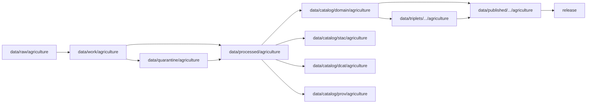

<!-- [KFM_META_BLOCK_V2]
doc_id: kfm://doc/data-processed-agriculture-readme
title: data/processed/agriculture/README.md — Agriculture Processed Data Lifecycle README
version: v0.1
type: readme; data-lifecycle-root; processed-stage-guide; agriculture-domain-lane
status: draft; PROPOSED; data-root; processed-stage; agriculture; release-gated; evidence-required
owners: OWNER_TBD — Agriculture steward · Data steward · Pipeline steward · Source steward · Evidence steward · Catalog steward · Policy steward · Release steward · Docs steward
created: NEEDS VERIFICATION — greenfield stub existed before v0.1 expansion
updated: 2026-06-25
policy_label: public-doc; data; processed; agriculture; lifecycle; governed; release-gated
tags: [kfm, data, processed, agriculture, lifecycle, RAW, WORK, QUARANTINE, CATALOG, TRIPLET, PUBLISHED, EvidenceBundle, SourceDescriptor, RunReceipt, AggregationReceipt, ReleaseManifest]
related:
  - ../README.md
  - ../../README.md
  - ../../../docs/doctrine/directory-rules.md
  - ../../../docs/doctrine/lifecycle-law.md
  - ../../../docs/doctrine/trust-membrane.md
  - ../../raw/agriculture/
  - ../../work/agriculture/
  - ../../quarantine/agriculture/
  - ../../catalog/domain/agriculture/README.md
  - ../../catalog/stac/agriculture/
  - ../../catalog/dcat/agriculture/
  - ../../catalog/prov/agriculture/
  - ../../triplets/
  - ../../published/
  - ../../proofs/
  - ../../receipts/
  - ../../registry/
  - ../../../release/
  - ../../../schemas/
  - ../../../policy/
  - ../../../pipelines/
  - ../../../tools/validators/
notes:
  - "This file replaces a greenfield stub at `data/processed/agriculture/README.md`."
  - "`data/processed/agriculture/` is the domain-scoped PROCESSED-stage lane for normalized Agriculture artifacts that are not RAW, WORK, QUARANTINE, CATALOG, TRIPLET, or PUBLISHED."
  - "Processed Agriculture data is not public, not source truth, not proof, not catalog, not release, and not a policy decision by itself."
  - "Promotion from this lane to Agriculture catalog/triplet/published outputs requires validation, provenance, receipts, policy posture, aggregation posture when public-safe aggregation matters, release state, correction path, and rollback target."
  - "Rollback target for this expansion is previous stub blob SHA `44e1f956869641f008fd36aa5ddca1e13fed3355`."
[/KFM_META_BLOCK_V2] -->

<a id="top"></a>

# data/processed/agriculture

> Agriculture-domain PROCESSED lifecycle lane for normalized data artifacts that are no longer RAW or WORK, but are not yet Agriculture catalog records, graph/triplet projections, or published products.

<p>
  
  
  
  
  
</p>

**Status:** draft / PROPOSED  
**Path:** `data/processed/agriculture/README.md`  
**Owning root:** `data/processed/`  
**Domain segment:** `agriculture`  
**Lifecycle stage:** `PROCESSED`  
**Exposure posture:** not public by default; public Agriculture exposure requires governed catalog, aggregation, release, and published-output linkage  
**Truth posture:** CONFIRMED target was a greenfield stub · CONFIRMED `data/processed/` is the PROCESSED-stage lane · CONFIRMED Agriculture catalog lane excludes processed Agriculture datasets back to this path · NEEDS VERIFICATION for actual child inventory, schemas, validators, receipts, aggregation handling, release linkage, and CI enforcement.

**Quick jumps:** [Purpose](#purpose) · [Lifecycle boundary](#lifecycle-boundary) · [Repo fit](#repo-fit) · [Accepted contents](#accepted-contents) · [Exclusions](#exclusions) · [Agriculture processed-data requirements](#agriculture-processed-data-requirements) · [Aggregation and sensitivity guardrails](#aggregation-and-sensitivity-guardrails) · [Evidence ledger](#evidence-ledger) · [Validation checklist](#validation-checklist) · [Rollback](#rollback)

---

## Purpose

`data/processed/agriculture/` holds Agriculture-domain processed artifacts generated after source capture, working transformation, quarantine resolution, cleanup, normalization, alignment, enrichment, aggregation/generalization, or validation steps.

This lane is upstream of Agriculture catalog records, graph/triplet projections, and public-safe published products. It may support downstream Agriculture catalog records, aggregation receipts, reports, tiles, or public-safe releases, but it does not replace any of those governed outputs.

## Lifecycle boundary

```text
RAW -> WORK / QUARANTINE -> PROCESSED -> CATALOG / TRIPLET -> PUBLISHED
```



`data/processed/agriculture/` is a staging lane. It must not be used as the normal public surface.

## Repo fit

| Responsibility | Correct home | Rule |
|---|---|---|
| Agriculture RAW source capture | `data/raw/agriculture/` | Not this lane. |
| Agriculture work/intermediate transforms | `data/work/agriculture/` | Not this lane. |
| Agriculture quarantined or unresolved material | `data/quarantine/agriculture/` | Not this lane. |
| Agriculture normalized processed outputs | `data/processed/agriculture/` | This lane. |
| Agriculture domain catalog records | `data/catalog/domain/agriculture/` | Downstream catalog stage. |
| Agriculture STAC/DCAT/PROV records | `data/catalog/{stac,dcat,prov}/agriculture/` | Downstream catalog projections. |
| Agriculture triplet/graph projections | `data/triplets/.../agriculture/` | Downstream graph stage. |
| Agriculture public-safe products | `data/published/.../agriculture/` | Downstream after release. |
| Agriculture evidence/proof records | `data/proofs/` | EvidenceBundle and proof support. |
| Agriculture receipts | `data/receipts/` | RunReceipt, AggregationReceipt, validation, policy, transform, correction, and release receipts. |
| Agriculture source registry records | `data/registry/` | SourceDescriptor/source-admission records. |
| Agriculture release decisions | `release/` | Publication authority. |
| Agriculture schemas and policy | `schemas/`, `policy/` | Separate roots. |
| Pipelines and validators | `pipelines/`, `tools/validators/`, `tests/` | Not this lane. |

## Accepted contents

Processed Agriculture data may include:

- Normalized crop, field-candidate, crop-rotation, yield-observation, irrigation, conservation-practice, soil-crop suitability, drought-stress, pest-stress, agricultural-economy, or supply-chain derived artifacts.
- Aggregated or generalized derivatives that still require catalog/release review before public use.
- Spatial, temporal, tabular, raster, vector, graph-ready, or report-ready Agriculture artifacts created by governed processing.
- Sidecar metadata needed to interpret processed artifacts when it is not a catalog record, proof bundle, receipt, source registry record, release manifest, policy decision, schema, or code.
- README files explaining local processed-data boundaries.

## Exclusions

Do not store these under `data/processed/agriculture/`:

- Agriculture RAW source files.
- Agriculture WORK/scratch intermediates that have not passed processing gates.
- Agriculture quarantined or unresolved sensitive/rights material.
- Agriculture domain catalog records, STAC records, DCAT records, or PROV records.
- Agriculture triplet/graph publication records.
- EvidenceBundle or proof records.
- RunReceipt, AggregationReceipt, CatalogBuildReceipt, validation receipt, policy receipt, correction receipt, or release receipt records.
- SourceDescriptor/source registry records.
- Release decisions, ReleaseManifest records, rollback cards, withdrawal notices, correction notices, signatures, or release changelogs.
- Published public products.
- Schemas, policy rules, validators, tests, packages, pipelines, app/UI/API code.

## Agriculture processed-data requirements

PROPOSED until concrete schemas and validators are verified:

| Requirement | Meaning |
|---|---|
| Source trace | Processed Agriculture output should trace back to SourceDescriptor or source registry context when source authority matters. |
| Run trace | Processing run, transform, validation, and tool/version context should have receipt linkage. |
| Stable identity | Processed Agriculture artifacts should have stable IDs or content digests where practical. |
| Evidence linkage | Claims derived from processed Agriculture outputs should be backed by EvidenceBundle/proof context downstream. |
| Aggregation posture | Public-safe aggregate Agriculture products should resolve aggregation handling before publication. |
| Sensitivity posture | Farm/operator/parcel, private yield, pesticide-record, proprietary, or sensitive joins must fail closed until reviewed. |
| Catalog readiness | Processed outputs intended for discovery should promote through Agriculture catalog lanes, not directly to public use. |
| Release readiness | Public use requires release state, published output path, correction path, and rollback target. |

## Aggregation and sensitivity guardrails

- Processed Agriculture artifacts are not field truth merely because they have been normalized.
- Aggregation may be load-bearing for public Agriculture products; aggregation support should be traceable before release.
- Farm/operator/parcel, private-yield, pesticide-record, and proprietary or private-sensitive joins fail closed until policy and review allow an appropriate representation.
- Crop Data Layer, stress indicators, and aggregate statistics should retain source-role distinctions; they must not be promoted as stronger evidence than their source role supports.
- Unreleased processed Agriculture artifacts are not public merely because they exist under this directory.

## Evidence ledger

| Source | Status | Supports | Limits |
|---|---|---|---|
| Previous file | CONFIRMED | Target existed as a greenfield stub. | Did not define Agriculture PROCESSED-stage boundaries. |
| `data/processed/README.md` | CONFIRMED | Parent processed lane is upstream of catalog, triplets, and publication and is not public by default. | Does not prove child inventory under `data/processed/agriculture/`. |
| `data/catalog/domain/agriculture/README.md` | CONFIRMED | Agriculture catalog lane places Agriculture processed datasets under `data/processed/agriculture/` and keeps catalog records downstream. | Does not prove processed schemas, validators, receipts, or actual inventory. |
| `data/README.md` | CONFIRMED | `data/` is the lifecycle data root and excludes code, schemas, policy rules, and release decisions. | Does not prove runtime enforcement. |
| `docs/doctrine/directory-rules.md` | CONFIRMED doctrine / PROPOSED path specifics | Root folders encode responsibility and data uses lifecycle phases. | Does not prove runtime enforcement. |

## Validation checklist

- [ ] Confirm actual child directories under `data/processed/agriculture/`.
- [ ] Confirm accepted Agriculture source/domain path convention.
- [ ] Confirm Agriculture processed artifact schemas or contracts.
- [ ] Confirm Agriculture processed validators and CI checks.
- [ ] Confirm SourceDescriptor/source registry linkage.
- [ ] Confirm RunReceipt, transform receipt, validation receipt, AggregationReceipt, policy posture, correction path, and rollback target where applicable.
- [ ] Confirm no RAW, WORK, QUARANTINE, CATALOG, TRIPLET, PUBLISHED, proof, receipt, release, schema, policy, or code artifacts are misplaced here.
- [ ] Confirm promotion flow from processed Agriculture data to catalog/triplet/published outputs is governed and reversible.

## Rollback

Rollback is required if this lane becomes an Agriculture source-data root, quarantine bypass, proof store, receipt store, catalog root, triplet root, source-registry root, release-decision root, published-output root, schema root, policy root, validator root, implementation root, public API shortcut, or public exposure shortcut.

Rollback target for this expansion: previous stub blob SHA `44e1f956869641f008fd36aa5ddca1e13fed3355`.

<p align="right"><a href="#top">Back to top</a></p>
