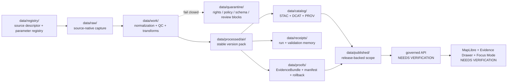

<!-- [KFM_META_BLOCK_V2]
doc_id: kfm://doc/NEEDS-VERIFICATION-UUID
title: data/processed/air/
type: standard
version: v1
status: draft
owners: @bartytime4life
created: 2026-05-01
updated: 2026-05-01
policy_label: NEEDS_VERIFICATION
related: [../README.md, ../../README.md, ../../raw/README.md, ../../work/README.md, ../../quarantine/README.md, ../../registry/README.md, ../../catalog/README.md, ../../receipts/README.md, ../../proofs/README.md, ../../published/README.md, ../../../docs/domains/atmosphere/README.md, ../../../schemas/contracts/v1/atmosphere/, ../../../policy/atmosphere/]
tags: [kfm, data, processed, air, atmosphere, lifecycle, evidence, readme]
notes: [Requested target is data/processed/air/README.md; attached KFM atmosphere doctrine usually uses the wider lane name atmosphere; live repo checkout was not mounted in this session; verify owner, policy label, related paths, and whether air is an alias or narrow processed leaf before merge.]
[/KFM_META_BLOCK_V2] -->

<a id="top"></a>

# `data/processed/air/`

Processed-zone guide for stable, evidence-linked air-quality and air-context dataset versions in KFM.

> **Status:** experimental  
> **Doc state:** draft  
> **Owners:** `@bartytime4life` `NEEDS VERIFICATION`  
> **Path target:** `data/processed/air/README.md`  
> **Repo fit:** [`../README.md`](../README.md) → `data/processed/air/` → [`../../catalog/README.md`](../../catalog/README.md) · [`../../receipts/README.md`](../../receipts/README.md) · [`../../proofs/README.md`](../../proofs/README.md) · [`../../published/README.md`](../../published/README.md)  
>        
> **Quick jump:** [Scope](#scope) · [Repo fit](#repo-fit) · [Accepted inputs](#accepted-inputs) · [Exclusions](#exclusions) · [Directory tree](#directory-tree) · [Quickstart](#quickstart) · [Usage](#usage) · [Diagram](#diagram) · [Tables](#tables) · [Task list](#task-list) · [FAQ](#faq) · [Appendix](#appendix)

> [!IMPORTANT]
> `data/processed/air/` is **not** a public endpoint.
>
> It is a stable processed-artifact holding area. Public clients, map popups, exports, Focus Mode, and Evidence Drawer surfaces should resolve air claims through governed APIs, catalog closure, release state, and EvidenceBundle-backed proof paths.

---

## Scope

This README governs the requested processed-zone leaf:

```text
data/processed/air/
```

Use it for **stable, versioned, replayable air artifacts** after source intake, normalization, quality checks, rights review, and evidence-linking have produced an inspectable dataset version.

### Naming note: `air` versus `atmosphere`

| Name | Status | How this README treats it |
| --- | --- | --- |
| `air` | **CONFIRMED request target** | The requested processed leaf for air-quality and air-context version packs. |
| `atmosphere` | **CONFIRMED corpus term / NEEDS VERIFICATION in repo** | The wider KFM lane name used for air quality, smoke, climate context, Earth-observation context, visibility, emissions, and meteorological support. |
| `data/processed/air/` ↔ `data/processed/atmosphere/` | **NEEDS VERIFICATION** | Do not silently maintain both as authoritative. Resolve by ADR or repo convention before merge. |

### This path is for

- stable processed **air-quality observations**
- normalized **site/station** artifacts
- processed **AQI report** artifacts, where AQI remains an index/report, not a concentration
- processed **model field** artifacts, where model outputs remain labeled as model fields
- processed **remote-sensing masks or optical context** artifacts, where AOD/smoke masks are not collapsed into surface PM2.5
- processed **derived/fusion products**, when inputs, assumptions, uncertainty, and EvidenceRefs are preserved
- version-local README, manifest, checksum, method, caveat, rights, and citation memory

### This path is not for

- raw source captures
- work-in-progress transforms
- rights-unclear or sensitivity-blocked materials
- live emergency alerting
- source registry authority
- release proof packs
- public serving shortcuts
- AI-generated summaries detached from EvidenceBundle resolution

[Back to top](#top)

---

## Repo fit

**Path:** `data/processed/air/README.md`

### Upstream and lateral surfaces

| Relation | Surface | Use |
| --- | --- | --- |
| Parent zone | [`../README.md`](../README.md) | Processed-zone policy and stable version-pack expectations. |
| Data root | [`../../README.md`](../../README.md) | Overall data lifecycle and zone boundaries. |
| Source intake | [`../../raw/README.md`](../../raw/README.md) | Immutable source-native captures and acquisition evidence. |
| Transform staging | [`../../work/README.md`](../../work/README.md) | Normalization, unit conversion, QC, conflict preparation, and transform work. |
| Blocked material | [`../../quarantine/README.md`](../../quarantine/README.md) | Rights, policy, schema, source-role, or review blockers. |
| Source identity | [`../../registry/README.md`](../../registry/README.md) | Source descriptors, parameter registries, rights status, and source roles. |

### Downstream closure surfaces

| Relation | Surface | Use |
| --- | --- | --- |
| Catalog closure | [`../../catalog/README.md`](../../catalog/README.md) | STAC, DCAT, PROV, and catalog matrix records. |
| Process memory | [`../../receipts/README.md`](../../receipts/README.md) | Run receipts, validation reports, dryrun memory, and replay references. |
| Release evidence | [`../../proofs/README.md`](../../proofs/README.md) | EvidenceBundle, ReleaseManifest, CatalogMatrix, DecisionEnvelope, rollback references. |
| Materialized release | [`../../published/README.md`](../../published/README.md) | Public-safe or steward-facing release scopes after promotion. |
| UI/API surfaces | `../../../apps/` `NEEDS VERIFICATION` | Governed API, MapLibre layers, Evidence Drawer payloads, Focus Mode outcomes. |

### Control-plane surfaces to verify

| Surface | Expected role | Verification state |
| --- | --- | --- |
| `../../../docs/domains/atmosphere/` | Atmosphere/air domain docs, runbooks, source-role boundaries, promotion/rollback notes. | **NEEDS VERIFICATION** |
| `../../../schemas/contracts/v1/atmosphere/` | Machine-readable schemas for atmosphere/air objects. | **NEEDS VERIFICATION** |
| `../../../policy/atmosphere/` | Backend/CI policy gates and deny reason codes. | **NEEDS VERIFICATION** |
| `../../../tests/atmosphere/` | Offline fixture, schema, policy, dryrun, and regression tests. | **NEEDS VERIFICATION** |

> [!NOTE]
> Treat checked-in repo evidence as the source of truth for what exists now. This README is designed to fit KFM doctrine and adjacent README style, but it does not prove that `air/`, `atmosphere/`, schemas, policies, tests, or runtime bindings already exist.

[Back to top](#top)

---

## Accepted inputs

Artifacts belong here only when they are stable enough to be versioned, inspected, linked, and carried forward without pretending to be published truth.

| Accepted input | Why it belongs here | Typical shape |
| --- | --- | --- |
| Processed air observation version pack | Holds normalized, QC-reviewed observation outputs after upstream raw/work stages. | `data/processed/air/<dataset>/<version>/` |
| Processed station/site inventory | Keeps station/site metadata stable for the processed dataset version. | `sites.json`, `sites.parquet`, `site_manifest.json` |
| Processed AQI report artifact | Preserves AQI/report semantics without treating index values as concentrations. | `aqi_report.json`, `aqi_report.parquet` |
| Processed model-field artifact | Keeps modeled atmospheric fields labeled as model outputs with method and caveat metadata. | `model_field.zarr`, `model_field.parquet`, `model_field_manifest.json` |
| Remote-sensing mask or context artifact | Preserves smoke/AOD/visibility context without collapsing it into observed surface exposure. | `remote_mask.geojson`, `aod_context.tif`, `visibility_context.parquet` |
| Derived/fusion product | Carries derived consensus or grid products when inputs, EvidenceRefs, uncertainty, and assumptions are explicit. | `fusion_product.parquet`, `fusion_grid.pmtiles`, `method.md` |
| `README.md` per version pack | Human-readable scope, method, caveats, temporal support, rights, and citation memory. | `README.md` |
| `manifest.json` | Machine-readable inventory of processed files, input refs, hashes, and linked closure surfaces. | `manifest.json` |
| `SHA256SUMS.txt` | Integrity anchor for the version pack contents. | `SHA256SUMS.txt` |
| Rights/license note | Keeps rights posture close to the version pack. | `LICENSE.txt`, `RIGHTS.md`, SPDX-compatible field in manifest |
| Links to receipts/proofs/catalog | Keeps the version pack traceable without copying every proof object locally. | Relative links or manifest refs |

[Back to top](#top)

---

## Exclusions

| Exclusion | Put it under or behind | Why |
| --- | --- | --- |
| Raw source captures, API responses, source-native files | [`../../raw/README.md`](../../raw/README.md) | Raw evidence should remain source-native and immutable. |
| Transform scratch, intermediate joins, temporary QC output | [`../../work/README.md`](../../work/README.md) | Processed is not a scratchpad. |
| Rights-unclear, schema-failing, source-role-conflicted, or review-blocked material | [`../../quarantine/README.md`](../../quarantine/README.md) | KFM fails closed when rights, source role, evidence, or policy are unresolved. |
| Source descriptors and parameter registries | [`../../registry/README.md`](../../registry/README.md) | Source identity belongs in the registry, not inside a dataset pack. |
| Policy bundles and deny-reason logic | `../../../policy/atmosphere/` `NEEDS VERIFICATION` | Policy must remain executable, reviewable, and not folder-local folklore. |
| Schemas/contracts | `../../../schemas/contracts/v1/atmosphere/` `NEEDS VERIFICATION` | Keep machine-contract authority singular. |
| STAC/DCAT/PROV catalog records | [`../../catalog/README.md`](../../catalog/README.md) | Catalog closure should remain discoverable and cross-release aware. |
| Run receipts and validation reports | [`../../receipts/README.md`](../../receipts/README.md) | Receipts are process memory, not the processed dataset itself. |
| Evidence bundles, release manifests, attestations, rollback cards | [`../../proofs/README.md`](../../proofs/README.md) | Release proof must stay grouped by release/promotion context. |
| Public-safe materialized outputs | [`../../published/README.md`](../../published/README.md) | Publication follows promotion; processed files are not public by default. |
| Secrets, tokens, API keys, credentials | Environment or secret store | This zone is versionable evidence, not secret storage. |
| Emergency instructions or life-safety guidance | Official public alerting systems and source agencies | KFM air artifacts can carry evidence context; they are not emergency alert authority. |
| AQI rewritten as concentration | Nowhere | AQI is an index/reporting product, not a pollutant concentration unit. |
| AOD or smoke masks rewritten as surface PM2.5 without assumptions/model support | Nowhere | Optical and mask products require method and assumption boundaries. |

> [!CAUTION]
> A clean processed file can still be **unpublishable**. Catalog closure, source-role checks, rights, EvidenceRefs, review state, proof objects, and promotion state still matter.

[Back to top](#top)

---

## Directory tree

### Requested target shape

`NEEDS VERIFICATION`: the live checkout was not mounted in this session, so this is the requested target shape, not a confirmed current tree.

```text
data/processed/
├── README.md
└── air/
    └── README.md
```

### Doctrine-aligned version-pack shape

Use one stable version pack per dataset version. Do not scatter related outputs across unversioned folder fragments.

```text
data/processed/air/
├── README.md
└── <dataset_slug>/
    └── <version>/
        ├── README.md
        ├── manifest.json
        ├── SHA256SUMS.txt
        ├── METHOD.md
        ├── RIGHTS.md
        ├── CITATION.cff
        └── <processed-artifacts...>
```

### Closure shape

Processed packs should point outward to catalog, receipt, proof, and release surfaces.

```text
data/
├── processed/air/<dataset_slug>/<version>/
├── catalog/
│   ├── stac/
│   ├── dcat/
│   └── prov/
├── receipts/
├── proofs/
└── published/
```

### Naming conflict to resolve before merge

```text
data/processed/air/          # requested target leaf
data/processed/atmosphere/   # name used in attached atmosphere architecture plan
```

> [!WARNING]
> Do not let `air/` and `atmosphere/` become parallel authorities for the same processed objects. Pick one canonical home or create an explicit alias/migration note.

[Back to top](#top)

---

## Quickstart

### 1) Inspect the live checkout first

```bash
# Verify the requested target and nearby lifecycle docs.
find data/processed -maxdepth 5 -print 2>/dev/null | sort

for p in \
  data/README.md \
  data/processed/README.md \
  data/raw/README.md \
  data/work/README.md \
  data/quarantine/README.md \
  data/registry/README.md \
  data/catalog/README.md \
  data/receipts/README.md \
  data/proofs/README.md \
  data/published/README.md
do
  test -f "$p" && { echo; echo "== $p =="; sed -n '1,220p' "$p"; }
done
```

### 2) Check the air/atmosphere naming boundary

```bash
# Detect whether the checkout already uses air, atmosphere, or both.
find data -maxdepth 5 \
  \( -path '*/air*' -o -path '*/atmosphere*' \) \
  -print 2>/dev/null | sort

find docs schemas contracts policy tests tools apps packages -maxdepth 5 \
  \( -path '*/air*' -o -path '*/atmosphere*' \) \
  -print 2>/dev/null | sort
```

### 3) Create a version pack

Illustrative scaffold only; adapt names to the repo’s verified conventions.

```bash
dataset_slug="pm25_observations"
version="YYYY-MM-DD-or-semver"

mkdir -p "data/processed/air/${dataset_slug}/${version}"
touch "data/processed/air/${dataset_slug}/${version}/README.md"
touch "data/processed/air/${dataset_slug}/${version}/manifest.json"
touch "data/processed/air/${dataset_slug}/${version}/SHA256SUMS.txt"
touch "data/processed/air/${dataset_slug}/${version}/METHOD.md"
touch "data/processed/air/${dataset_slug}/${version}/RIGHTS.md"
```

### 4) Inspect proof-shaped links before claiming readiness

```bash
# Look for closure evidence without assuming it exists.
find data/catalog data/receipts data/proofs data/published -maxdepth 6 -type f \
  \( -iname '*air*' -o -iname '*atmosphere*' -o -iname '*manifest*' -o -iname '*receipt*' -o -iname '*proof*' -o -iname '*.json' -o -iname '*.jsonld' -o -iname '*.yaml' -o -iname '*.yml' \) \
  2>/dev/null | sort | sed -n '1,240p'
```

### 5) Guard against lifecycle leakage

```bash
# Processed packs should not embed raw/work/quarantine paths as public-serving shortcuts.
grep -RInE 'data/(raw|work|quarantine)/|secret|token|password|api[_-]?key' \
  data/processed/air 2>/dev/null || true
```

[Back to top](#top)

---

## Usage

### Version, do not overwrite

A processed air artifact should normally move forward as a new version, not by mutating an old version in place. Corrections should leave visible lineage through manifests, receipts, proofs, and rollback/correction records.

### Preserve source role and knowledge character

A processed artifact must keep enough metadata to distinguish:

- observed sensor readings
- low-cost sensor readings with correction/caveat context
- regulatory archive records
- public AQI reports
- model fields and forecasts
- remote-sensing masks or optical context
- derived/fusion products
- meteorological context

### Keep raw and normalized values visible

For air artifacts, unit handling is part of the evidence story. Preserve raw values and raw units when normalization is performed, and document the transform identity in the version pack or linked receipt.

### Treat time as support, not decoration

Every processed pack should state the temporal support it can actually defend:

- observed time
- received or retrieval time
- valid time
- processing time
- freshness window
- baseline or comparison period, where relevant

### Link, do not duplicate, release evidence

Version packs should link to receipts, catalog objects, and proof packs. Do not copy release proof into processed folders unless the repo has an explicit convention for doing so.

[Back to top](#top)

---

## Diagram



[Back to top](#top)

---

## Tables

### Knowledge-character guardrails

| Artifact character | Allowed in `data/processed/air/`? | Required guardrail |
| --- | --- | --- |
| `OBSERVED_SENSOR` | Yes | Preserve source, site, parameter, unit, time support, QC flags, EvidenceRefs, and raw/normalized values. |
| `LOW_COST_SENSOR` | Yes, with caveats | Include correction method, caveats, confidence, and limitations; do not promote as regulatory truth. |
| `REGULATORY_ARCHIVE` | Yes | Keep archive/source role visible; do not present as live-state unless freshness supports it. |
| `PUBLIC_AQI_REPORT` | Yes | Treat AQI as an index/report; do not convert to concentration. |
| `ATMOSPHERIC_MODEL_FIELD` | Yes | Keep model identity, run time, valid time, assumptions, uncertainty/caveats, and model-card reference. |
| `REMOTE_SENSING_MASK` | Yes | Treat smoke/AOD/optical products as remote-sensing context, not direct surface concentration. |
| `DERIVED_FUSION` | Yes, when supported | Preserve all input EvidenceRefs, uncertainty, fusion method, and disagreement handling. |
| `ALERT_AND_ADVISORY_CONTEXT` | Conditional | Carry official source/valid-time context; do not become emergency alerting or life-safety instructions. |
| Unknown rights or missing source role | No | Move to quarantine or block promotion until resolved. |

### Version-pack minimum fields

| Field | Why it matters | Where to record |
| --- | --- | --- |
| `dataset_id` | Stable version identity. | `manifest.json` |
| `version` | Correction-safe history. | `manifest.json`, folder name |
| `source_refs` | Links processed artifact to source descriptors and raw/work runs. | `manifest.json` |
| `evidence_refs` | Enables EvidenceRef → EvidenceBundle resolution. | `manifest.json` or linked proof |
| `knowledge_character` | Prevents model/observed/AQI/remote-sensing collapse. | `manifest.json`, `README.md` |
| `parameter_ids` | Keeps units and parameter semantics explicit. | `manifest.json`, parameter registry |
| `spatial_support` | Defines geography/support, not just geometry. | `README.md`, `manifest.json` |
| `temporal_support` | Defines valid/observed/processed time. | `README.md`, `manifest.json` |
| `rights_spdx` | Blocks rights-unknown publication. | `RIGHTS.md`, `manifest.json` |
| `transform_spec_hash` | Makes method identity auditable. | `manifest.json`, receipt |
| `sha256` | Verifies artifact integrity. | `SHA256SUMS.txt`, `manifest.json` |
| `catalog_refs` | Connects to STAC/DCAT/PROV closure. | `manifest.json` |
| `receipt_refs` | Connects to process memory. | `manifest.json` |
| `proof_refs` | Connects to release or promotion evidence. | `manifest.json` |

### Path decision matrix

| Decision | Preferred posture | Why |
| --- | --- | --- |
| Keep only `air/` | **PROPOSED when repo confirms air is the lane leaf** | Matches requested target and may keep the processed path concise. |
| Keep only `atmosphere/` | **PROPOSED when repo follows attached atmosphere plan** | Aligns with broader lane scope and existing schema/object names. |
| Keep both with aliases | **Conditional** | Acceptable only with ADR, redirect/alias map, migration notes, and tests. |
| Keep both as independent authorities | **DENY** | Creates source, proof, catalog, and correction drift. |

[Back to top](#top)

---

## Task list

Use this checklist before treating `data/processed/air/` as merged and usable.

- [ ] Verify whether `data/processed/air/` already exists in the live checkout.
- [ ] Verify whether `data/processed/atmosphere/` already exists and whether it conflicts with this target.
- [ ] Confirm `/data/` owner routing and update `owners` if `@bartytime4life` is not current.
- [ ] Confirm policy label for this README and processed air artifacts.
- [ ] Resolve `air` versus `atmosphere` naming by repo convention or ADR.
- [ ] Confirm schema authority: `schemas/contracts/v1/atmosphere/`, `contracts/atmosphere/`, or another repo-native home.
- [ ] Confirm source registry home and source descriptor fields before admitting processed air artifacts.
- [ ] Require `manifest.json`, `SHA256SUMS.txt`, method notes, rights notes, and version-local README for each processed pack.
- [ ] Require source role, knowledge character, EvidenceRefs, temporal support, spatial support, rights posture, and transform identity.
- [ ] Add or link offline fixture tests for valid and invalid air/atmosphere processed packs.
- [ ] Add policy denial tests for missing evidence, missing source role, unknown rights public release, model-as-observed, AQI-as-concentration, and AOD-as-PM2.5.
- [ ] Verify catalog closure before promotion.
- [ ] Verify receipts and proof references before published or API-facing release.
- [ ] Confirm MapLibre layer descriptors and Evidence Drawer payloads consume governed release artifacts, not this folder directly.
- [ ] Record rollback/correction references for any promoted version.

[Back to top](#top)

---

## FAQ

### Is `data/processed/air/` public?

No. Processed artifacts are stable and closer to release than `raw/`, `work/`, or `quarantine/`, but public exposure still requires catalog closure, policy checks, review, proof objects, promotion, and governed access.

### Can a MapLibre layer read directly from this folder?

Normal public or UI surfaces should not depend on direct processed-folder access. A layer should be backed by released artifacts, catalog records, layer descriptors, and EvidenceBundle-resolving governed APIs.

### Can AQI values live here?

Yes, when they remain labeled as AQI/report products. Do not treat AQI as a concentration or silently convert it into pollutant units.

### Can model outputs live here?

Yes, when they remain labeled as model fields or forecasts with model identity, run time, valid time, uncertainty/caveats, and EvidenceRefs.

### Can smoke masks, AOD, or satellite-derived context live here?

Yes, if they remain remote-sensing/optical/context artifacts. Do not treat them as observed surface PM2.5 without an explicit model, assumptions, validation, and source-role disclosure.

### What happens when source rights are unknown?

Do not publish. Either keep the candidate out of processed, move it to quarantine, or block promotion until rights are verified and recorded.

### What is the smallest good first version pack?

A small offline fixture pack is enough: one processed observation artifact, one site artifact, one manifest, checksums, method and rights notes, linked receipt/proof placeholders, and tests that prove invalid cases fail closed.

[Back to top](#top)

---

## Appendix

<details>
<summary><strong>Illustrative manifest skeleton</strong></summary>

```json
{
  "dataset_id": "air.pm25_observations",
  "version": "YYYY-MM-DD-or-semver",
  "status": "processed_candidate",
  "knowledge_character": "OBSERVED_SENSOR",
  "source_refs": [
    "kfm://source/NEEDS-VERIFICATION"
  ],
  "evidence_refs": [
    "kfm://evidence/NEEDS-VERIFICATION"
  ],
  "parameter_ids": [
    "pm25"
  ],
  "spatial_support": {
    "type": "site_observation",
    "crs": "NEEDS_VERIFICATION",
    "geometry_policy": "public_safe_after_promotion"
  },
  "temporal_support": {
    "observed_at": "YYYY-MM-DDTHH:MM:SSZ",
    "processed_at": "YYYY-MM-DDTHH:MM:SSZ",
    "freshness_status": "NEEDS_VERIFICATION"
  },
  "rights": {
    "rights_spdx": "NEEDS_VERIFICATION",
    "public_release_allowed": false,
    "verification_status": "UNKNOWN"
  },
  "transforms": {
    "transform_spec_hash": "NEEDS_VERIFICATION",
    "unit_policy": "raw_and_normalized_values_preserved"
  },
  "artifacts": [
    {
      "path": "observations.parquet",
      "sha256": "NEEDS_VERIFICATION",
      "media_type": "application/vnd.apache.parquet"
    }
  ],
  "closure_refs": {
    "catalog": [],
    "receipts": [],
    "proofs": []
  },
  "notes": [
    "Illustrative only. Replace placeholders after source, schema, rights, and repo conventions are verified."
  ]
}
```

</details>

<details>
<summary><strong>Per-version README checklist</strong></summary>

A version-local `README.md` should answer:

1. What artifact version is this?
2. Which source descriptor(s) and source role(s) does it depend on?
3. What knowledge character is represented?
4. What was normalized, corrected, filtered, or derived?
5. What raw values and raw units were preserved?
6. What CRS, geometry support, and spatial generalization rules apply?
7. What temporal support applies?
8. What rights, attribution, and release restrictions apply?
9. What caveats, station-health issues, source disagreements, or uncertainty remain?
10. Which catalog, receipt, proof, and promotion objects should reviewers inspect?

</details>

<details>
<summary><strong>Promotion review questions</strong></summary>

- Does every consequential artifact resolve to EvidenceRefs?
- Are source roles visible and correct?
- Are rights verified enough for the requested release class?
- Are AQI, model fields, AOD, smoke masks, and fusion products labeled without collapse?
- Are QC failures, exclusions, and disagreements preserved rather than silently erased?
- Do catalog objects and proof objects point to the same version?
- Is there a rollback or correction target?
- Is any public surface bypassing governed APIs or released artifacts?

</details>

[Back to top](#top)
