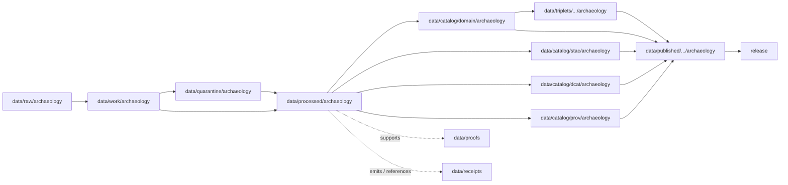

<!-- [KFM_META_BLOCK_V2]
doc_id: kfm://doc/data-processed-archaeology-readme
title: data/processed/archaeology/README.md — Archaeology Processed Data Lifecycle README
version: v0.1
type: readme; data-lifecycle-root; processed-stage-guide; archaeology-domain-lane
status: draft; PROPOSED; data-root; processed-stage; archaeology; release-gated; sensitivity-deny-default
owners: OWNER_TBD — Archaeology steward · Data steward · Pipeline steward · Source steward · Evidence steward · Policy steward · Release steward · Cultural review steward · Docs steward
created: NEEDS VERIFICATION — greenfield stub existed before v0.1 expansion
updated: 2026-06-25
policy_label: public-doc; data; processed; archaeology; lifecycle; governed; release-gated; sensitivity-deny-default
tags: [kfm, data, processed, archaeology, cultural-heritage, lifecycle, RAW, WORK, QUARANTINE, CATALOG, TRIPLET, PUBLISHED, EvidenceBundle, ReviewRecord, RedactionReceipt, PublicationTransformReceipt, ReleaseManifest]
related:
  - ../README.md
  - ../../README.md
  - ../../../docs/doctrine/directory-rules.md
  - ../../../docs/doctrine/lifecycle-law.md
  - ../../../docs/doctrine/trust-membrane.md
  - ../../raw/archaeology/
  - ../../work/archaeology/
  - ../../quarantine/archaeology/
  - ../../catalog/domain/archaeology/README.md
  - ../../catalog/stac/archaeology/
  - ../../catalog/dcat/archaeology/
  - ../../catalog/prov/archaeology/
  - ../../triplets/
  - ../../published/
  - ../../proofs/
  - ../../receipts/
  - ../../registry/
  - ../../../release/
  - ../../../schemas/
  - ../../../policy/
  - ../../../policy/sensitivity/archaeology/
  - ../../../pipelines/
  - ../../../tools/validators/
notes:
  - "This file replaces a greenfield stub at `data/processed/archaeology/README.md`."
  - "`data/processed/archaeology/` is the domain-scoped PROCESSED-stage lane for normalized Archaeology artifacts that are not RAW, WORK, QUARANTINE, CATALOG, TRIPLET, or PUBLISHED."
  - "Processed Archaeology data is not public, not source truth, not proof, not catalog, not release, and not a policy decision by itself."
  - "Archaeology fails closed by default for exact site geometry, burial/human-remains context, sacred sites, looting-risk exposure, collection security, and private-landowner detail."
  - "Promotion from this lane to Archaeology catalog/triplet/published outputs requires validation, provenance, receipts, policy posture, cultural/steward review when required, release state, correction path, and rollback target."
  - "Rollback target for this expansion is previous stub blob SHA `a81636d2ffa21764eb228321cebbff658519b180`."
[/KFM_META_BLOCK_V2] -->

<a id="top"></a>

# data/processed/archaeology

> Archaeology-domain PROCESSED lifecycle lane for normalized artifacts that have moved beyond source capture and working transforms, but are not yet catalog records, graph/triplet projections, proof bundles, release decisions, or public-safe products.

<p>
  
  
  
  
  
  
</p>

**Status:** draft / PROPOSED  
**Owners:** OWNER_TBD — Archaeology steward · Data steward · Pipeline steward · Source steward · Evidence steward · Policy steward · Release steward · Cultural review steward · Docs steward  
**Path:** `data/processed/archaeology/README.md`  
**Owning root:** `data/processed/`  
**Domain segment:** `archaeology`  
**Lifecycle stage:** `PROCESSED`  
**Exposure posture:** not public by default; public archaeology exposure requires governed catalog, proof, sensitivity transform, cultural/steward review where required, release, correction, and rollback linkage  
**Truth posture:** CONFIRMED target was a greenfield stub · CONFIRMED parent `data/processed/` lane is upstream of catalog/triplet/publication · CONFIRMED archaeology domain docs require exact-location denial by default · PROPOSED processed-lane details · NEEDS VERIFICATION for actual child inventory, schemas, validators, receipts, CI enforcement, and release linkage.

**Quick jumps:** [Purpose](#purpose) · [Lifecycle boundary](#lifecycle-boundary) · [Repo fit](#repo-fit) · [Accepted contents](#accepted-contents) · [Exclusions](#exclusions) · [Archaeology processed-data requirements](#archaeology-processed-data-requirements) · [Sensitivity guardrails](#sensitivity-guardrails) · [Evidence ledger](#evidence-ledger) · [Validation checklist](#validation-checklist) · [Rollback](#rollback)

---

## Purpose

`data/processed/archaeology/` holds Archaeology-domain processed artifacts generated after source capture, working transformation, quarantine resolution, cleanup, normalization, alignment, enrichment, redaction/generalization, or validation steps.

This lane is upstream of Archaeology catalog records, graph/triplet projections, and public-safe published products. It may support downstream catalog records, sensitivity transforms, EvidenceBundle-backed claims, generalized map layers, reports, tiles, or release packages, but it does not replace any of those governed outputs.

> [!IMPORTANT]
> Processed Archaeology data is not public truth merely because it exists here. Public-facing map layers, APIs, downloads, Focus Mode answers, dashboards, and story nodes must consume governed catalog/proof/release surfaces, not this directory as the normal public path.

## Lifecycle boundary

```text
RAW -> WORK / QUARANTINE -> PROCESSED -> CATALOG / TRIPLET -> PUBLISHED
```



`data/processed/archaeology/` is a staging lane. It must not be used as the normal public surface.

## Repo fit

| Responsibility | Correct home | Rule |
|---|---|---|
| Archaeology RAW source capture | `data/raw/archaeology/` | Not this lane. |
| Archaeology work/intermediate transforms | `data/work/archaeology/` | Not this lane. |
| Archaeology quarantined or unresolved material | `data/quarantine/archaeology/` | Not this lane. |
| Archaeology normalized processed outputs | `data/processed/archaeology/` | This lane. |
| Archaeology domain catalog records | `data/catalog/domain/archaeology/` | Downstream catalog stage. |
| Archaeology STAC/DCAT/PROV records | `data/catalog/{stac,dcat,prov}/archaeology/` | Downstream catalog projections, if accepted. |
| Archaeology triplet/graph projections | `data/triplets/.../archaeology/` | Downstream graph stage. |
| Archaeology public-safe products | `data/published/.../archaeology/` | Downstream after release. |
| Archaeology evidence/proof records | `data/proofs/` | EvidenceBundle and proof support. |
| Archaeology receipts and review records | `data/receipts/` or accepted review/receipt roots | RedactionReceipt, PublicationTransformReceipt, ReviewRecord, RunReceipt, validation receipts. |
| Archaeology source registry records | `data/registry/` | SourceDescriptor/source-admission records. |
| Archaeology release decisions | `release/` | Publication authority. |
| Archaeology schemas and policy | `schemas/`, `policy/`, `policy/sensitivity/archaeology/` | Separate roots. |
| Pipelines and validators | `pipelines/`, `tools/validators/`, `tests/` | Not this lane. |

## Accepted contents

Processed Archaeology data may include:

- Normalized survey-project, survey-transect, site-candidate, site-component, artifact-record, provenience-context, excavation-unit, stratigraphic-unit, collection-repository, chronology-assertion, geophysics-observation, remote-sensing-anomaly, LiDAR-candidate, 3D-documentation, or public-safe generalized derivative artifacts.
- Sensitivity-transformed or generalized derivatives that still require catalog/release review before public use.
- Spatial, temporal, tabular, raster, vector, graph-ready, or report-ready Archaeology artifacts created by governed processing.
- Candidate feature products that remain explicitly labeled as candidates and never as confirmed sites without required review.
- Sidecar metadata needed to interpret processed artifacts when it is not a catalog record, proof bundle, receipt, source registry record, release manifest, policy decision, schema, or code.
- README files explaining local processed-data boundaries.

## Exclusions

Do not store these under `data/processed/archaeology/`:

- Archaeology RAW source files.
- Archaeology WORK/scratch intermediates that have not passed processing gates.
- Archaeology quarantined or unresolved sensitive/rights/cultural material.
- Archaeology domain catalog records, STAC records, DCAT records, or PROV records.
- Archaeology triplet/graph publication records.
- EvidenceBundle or proof records.
- RunReceipt, TransformReceipt, ValidationReceipt, RedactionReceipt, PublicationTransformReceipt, ReviewRecord, PolicyReceipt, CatalogBuildReceipt, correction receipt, or release receipt records.
- SourceDescriptor/source registry records.
- Release decisions, ReleaseManifest records, rollback cards, withdrawal notices, correction notices, signatures, or release changelogs.
- Published public products.
- Schemas, policy rules, validators, tests, packages, pipelines, app/UI/API code.
- Public-readable exact site coordinates, sacred-site geometry, burial/human-remains location detail, collection-security detail, looting-risk detail, or private-landowner detail.

## Archaeology processed-data requirements

PROPOSED until concrete schemas and validators are verified:

| Requirement | Meaning |
|---|---|
| Source trace | Processed Archaeology output should trace back to SourceDescriptor or source registry context when source authority matters. |
| Run trace | Processing run, transform, validation, and tool/version context should have receipt linkage. |
| Stable identity | Processed Archaeology artifacts should have stable IDs or content digests where practical. |
| Candidate labeling | CandidateFeature, RemoteSensingAnomaly, and LiDARCandidate artifacts must remain visibly candidate-class until confirmed by evidence and review. |
| Evidence linkage | Claims derived from processed Archaeology outputs should be backed by EvidenceBundle/proof context downstream. |
| Review linkage | Cultural/steward review state should be referenced when required before catalog or release promotion. |
| Sensitivity transform | Public-safe derivatives should resolve redaction/generalization posture before publication. |
| Policy posture | Exact site geometry, burial/human-remains, sacred-site, looting-risk, collection-security, and private-landowner details must fail closed unless policy and review allow an appropriate representation. |
| Catalog readiness | Processed outputs intended for discovery should promote through Archaeology catalog lanes, not directly to public use. |
| Release readiness | Public use requires release state, published output path, correction path, and rollback target. |

## Sensitivity guardrails

- Processed Archaeology artifacts are not site truth merely because they have been normalized.
- Candidate features and remote-sensing anomalies must not be presented as confirmed archaeological sites without evidence and steward review.
- Exact archaeological-site geometry, burial/human-remains context, sacred-site information, collection-security detail, looting-risk detail, and private-landowner information fail closed by default.
- Public products should use reviewed redacted/generalized outputs rather than precise restricted source material.
- Rights, cultural review, steward authority, sovereignty-sensitive obligations, and consent-sensitive records remain separate governance concerns.
- Unreleased processed Archaeology artifacts are not public merely because they exist under this directory.

> [!CAUTION]
> A processed Archaeology file must not become a sensitivity bypass. If rights, cultural review, source terms, consent, site sensitivity, geometry precision, or public representation is unclear, keep the artifact unpublished, quarantine it if necessary, and require steward review before downstream catalog or release promotion.

## Evidence ledger

| Source | Status | Supports | Limits |
|---|---|---|---|
| Previous file | CONFIRMED | Target existed as a greenfield stub. | Did not define Archaeology PROCESSED-stage boundaries. |
| `data/processed/README.md` | CONFIRMED | Parent processed lane is upstream of catalog, triplets, and publication and is not public by default. | Does not prove child inventory under `data/processed/archaeology/`. |
| `data/catalog/domain/archaeology/README.md` | CONFIRMED | Archaeology catalog lane places processed Archaeology datasets upstream and keeps catalog records downstream; sensitivity posture fails closed. | Does not prove processed schemas, validators, receipts, or actual inventory. |
| `docs/domains/archaeology/README.md` | CONFIRMED doctrine / PROPOSED implementation | Archaeology scope, object families, sensitivity posture, exact-location denial, and lane pattern. | Implementation maturity and runtime behavior remain NEEDS VERIFICATION. |
| `docs/domains/archaeology/MISSING_OR_PLANNED_FILES.md` | CONFIRMED planning ledger / PROPOSED realization | Archaeology expected lane shape and fail-closed path creation warning. | Path promotion requires mounted-repo evidence. |
| `data/README.md` | CONFIRMED | `data/` is the lifecycle data root and excludes code, schemas, policy rules, and release decisions. | Does not prove runtime enforcement. |
| `docs/doctrine/directory-rules.md` | CONFIRMED doctrine / PROPOSED path specifics | Root folders encode responsibility and data uses lifecycle phases. | Does not prove runtime enforcement. |

## Validation checklist

- [ ] Confirm actual child directories under `data/processed/archaeology/`.
- [ ] Confirm accepted Archaeology source/domain path convention.
- [ ] Confirm Archaeology processed artifact schemas or contracts.
- [ ] Confirm Archaeology processed validators and CI checks.
- [ ] Confirm SourceDescriptor/source registry linkage.
- [ ] Confirm RunReceipt, TransformReceipt, ValidationReceipt, RedactionReceipt, PublicationTransformReceipt, ReviewRecord, PolicyReceipt, correction path, and rollback target where applicable.
- [ ] Confirm exact-geometry, burial/human-remains, sacred-site, looting-risk, collection-security, private-landowner, rights, cultural-review, and sovereignty-sensitive handling.
- [ ] Confirm no RAW, WORK, QUARANTINE, CATALOG, TRIPLET, PUBLISHED, proof, receipt, release, schema, policy, or code artifacts are misplaced here.
- [ ] Confirm promotion flow from processed Archaeology data to catalog/triplet/published outputs is governed, reviewed, sensitivity-safe, and reversible.

## Rollback

Rollback is required if this lane becomes an Archaeology source-data root, quarantine bypass, proof store, receipt store, catalog root, triplet root, source-registry root, release-decision root, published-output root, schema root, policy root, validator root, implementation root, public API shortcut, public exposure shortcut, or exact-location/sensitive-data shortcut.

Rollback target for this expansion: previous stub blob SHA `a81636d2ffa21764eb228321cebbff658519b180`.

<p align="right"><a href="#top">Back to top</a></p>
