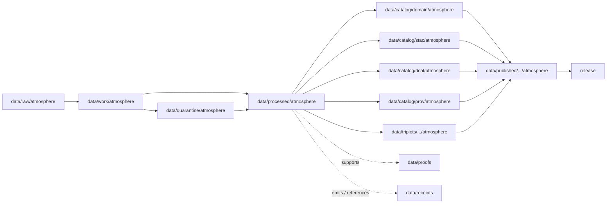

<!-- [KFM_META_BLOCK_V2]
doc_id: kfm://doc/data-processed-atmosphere-readme
title: data/processed/atmosphere/README.md — Atmosphere Processed Data README
version: v0.1
type: readme; data-lifecycle-domain-lane; processed-stage-guide; atmosphere-domain-root; lane-index
status: draft; PROPOSED; data-root; processed-stage; atmosphere; air-quality; weather; smoke; aerosol; climate; model-context; advisory-context; release-gated; source-role-aware
authors: ChatGPT-5.5 Thinking; reviewed_by: OWNER_TBD
owners: OWNER_TBD — Atmosphere steward · Air-quality steward · Weather steward · Climate steward · Forecast/model steward · Data steward · Pipeline steward · Evidence steward · Policy steward · Release steward · Docs steward
created: NEEDS VERIFICATION — greenfield stub existed before v0.1 expansion
updated: 2026-06-25
policy_label: public-doc; data; processed; atmosphere; lifecycle; governed; release-gated
tags: [kfm, data, processed, atmosphere, air, air-quality, weather, smoke, AOD, climate, model-context, advisory-context, RAW, WORK, QUARANTINE, PROCESSED, CATALOG, TRIPLET, PUBLISHED, EvidenceBundle, SourceDescriptor, RunReceipt, ValidationReport, PolicyDecision, ReleaseManifest]
related:
  - ../README.md
  - ../../README.md
  - ../../../docs/domains/atmosphere/README.md
  - ../../../docs/domains/atmosphere/SOURCES.md
  - ../../../data/catalog/domain/atmosphere/README.md
  - ../../../contracts/domains/atmosphere/
  - ../../../schemas/contracts/v1/domains/atmosphere/
  - ../../../policy/domains/atmosphere/
  - ../../../policy/sensitivity/
  - ../../../docs/doctrine/directory-rules.md
  - ../../../docs/doctrine/lifecycle-law.md
  - ../../../docs/doctrine/trust-membrane.md
  - ../../raw/atmosphere/
  - ../../work/atmosphere/
  - ../../quarantine/atmosphere/
  - ../../catalog/domain/atmosphere/README.md
  - ../../catalog/stac/atmosphere/
  - ../../catalog/dcat/atmosphere/
  - ../../catalog/prov/atmosphere/
  - ../../triplets/
  - ../../published/
  - ../../proofs/
  - ../../receipts/
  - ../../registry/
  - ../../../release/
  - ../../../pipelines/
  - ../../../tools/validators/
notes:
  - "This file replaces a greenfield stub at `data/processed/atmosphere/README.md`."
  - "This is the parent PROCESSED-stage domain lane for Atmosphere/Air artifacts. It is not RAW source storage, WORK scratch, QUARANTINE holding, CATALOG, TRIPLET, PUBLISHED, proof storage, release authority, source registry, schema authority, policy authority, public API/UI output, emergency alerting, or life-safety guidance."
  - "Atmosphere processed artifacts must preserve source role, source rights posture, time semantics, units, QA/correction posture, caveats, uncertainty, evidence linkage, policy posture, catalog readiness, release state, correction path, and rollback target before public use."
  - "Atmosphere domain doctrine owns air-quality observations, weather/mesonet observations, smoke/AOD context, climate context, model/advisory context, and public-safe derived products, but it does not own emergency/hazard event truth, hydrology canonical claims, agriculture canonical claims, biodiversity canonical claims, or infrastructure canonical claims."
  - "This README is a parent lane guide and index. Child lane READMEs define local sublane boundaries; contracts define semantic object meaning; schemas define machine shape; policy and release records decide public use."
  - "Rollback target for this expansion is previous greenfield stub blob SHA `070fc82ec479e5c6cacaa7062fdf81e4d539c861`."
[/KFM_META_BLOCK_V2] -->

<a id="top"></a>

# data/processed/atmosphere

> Parent Atmosphere/Air PROCESSED-stage lane for normalized air-quality, weather, smoke/aerosol, climate, forecast/model, advisory-context, regulatory/archive, and public-safe derived artifacts that have passed beyond RAW/WORK/QUARANTINE but are not yet cataloged, triplet-projected, published, or released.

<p>
  
  
  
  
  
  
</p>

**Status:** draft / PROPOSED  
**Owners:** OWNER_TBD — Atmosphere steward · Air-quality steward · Weather steward · Climate steward · Forecast/model steward · Data steward · Pipeline steward · Evidence steward · Policy steward · Release steward · Docs steward  
**Path:** `data/processed/atmosphere/README.md`  
**Owning root:** `data/processed/`  
**Domain segment:** `atmosphere`  
**Lifecycle stage:** `PROCESSED`  
**Exposure posture:** not public by default; public use requires governed catalog, evidence, policy, release, correction, and rollback linkage  
**Truth posture:** CONFIRMED target was a greenfield stub · CONFIRMED parent `data/processed/` says PROCESSED is upstream of catalog, triplet, and publication · CONFIRMED Atmosphere domain doctrine includes air-quality, smoke/aerosol, weather/mesonet, climate, model/advisory context, and public-safe derived products · PROPOSED parent-lane details and lane index · NEEDS VERIFICATION for actual child inventory, validators, receipts, CI enforcement, release linkage, and governed route behavior.

**Quick jumps:** [Purpose](#purpose) · [Lifecycle boundary](#lifecycle-boundary) · [Repo fit](#repo-fit) · [Lane index](#lane-index) · [Accepted contents](#accepted-contents) · [Exclusions](#exclusions) · [Atmosphere processed requirements](#atmosphere-processed-requirements) · [Cross-lane guardrails](#cross-lane-guardrails) · [Evidence ledger](#evidence-ledger) · [Validation checklist](#validation-checklist) · [Rollback](#rollback)

---

## Purpose

`data/processed/atmosphere/` is the parent PROCESSED-stage lane for normalized Atmosphere/Air artifacts. It organizes processed outputs after source capture, extraction, transformation, correction, redaction/generalization, QA, or normalization, while keeping those artifacts upstream of catalog, triplet, publication, release, proof closure, and public access.

This lane may contain or point to processed artifacts for:

- air-quality observations and stations;
- PM2.5 and ozone pollutant-specific observations;
- AQI/report posture and regulatory/archive context;
- smoke, aerosol, AOD, and remote-sensing proxy context;
- weather stations and mesonet/weather observations;
- wind, precipitation, temperature, and related meteorological context;
- forecast/model fields and modeled remote-sensing comparisons;
- climate normals, anomalies, and aggregate climate context;
- advisory/referral context and public-safe derived products.

This parent README does not create a semantic contract, schema, validator, source registry, proof, policy, release decision, public map layer, public tile, public API route, public UI payload, official advisory, or life-safety product.

## Lifecycle boundary

```text
RAW -> WORK / QUARANTINE -> PROCESSED -> CATALOG / TRIPLET -> PUBLISHED
```



`data/processed/atmosphere/` is upstream of catalog, triplet, publication, and release. It must not be used as a normal public map/API/UI/AI source.

## Repo fit

| Responsibility | Correct home | Rule |
|---|---|---|
| Raw Atmosphere source captures, source-native files, station feeds, agency feeds, satellite/model downloads, QA payloads, or logs | `data/raw/atmosphere/` | Not this lane. |
| In-process transforms, parsing, joins, experiments, scratch outputs, notebooks, or temporary QA work | `data/work/atmosphere/` | Not this lane. |
| Rights-unclear, source-role-unclear, stale, malformed, unsupported, disputed, sensitive, or unsafe Atmosphere material | `data/quarantine/atmosphere/` | Not this lane until resolved. |
| Normalized Atmosphere processed artifacts | `data/processed/atmosphere/` | This parent lane and its child lanes. |
| Atmosphere domain catalog records | `data/catalog/domain/atmosphere/` | Downstream catalog stage. |
| Atmosphere STAC/DCAT/PROV records | `data/catalog/{stac,dcat,prov}/atmosphere/` | Downstream catalog projections, if accepted. |
| Atmosphere triplet/graph records | `data/triplets/.../atmosphere/` | Downstream graph stage. |
| Atmosphere public-safe published products | `data/published/.../atmosphere/` | Downstream after release. |
| EvidenceBundle/proof records | `data/proofs/` | Separate proof family. |
| Source, run, model-run, transform, validation, policy, correction, and release receipts | `data/receipts/` | Separate receipt family. |
| SourceDescriptor/source registry records | `data/registry/` | Separate source authority. |
| Release decisions, manifests, rollback cards, corrections, withdrawals | `release/` | Separate publication authority. |
| Atmosphere contracts | `contracts/domains/atmosphere/` | Object meaning; not data. |
| Atmosphere schemas | `schemas/contracts/v1/domains/atmosphere/` | Machine shape; not data. |
| Policy, validators, tests, pipelines, apps, packages | `policy/`, `tools/validators/`, `tests/`, `pipelines/`, `apps/`, `packages/` | Separate roots. |

## Lane index

Known or intended child lanes under `data/processed/atmosphere/` are listed below. Treat entries as **PROPOSED** unless current child READMEs, validators, fixtures, and CI enforcement have been verified in the same implementation pass.

| Lane | Object / family | Purpose | Hard boundary |
|---|---|---|---|
| `advisory/` | Advisory-adjacent context | Compatibility or legacy advisory lane if retained. | Must not become official warning or life-safety instruction. |
| `advisory_context/` | `AdvisoryContext` | Official-source advisory/referral context. | KFM does not issue advisories; it redirects to authority. |
| `aggregate/` | Aggregate products | Parent lane for aggregate products. | Aggregates are not proof or release. |
| `aggregate/climate/` | Climate aggregate context | Climate aggregate staging. | Does not replace `ClimateNormal` or `ClimateAnomaly`. |
| `air_observations/` | `AirObservation` | General observed air-quality records. | Not PM2.5, ozone, AQI report, AOD, model, advisory, proof, or release by default. |
| `air_stations/` | `AirStation` | Air-quality station/network context. | Exact siting, ownership, and access need sensitivity controls. |
| `aod/` | `AODRaster` | Aerosol optical depth remote-sensing proxy context. | AOD is not PM2.5, AQI, or ground observation. |
| `climate_anomaly/` | `ClimateAnomaly` | Baseline-relative climate departures. | Not raw observation, forecast, attribution, or impact proof. |
| `climate_normals/` | `ClimateNormal` | Reference-period climate baselines. | Not a trend, anomaly, attribution proof, or release. |
| `derived/` | Derived products | Public-safe candidate derivatives and cross-object products. | Derived layers do not replace canonical truth. |
| `forecast_context/` | `ForecastContext` | Forecast/model context and modeled atmospheric fields. | Model fields are not observations or life-safety guidance. |
| `modeled/` | Modeled products | Parent lane for model-derived Atmosphere artifacts. | Requires model-run lineage and uncertainty. |
| `modeled/remote-sensing/` | Model/proxy comparisons | Modeled plus remote-sensing context. | Must preserve model/proxy/observation distinctions. |
| `observed/` | Observed parent lane | Parent observed-sensor / observed-weather lane. | Observed values are not station metadata, models, proof, or release. |
| `ozone/` | `OzoneObservation` | Ozone concentration / AQI-report / regulatory posture. | AQI report is not raw ozone concentration. |
| `pm25/` | `PM25Observation` | PM2.5 concentration / AQI-report / low-cost / regulatory posture. | AOD is not PM2.5; low-cost sensor caveats required. |
| `precipitation/` | `PrecipitationObservation` | Precipitation amount, rate, accumulation, type, and context. | Does not prove flood, drought, damage, or crop loss. |
| `regulatory/` | Regulatory/archive posture | Agency archive, public report, AQI/report, compliance-adjacent context. | Not legal compliance authority or exceedance proof. |
| `smoke_context/` | `SmokeContext` | Smoke masks, plume context, smoke model/proxy context. | Not PM2.5 measurement, hazard event truth, or public alert. |
| `temperature/` | `TemperatureObservation` | Temperature, apparent temperature, dew point, wet bulb, heat-index/wind-chill context. | Does not prove heat/cold hazard, exposure, or impact. |
| `weather_observations/` | `WeatherObservation` | General weather/mesonet observation and meteorological context. | Variable-specific semantics should use temperature, precipitation, or wind. |
| `weather_stations/` | `WeatherStation` | Meteorological station/network/site context. | Exact station siting needs generalization or restriction before public release. |
| `wind_field/` | `WindField` | Observed or modeled wind speed/direction/vector/gust context. | Modeled wind is not observed wind; wind does not prove impacts. |

## Accepted contents

Processed Atmosphere data may include:

- normalized tabular, spatial, temporal, raster, vector, model, or observation-ready artifacts;
- source-role-tagged air, weather, smoke, AOD, climate, forecast, advisory, regulatory, and derived products;
- processed station/network context where exact siting, ownership, access, and sensitivity posture are preserved;
- pollutant-specific observations when AQI/report posture, concentration posture, source role, units, caveats, and evidence links remain explicit;
- model fields when model-run lineage, run time, valid time, product version, uncertainty, and model-is-not-observation posture remain explicit;
- remote-sensing proxies when proxy-vs-observation boundaries remain explicit;
- redacted/generalized derivatives that still require catalog, policy, release, correction, and rollback review before public use;
- sidecars needed to interpret processed artifacts when they are not proofs, receipts, source registry records, catalog records, release records, schemas, validators, or policy rules.

## Exclusions

Do not store these under `data/processed/atmosphere/`:

- RAW Atmosphere source files, source-native downloads, agency feeds, station feeds, model files, source rasters, source polygons, logs, screenshots, or QA payloads.
- WORK/scratch outputs that have not passed processing gates.
- Quarantined or unresolved sensitive, rights-unclear, source-role-unclear, malformed, stale, unsupported, disputed, or unsafe material.
- Catalog records, STAC/DCAT/PROV records, triplet/graph records, published products, proof records, receipts, source registry records, release decisions, schemas, policy rules, validators, tests, pipelines, app/UI/API code, or packages.
- Emergency alerts, official warnings, health/safety instructions, exposure guidance, hazard event truth, hydrology canonical claims, agriculture/crop-loss claims, biodiversity canonical claims, infrastructure impacts, legal compliance findings, regulatory exceedance proof, or damages claims.
- Model-as-observation substitution, AQI-as-concentration substitution, AOD-as-PM2.5 substitution, low-cost-sensor-as-reference-grade substitution, station-metadata-as-observation substitution, or context-as-primary-proof substitution.

## Atmosphere processed requirements

PROPOSED until concrete validators and CI enforcement are verified:

| Requirement | Meaning |
|---|---|
| Source trace | Every source-derived artifact should trace to SourceDescriptor or source registry context when source authority matters. |
| Source role | `OBSERVED_SENSOR`, `REMOTE_SENSING_MASK`, `ATMOSPHERIC_MODEL_FIELD`, `METEOROLOGICAL_CONTEXT`, `PUBLIC_AQI_REPORT`, regulatory/archive, low-cost sensor, advisory context, or other admitted role must remain explicit. |
| Time semantics | Observed time, retrieval time, run time, valid time, source vintage, aggregation window, correction time, release time, and freshness posture should remain distinguishable where material. |
| Units and method | Units, conversions, averaging windows, canonical-unit posture, vector semantics, proxy method, model method, and reporting posture should be explicit enough to prevent collapse. |
| QA and caveats | QA flags, correction lineage, missingness, confidence, uncertainty, caveats, and limitations should travel with the artifact. |
| Sensitivity posture | Exact stations, private-land context, infrastructure-sensitive context, rare/sensitive joins, people-proximate joins, and rights-unclear material must fail closed or be generalized/restricted. |
| Evidence linkage | Claims derived from processed Atmosphere artifacts should resolve downstream to EvidenceBundle/proof context. |
| Policy posture | Public display requires rights, source-role, sensitivity, caveat, freshness, validation, and policy/admissibility posture. |
| Catalog readiness | Processed Atmosphere artifacts intended for discovery should promote through catalog and triplet lanes, not directly to public use. |
| Release readiness | Public use requires release state, published output path, correction path, and rollback target. |
| No life-safety by default | Atmosphere processed artifacts do not create emergency, medical, exposure, regulatory, hazard-impact, crop, hydrology, biodiversity, infrastructure, or life-safety claims without separate authority and review. |

## Cross-lane guardrails

- AQI is not concentration.
- AOD is not PM2.5.
- Smoke context is not PM2.5 measurement, hazard event truth, or public alerting.
- Model fields are not observations.
- Forecast/model products require model-run lineage, uncertainty, and model-is-not-observation posture.
- Low-cost sensor public release requires correction, caveats, confidence, and limitations.
- Station/network context is not observation truth; exact station siting may require generalization or restriction.
- Weather observations are not hazards, impacts, advisories, hydrology truth, agriculture truth, or infrastructure truth.
- Temperature, precipitation, and wind can contextualize hazards or cross-domain questions, but they do not prove heat/cold impacts, flood/drought impacts, smoke transport outcomes, crop loss, health effects, infrastructure impacts, or damages by themselves.
- Advisory context must redirect to the official issuing authority and must not become KFM life-safety instruction.
- Processed data is not proof, catalog, release, or public output by itself.
- Public clients and Focus Mode must use governed APIs, released artifacts, catalog/triplet records, EvidenceBundle-backed payloads, and policy-safe envelopes, not this directory directly.

> [!CAUTION]
> Do not expose `data/processed/atmosphere/` directly as a public map, tile service, API, UI, download, Focus Mode answer, AI answer source, emergency alert, public advisory, exposure guidance, legal/regulatory conclusion, or life-safety product. Promotion is a governed state transition with evidence, policy, release, correction, and rollback support.

## Evidence ledger

| Source | Status | Supports | Limits |
|---|---|---|---|
| Previous file | CONFIRMED | Target existed as a greenfield stub. | Did not define Atmosphere processed boundaries or child lanes. |
| `data/processed/README.md` | CONFIRMED | Parent PROCESSED lane is upstream of catalog, triplets, and publication and is not public by default. | Does not prove Atmosphere child inventory or runtime enforcement. |
| `docs/domains/atmosphere/README.md` | CONFIRMED doctrine / PROPOSED implementation | Atmosphere owns air-quality, smoke/AOD, weather/mesonet, climate, model/advisory context, and public-safe derived products; not emergency/life-safety system. | Implementation maturity and route behavior remain NEEDS VERIFICATION. |
| `data/catalog/domain/atmosphere/README.md` | CONFIRMED downstream catalog lane | Atmosphere catalog is downstream and includes air stations, observations, PM2.5, ozone, smoke, AOD, weather stations, wind, precipitation, temperature, climate, forecast, and advisory context. | Catalog records do not make claims true, public, policy-admitted, evidence-supported, or released by themselves. |
| Child README expansion sequence | CONFIRMED in current workstream | Multiple Atmosphere processed child READMEs were expanded from placeholders/stubs in this session. | Full child inventory, validators, fixtures, and CI enforcement still need verification. |
| Atmosphere contracts under `contracts/domains/atmosphere/` | CONFIRMED for many object families in this workstream | Contracts define object meanings and anti-collapse boundaries. | Contracts do not prove schema enforcement, EvidenceBundle implementation, policy approval, or release approval. |
| Atmosphere schemas under `schemas/contracts/v1/domains/atmosphere/` | CONFIRMED scaffold schemas for many object families | Paired schema files exist for many object families. | Many schemas remain PROPOSED scaffolds with empty properties and `additionalProperties: true`. |
| `docs/doctrine/directory-rules.md` | CONFIRMED doctrine / PROPOSED path specifics | Data paths encode lifecycle phase and domain segment; promotion is governed. | Does not prove runtime enforcement. |

## Validation checklist

- [ ] Confirm actual child directories under `data/processed/atmosphere/` and reconcile any missing, duplicate, alias, legacy, or compatibility lanes.
- [ ] Confirm accepted Atmosphere processed path convention for object-family lanes and parent/child lanes.
- [ ] Confirm each child lane has README, owning steward, purpose, accepted contents, exclusions, guardrails, validation checklist, and rollback target.
- [ ] Confirm semantic contracts and schema paths for each object family.
- [ ] Confirm schema maturity beyond scaffold where required.
- [ ] Confirm validators, fixtures, and CI checks for processed Atmosphere artifacts.
- [ ] Confirm SourceDescriptor/source registry linkage for source-derived artifacts.
- [ ] Confirm RunReceipt, ModelRunReceipt, TransformReceipt, ValidationReport, PolicyDecision, correction path, and rollback target where applicable.
- [ ] Confirm rights, source role, sensitivity, exact-siting, low-cost-sensor, AOD/PM2.5, AQI/concentration, model/observation, advisory/authority, and cross-domain impact boundaries.
- [ ] Confirm no RAW, WORK, QUARANTINE, CATALOG, TRIPLET, PUBLISHED, proof, receipt, release, source registry, schema, policy, validator, package, pipeline, app, API, emergency, advisory, exposure, health/safety, regulatory, hydrology, agriculture, biodiversity, infrastructure, hazard-impact, or life-safety artifacts are misplaced here.
- [ ] Confirm promotion flow from processed Atmosphere artifacts to catalog/triplet/published outputs is governed, source-role-safe, evidence-backed, policy-aware, and reversible.
- [ ] Confirm public clients and Focus Mode cannot read this lane directly as a public truth, map, tile, API, UI, AI-answer, health/safety, emergency, regulatory, hazards, hydrology, agriculture, biodiversity, infrastructure, or life-safety source.

## Rollback

Rollback is required if this parent lane becomes a RAW source-data root, WORK scratch root, QUARANTINE bypass, catalog root, triplet root, proof store, receipt store, source-registry root, release-decision root, published-output root, schema root, policy root, validator root, implementation root, public API shortcut, public UI shortcut, public tile shortcut, public exposure shortcut, official advisory source, emergency alerting source, legal/regulatory conclusion source, hazards/event/impact source, cross-domain canonical truth source, or life-safety guidance source.

Rollback target for this expansion: previous greenfield stub blob SHA `070fc82ec479e5c6cacaa7062fdf81e4d539c861`.

<p align="right"><a href="#top">Back to top</a></p>
