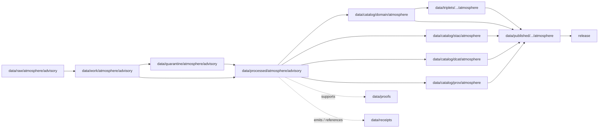

<!-- [KFM_META_BLOCK_V2]
doc_id: kfm://doc/data-processed-atmosphere-advisory-readme
title: data/processed/atmosphere/advisory/README.md — Atmosphere Advisory Processed Data README
version: v0.1
type: readme; data-lifecycle-sublane; processed-stage-guide; atmosphere-domain-lane; advisory-context-lane
status: draft; PROPOSED; data-root; processed-stage; atmosphere; advisory-context; release-gated; official-source-referral
owners: OWNER_TBD — Atmosphere steward · Advisory/source steward · Data steward · Pipeline steward · Evidence steward · Policy steward · Release steward · Docs steward
created: NEEDS VERIFICATION — blank placeholder existed before v0.1 expansion
updated: 2026-06-25
policy_label: public-doc; data; processed; atmosphere; advisory; lifecycle; governed; release-gated
tags: [kfm, data, processed, atmosphere, advisory, AdvisoryContext, lifecycle, RAW, WORK, QUARANTINE, CATALOG, TRIPLET, PUBLISHED, EvidenceBundle, SourceDescriptor, RunReceipt, ValidationReport, PolicyDecision, ReleaseManifest]
related:
  - ../README.md
  - ../../README.md
  - ../../../README.md
  - ../../../../docs/domains/atmosphere/README.md
  - ../../../../contracts/domains/atmosphere/AdvisoryContext.md
  - ../../../../schemas/contracts/v1/domains/atmosphere/AdvisoryContext.schema.json
  - ../../../../policy/domains/atmosphere/
  - ../../../../docs/doctrine/directory-rules.md
  - ../../../../docs/doctrine/lifecycle-law.md
  - ../../../../docs/doctrine/trust-membrane.md
  - ../../../raw/atmosphere/
  - ../../../work/atmosphere/
  - ../../../quarantine/atmosphere/
  - ../../../catalog/domain/atmosphere/README.md
  - ../../../catalog/stac/atmosphere/
  - ../../../catalog/dcat/atmosphere/
  - ../../../catalog/prov/atmosphere/
  - ../../../triplets/
  - ../../../published/
  - ../../../proofs/
  - ../../../receipts/
  - ../../../registry/
  - ../../../../release/
  - ../../../../pipelines/
  - ../../../../tools/validators/
notes:
  - "This file replaces a blank placeholder at `data/processed/atmosphere/advisory/README.md`."
  - "`data/processed/atmosphere/advisory/` is a PROCESSED-stage sublane for normalized advisory-context artifacts, not live alerting, emergency instruction, source truth, catalog records, release authority, or public warning output."
  - "AdvisoryContext is a governed referral/context object; KFM must not become the issuing advisory authority or a life-safety instruction system."
  - "Promotion from this lane to catalog, published artifacts, API/UI surfaces, or Focus Mode requires source role, freshness, evidence, policy, release state, correction path, and rollback target."
  - "Rollback target for this expansion is previous blank blob SHA `8b137891791fe96927ad78e64b0aad7bded08bdc`."
[/KFM_META_BLOCK_V2] -->

<a id="top"></a>

# data/processed/atmosphere/advisory

> Atmosphere PROCESSED-stage sublane for normalized `AdvisoryContext` artifacts: governed referrals to authoritative advisory material, not live alerting, emergency instructions, official warning issuance, or public warning authority.

<p>
  
  
  
  
  
  
</p>

**Status:** draft / PROPOSED  
**Owners:** OWNER_TBD — Atmosphere steward · Advisory/source steward · Data steward · Pipeline steward · Evidence steward · Policy steward · Release steward · Docs steward  
**Path:** `data/processed/atmosphere/advisory/README.md`  
**Owning root:** `data/processed/`  
**Domain segment:** `atmosphere`  
**Sublane:** `advisory` / `AdvisoryContext`  
**Lifecycle stage:** `PROCESSED`  
**Exposure posture:** not public by default; public use requires governed catalog, evidence, freshness, policy, release, correction, and rollback linkage  
**Truth posture:** CONFIRMED target was blank · CONFIRMED `AdvisoryContext` contract and schema paths exist · CONFIRMED Atmosphere domain is not an emergency alert system · PROPOSED processed-sublane details · NEEDS VERIFICATION for actual child inventory, validators, receipts, CI enforcement, release linkage, and governed route behavior.

**Quick jumps:** [Purpose](#purpose) · [Lifecycle boundary](#lifecycle-boundary) · [Repo fit](#repo-fit) · [Accepted contents](#accepted-contents) · [Exclusions](#exclusions) · [Advisory processed-data requirements](#advisory-processed-data-requirements) · [Advisory guardrails](#advisory-guardrails) · [Directory map](#directory-map) · [Evidence ledger](#evidence-ledger) · [Validation checklist](#validation-checklist) · [Rollback](#rollback)

---

## Purpose

`data/processed/atmosphere/advisory/` holds normalized Atmosphere/Air advisory-context artifacts that have moved beyond RAW capture, WORK transforms, and QUARANTINE holds.

This lane is for processed `AdvisoryContext` records or derivatives that preserve source identity, advisory role, validity window, retrieval time, freshness/supersession state, policy posture, evidence references, and downstream catalog readiness.

It is **not** a live alerting lane. It is **not** an emergency-management service. It is **not** the official issuing authority. It is a governed lifecycle handoff lane for advisory context that may later support catalog records, EvidenceBundle-backed UI payloads, public-safe referral metadata, or release packages after gates pass.

> [!IMPORTANT]
> KFM Atmosphere may carry advisory context, but emergency advisories, life-safety direction, and official warning authority belong to the official issuing authority and, when KFM models hazard/event truth, to governed Hazards/emergency lanes. This directory must never become the public warning system.

## Lifecycle boundary

```text
RAW -> WORK / QUARANTINE -> PROCESSED -> CATALOG / TRIPLET -> PUBLISHED
```



`data/processed/atmosphere/advisory/` is upstream of catalog, triplet, publication, and release. It must not be used as a normal public map/API/UI/AI source.

## Repo fit

| Responsibility | Correct home | Rule |
|---|---|---|
| Advisory source-native payloads, feeds, bulletins, CAP/XML/JSON, screenshots, or downloads | `data/raw/atmosphere/` or source-specific RAW sublane | Not this lane. |
| Advisory working transforms, parsing output, enrichment workspace, or temporary joins | `data/work/atmosphere/` | Not this lane. |
| Rights-unclear, stale, malformed, unsupported, disputed, or unsafe advisory material | `data/quarantine/atmosphere/` | Not this lane until resolved. |
| Normalized advisory-context processed artifacts | `data/processed/atmosphere/advisory/` | This lane. |
| Atmosphere domain catalog records | `data/catalog/domain/atmosphere/` | Downstream catalog stage. |
| Atmosphere STAC/DCAT/PROV records | `data/catalog/{stac,dcat,prov}/atmosphere/` | Downstream catalog projections, if accepted. |
| Atmosphere triplet/graph projections | `data/triplets/.../atmosphere/` | Downstream graph stage. |
| Atmosphere public-safe products | `data/published/.../atmosphere/` | Downstream after release. |
| EvidenceBundle/proof records | `data/proofs/` | Separate proof family. |
| Source, run, transform, validation, policy, freshness, correction, and release receipts | `data/receipts/` | Separate receipt family. |
| SourceDescriptor/source registry records | `data/registry/` | Separate registry family. |
| Release decisions, manifests, rollback cards, corrections, withdrawals | `release/` | Separate publication authority. |
| AdvisoryContext semantic contract | `contracts/domains/atmosphere/AdvisoryContext.md` | Object meaning; not data. |
| AdvisoryContext schema | `schemas/contracts/v1/domains/atmosphere/AdvisoryContext.schema.json` | Machine shape; not data. |
| Policy, validators, tests, pipelines, apps, packages | `policy/`, `tools/validators/`, `tests/`, `pipelines/`, `apps/`, `packages/` | Separate roots. |

## Accepted contents

Processed advisory-context data may include:

- normalized `AdvisoryContext` artifacts parsed from governed advisory, alert, watch, warning, bulletin, statement, notice, public-information product, or source-declared advisory material;
- processed metadata for source identity, issuing/source-declared authority, advisory type, external advisory identifier, issue time, valid/effective/expiration time, retrieval time, supersession/withdrawal state, and correction lineage;
- public-safe referral metadata that still requires catalog, policy, release, and freshness review before public display;
- joined context pointers to `ForecastContext`, `SmokeContext`, `AODRaster`, `AirObservation`, weather observations, wind fields, or other Atmosphere objects when the knowledge-character boundary remains visible;
- stale/expired/superseded markers generated by governed processing;
- sidecar metadata needed to interpret processed artifacts when it is not a catalog record, proof bundle, receipt, source registry record, release manifest, policy decision, schema, or code;
- README files explaining local advisory processed-data boundaries.

## Exclusions

Do not store these under `data/processed/atmosphere/advisory/`:

- RAW advisory feeds, bulletins, CAP/XML/JSON source payloads, images, screenshots, downloads, or source-native products.
- WORK/scratch outputs that have not passed minimal processing gates.
- Quarantined, malformed, stale-uncertain, rights-unclear, unsupported, disputed, or unsafe advisory material.
- Public alert dispatches, push notifications, emergency instructions, health/safety advice, evacuation/shelter instructions, official warning issuance, operational directives, or emergency-management runbooks.
- Hazard/event truth records owned by Hazards or emergency-management lanes.
- Forecast/model-field data unless represented in its own correct Atmosphere object family.
- Air-quality observations, PM2.5/Ozone concentration records, AQI summaries, smoke/AOD rasters, or weather observations unless they are only linked as advisory context and stored in their correct object-family lanes.
- Domain catalog records, STAC records, DCAT records, PROV records, triplet/graph records, published outputs, proofs, receipts, source registry records, release records, schemas, policy rules, validators, tests, pipelines, app/UI/API code.

## Advisory processed-data requirements

PROPOSED until concrete validators and CI enforcement are verified:

| Requirement | Meaning |
|---|---|
| Source trace | Every processed advisory artifact should trace to SourceDescriptor or source registry context when source authority matters. |
| Official-source referral | KFM records a governed referral; it must not imply KFM issued the advisory. |
| Advisory role | The record must preserve whether the material is advisory, alert, bulletin, watch, warning, statement, notice, public-information context, or other source-declared type. |
| Validity window | Issue, effective, expiration, valid, retrieval, release, correction, supersession, and withdrawal time should remain distinguishable where material. |
| Freshness posture | Stale, expired, superseded, withdrawn, or uncertain-freshness material must not be promoted as current public guidance. |
| Evidence linkage | Claims about advisory existence, source, scope, valid time, retrieval, correction, or supersession should resolve downstream to EvidenceBundle/proof context. |
| Policy posture | Public display requires rights, source-role, freshness, caveat, and policy/admissibility posture. |
| Knowledge-character boundary | Advisory context must not collapse into observation, forecast, concentration, AQI, exposure, hazard impact, or emergency instruction. |
| Catalog readiness | Processed advisory artifacts intended for discovery should promote through Atmosphere catalog lanes, not directly to public use. |
| Release readiness | Public use requires release state, published output path, correction path, and rollback target. |

## Advisory guardrails

- `AdvisoryContext` is a contextual referral, not a life-safety directive generated by KFM.
- Advisory context is not an observation, concentration measurement, AQI value, forecast/model field, exposure claim, hazard impact, or proof that an event occurred.
- Advisory context must keep official-source, source-role, freshness, validity-window, and correction/supersession boundaries visible.
- Public-safe advisory metadata must refer users to the authoritative issuing source when the source remains authoritative.
- Stale, expired, rights-unclear, unsupported, or transformed advisory content fails closed until reviewed.
- Focus Mode may summarize advisory context only as evidence-bounded referral metadata with official-source redirection, caveats, and release state. It must not generate emergency instructions.
- Unreleased processed advisory artifacts are not public merely because they exist under this directory.

> [!CAUTION]
> Do not build public warning behavior from this lane. Public alerting, emergency instruction, health/safety direction, evacuation or shelter guidance, and operational directives require explicit authority, policy, release, and source-control decisions outside this processed-data sublane.

## Directory map

Actual child inventory remains **NEEDS VERIFICATION**. Use this as a proposed local organization pattern only after confirming current repo convention and validators.

```text
data/processed/atmosphere/advisory/
├── README.md
├── normalized/              # PROPOSED — processed advisory-context records
├── freshness/               # PROPOSED — stale/expired/superseded/withdrawn markers
├── source_refs/             # PROPOSED — non-registry source pointers for local interpretation only
├── joins/                   # PROPOSED — processed links to forecast/smoke/AOD/observation context
├── _manifests/              # PROPOSED — lane-local non-release manifests only
└── _README_TODO.md          # PROPOSED — remove after actual child inventory is documented
```

## Evidence ledger

| Source | Status | Supports | Limits |
|---|---|---|---|
| Previous file | CONFIRMED | Target existed as a blank placeholder. | Did not define advisory PROCESSED-stage boundaries. |
| `data/processed/atmosphere/README.md` | CONFIRMED | Parent atmosphere processed lane exists as a greenfield stub. | Does not define parent boundaries yet. |
| `data/processed/README.md` | CONFIRMED | Parent processed lane is upstream of catalog, triplets, and publication and is not public by default. | Does not prove child inventory under `data/processed/atmosphere/advisory/`. |
| `data/catalog/domain/atmosphere/README.md` | CONFIRMED | Atmosphere catalog lane is downstream and includes advisory context while preserving source-role guardrails. | Does not prove advisory processed inventory or release behavior. |
| `docs/domains/atmosphere/README.md` | CONFIRMED doctrine / PROPOSED implementation | Atmosphere domain owns advisory context but is not an emergency alert system. | Implementation maturity and runtime behavior remain NEEDS VERIFICATION. |
| `contracts/domains/atmosphere/AdvisoryContext.md` | CONFIRMED contract file | Defines `AdvisoryContext` as governed referral/context, not life-safety instruction or official issuance by KFM. | Contract does not prove schema enforcement, validator behavior, or release approval. |
| `schemas/contracts/v1/domains/atmosphere/AdvisoryContext.schema.json` | CONFIRMED scaffold schema | Paired AdvisoryContext schema exists with PROPOSED status. | Properties are currently empty; validator enforcement remains NEEDS VERIFICATION. |
| `docs/doctrine/directory-rules.md` | CONFIRMED doctrine / PROPOSED path specifics | Data paths encode lifecycle phase and domain segment; promotion is governed. | Does not prove runtime enforcement. |

## Validation checklist

- [ ] Confirm actual child directories under `data/processed/atmosphere/advisory/`.
- [ ] Confirm accepted advisory source/domain path convention.
- [ ] Confirm `AdvisoryContext` schema fields and title casing are updated beyond scaffold if needed.
- [ ] Confirm advisory processed validators and CI checks.
- [ ] Confirm SourceDescriptor/source registry linkage for each source-derived advisory artifact.
- [ ] Confirm RunReceipt, TransformReceipt, ValidationReport, PolicyDecision, freshness/supersession receipt, correction path, and rollback target where applicable.
- [ ] Confirm stale, expired, superseded, withdrawn, rights-unclear, unsupported, or disputed advisories fail closed.
- [ ] Confirm no RAW, WORK, QUARANTINE, CATALOG, TRIPLET, PUBLISHED, proof, receipt, release, schema, policy, validator, package, pipeline, app, API, alerting, or emergency-instruction artifacts are misplaced here.
- [ ] Confirm promotion flow from processed advisory data to catalog/triplet/published outputs is governed, source-role-safe, freshness-aware, and reversible.
- [ ] Confirm public clients and Focus Mode cannot use this lane as a direct official warning, public alert, or life-safety instruction source.

## Rollback

Rollback is required if this lane becomes an Atmosphere source-data root, quarantine bypass, proof store, receipt store, catalog root, triplet root, source-registry root, release-decision root, published-output root, schema root, policy root, validator root, implementation root, public API shortcut, public exposure shortcut, emergency instruction source, public alert system, or official-warning substitute.

Rollback target for this expansion: previous blank blob SHA `8b137891791fe96927ad78e64b0aad7bded08bdc`.

<p align="right"><a href="#top">Back to top</a></p>
