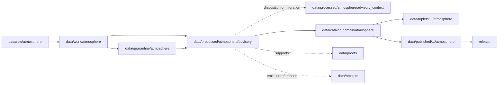

<!-- [KFM_META_BLOCK_V2]
doc_id: kfm://doc/data-processed-atmosphere-advisory-readme
title: data/processed/atmosphere/advisory/README.md — Atmosphere Advisory Compatibility Lane README
version: v0.2
type: readme; data-lifecycle-sublane; processed-stage-guide; atmosphere-domain-lane; compatibility-lane; advisory-context-referral
status: draft; PROPOSED; data-root; processed-stage; atmosphere; advisory; compatibility; release-gated; official-source-referral
owners: OWNER_TBD — Atmosphere steward · Advisory/source steward · Data steward · Pipeline steward · Evidence steward · Policy steward · Release steward · Docs steward
created: NEEDS VERIFICATION — blank placeholder existed before v0.1 expansion
updated: 2026-07-25
policy_label: public-doc; data; processed; atmosphere; advisory; compatibility; lifecycle; governed; release-gated
tags: [kfm, data, processed, atmosphere, advisory, AdvisoryContext, compatibility, lifecycle, RAW, WORK, QUARANTINE, CATALOG, TRIPLET, PUBLISHED, EvidenceBundle, SourceDescriptor, RunReceipt, ValidationReport, PolicyDecision, ReleaseManifest]
related:
  - ../README.md
  - ../advisory_context/README.md
  - ../../README.md
  - ../../../README.md
  - ../../../../docs/domains/atmosphere/README.md
  - ../../../../docs/domains/atmosphere/CANONICAL_PATHS.md
  - ../../../../contracts/domains/atmosphere/AdvisoryContext.md
  - ../../../../schemas/contracts/v1/domains/atmosphere/AdvisoryContext.schema.json
  - ../../../../policy/domains/atmosphere/
  - ../../../../docs/doctrine/directory-rules.md
  - ../../../../docs/doctrine/lifecycle-law.md
  - ../../../../docs/doctrine/trust-membrane.md
  - ../../../raw/atmosphere/
  - ../../../work/atmosphere/
  - ../../../quarantine/atmosphere/
  - ../../../catalog/domain/atmosphere/README.md
  - ../../../catalog/stac/atmosphere/
  - ../../../catalog/dcat/atmosphere/
  - ../../../catalog/prov/atmosphere/
  - ../../../triplets/
  - ../../../published/
  - ../../../proofs/
  - ../../../receipts/
  - ../../../registry/
  - ../../../../release/
  - ../../../../pipelines/
  - ../../../../tools/validators/
notes:
  - "This file preserves the existing `data/processed/atmosphere/advisory/` path while clarifying that the parent Atmosphere index treats it as a compatibility or legacy advisory lane."
  - "The object-specific `AdvisoryContext` lane is `data/processed/atmosphere/advisory_context/` according to the current parent lane index; promotion or migration between these lanes remains governed and NEEDS VERIFICATION."
  - "This lane may hold normalized advisory-adjacent compatibility artifacts, aliases, or migration references, but it is not live alerting, emergency instruction, source truth, catalog authority, release authority, or public warning output."
  - "AdvisoryContext is a governed referral/context object; KFM must not become the issuing advisory authority or a life-safety instruction system."
  - "Promotion from this lane to catalog, published artifacts, API/UI surfaces, or Focus Mode requires source role, freshness, evidence, policy, release state, correction path, and rollback target."
  - "Rollback target for v0.2 is prior blob SHA `07e27114687cbef5fdd0a1182e3c44e1d83940d6`."
[/KFM_META_BLOCK_V2] -->

<a id="top"></a>

# data/processed/atmosphere/advisory

> Compatibility-oriented Atmosphere PROCESSED-stage lane for normalized advisory-adjacent artifacts and migration references. The object-specific `AdvisoryContext` lane is `../advisory_context/`; neither lane is live alerting, emergency instruction, official warning issuance, or public warning authority.

<p>
  
  
  
  
  
  
</p>

**Status:** draft / PROPOSED  
**Owners:** OWNER_TBD — Atmosphere steward · Advisory/source steward · Data steward · Pipeline steward · Evidence steward · Policy steward · Release steward · Docs steward  
**Path:** `data/processed/atmosphere/advisory/README.md`  
**Owning root:** `data/processed/`  
**Domain segment:** `atmosphere`  
**Lane class:** compatibility or legacy advisory lane, pending steward disposition  
**Object-specific lane:** `data/processed/atmosphere/advisory_context/`  
**Lifecycle stage:** `PROCESSED`  
**Exposure posture:** not public by default; public use requires governed catalog, evidence, freshness, policy, release, correction, and rollback linkage  
**Truth posture:** CONFIRMED this path and README exist · CONFIRMED the parent Atmosphere processed index distinguishes `advisory/` from the object-specific `advisory_context/` lane · CONFIRMED `AdvisoryContext` contract and scaffold schema exist · CONFIRMED Atmosphere is not an emergency alert system · PROPOSED compatibility-lane disposition · NEEDS VERIFICATION for child inventory, migration state, validators, receipts, CI enforcement, release linkage, and governed route behavior.

**Quick jumps:** [Purpose](#purpose) · [Lane identity](#lane-identity) · [Lifecycle boundary](#lifecycle-boundary) · [Repo fit](#repo-fit) · [Accepted contents](#accepted-contents) · [Exclusions](#exclusions) · [Processed-data requirements](#processed-data-requirements) · [Advisory guardrails](#advisory-guardrails) · [Disposition and migration](#disposition-and-migration) · [Evidence ledger](#evidence-ledger) · [Validation checklist](#validation-checklist) · [Rollback](#rollback)

---

## Purpose

`data/processed/atmosphere/advisory/` preserves an existing Atmosphere/Air processed-stage path for normalized advisory-adjacent compatibility artifacts, aliases, migration references, or older products whose final object-family placement has not yet been reconciled.

The current parent lane index separately identifies `data/processed/atmosphere/advisory_context/` as the object-specific lane for `AdvisoryContext`. Therefore this README does **not** claim that `advisory/` is the canonical object lane. Its purpose is to prevent an existing path from silently becoming a second authority while still documenting the lifecycle, evidence, safety, and migration controls that apply to any material retained here.

> [!IMPORTANT]
> KFM Atmosphere may carry advisory context, but emergency advisories, life-safety direction, and official warning authority belong to authoritative issuing sources and governed emergency or Hazards systems. This directory must never become a public warning system.

## Lane identity

| Question | Current answer | Status |
|---|---|---|
| Does this path exist? | Yes: `data/processed/atmosphere/advisory/`. | CONFIRMED |
| Is it the object-specific `AdvisoryContext` lane? | No. The parent index names `advisory_context/` for that role. | CONFIRMED from current parent README |
| What may remain here? | Compatibility artifacts, aliases, migration references, or legacy normalized advisory material pending review. | PROPOSED |
| Can new object-family authority be established here? | No, not without reconciling the parent lane index, contracts, schemas, validators, and migration state. | CONFIRMED governance posture |
| Is deletion or migration authorized by this README? | No. Steward review and evidence-backed migration planning are required. | CONFIRMED |
| Is either lane public by default? | No. Both are upstream processed-data lanes. | CONFIRMED |

> [!CAUTION]
> Do not write the same advisory object family to both `advisory/` and `advisory_context/` as parallel authorities. Until disposition is verified, prefer the object-specific lane for new `AdvisoryContext` design work and treat this lane as compatibility-only.

## Lifecycle boundary

```text
RAW -> WORK / QUARANTINE -> PROCESSED -> CATALOG / TRIPLET -> PUBLISHED
```


```mermaid
flowchart LR
  RAW[data/raw/atmosphere] --> WORK[data/work/atmosphere]
  WORK --> QUAR[data/quarantine/atmosphere]
  WORK --> PROC[data/processed/atmosphere/advisory]
  QUAR --> PROC
  PROC -. disposition or migration .-> CANON[data/processed/atmosphere/advisory_context]
  PROC --> CAT[data/catalog/domain/atmosphere]
  PROC -. supports .-> PROOF[data/proofs]
  PROC -. emits or references .-> RECEIPT[data/receipts]
  CAT --> TRIP[data/triplets/.../atmosphere]
  CAT --> PUB[data/published/.../atmosphere]
  PUB --> REL[release]
```

This lane is upstream of catalog, triplet, publication, and release. A file's presence here is not catalog admission, proof closure, publication, current-advisory status, or release approval.

## Repo fit

| Responsibility | Correct home | Rule |
|---|---|---|
| Advisory source-native payloads, feeds, bulletins, CAP/XML/JSON, screenshots, or downloads | `data/raw/atmosphere/` or source-specific RAW sublane | Not this lane. |
| Advisory working transforms, parsing output, enrichment workspace, or temporary joins | `data/work/atmosphere/` | Not this lane. |
| Rights-unclear, stale-uncertain, malformed, unsupported, disputed, or unsafe advisory material | `data/quarantine/atmosphere/` | Not this lane until resolved. |
| Object-specific normalized `AdvisoryContext` artifacts | `data/processed/atmosphere/advisory_context/` | Current parent-index object lane. |
| Compatibility, alias, migration, or legacy advisory processed artifacts | `data/processed/atmosphere/advisory/` | This lane, pending disposition. |
| Atmosphere domain catalog records | `data/catalog/domain/atmosphere/` | Downstream catalog stage. |
| Atmosphere STAC/DCAT/PROV records | `data/catalog/{stac,dcat,prov}/atmosphere/` | Downstream catalog projections, if accepted. |
| Atmosphere triplet/graph projections | `data/triplets/.../atmosphere/` | Downstream graph stage. |
| Atmosphere public-safe products | `data/published/.../atmosphere/` | Downstream after release. |
| EvidenceBundle/proof records | `data/proofs/` | Separate proof family. |
| Source, run, transform, validation, policy, freshness, correction, migration, and release receipts | `data/receipts/` | Separate receipt family. |
| SourceDescriptor/source registry records | `data/registry/` | Separate registry family. |
| Release decisions, manifests, rollback cards, corrections, withdrawals | `release/` | Separate publication authority. |
| `AdvisoryContext` semantic contract | `contracts/domains/atmosphere/AdvisoryContext.md` | Object meaning; not data. |
| `AdvisoryContext` schema | `schemas/contracts/v1/domains/atmosphere/AdvisoryContext.schema.json` | Machine shape; currently a permissive scaffold. |
| Policy, validators, tests, pipelines, apps, packages | `policy/`, `tools/validators/`, `tests/`, `pipelines/`, `apps/`, `packages/` | Separate roots. |

## Accepted contents

Subject to steward review and local conventions, this compatibility lane may contain:

- normalized legacy advisory artifacts created before the object-specific lane was established;
- compatibility aliases or migration maps that point to object-specific records without duplicating truth;
- reconciliation inventories identifying which artifacts belong in `advisory_context/`, quarantine, catalog, or another object-family lane;
- public-safe referral metadata that still requires catalog, policy, release, and freshness review before public display;
- stale, expired, superseded, corrected, or withdrawn markers generated by governed processing;
- sidecar metadata needed to interpret compatibility artifacts when it is not a catalog record, proof bundle, receipt, source registry record, release manifest, policy decision, schema, or code;
- this README and other documentation that explains local compatibility and migration boundaries.

## Exclusions

Do not store these under `data/processed/atmosphere/advisory/`:

- New canonical `AdvisoryContext` objects when `advisory_context/` is the verified object-specific lane.
- Duplicate copies of the same processed object in both advisory lanes without a controlled alias or migration record.
- RAW advisory feeds, bulletins, CAP/XML/JSON source payloads, images, screenshots, downloads, or source-native products.
- WORK/scratch outputs that have not passed minimal processing gates.
- Quarantined, malformed, rights-unclear, unsupported, disputed, or unsafe advisory material.
- Public alert dispatches, push notifications, emergency instructions, health or safety advice, evacuation or shelter instructions, official warning issuance, operational directives, or emergency-management runbooks.
- Hazard or event truth records owned by Hazards or emergency-management lanes.
- Forecast/model fields, observations, concentration records, AQI summaries, smoke/AOD rasters, or weather observations except as controlled references to their correct object-family lanes.
- Catalog, STAC, DCAT, PROV, triplet, published, proof, receipt, source-registry, release, schema, policy, validator, test, pipeline, app, UI, or API artifacts.

## Processed-data requirements

The current schema is a permissive scaffold, so these requirements remain semantic and **PROPOSED** until concrete validators and CI enforcement are verified:

| Requirement | Meaning |
|---|---|
| Stable identity | Compatibility artifacts should retain stable identity and, when migrated, a resolvable predecessor/successor relation. |
| Source trace | Every source-derived artifact should trace to a `SourceDescriptor` or source registry context when source authority matters. |
| Official-source referral | KFM records a governed referral; it must not imply KFM issued the advisory. |
| Lane classification | Each artifact should declare whether it is canonical, compatibility-only, alias, migration candidate, held, superseded, or withdrawn. |
| Advisory role | Preserve the source-declared advisory, alert, bulletin, watch, warning, statement, notice, or public-information type. |
| Validity window | Keep issue, effective, expiration, valid, retrieval, release, correction, supersession, and withdrawal times distinguishable where material. |
| Freshness posture | Stale, expired, superseded, withdrawn, or uncertain-freshness material must not be promoted as current public guidance. |
| Evidence linkage | Claims about advisory existence, source, scope, time, correction, or supersession should resolve downstream to EvidenceBundle/proof context. |
| Policy posture | Public display requires rights, source-role, freshness, caveat, and policy/admissibility posture. |
| Knowledge-character boundary | Advisory context must not collapse into observation, forecast, concentration, AQI, exposure, hazard impact, or emergency instruction. |
| Migration receipt | Moving, aliasing, superseding, or retiring artifacts should produce a reviewable migration or transform receipt and rollback target. |
| Catalog readiness | Discoverable artifacts should promote through Atmosphere catalog lanes, not directly to public use. |
| Release readiness | Public use requires release state, published output path, correction path, and rollback target. |

## Advisory guardrails

- `AdvisoryContext` is a contextual referral, not a life-safety directive generated by KFM.
- Compatibility artifacts do not become canonical merely because this path predates or coexists with `advisory_context/`.
- Advisory context is not an observation, concentration measurement, AQI value, forecast/model field, exposure claim, hazard impact, or proof that an event occurred.
- Advisory context must keep official-source, source-role, freshness, validity-window, correction, and supersession boundaries visible.
- Public-safe advisory metadata must refer users to the authoritative issuing source when the source remains authoritative.
- Stale, expired, rights-unclear, unsupported, or transformed advisory content fails closed until reviewed.
- Focus Mode may summarize released advisory context only as evidence-bounded referral metadata with official-source redirection, caveats, and release state. It must not generate emergency instructions.
- Unreleased processed advisory artifacts are not public merely because they exist under this directory.

> [!CAUTION]
> Do not build public warning behavior from this lane. Public alerting, emergency instruction, health/safety direction, evacuation or shelter guidance, and operational directives require explicit authority, policy, release, and source-control decisions outside this processed-data sublane.

## Disposition and migration

No migration is executed by this README. The smallest governed next step is an inventory-and-crosswalk pass:

1. Enumerate actual non-README children in `advisory/` and `advisory_context/`.
2. Classify each artifact as canonical, compatibility-only, duplicate, alias, migration candidate, quarantine candidate, or unknown.
3. Verify source, contract, schema, policy, validator, receipt, catalog, release, and consumer references.
4. Choose one authoritative object lane and document compatibility behavior.
5. Move or supersede artifacts only with reviewable receipts, reference repair, validation, and rollback targets.
6. Retain correction and lineage records; do not silently delete history.

| Outcome | Required posture |
|---|---|
| `RETAIN_COMPATIBILITY` | Keep this lane, declare compatibility rules, prevent parallel authority. |
| `MIGRATE_TO_ADVISORY_CONTEXT` | Move controlled artifacts to `advisory_context/`, preserve aliases/lineage, repair references, validate, and retain rollback. |
| `QUARANTINE` | Hold artifacts with unresolved rights, source role, freshness, schema, or safety posture. |
| `RETIRE_EMPTY_LANE` | Allowed only after proving the lane is empty/unreferenced and recording reversible disposition. |
| `UNKNOWN` | Make no structural change; record the verification gap. |

## Evidence ledger

| Source | Status | Supports | Limits |
|---|---|---|---|
| Current target README | CONFIRMED | Existing path, prior processed-stage and advisory safety documentation. | Prior version treated the lane too much like the object-specific lane and did not foreground compatibility status. |
| `data/processed/atmosphere/README.md` | CONFIRMED | Parent processed lane exists and distinguishes `advisory/` as compatibility/legacy from `advisory_context/` as `AdvisoryContext`. | Does not prove actual child inventory, migration state, or consumer behavior. |
| `data/processed/README.md` | CONFIRMED | PROCESSED is upstream of catalog, triplet, publication, and release and is not public by default. | Does not prove lane-specific validation. |
| `docs/domains/atmosphere/CANONICAL_PATHS.md` | CONFIRMED draft registry / PROPOSED implementation | Atmosphere data uses lifecycle paths under `data/<phase>/atmosphere/`; new parallel authority is prohibited. | It does not choose between these two advisory sublanes. |
| `data/catalog/domain/atmosphere/README.md` | CONFIRMED | Atmosphere catalog is downstream and includes advisory context with source-role guardrails. | Does not prove processed inventory or release behavior. |
| `docs/domains/atmosphere/README.md` | CONFIRMED doctrine / PROPOSED implementation | Atmosphere owns advisory context but is not an emergency alert system. | Runtime and release maturity remain NEEDS VERIFICATION. |
| `contracts/domains/atmosphere/AdvisoryContext.md` | CONFIRMED contract | Defines `AdvisoryContext` as governed referral/context, not life-safety instruction or official issuance by KFM. | Contract does not prove schema enforcement, validator behavior, or release approval. |
| `schemas/contracts/v1/domains/atmosphere/AdvisoryContext.schema.json` | CONFIRMED scaffold schema | Paired schema exists with PROPOSED status. | Properties are empty and `additionalProperties` is true; enforcement remains NEEDS VERIFICATION. |
| `docs/doctrine/directory-rules.md` | CONFIRMED doctrine | Data paths encode lifecycle and domain; parallel authorities and silent moves are prohibited; promotion is governed. | Does not prove runtime enforcement. |

## Validation checklist

- [ ] Confirm actual child inventory under `data/processed/atmosphere/advisory/`.
- [ ] Confirm actual child inventory under `data/processed/atmosphere/advisory_context/`.
- [ ] Confirm the parent lane index still reflects current repository intent.
- [ ] Confirm which lane is authoritative for new `AdvisoryContext` artifacts.
- [ ] Confirm no duplicate canonical objects are written to both lanes.
- [ ] Confirm accepted source and domain path conventions.
- [ ] Confirm `AdvisoryContext` schema fields and title casing are updated beyond scaffold if needed.
- [ ] Confirm advisory processed validators, fixtures, and CI checks.
- [ ] Confirm `SourceDescriptor` linkage for every source-derived advisory artifact.
- [ ] Confirm `RunReceipt`, `TransformReceipt`, `ValidationReport`, `PolicyDecision`, freshness/supersession receipt, correction path, migration receipt, and rollback target where applicable.
- [ ] Confirm stale, expired, superseded, withdrawn, rights-unclear, unsupported, or disputed advisories fail closed.
- [ ] Confirm no RAW, WORK, QUARANTINE, CATALOG, TRIPLET, PUBLISHED, proof, receipt, release, schema, policy, validator, package, pipeline, app, API, alerting, or emergency-instruction artifacts are misplaced here.
- [ ] Confirm promotion from processed advisory data to catalog/triplet/published outputs is governed, source-role-safe, freshness-aware, and reversible.
- [ ] Confirm public clients and Focus Mode cannot use this lane as a direct official warning, public alert, or life-safety instruction source.
- [ ] Confirm any lane retirement or migration preserves references, history, correction lineage, and rollback.

## Rollback

Rollback is required if this lane becomes a second canonical `AdvisoryContext` authority, source-data root, quarantine bypass, proof store, receipt store, catalog root, triplet root, source-registry root, release-decision root, published-output root, schema root, policy root, validator root, implementation root, public API shortcut, public exposure shortcut, emergency instruction source, public alert system, or official-warning substitute.

Rollback target for v0.2: prior blob SHA `07e27114687cbef5fdd0a1182e3c44e1d83940d6`.

<p align="right"><a href="#top">Back to top</a></p>
