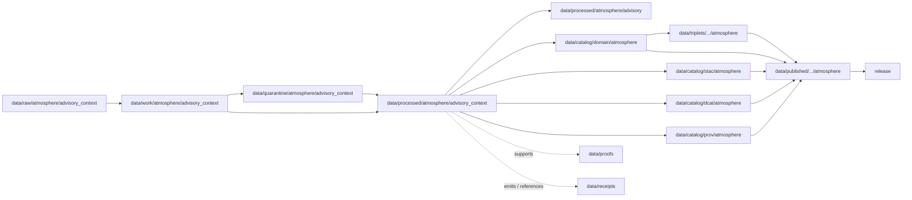

<!-- [KFM_META_BLOCK_V2]
doc_id: kfm://doc/data-processed-atmosphere-advisory-context-readme
title: data/processed/atmosphere/advisory_context/README.md — Atmosphere AdvisoryContext Processed Data README
version: v0.1
type: readme; data-lifecycle-sublane; processed-stage-guide; atmosphere-domain-lane; advisory-context-object-lane
status: draft; PROPOSED; data-root; processed-stage; atmosphere; AdvisoryContext; release-gated; official-source-referral; compatibility-aware
owners: OWNER_TBD — Atmosphere steward · Advisory/source steward · Data steward · Pipeline steward · Evidence steward · Policy steward · Release steward · Docs steward
created: NEEDS VERIFICATION — blank placeholder existed before v0.1 expansion
updated: 2026-06-25
policy_label: public-doc; data; processed; atmosphere; advisory-context; lifecycle; governed; release-gated
tags: [kfm, data, processed, atmosphere, advisory_context, AdvisoryContext, lifecycle, RAW, WORK, QUARANTINE, CATALOG, TRIPLET, PUBLISHED, EvidenceBundle, SourceDescriptor, RunReceipt, ValidationReport, PolicyDecision, ReleaseManifest]
related:
  - ../advisory/README.md
  - ../README.md
  - ../../README.md
  - ../../../README.md
  - ../../../../docs/domains/atmosphere/README.md
  - ../../../../contracts/domains/atmosphere/AdvisoryContext.md
  - ../../../../schemas/contracts/v1/domains/atmosphere/AdvisoryContext.schema.json
  - ../../../../policy/domains/atmosphere/
  - ../../../../docs/doctrine/directory-rules.md
  - ../../../../docs/doctrine/lifecycle-law.md
  - ../../../../docs/doctrine/trust-membrane.md
  - ../../../raw/atmosphere/
  - ../../../work/atmosphere/
  - ../../../quarantine/atmosphere/
  - ../../../catalog/domain/atmosphere/README.md
  - ../../../catalog/stac/atmosphere/
  - ../../../catalog/dcat/atmosphere/
  - ../../../catalog/prov/atmosphere/
  - ../../../triplets/
  - ../../../published/
  - ../../../proofs/
  - ../../../receipts/
  - ../../../registry/
  - ../../../../release/
  - ../../../../pipelines/
  - ../../../../tools/validators/
notes:
  - "This file replaces a blank placeholder at `data/processed/atmosphere/advisory_context/README.md`."
  - "This is an object-named PROCESSED-stage sublane for normalized AdvisoryContext artifacts. It must not create a second contract, schema, policy, release, or public-warning authority."
  - "The sibling `data/processed/atmosphere/advisory/README.md` already defines the broader advisory processed lane; this file narrows the object-family boundary for `AdvisoryContext` artifacts."
  - "AdvisoryContext is a governed referral/context object; KFM must not become the issuing advisory authority or a life-safety instruction system."
  - "Rollback target for this expansion is previous blank blob SHA `8b137891791fe96927ad78e64b0aad7bded08bdc`."
[/KFM_META_BLOCK_V2] -->

<a id="top"></a>

# data/processed/atmosphere/advisory_context

> Object-named Atmosphere PROCESSED-stage sublane for normalized `AdvisoryContext` artifacts: governed advisory-context referrals, not live alerting, emergency instruction, official warning issuance, or public warning authority.

<p>
  
  
  
  
  
  
</p>

**Status:** draft / PROPOSED  
**Owners:** OWNER_TBD — Atmosphere steward · Advisory/source steward · Data steward · Pipeline steward · Evidence steward · Policy steward · Release steward · Docs steward  
**Path:** `data/processed/atmosphere/advisory_context/README.md`  
**Owning root:** `data/processed/`  
**Domain segment:** `atmosphere`  
**Object-family segment:** `advisory_context` / `AdvisoryContext`  
**Lifecycle stage:** `PROCESSED`  
**Exposure posture:** not public by default; public use requires governed catalog, evidence, freshness, policy, release, correction, and rollback linkage  
**Truth posture:** CONFIRMED target was blank · CONFIRMED sibling `data/processed/atmosphere/advisory/README.md` exists · CONFIRMED `AdvisoryContext` contract and schema paths exist · CONFIRMED Atmosphere domain is not an emergency alert system · PROPOSED object-named processed-sublane details · NEEDS VERIFICATION for actual child inventory, validators, receipts, CI enforcement, release linkage, and governed route behavior.

**Quick jumps:** [Purpose](#purpose) · [Naming and compatibility note](#naming-and-compatibility-note) · [Lifecycle boundary](#lifecycle-boundary) · [Repo fit](#repo-fit) · [Accepted contents](#accepted-contents) · [Exclusions](#exclusions) · [AdvisoryContext processed-data requirements](#advisorycontext-processed-data-requirements) · [AdvisoryContext guardrails](#advisorycontext-guardrails) · [Evidence ledger](#evidence-ledger) · [Validation checklist](#validation-checklist) · [Rollback](#rollback)

---

## Purpose

`data/processed/atmosphere/advisory_context/` holds normalized `AdvisoryContext` artifacts that have moved beyond RAW capture, WORK transforms, and QUARANTINE holds.

This lane is narrower than the sibling advisory lane. It is for object-family-specific processed artifacts where maintainers need a path that mirrors the contract/schema object name `AdvisoryContext` while still preserving KFM lifecycle boundaries.

It may support downstream catalog records, EvidenceBundle-backed UI payloads, public-safe referral metadata, freshness/supersession analysis, or release packages after gates pass. It does not replace catalog, proof, receipt, source registry, policy, schema, contract, release, or public surfaces.

> [!IMPORTANT]
> KFM may represent advisory context as governed referral metadata, but it must not become the official issuing advisory authority, a public alerting system, or a life-safety instruction service.

## Naming and compatibility note

The repo also contains:

```text
data/processed/atmosphere/advisory/README.md
```

That sibling README defines the broader advisory processed lane. This `advisory_context/` README is intentionally object-named and must be treated as one of these until maintainers settle the convention:

| Naming option | Meaning | Required action |
|---|---|---|
| `advisory/` | Broad topic sublane for advisory-context processed artifacts. | Keep as canonical only if repo convention prefers topic sublanes. |
| `advisory_context/` | Object-family sublane mirroring `AdvisoryContext`. | Keep as canonical only if repo convention prefers object-family sublanes. |
| Both paths | Transitional / compatibility state. | Add a drift or verification note before storing real data in both. |

> [!CAUTION]
> Do not let `advisory/` and `advisory_context/` become parallel truth stores. If both paths remain, define which one owns processed artifacts and which one is an alias, index, compatibility shim, or deprecated path.

## Lifecycle boundary

```text
RAW -> WORK / QUARANTINE -> PROCESSED -> CATALOG / TRIPLET -> PUBLISHED
```



`data/processed/atmosphere/advisory_context/` is upstream of catalog, triplet, publication, and release. It must not be used as a normal public map/API/UI/AI source.

## Repo fit

| Responsibility | Correct home | Rule |
|---|---|---|
| AdvisoryContext source-native payloads, feeds, bulletins, CAP/XML/JSON, screenshots, or downloads | `data/raw/atmosphere/` or source-specific RAW sublane | Not this lane. |
| AdvisoryContext working transforms, parsing output, enrichment workspace, or temporary joins | `data/work/atmosphere/` | Not this lane. |
| Rights-unclear, stale, malformed, unsupported, disputed, or unsafe advisory context | `data/quarantine/atmosphere/` | Not this lane until resolved. |
| Normalized AdvisoryContext processed artifacts | `data/processed/atmosphere/advisory_context/` | This lane, if object-family naming is accepted. |
| Broader advisory processed lane | `data/processed/atmosphere/advisory/` | Sibling; must not become a parallel truth store. |
| Atmosphere domain catalog records | `data/catalog/domain/atmosphere/` | Downstream catalog stage. |
| Atmosphere STAC/DCAT/PROV records | `data/catalog/{stac,dcat,prov}/atmosphere/` | Downstream catalog projections, if accepted. |
| Atmosphere triplet/graph projections | `data/triplets/.../atmosphere/` | Downstream graph stage. |
| Atmosphere public-safe products | `data/published/.../atmosphere/` | Downstream after release. |
| EvidenceBundle/proof records | `data/proofs/` | Separate proof family. |
| Source, run, transform, validation, policy, freshness, correction, and release receipts | `data/receipts/` | Separate receipt family. |
| SourceDescriptor/source registry records | `data/registry/` | Separate registry family. |
| Release decisions, manifests, rollback cards, corrections, withdrawals | `release/` | Separate publication authority. |
| AdvisoryContext semantic contract | `contracts/domains/atmosphere/AdvisoryContext.md` | Object meaning; not data. |
| AdvisoryContext schema | `schemas/contracts/v1/domains/atmosphere/AdvisoryContext.schema.json` | Machine shape; not data. |
| Policy, validators, tests, pipelines, apps, packages | `policy/`, `tools/validators/`, `tests/`, `pipelines/`, `apps/`, `packages/` | Separate roots. |

## Accepted contents

Processed `AdvisoryContext` data may include:

- normalized `AdvisoryContext` records parsed from governed advisory, alert, watch, warning, bulletin, statement, notice, public-information product, or source-declared advisory material;
- processed metadata for source identity, issuing/source-declared authority, advisory type, external advisory identifier, issue time, valid/effective/expiration time, retrieval time, supersession/withdrawal state, and correction lineage;
- source-role-safe referral metadata that still requires catalog, policy, release, and freshness review before public display;
- processed joins to `ForecastContext`, `SmokeContext`, `AODRaster`, `AirObservation`, weather observations, wind fields, or other Atmosphere objects when the knowledge-character boundary remains visible;
- freshness, expiration, supersession, withdrawal, or correction markers generated by governed processing;
- sidecar metadata needed to interpret processed artifacts when it is not a catalog record, proof bundle, receipt, source registry record, release manifest, policy decision, schema, or code;
- README files explaining local processed-data boundaries.

## Exclusions

Do not store these under `data/processed/atmosphere/advisory_context/`:

- RAW advisory feeds, bulletins, CAP/XML/JSON source payloads, images, screenshots, downloads, or source-native products.
- WORK/scratch outputs that have not passed minimal processing gates.
- Quarantined, malformed, stale-uncertain, rights-unclear, unsupported, disputed, or unsafe advisory material.
- Public alert dispatches, push notifications, emergency instructions, health/safety advice, evacuation/shelter instructions, official warning issuance, operational directives, or emergency-management runbooks.
- Hazard/event truth records owned by Hazards or emergency-management lanes.
- Forecast/model-field data unless represented in its own correct Atmosphere object family.
- Air-quality observations, PM2.5/Ozone concentration records, AQI summaries, smoke/AOD rasters, or weather observations unless they are only linked as advisory context and stored in their correct object-family lanes.
- Domain catalog records, STAC records, DCAT records, PROV records, triplet/graph records, published outputs, proofs, receipts, source registry records, release records, schemas, policy rules, validators, tests, pipelines, app/UI/API code.

## AdvisoryContext processed-data requirements

PROPOSED until concrete validators and CI enforcement are verified:

| Requirement | Meaning |
|---|---|
| Source trace | Every processed AdvisoryContext artifact should trace to SourceDescriptor or source registry context when source authority matters. |
| Official-source referral | KFM records a governed referral; it must not imply KFM issued the advisory. |
| Advisory role | The record must preserve whether the material is advisory, alert, bulletin, watch, warning, statement, notice, public-information context, or other source-declared type. |
| Validity window | Issue, effective, expiration, valid, retrieval, release, correction, supersession, and withdrawal time should remain distinguishable where material. |
| Freshness posture | Stale, expired, superseded, withdrawn, or uncertain-freshness material must not be promoted as current public guidance. |
| Evidence linkage | Claims about advisory existence, source, scope, valid time, retrieval, correction, or supersession should resolve downstream to EvidenceBundle/proof context. |
| Policy posture | Public display requires rights, source-role, freshness, caveat, and policy/admissibility posture. |
| Knowledge-character boundary | AdvisoryContext must not collapse into observation, forecast, concentration, AQI, exposure, hazard impact, or emergency instruction. |
| Catalog readiness | Processed AdvisoryContext artifacts intended for discovery should promote through Atmosphere catalog lanes, not directly to public use. |
| Release readiness | Public use requires release state, published output path, correction path, and rollback target. |
| Path convention | If `advisory/` and `advisory_context/` both exist, maintainers must decide whether one is canonical and record the decision before storing real artifacts in both. |

## AdvisoryContext guardrails

- `AdvisoryContext` is a contextual referral, not a life-safety directive generated by KFM.
- AdvisoryContext is not an observation, concentration measurement, AQI value, forecast/model field, exposure claim, hazard impact, or proof that an event occurred.
- AdvisoryContext must keep official-source, source-role, freshness, validity-window, and correction/supersession boundaries visible.
- Public-safe advisory metadata must refer users to the authoritative issuing source when the source remains authoritative.
- Stale, expired, rights-unclear, unsupported, or transformed advisory content fails closed until reviewed.
- Focus Mode may summarize AdvisoryContext only as evidence-bounded referral metadata with official-source redirection, caveats, and release state. It must not generate emergency instructions.
- Unreleased processed AdvisoryContext artifacts are not public merely because they exist under this directory.

> [!CAUTION]
> Do not build public warning behavior from this lane. Public alerting, emergency instruction, health/safety direction, evacuation or shelter guidance, and operational directives require explicit authority, policy, release, and source-control decisions outside this processed-data sublane.

## Evidence ledger

| Source | Status | Supports | Limits |
|---|---|---|---|
| Previous file | CONFIRMED | Target existed as a blank placeholder. | Did not define AdvisoryContext PROCESSED-stage boundaries. |
| `data/processed/atmosphere/advisory/README.md` | CONFIRMED sibling README | Broader advisory processed lane exists and defines advisory-context guardrails. | Does not decide whether `advisory/` or `advisory_context/` is canonical. |
| `data/processed/README.md` | CONFIRMED | Parent processed lane is upstream of catalog, triplets, and publication and is not public by default. | Does not prove child inventory under `data/processed/atmosphere/advisory_context/`. |
| `data/catalog/domain/atmosphere/README.md` | CONFIRMED | Atmosphere catalog lane is downstream and includes advisory context while preserving source-role guardrails. | Does not prove AdvisoryContext processed inventory or release behavior. |
| `docs/domains/atmosphere/README.md` | CONFIRMED doctrine / PROPOSED implementation | Atmosphere domain owns advisory context but is not an emergency alert system. | Implementation maturity and runtime behavior remain NEEDS VERIFICATION. |
| `contracts/domains/atmosphere/AdvisoryContext.md` | CONFIRMED contract file | Defines `AdvisoryContext` as governed referral/context, not life-safety instruction or official issuance by KFM. | Contract does not prove schema enforcement, validator behavior, or release approval. |
| `schemas/contracts/v1/domains/atmosphere/AdvisoryContext.schema.json` | CONFIRMED scaffold schema | Paired AdvisoryContext schema exists with PROPOSED status. | Properties are currently empty; validator enforcement remains NEEDS VERIFICATION. |
| `docs/doctrine/directory-rules.md` | CONFIRMED doctrine / PROPOSED path specifics | Data paths encode lifecycle phase and domain segment; promotion is governed. | Does not prove runtime enforcement. |

## Validation checklist

- [ ] Confirm actual child directories under `data/processed/atmosphere/advisory_context/`.
- [ ] Decide whether `advisory/` or `advisory_context/` is the canonical processed sublane for `AdvisoryContext` artifacts.
- [ ] Confirm accepted AdvisoryContext source/domain path convention.
- [ ] Confirm `AdvisoryContext` schema fields and title casing are updated beyond scaffold if needed.
- [ ] Confirm AdvisoryContext processed validators and CI checks.
- [ ] Confirm SourceDescriptor/source registry linkage for each source-derived AdvisoryContext artifact.
- [ ] Confirm RunReceipt, TransformReceipt, ValidationReport, PolicyDecision, freshness/supersession receipt, correction path, and rollback target where applicable.
- [ ] Confirm stale, expired, superseded, withdrawn, rights-unclear, unsupported, or disputed advisories fail closed.
- [ ] Confirm no RAW, WORK, QUARANTINE, CATALOG, TRIPLET, PUBLISHED, proof, receipt, release, schema, policy, validator, package, pipeline, app, API, alerting, or emergency-instruction artifacts are misplaced here.
- [ ] Confirm promotion flow from processed AdvisoryContext data to catalog/triplet/published outputs is governed, source-role-safe, freshness-aware, and reversible.
- [ ] Confirm public clients and Focus Mode cannot use this lane as a direct official warning, public alert, or life-safety instruction source.

## Rollback

Rollback is required if this lane becomes an Atmosphere source-data root, duplicate truth store beside `advisory/`, quarantine bypass, proof store, receipt store, catalog root, triplet root, source-registry root, release-decision root, published-output root, schema root, policy root, validator root, implementation root, public API shortcut, public exposure shortcut, emergency instruction source, public alert system, or official-warning substitute.

Rollback target for this expansion: previous blank blob SHA `8b137891791fe96927ad78e64b0aad7bded08bdc`.

<p align="right"><a href="#top">Back to top</a></p>
