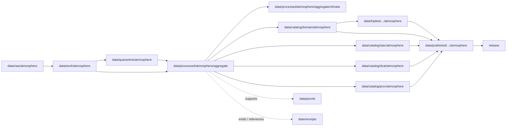

<!-- [KFM_META_BLOCK_V2]
doc_id: kfm://doc/data-processed-atmosphere-aggregate-readme
title: data/processed/atmosphere/aggregate/README.md — Atmosphere Aggregate Processed Data README
version: v0.1
type: readme; data-lifecycle-sublane; processed-stage-guide; atmosphere-domain-lane; aggregate-parent-lane
status: draft; PROPOSED; data-root; processed-stage; atmosphere; aggregate; release-gated; source-role-aware; aggregation-aware
owners: OWNER_TBD — Atmosphere steward · Aggregate-data steward · Data steward · Pipeline steward · Evidence steward · Policy steward · Release steward · Docs steward
created: NEEDS VERIFICATION — blank placeholder existed before v0.1 expansion
updated: 2026-06-25
policy_label: public-doc; data; processed; atmosphere; aggregate; lifecycle; governed; release-gated
tags: [kfm, data, processed, atmosphere, aggregate, climate, air-quality, weather, smoke, AOD, lifecycle, RAW, WORK, QUARANTINE, CATALOG, TRIPLET, PUBLISHED, EvidenceBundle, SourceDescriptor, AggregationReceipt, ValidationReport, PolicyDecision, ReleaseManifest]
related:
  - ../README.md
  - ../../README.md
  - ../../../README.md
  - ../../../../docs/domains/atmosphere/README.md
  - ../../../../data/processed/atmosphere/aggregate/climate/README.md
  - ../../../../data/catalog/domain/atmosphere/README.md
  - ../../../../contracts/domains/atmosphere/
  - ../../../../schemas/contracts/v1/domains/atmosphere/
  - ../../../../policy/domains/atmosphere/
  - ../../../../docs/doctrine/directory-rules.md
  - ../../../../docs/doctrine/lifecycle-law.md
  - ../../../../docs/doctrine/trust-membrane.md
  - ../../../raw/atmosphere/
  - ../../../work/atmosphere/
  - ../../../quarantine/atmosphere/
  - ../../../catalog/stac/atmosphere/
  - ../../../catalog/dcat/atmosphere/
  - ../../../catalog/prov/atmosphere/
  - ../../../triplets/
  - ../../../published/
  - ../../../proofs/
  - ../../../receipts/
  - ../../../registry/
  - ../../../../release/
  - ../../../../pipelines/
  - ../../../../tools/validators/
notes:
  - "This file replaces a blank placeholder at `data/processed/atmosphere/aggregate/README.md`."
  - "This is the parent PROCESSED-stage aggregate lane for Atmosphere artifacts. It organizes aggregate products without becoming a catalog, proof, receipt, release, schema, policy, or public surface."
  - "Aggregate Atmosphere artifacts must preserve source role, aggregation method, spatial/temporal scope, units, uncertainty/caveats, source trace, evidence linkage, policy posture, and release state before public use."
  - "The child `climate/` lane covers aggregate climate normals, baselines, and anomalies. Additional child lanes are PROPOSED until verified."
  - "Rollback target for this expansion is previous blank blob SHA `8b137891791fe96927ad78e64b0aad7bded08bdc`."
[/KFM_META_BLOCK_V2] -->

<a id="top"></a>

# data/processed/atmosphere/aggregate

> Parent Atmosphere PROCESSED-stage lane for aggregate artifacts: normalized summaries, rollups, derived grids, baseline-ready outputs, and aggregation products that remain upstream of catalog, proof, release, and public map/API/UI surfaces.

<p>
  
  
  
  
  
  
</p>

**Status:** draft / PROPOSED  
**Owners:** OWNER_TBD — Atmosphere steward · Aggregate-data steward · Data steward · Pipeline steward · Evidence steward · Policy steward · Release steward · Docs steward  
**Path:** `data/processed/atmosphere/aggregate/README.md`  
**Owning root:** `data/processed/`  
**Domain segment:** `atmosphere`  
**Sublane:** `aggregate`  
**Lifecycle stage:** `PROCESSED`  
**Exposure posture:** not public by default; public use requires governed catalog, evidence, aggregation disclosure, policy, release, correction, and rollback linkage  
**Truth posture:** CONFIRMED target was blank · CONFIRMED child `aggregate/climate/README.md` exists · CONFIRMED parent `data/processed/` lane is not a public surface · PROPOSED aggregate-parent processed-lane details · NEEDS VERIFICATION for actual child inventory, schemas, validators, receipts, CI enforcement, release linkage, and governed route behavior.

**Quick jumps:** [Purpose](#purpose) · [Lifecycle boundary](#lifecycle-boundary) · [Repo fit](#repo-fit) · [Accepted contents](#accepted-contents) · [Exclusions](#exclusions) · [Aggregate requirements](#aggregate-requirements) · [Source-role guardrails](#source-role-guardrails) · [Child lanes](#child-lanes) · [Directory map](#directory-map) · [Evidence ledger](#evidence-ledger) · [Validation checklist](#validation-checklist) · [Rollback](#rollback)

---

## Purpose

`data/processed/atmosphere/aggregate/` holds normalized aggregate Atmosphere/Air artifacts that have moved beyond RAW capture, WORK transforms, and QUARANTINE holds.

This parent lane groups processed aggregate products across Atmosphere object families: climate normals/anomalies, air-quality summaries, weather/mesonet summaries, smoke/AOD summaries, station-network rollups, tile-safe grids, regional summaries, and other derived aggregate outputs where the aggregation method and source role remain visible.

It is not a catalog lane, proof store, receipt store, release authority, public map layer, or public API source. It is a governed lifecycle handoff lane that may support downstream catalog records, EvidenceBundle-backed UI payloads, public-safe derived products, Focus Mode summaries, or release packages after gates pass.

## Lifecycle boundary

```text
RAW -> WORK / QUARANTINE -> PROCESSED -> CATALOG / TRIPLET -> PUBLISHED
```



`data/processed/atmosphere/aggregate/` is upstream of catalog, triplet, publication, and release. It must not be used as a normal public map/API/UI/AI source.

## Repo fit

| Responsibility | Correct home | Rule |
|---|---|---|
| Raw atmosphere source payloads | `data/raw/atmosphere/` | Not this lane. |
| In-process aggregation, scratch rollups, temporary joins, temporary grids, or method experiments | `data/work/atmosphere/` | Not this lane. |
| Rights-unclear, source-role-unclear, malformed, unsupported, disputed, sensitive, or unsafe aggregate material | `data/quarantine/atmosphere/` | Not this lane until resolved. |
| Normalized aggregate Atmosphere processed artifacts | `data/processed/atmosphere/aggregate/` | This parent lane. |
| Aggregate climate processed artifacts | `data/processed/atmosphere/aggregate/climate/` | Existing child lane. |
| Atmosphere domain catalog records | `data/catalog/domain/atmosphere/` | Downstream catalog stage. |
| Atmosphere STAC/DCAT/PROV records | `data/catalog/{stac,dcat,prov}/atmosphere/` | Downstream catalog projections, if accepted. |
| Atmosphere triplet/graph projections | `data/triplets/.../atmosphere/` | Downstream graph stage. |
| Atmosphere public-safe products | `data/published/.../atmosphere/` | Downstream after release. |
| EvidenceBundle/proof records | `data/proofs/` | Separate proof family. |
| Source, run, transform, aggregation, validation, policy, correction, and release receipts | `data/receipts/` | Separate receipt family. |
| SourceDescriptor/source registry records | `data/registry/` | Separate registry family. |
| Release decisions, manifests, rollback cards, corrections, withdrawals | `release/` | Separate publication authority. |
| Atmosphere semantic contracts | `contracts/domains/atmosphere/` | Object meaning; not data. |
| Atmosphere schemas | `schemas/contracts/v1/domains/atmosphere/` | Machine shape; not data. |
| Policy, validators, tests, pipelines, apps, packages | `policy/`, `tools/validators/`, `tests/`, `pipelines/`, `apps/`, `packages/` | Separate roots. |

## Accepted contents

Processed aggregate Atmosphere data may include:

- normalized spatial aggregate products such as county, region, grid, tile-safe, station-network, watershed-adjacent, smoke-zone, climate-zone, or other governed aggregate units when the spatial unit is documented;
- normalized temporal aggregate products such as hourly, daily, monthly, seasonal, annual, rolling-window, reference-period, or event-context summaries when the temporal unit is documented;
- aggregate climate, weather, air-quality, smoke, AOD, precipitation, temperature, wind, or other supported Atmosphere variables when source role, units, aggregation window, and method are preserved;
- uncertainty, caveat, quality, missingness, station coverage, interpolation, correction, and method metadata sidecars when those sidecars are not proofs, receipts, catalog records, schemas, source registry records, or policy rules;
- processed artifacts prepared for downstream domain catalog, STAC/DCAT/PROV packaging, EvidenceBundle support, triplet generation, or release review;
- README files explaining local aggregate processed-data boundaries.

## Exclusions

Do not store these under `data/processed/atmosphere/aggregate/`:

- RAW source files, raw station observations, source-native gridded products, screenshots, downloads, bulletins, advisories, or raw model/forecast files.
- WORK/scratch outputs that have not passed processing gates.
- Quarantined, malformed, source-role-unclear, rights-unclear, unsupported, disputed, stale, sensitive, or unsafe aggregate material.
- Direct object-family records that belong in narrower lanes unless they are aggregate derivatives with documented source role and method.
- Domain catalog records, STAC records, DCAT records, PROV records, triplet/graph records, published outputs, proofs, receipts, source registry records, release records, schemas, policy rules, validators, tests, pipelines, app/UI/API code.
- Climate attribution claims, trend-significance claims, event/hazard truth, damages, health/safety claims, emergency instructions, public alerting behavior, or policy conclusions.

## Aggregate requirements

PROPOSED until concrete validators and CI enforcement are verified:

| Requirement | Meaning |
|---|---|
| Source trace | Every processed aggregate artifact should trace to SourceDescriptor or source registry context when source authority matters. |
| Aggregation disclosure | Aggregation method, spatial unit, temporal unit, variable, units, weighting, interpolation, correction, missingness, and quality posture should resolve to receipt or validation context. |
| Source-role preservation | Observations, reports/indexes, model fields, forecasts, satellite proxies, advisories, normals, anomalies, and derived aggregate products must remain labeled as their actual role. |
| Deterministic identity | Aggregate artifacts should have stable IDs, content digests, or method-linked identities where practical. |
| Evidence linkage | Claims about aggregate value, scope, baseline, method, uncertainty, correction, or release should resolve downstream to EvidenceBundle/proof context. |
| Policy posture | Public display requires rights, source-role, caveat, freshness where applicable, sensitivity, and policy/admissibility posture. |
| Catalog readiness | Processed aggregate artifacts intended for discovery should promote through Atmosphere catalog lanes, not directly to public use. |
| Release readiness | Public use requires release state, published output path, correction path, and rollback target. |
| No overclaim by default | Aggregate context does not prove cause, impact, damages, trend significance, exposure, hazard truth, or health/safety guidance without separate evidence and review. |

## Source-role guardrails

- Aggregation does not turn processed data into truth or publication authority.
- AQI is not raw concentration.
- AOD is not PM2.5.
- Model fields and forecasts must remain labeled as model or forecast context.
- Advisory context must keep official-source and role boundaries visible.
- Low-cost sensor aggregates require correction, caveats, confidence, limitations, policy posture, and source rights before public use.
- Public aggregate products require source-role disclosure, method disclosure, evidence, policy, release state, correction path, and rollback target.
- Unreleased processed aggregate artifacts are not public merely because they exist under this directory.

> [!CAUTION]
> Do not use this lane as a shortcut from processed aggregate data to public claims. Aggregate products must pass catalog, evidence, policy, validation, release, correction, and rollback gates before public use.

## Child lanes

| Child lane | Status | Purpose |
|---|---|---|
| `climate/` | draft / PROPOSED | Aggregate climate artifacts, especially `ClimateNormal`, `ClimateAnomaly`-ready derivatives, baselines, normals, anomalies, and climate-context aggregate products. |

Additional child lanes are **PROPOSED** until verified. Candidate future lanes may include:

| Candidate lane | Proposed purpose | Caution |
|---|---|---|
| `air_quality/` | Aggregated PM2.5, ozone, AQI-context, or station-network summaries. | Must preserve AQI-vs-concentration and low-cost sensor caveats. |
| `weather/` | Aggregated temperature, precipitation, wind, or mesonet summaries. | Must preserve observation/model/forecast distinctions. |
| `smoke_aod/` | Aggregated smoke, aerosol, AOD, or satellite-proxy summaries. | AOD is not PM2.5; smoke context is not life-safety alerting. |
| `advisory/` | Aggregated advisory-context counts or summaries. | Advisory context is not official warning issuance or emergency instruction. |

Do not create child lanes as parallel truth stores. Each child must explain what it owns, what it excludes, which object families it touches, and how it promotes downstream.

## Directory map

Actual child inventory remains **NEEDS VERIFICATION**. Use this as a proposed local organization pattern only after confirming current repo convention and validators.

```text
data/processed/atmosphere/aggregate/
├── README.md
├── climate/                 # CONFIRMED child README exists; detailed climate aggregate lane
├── air_quality/             # PROPOSED — aggregate air-quality summaries
├── weather/                 # PROPOSED — aggregate weather / mesonet summaries
├── smoke_aod/               # PROPOSED — aggregate smoke / AOD / satellite-proxy summaries
├── advisory/                # PROPOSED — aggregate advisory-context summaries
├── methods/                 # PROPOSED — local method summaries, not canonical receipts
├── quality/                 # PROPOSED — missingness, coverage, uncertainty, caveats
├── _manifests/              # PROPOSED — lane-local non-release manifests only
└── _README_TODO.md          # PROPOSED — remove after actual child inventory is documented
```

## Evidence ledger

| Source | Status | Supports | Limits |
|---|---|---|---|
| Previous file | CONFIRMED | Target existed as a blank placeholder. | Did not define aggregate PROCESSED-stage boundaries. |
| `data/processed/atmosphere/aggregate/climate/README.md` | CONFIRMED child README | Existing aggregate climate child lane and detailed climate guardrails. | Does not define all aggregate child lanes. |
| `data/processed/atmosphere/README.md` | CONFIRMED | Parent atmosphere processed lane exists as a greenfield stub. | Does not define parent Atmosphere processed boundaries yet. |
| `data/processed/README.md` | CONFIRMED | Parent processed lane is upstream of catalog, triplets, and publication and is not public by default. | Does not prove child inventory under this lane. |
| `data/catalog/domain/atmosphere/README.md` | CONFIRMED | Atmosphere catalog lane is downstream and preserves source-role guardrails. | Does not prove aggregate processed inventory or release behavior. |
| `docs/domains/atmosphere/README.md` | CONFIRMED doctrine / PROPOSED implementation | Atmosphere scope includes air-quality, smoke/AOD, weather, climate, model/advisory context, and source-role denials. | Implementation maturity and runtime behavior remain NEEDS VERIFICATION. |
| `docs/doctrine/directory-rules.md` | CONFIRMED doctrine / PROPOSED path specifics | Data paths encode lifecycle phase and domain segment; promotion is governed. | Does not prove runtime enforcement. |

## Validation checklist

- [ ] Confirm actual child directories under `data/processed/atmosphere/aggregate/`.
- [ ] Confirm accepted aggregate source/domain path convention.
- [ ] Confirm aggregate artifact schemas or profiles for each accepted child lane.
- [ ] Confirm aggregate processed validators and CI checks.
- [ ] Confirm SourceDescriptor/source registry linkage for each source-derived aggregate artifact.
- [ ] Confirm RunReceipt, TransformReceipt, AggregationReceipt, ValidationReport, PolicyDecision, correction path, and rollback target where applicable.
- [ ] Confirm aggregation method, spatial unit, temporal unit, variable, units, uncertainty, caveats, missingness, correction, and source-role handling.
- [ ] Confirm no RAW, WORK, QUARANTINE, CATALOG, TRIPLET, PUBLISHED, proof, receipt, release, schema, policy, validator, package, pipeline, app, API, attribution, hazard-impact, public-alerting, or health/safety artifacts are misplaced here.
- [ ] Confirm promotion flow from processed aggregate data to catalog/triplet/published outputs is governed, aggregation-aware, source-role-safe, evidence-backed, and reversible.
- [ ] Confirm public clients and Focus Mode cannot use this lane as a direct public claim, alerting, attribution, trend-significance, hazard-impact, or health/safety source.

## Rollback

Rollback is required if this lane becomes an Atmosphere source-data root, quarantine bypass, proof store, receipt store, catalog root, triplet root, source-registry root, release-decision root, published-output root, schema root, policy root, validator root, implementation root, public API shortcut, public exposure shortcut, climate-attribution source, trend-significance source, hazard-impact source, public-alerting source, or health/safety guidance source.

Rollback target for this expansion: previous blank blob SHA `8b137891791fe96927ad78e64b0aad7bded08bdc`.

<p align="right"><a href="#top">Back to top</a></p>
