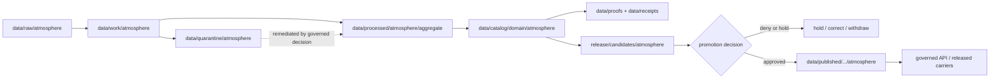

<!-- [KFM_META_BLOCK_V2]
doc_id: kfm://doc/data-processed-atmosphere-aggregate-readme
title: data/processed/atmosphere/aggregate/ — Atmosphere Aggregate Processed Data
version: v0.2.0
type: directory-readme
subtype: processed-atmosphere-aggregate-parent-lane
status: repository-grounded draft; aggregate payload, schema enforcement, validators, receipts, proof, release, and runtime behavior remain bounded
owners:
  - "NEEDS VERIFICATION — Atmosphere domain steward"
  - "NEEDS VERIFICATION — aggregate-data and method steward"
  - "NEEDS VERIFICATION — data, evidence, policy, release, correction, and rollback stewards"
created: NEEDS VERIFICATION — blank placeholder existed before v0.1 expansion
updated: 2026-07-25
policy_label: public-doc; processed-stage; atmosphere; aggregate-parent; source-role-aware; method-disclosure-required; release-gated; no-direct-public-path
path: data/processed/atmosphere/aggregate/README.md
truth_posture: >
  CONFIRMED exact target path, prior blob, Directory Rules placement, Atmosphere parent lane,
  aggregate climate child lane, Atmosphere canonical-path guidance, current advisory compatibility
  lane, and adjacent aggregate-climate PR evidence / PROPOSED parent-lane admission profile,
  aggregate packet, and downstream promotion expectations / UNKNOWN recursive payload inventory,
  real aggregation pipelines, accepted aggregate schemas, validators, receipts, proof closure,
  release instances, hosting, and public behavior / NEEDS VERIFICATION accountable owners,
  accepted child-lane inventory, enforceable comparability rules, correction propagation,
  cache invalidation, and rollback drills
evidence_snapshot:
  repository: bartytime4life/Kansas-Frontier-Matrix
  base_ref: main
  base_commit: 839781bfe8c75bdc78a2dda0c4385b4109ef580e
  prior_blob: 08a51196fe1df3771b2a0890abd6e3d598944a03
  directory_rules_blob: 2affb080e6f0043867c64c7f06c1ca52030fbd55
  atmosphere_parent_blob: e37ce206f396f832c414fc46a70dd9cd9b3f64e4
  aggregate_climate_base_blob: a8dd799435eff3cdccbe2bf42bfb7ed88c38d8f9
  canonical_paths_blob: 97296d516792ad3bc2bc1f18d03e2518e367d28a
  adjacent_climate_pr: 1711
related:
  - ../README.md
  - ../../README.md
  - ../../../README.md
  - ../../../../docs/domains/atmosphere/README.md
  - ../../../../docs/domains/atmosphere/CANONICAL_PATHS.md
  - ../../../../docs/domains/atmosphere/API_CONTRACTS.md
  - ../../../../docs/domains/atmosphere/PUBLICATION_POSTURE.md
  - ../../../../docs/doctrine/directory-rules.md
  - ../../../../contracts/domains/atmosphere/README.md
  - ../../../../contracts/domains/atmosphere/knowledge_character.md
  - ../../../../schemas/contracts/v1/domains/atmosphere/README.md
  - ../../../../policy/domains/atmosphere/README.md
  - climate/README.md
  - ../../../raw/atmosphere/README.md
  - ../../../work/atmosphere/README.md
  - ../../../quarantine/atmosphere/README.md
  - ../../../catalog/domain/atmosphere/README.md
  - ../../../triplets/README.md
  - ../../../proofs/README.md
  - ../../../receipts/README.md
  - ../../../registry/sources/atmosphere/README.md
  - ../../../../release/candidates/atmosphere/README.md
  - ../../../../release/README.md
notes:
  - "Same-path Markdown modernization only; no aggregate bytes, source state, schema, contract, policy, validator, workflow, proof, release, route, hosting, or KFM publication state changed."
  - "The parent lane may hold processed aggregate inputs and object-ready derivatives; presence here does not establish a validated object instance, comparability, evidence closure, or release readiness."
  - "Aggregation never erases source role: observation, model, forecast, proxy, advisory, normal, anomaly, report/index, and derived product remain distinct knowledge characters."
  - "Rollback target for v0.2.0 is prior blob SHA `08a51196fe1df3771b2a0890abd6e3d598944a03`."
[/KFM_META_BLOCK_V2] -->

<a id="top"></a>

# `data/processed/atmosphere/aggregate/` — Atmosphere aggregate processed data

> **One-line purpose.** Hold processed Atmosphere aggregate inputs and object-ready derivatives while preserving source role, method, scope, units, comparability, uncertainty, and correction lineage upstream of catalog, release, and publication.

[](#status)
[](#authority-level)
[](#what-belongs-here)
[](#outputs)
[](#aggregate-admission-profile)
[](#validation)

> [!IMPORTANT]
> The word **aggregate** describes a transformation family, not an authority level. An aggregate can be well-formed yet still be non-comparable, stale, rights-unclear, weakly supported, policy-held, unreleased, or unsafe for public use.

**Path:** `data/processed/atmosphere/aggregate/README.md`  
**Owning root:** `data/`  
**Lifecycle phase:** `processed/`  
**Domain segment:** `atmosphere/`  
**Lane role:** aggregate parent lane  
**Direct public access:** denied  
**Last reviewed:** 2026-07-25

**Quick navigation:** [Purpose](#purpose) · [Authority level](#authority-level) · [Status](#status) · [What belongs here](#what-belongs-here) · [What does NOT belong here](#what-does-not-belong-here) · [Inputs](#inputs) · [Outputs](#outputs) · [Validation](#validation) · [Review burden](#review-burden) · [Related folders](#related-folders) · [ADRs](#adrs) · [Last reviewed](#last-reviewed) · [Aggregate admission profile](#aggregate-admission-profile) · [Knowledge-character guardrails](#knowledge-character-guardrails) · [Child-lane posture](#child-lane-posture) · [Lifecycle and promotion](#lifecycle-and-promotion) · [Correction and rollback](#correction-and-rollback)

---

## Purpose

This directory is the Atmosphere domain's **PROCESSED-stage parent lane for aggregate products**. It may hold normalized summaries, rollups, baseline inputs, comparison inputs, derived grids, station-network aggregates, regional products, and other aggregation outputs that have moved beyond RAW capture, WORK experimentation, and QUARANTINE holds.

It exists to keep aggregate method and knowledge character visible before downstream catalog, evidence, policy, review, release, and publication gates. It is not a public map layer, API payload store, proof store, receipt authority, release authority, or source registry.

## Authority level

**Implementation-bearing lifecycle lane.** The path is CONFIRMED in the repository and is correctly placed under `data/processed/atmosphere/` according to Directory Rules' lifecycle and domain-placement rules.

Its authority is deliberately narrow:

- it may carry processed aggregate artifacts and lane-local explanatory metadata;
- it does not define Atmosphere object meaning—that remains in `contracts/domains/atmosphere/`;
- it does not define machine shape—that remains in `schemas/contracts/v1/domains/atmosphere/`;
- it does not decide admissibility—that remains in `policy/domains/atmosphere/` and release controls;
- it does not prove evidence closure, publication, or safe public use.

## Status

| Surface | Status | Evidence-bounded interpretation |
|---|---|---|
| This README and path | **CONFIRMED** | The file exists at the pinned base and is updated in place. |
| Parent Atmosphere processed lane | **CONFIRMED** | `data/processed/atmosphere/README.md` identifies `aggregate/` as an aggregate-product parent lane. |
| Aggregate climate child lane | **CONFIRMED** | `aggregate/climate/README.md` exists; draft PR #1711 separately modernizes that child. |
| Other aggregate child lanes | **UNKNOWN / PROPOSED** | Recursive child inventory was not established strongly enough to treat candidates as implemented. |
| Real aggregate payload inventory | **UNKNOWN** | This documentation pass did not inspect or expose aggregate data files. |
| Aggregate contracts and schemas | **NEEDS VERIFICATION** | Object-specific contracts exist in the domain, but no accepted universal aggregate-object schema or parent-lane enforcement was verified. |
| Validators, fixtures, CI enforcement | **NEEDS VERIFICATION** | No aggregate-parent deterministic validator suite was verified in this task. |
| Receipts, proof, policy, release, hosting, public behavior | **UNKNOWN / held** | Presence in this lane creates none of these states. |

## What belongs here

Good fits are processed aggregate artifacts whose transformation and support remain inspectable, including:

- spatial summaries over declared counties, regions, grids, station networks, climate zones, smoke zones, or other governed support units;
- temporal summaries over declared hourly, daily, monthly, seasonal, annual, rolling-window, reference-period, or event-context intervals;
- aggregate observation products that preserve observation identity and source lineage;
- aggregate model or forecast products that remain explicitly labeled modeled or forecast;
- aggregate proxy products such as AOD or smoke-context summaries that remain explicitly labeled proxy/context;
- normal, baseline, anomaly-ready, and comparison-ready inputs that preserve reference and comparison periods;
- quality, missingness, coverage, interpolation, correction, uncertainty, and caveat metadata stored as non-authoritative sidecars when appropriate;
- object-ready derivatives prepared for contract/schema validation, catalog closure, EvidenceBundle support, or release review;
- lane-local README or non-release manifest notes that explain artifact identity without becoming receipts, proofs, catalogs, or release decisions.

## What does NOT belong here

Do not place these in `data/processed/atmosphere/aggregate/`:

- RAW station feeds, source-native grids, downloaded reports, bulletins, advisories, forecasts, model files, satellite products, screenshots, or source logs;
- WORK notebooks, scratch rollups, temporary joins, incomplete interpolation, experiment outputs, or debugging products;
- QUARANTINE material with unresolved source role, rights, method, baseline, units, time, support geometry, quality, sensitivity, or dispute state;
- direct non-aggregate object records that have a narrower accepted processed lane;
- semantic contracts, JSON Schemas, policy rules, validators, tests, fixtures, executable pipelines, packages, or application code;
- `EvidenceBundle`, proof, receipt, catalog, STAC, DCAT, PROV, triplet, release, correction, withdrawal, rollback, or published artifacts;
- climate attribution, trend-significance, regulatory-compliance, hazard-impact, damage, exposure, health, emergency, or life-safety conclusions unsupported by separate evidence and authority;
- aggregates that silently collapse AQI into concentration, AOD into PM2.5, model into observation, forecast into observation, advisory into KFM-issued guidance, or normal into trend evidence.

## Inputs

Inputs may arrive only through governed lifecycle transitions from:

- `data/work/atmosphere/` after the declared transform, aggregation, normalization, and validation posture is recorded;
- `data/quarantine/atmosphere/` after the hold condition is resolved and the remediation decision is auditable;
- accepted Atmosphere pipelines or tools that preserve source, method, units, spatial support, temporal support, and correction lineage;
- upstream object-family lanes when the aggregate is a derivative and the relationship to the contributing records remains explicit.

A direct connector-to-PROCESSED or watcher-to-PROCESSED shortcut is not an accepted normal path. Connectors admit source material to RAW or QUARANTINE; promotion into this lane is a governed transition.

## Outputs

This lane may support downstream candidates for:

- `data/catalog/domain/atmosphere/` and accepted STAC/DCAT/PROV projections;
- `data/triplets/` or other derived relationship projections that retain source/evidence links;
- `data/proofs/` and `data/receipts/` through separate emitted objects;
- `release/candidates/atmosphere/` after identity, evidence, policy, review, validation, correction, and rollback obligations are met;
- `data/published/` only through a governed release transition and a separate released artifact path;
- governed API, MapLibre, Evidence Drawer, export, or Focus Mode carriers only after public-safe release.

> [!CAUTION]
> Ordinary public clients must not read this directory directly. A processed aggregate is not a released claim merely because it is easy to render or summarize.

## Validation

No aggregate-parent production validator was verified in this task. Until accepted contracts, schemas, fixtures, validators, and CI evidence exist, validation claims must remain bounded.

A credible aggregate validation profile should check, at minimum:

1. source and source-role identity;
2. variable and unit compatibility;
3. aggregation method and version;
4. spatial support and weighting;
5. temporal window, reference period, and comparison period where applicable;
6. contributing-record coverage, missingness, and exclusion rules;
7. interpolation, correction, calibration, and quality flags;
8. deterministic identity or content/method digest where practical;
9. uncertainty and public caveats;
10. evidence references, policy posture, review state, release hold, correction path, and rollback target.

Fail closed or quarantine when any material field is absent, contradictory, unsupported, non-comparable, rights-unclear, stale beyond policy, or unsafe for the requested downstream use.

## Review burden

Changes require review proportional to consequence:

| Change | Minimum review burden |
|---|---|
| README wording or navigation only | Docs steward plus Atmosphere/domain reviewer. |
| New child-lane admission or renamed aggregate family | Atmosphere steward, data/pipeline steward, docs steward, and Directory Rules review. |
| Method, units, baseline, comparability, or uncertainty semantics | Atmosphere subject-matter reviewer plus contract/schema and validation reviewers. |
| Public-facing candidate, map, API, Focus Mode, export, or release linkage | Evidence, policy, release, correction, rollback, and domain review; independent approval where policy requires it. |
| Attribution, hazard, regulatory, health, or life-safety implication | Hold by default; require the owning authority/domain and evidence appropriate to the consequence. |

Accountable named owners and CODEOWNERS coverage remain **NEEDS VERIFICATION**.

## Related folders

| Responsibility | Repository home | Relationship |
|---|---|---|
| Atmosphere processed parent | [`../`](../) | Defines the broader PROCESSED domain lane and child-lane index. |
| Aggregate climate child | [`climate/`](./climate/) | Climate baseline and anomaly-ready aggregate derivatives; separately modernized in draft PR #1711. |
| Atmosphere contracts | [`../../../../contracts/domains/atmosphere/`](../../../../contracts/domains/atmosphere/) | Object meaning and knowledge-character distinctions. |
| Atmosphere schemas | [`../../../../schemas/contracts/v1/domains/atmosphere/`](../../../../schemas/contracts/v1/domains/atmosphere/) | Machine shape; maturity varies by object and must be verified. |
| Atmosphere policy | [`../../../../policy/domains/atmosphere/`](../../../../policy/domains/atmosphere/) | Admissibility and anti-collapse policy. |
| Source registry | [`../../../registry/sources/atmosphere/`](../../../registry/sources/atmosphere/) | Source identity, role, rights, and activation posture. |
| Domain catalog | [`../../../catalog/domain/atmosphere/`](../../../catalog/domain/atmosphere/) | Downstream discovery/catalog closure. |
| Receipts | [`../../../receipts/`](../../../receipts/) | Run, transform, aggregation, validation, correction, and related process memory. |
| Proofs | [`../../../proofs/`](../../../proofs/) | Evidence/proof support; separate from processed artifacts. |
| Release candidates | [`../../../../release/candidates/atmosphere/`](../../../../release/candidates/atmosphere/) | Candidate dossiers; a candidate is not a release. |
| Release decisions | [`../../../../release/`](../../../../release/) | Manifests, promotion decisions, corrections, withdrawals, and rollback. |

## ADRs

No accepted ADR was verified as specifically defining the internal `aggregate/` child taxonomy.

Relevant governing decisions and open tensions include:

- ADR-0001 schema-home posture: machine schemas belong under `schemas/contracts/v1/...`;
- the unresolved `atmosphere/` versus `air/` segment tension documented in `docs/domains/atmosphere/CANONICAL_PATHS.md`;
- any future child-lane creation, rename, or parallel authority proposal must be checked against Directory Rules and current ADRs before implementation.

## Last reviewed

**2026-07-25.** Re-review when any of these occurs:

- an aggregate-parent schema or validator is accepted;
- a new aggregate child lane is implemented;
- aggregate data inventory is added or migrated;
- the `atmosphere/` versus `air/` naming question is resolved;
- downstream catalog, proof, release, API, map, export, or Focus Mode behavior changes;
- six months elapse without review.

---

<a id="1-scope"></a>

## Aggregate admission profile

The following is a **PROPOSED parent-lane profile**, not an implemented universal schema.

| Dimension | Minimum auditable posture |
|---|---|
| Identity | Stable artifact ID plus source/method lineage; deterministic digest where practical. |
| Knowledge character | Observation aggregate, model aggregate, forecast aggregate, proxy/context aggregate, normal/baseline, anomaly/comparison, report/index, or other declared derivative. |
| Variable and units | Variable identity, canonical or source unit, conversion method, and incompatible-unit rejection. |
| Spatial support | Declared geometry/support unit, coverage, weighting, resolution, and any generalization. |
| Temporal support | Observation/source interval, aggregation window, timezone/calendar handling, reference period, comparison period, and freshness. |
| Method | Aggregation function, grouping keys, weighting, interpolation, correction, calibration, exclusions, software/spec version, and method digest. |
| Coverage and quality | Contributing-record count, expected coverage, missingness, station/network composition, QA flags, uncertainty, and caveats. |
| Evidence and governance | SourceDescriptor/EvidenceRef context, validation state, PolicyDecision or hold, review state, release state, correction lineage, and rollback target. |

Averages, sums, percentiles, maxima, minima, counts, rates, indices, normals, and anomalies are not interchangeable. The method and denominator must remain visible.

<a id="2-lifecycle-boundary"></a>

## Knowledge-character guardrails

Aggregation must preserve what kind of knowledge produced the value:

- **Observation aggregate:** derived from observations; it is not a raw observation and does not become regulatory truth automatically.
- **Model aggregate:** derived from modeled fields; it must never be labeled observed.
- **Forecast aggregate:** retains issue time, valid time, horizon, model/version, and supersession posture.
- **Proxy/context aggregate:** AOD, smoke masks, or related remote-sensing/context products remain proxies or context.
- **AQI/report aggregate:** AQI or public-report indices remain reports/indices, not pollutant concentration.
- **Normal/baseline:** a declared reference-period aggregate; not a trend or anomaly by itself.
- **Anomaly/comparison:** a difference or departure anchored to a declared compatible baseline; not attribution or impact proof.
- **Advisory aggregate:** an aggregation of official-source advisory context; never a KFM-issued advisory or instruction.

> [!WARNING]
> Aggregation can increase apparent authority while hiding incompatibility. Do not combine differing units, methods, source roles, station classes, baselines, calendars, spatial supports, or quality regimes without an explicit and reviewed comparability rule.

<a id="3-repo-fit"></a>

## Child-lane posture

**CONFIRMED child:**

| Lane | Current evidence | Boundary |
|---|---|---|
| `climate/` | README exists; draft PR #1711 documents `ClimateNormal` and `ClimateAnomaly` object-ready derivatives and permissive schema scaffolds. | Climate aggregate inputs are not automatically validated object instances or released climate claims. |

**Additional children:** UNKNOWN until current directory inventory and an admitted responsibility justify them. Earlier README candidates such as `air_quality/`, `weather/`, `smoke_aod/`, or `advisory/` remain design possibilities, not repo facts.

Before creating a child lane:

1. identify a distinct responsibility that cannot be expressed safely in an existing lane;
2. verify current repository inventory and canonical-path guidance;
3. define the object/derivative relationship without creating a parallel contract or schema home;
4. define source-role, method, units, comparability, freshness, evidence, policy, and release boundaries;
5. add representative offline fixtures and deterministic validation where feasible;
6. document correction and rollback;
7. cite Directory Rules in the PR.

<a id="4-accepted-contents"></a>

## Lifecycle and promotion

```text
RAW -> WORK / QUARANTINE -> PROCESSED -> CATALOG / TRIPLET -> PUBLISHED
```


```mermaid
flowchart LR
  RAW["data/raw/atmosphere"] --> WORK["data/work/atmosphere"]
  WORK --> HOLD["data/quarantine/atmosphere"]
  WORK --> AGG["data/processed/atmosphere/aggregate"]
  HOLD -. remediated by governed decision .-> AGG
  AGG --> CAT["data/catalog/domain/atmosphere"]
  CAT --> PROOF["data/proofs + data/receipts"]
  CAT --> RC["release/candidates/atmosphere"]
  RC --> DECISION{"promotion decision"}
  DECISION -- deny or hold --> HOLD2["hold / correct / withdraw"]
  DECISION -- approved --> PUB["data/published/.../atmosphere"]
  PUB --> API["governed API / released carriers"]
```

The diagram is an operating model, not proof that each producer, schema, validator, or release object currently exists. Promotion is a governed state transition, not copying an aggregate into a public directory.

<a id="5-exclusions"></a>

## Correction and rollback

An aggregate must remain correctable when:

- source observations are corrected or withdrawn;
- station/network membership changes;
- method, units, weighting, interpolation, calibration, or baseline is found wrong;
- late-arriving records change coverage;
- a forecast or advisory is superseded;
- rights, policy, or review state changes;
- a published derivative is shown to be misleading or non-comparable.

A release-capable aggregate packet should identify:

- contributing source/dataset versions;
- method/spec version and digest;
- prior aggregate or release, if any;
- affected catalog, proof, tile, API, cache, export, and UI carriers;
- correction or withdrawal notice;
- recomputation and invalidation plan;
- rollback target.

Rollback this README change by reverting its commit or restoring prior blob `08a51196fe1df3771b2a0890abd6e3d598944a03`. Do not rewrite shared history.

<a id="6-aggregate-requirements"></a>

## Open verification register

| Item | Status | Evidence needed |
|---|---|---|
| Recursive child and payload inventory | **UNKNOWN** | Commit-pinned tree/file inventory that avoids exposing sensitive or bulky data. |
| Universal aggregate contract/schema | **UNKNOWN** | Accepted semantic contract, field-complete schema, compatibility plan, and fixtures. |
| Parent aggregate validator and CI | **NEEDS VERIFICATION** | Deterministic command, representative positive/negative fixtures, stable findings, and workflow wiring. |
| AggregationReceipt shape and producer | **NEEDS VERIFICATION** | Accepted contract/schema, emitted receipt examples, validator, and storage path. |
| Comparability policy | **NEEDS VERIFICATION** | Explicit rules for units, methods, station classes, baselines, calendars, spatial supports, and source roles. |
| Evidence and release closure | **UNKNOWN** | EvidenceBundle/proof, PolicyDecision, review, ReleaseManifest, correction, withdrawal, and rollback instances. |
| Public consumers | **UNKNOWN** | Governed API, map, export, or Focus Mode contract and runtime evidence tied to a release. |
| Accountable owners and separation of duties | **NEEDS VERIFICATION** | CODEOWNERS, reviewer assignments, and approved governance records. |

<a id="7-source-role-guardrails"></a>

## No-loss ledger

| Prior material | Disposition in v0.2.0 |
|---|---|
| Blank-placeholder lineage | Preserved in metadata and rollback history. |
| PROCESSED-stage and no-direct-public boundary | Preserved and strengthened. |
| Aggregate method, scope, units, uncertainty, evidence, policy, and release requirements | Preserved and expanded into the admission profile. |
| AQI ≠ concentration, AOD ≠ PM2.5, model/forecast ≠ observation, advisory authority boundary | Preserved in knowledge-character guardrails. |
| Climate child lane | Preserved and linked to adjacent draft PR #1711 without claiming it is merged. |
| Candidate future child lanes | Retained only as UNKNOWN design possibilities rather than presented as implemented directories. |
| Speculative directory tree | Removed because recursive inventory was not verified. |
| Validation checklist | Converted into explicit current status, validation profile, and open verification register. |
| Correction and rollback | Preserved and expanded to include downstream invalidation and recomputation. |

<p align="right"><a href="#top">Back to top</a></p>
