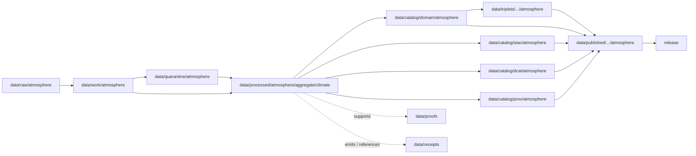

<!-- [KFM_META_BLOCK_V2]
doc_id: kfm://doc/data-processed-atmosphere-aggregate-climate-readme
title: data/processed/atmosphere/aggregate/climate/README.md — Atmosphere Aggregate Climate Processed Data README
version: v0.1
type: readme; data-lifecycle-sublane; processed-stage-guide; atmosphere-domain-lane; aggregate-climate-lane
status: draft; PROPOSED; data-root; processed-stage; atmosphere; aggregate; climate; release-gated; baseline-aware; source-role-aware
owners: OWNER_TBD — Atmosphere steward · Climate steward · Aggregate-data steward · Data steward · Pipeline steward · Evidence steward · Policy steward · Release steward · Docs steward
created: NEEDS VERIFICATION — blank placeholder existed before v0.1 expansion
updated: 2026-06-25
policy_label: public-doc; data; processed; atmosphere; aggregate; climate; lifecycle; governed; release-gated
tags: [kfm, data, processed, atmosphere, aggregate, climate, ClimateNormal, ClimateAnomaly, lifecycle, RAW, WORK, QUARANTINE, CATALOG, TRIPLET, PUBLISHED, EvidenceBundle, SourceDescriptor, AggregationReceipt, ValidationReport, PolicyDecision, ReleaseManifest]
related:
  - ../../README.md
  - ../README.md
  - ../../../README.md
  - ../../../../README.md
  - ../../../../../docs/domains/atmosphere/README.md
  - ../../../../../contracts/domains/atmosphere/ClimateNormal.md
  - ../../../../../contracts/domains/atmosphere/ClimateAnomaly.md
  - ../../../../../schemas/contracts/v1/domains/atmosphere/ClimateNormal.schema.json
  - ../../../../../schemas/contracts/v1/domains/atmosphere/ClimateAnomaly.schema.json
  - ../../../../../policy/domains/atmosphere/
  - ../../../../../docs/doctrine/directory-rules.md
  - ../../../../../docs/doctrine/lifecycle-law.md
  - ../../../../../docs/doctrine/trust-membrane.md
  - ../../../../raw/atmosphere/
  - ../../../../work/atmosphere/
  - ../../../../quarantine/atmosphere/
  - ../../../../catalog/domain/atmosphere/README.md
  - ../../../../catalog/stac/atmosphere/
  - ../../../../catalog/dcat/atmosphere/
  - ../../../../catalog/prov/atmosphere/
  - ../../../../triplets/
  - ../../../../published/
  - ../../../../proofs/
  - ../../../../receipts/
  - ../../../../registry/
  - ../../../../../release/
  - ../../../../../pipelines/
  - ../../../../../tools/validators/
notes:
  - "This file replaces a blank placeholder at `data/processed/atmosphere/aggregate/climate/README.md`."
  - "This lane is for processed aggregate climate artifacts under Atmosphere, especially ClimateNormal and ClimateAnomaly derivatives, not raw observations, raw station records, forecasts, attribution claims, catalog records, proofs, receipts, releases, or public layers."
  - "Climate aggregate products must preserve source role, baseline period, aggregation method, spatial/temporal scope, units, uncertainty/caveats, evidence linkage, policy posture, and release state before public use."
  - "ClimateNormal and ClimateAnomaly contracts define object meaning; this README does not create a second contract or schema authority."
  - "Rollback target for this expansion is previous blank blob SHA `8b137891791fe96927ad78e64b0aad7bded08bdc`."
[/KFM_META_BLOCK_V2] -->

<a id="top"></a>

# data/processed/atmosphere/aggregate/climate

> Atmosphere PROCESSED-stage sublane for aggregate climate artifacts: governed climate normals, anomaly-ready baselines, and baseline-relative climate derivatives that remain upstream of catalog, proof, release, and public map/API/UI surfaces.

<p>
  
  
  
  
  
  
</p>

**Status:** draft / PROPOSED  
**Owners:** OWNER_TBD — Atmosphere steward · Climate steward · Aggregate-data steward · Data steward · Pipeline steward · Evidence steward · Policy steward · Release steward · Docs steward  
**Path:** `data/processed/atmosphere/aggregate/climate/README.md`  
**Owning root:** `data/processed/`  
**Domain segment:** `atmosphere`  
**Sublane:** `aggregate/climate`  
**Primary object families:** `ClimateNormal`, `ClimateAnomaly`-ready aggregate derivatives, and climate-context aggregate products  
**Lifecycle stage:** `PROCESSED`  
**Exposure posture:** not public by default; public use requires governed catalog, evidence, aggregation/baseline disclosure, policy, release, correction, and rollback linkage  
**Truth posture:** CONFIRMED target was blank · CONFIRMED Atmosphere owns climate normals and climate anomalies · CONFIRMED `ClimateNormal` and `ClimateAnomaly` contracts exist · PROPOSED aggregate/climate processed-sublane details · NEEDS VERIFICATION for actual child inventory, schemas beyond scaffolds, validators, receipts, CI enforcement, release linkage, and governed route behavior.

**Quick jumps:** [Purpose](#purpose) · [Lifecycle boundary](#lifecycle-boundary) · [Repo fit](#repo-fit) · [Accepted contents](#accepted-contents) · [Exclusions](#exclusions) · [Aggregate climate requirements](#aggregate-climate-requirements) · [Climate guardrails](#climate-guardrails) · [Directory map](#directory-map) · [Evidence ledger](#evidence-ledger) · [Validation checklist](#validation-checklist) · [Rollback](#rollback)

---

## Purpose

`data/processed/atmosphere/aggregate/climate/` holds normalized aggregate climate artifacts that have moved beyond RAW capture, WORK transforms, and QUARANTINE holds.

This lane is for processed climate-normal, climate-baseline, climate-anomaly-prep, and baseline-relative climate-context artifacts that preserve source identity, source role, reference period, aggregation method, variable, units, spatial scope, temporal scope, uncertainty/caveats, validation posture, evidence references, and downstream catalog readiness.

It is not a public climate layer. It is not a proof of climate attribution, trend significance, hazard impact, damages, or health/safety guidance. It is a governed lifecycle handoff lane for aggregate climate context that may later support catalog records, EvidenceBundle-backed UI payloads, public-safe map layers, Focus Mode summaries, or release packages after gates pass.

## Lifecycle boundary

```text
RAW -> WORK / QUARANTINE -> PROCESSED -> CATALOG / TRIPLET -> PUBLISHED
```



`data/processed/atmosphere/aggregate/climate/` is upstream of catalog, triplet, publication, and release. It must not be used as a normal public map/API/UI/AI source.

## Repo fit

| Responsibility | Correct home | Rule |
|---|---|---|
| Raw climate, weather, station, grid, normal, anomaly, or model source payloads | `data/raw/atmosphere/` | Not this lane. |
| In-process aggregation, joins, scratch outputs, temporary baselines, or method experiments | `data/work/atmosphere/` | Not this lane. |
| Rights-unclear, baseline-unclear, malformed, unsupported, disputed, or unsafe climate aggregate material | `data/quarantine/atmosphere/` | Not this lane until resolved. |
| Normalized aggregate climate processed artifacts | `data/processed/atmosphere/aggregate/climate/` | This lane. |
| Atmosphere domain catalog records | `data/catalog/domain/atmosphere/` | Downstream catalog stage. |
| Atmosphere STAC/DCAT/PROV records | `data/catalog/{stac,dcat,prov}/atmosphere/` | Downstream catalog projections, if accepted. |
| Atmosphere triplet/graph projections | `data/triplets/.../atmosphere/` | Downstream graph stage. |
| Atmosphere public-safe products | `data/published/.../atmosphere/` | Downstream after release. |
| EvidenceBundle/proof records | `data/proofs/` | Separate proof family. |
| Source, run, transform, aggregation, validation, policy, correction, and release receipts | `data/receipts/` | Separate receipt family. |
| SourceDescriptor/source registry records | `data/registry/` | Separate registry family. |
| Release decisions, manifests, rollback cards, corrections, withdrawals | `release/` | Separate publication authority. |
| ClimateNormal semantic contract | `contracts/domains/atmosphere/ClimateNormal.md` | Object meaning; not data. |
| ClimateAnomaly semantic contract | `contracts/domains/atmosphere/ClimateAnomaly.md` | Object meaning; not data. |
| Climate schemas | `schemas/contracts/v1/domains/atmosphere/` | Machine shape; not data. |
| Policy, validators, tests, pipelines, apps, packages | `policy/`, `tools/validators/`, `tests/`, `pipelines/`, `apps/`, `packages/` | Separate roots. |

## Accepted contents

Processed aggregate climate data may include:

- normalized `ClimateNormal`-ready aggregate artifacts for declared reference periods;
- normalized `ClimateAnomaly`-ready baseline-relative derivatives anchored to declared climate normals or reviewed baselines;
- aggregate temperature, precipitation, drought/climate-context, or other supported atmosphere/climate variables when source role, units, aggregation window, and method are preserved;
- spatial aggregate products such as county, region, grid, tile-safe, station-network, basin-adjacent, or other governed aggregate units when the spatial unit is documented;
- temporal aggregate products such as monthly, seasonal, annual, climatological-normal, rolling-window, or reference-period summaries when the temporal unit is documented;
- uncertainty, caveat, quality, missingness, station coverage, interpolation, and method metadata sidecars when those sidecars are not proofs, receipts, source registry records, catalog records, schemas, or policy rules;
- processed artifacts prepared for downstream catalog/STAC/DCAT/PROV packaging, EvidenceBundle support, or release review.

## Exclusions

Do not store these under `data/processed/atmosphere/aggregate/climate/`:

- RAW source files, raw station observations, raw gridded products, source-native climate normals, source-native anomaly products, forecasts, model fields, screenshots, or downloads.
- WORK/scratch outputs that have not passed processing gates.
- Quarantined, malformed, baseline-unclear, source-role-unclear, rights-unclear, unsupported, disputed, stale, or unsafe climate aggregate material.
- Direct observation records such as `TemperatureObservation`, `PrecipitationObservation`, `WeatherObservation`, station records, air-quality observations, AQI summaries, smoke/AOD rasters, advisory context, or forecast/model objects unless only referenced as lineage and stored in their correct lanes.
- Climate attribution claims, trend-significance claims, event/hazard truth, damages, health/safety claims, or policy conclusions.
- Domain catalog records, STAC records, DCAT records, PROV records, triplet/graph records, published outputs, proofs, receipts, source registry records, release records, schemas, policy rules, validators, tests, pipelines, app/UI/API code.

## Aggregate climate requirements

PROPOSED until concrete validators and CI enforcement are verified:

| Requirement | Meaning |
|---|---|
| Source trace | Every processed aggregate climate artifact should trace to SourceDescriptor or source registry context when source authority matters. |
| Baseline disclosure | Climate-normal and climate-anomaly artifacts must preserve reference period or baseline identity. |
| Aggregation receipt | Aggregation method, spatial unit, temporal unit, variable, units, weighting, interpolation, missingness, and quality posture should resolve to receipt or validation context. |
| Source-role preservation | Observations, model fields, forecasts, normals, anomalies, and derived aggregate products must remain labeled as their actual role. |
| Anomaly anchor | A `ClimateAnomaly`-ready artifact must anchor to a `ClimateNormal` or reviewed baseline; it must not define its baseline implicitly. |
| Evidence linkage | Claims about baseline, anomaly, method, scope, uncertainty, correction, or release should resolve downstream to EvidenceBundle/proof context. |
| Policy posture | Public display requires rights, source-role, baseline, aggregation, caveat, and policy/admissibility posture. |
| Catalog readiness | Processed aggregate climate artifacts intended for discovery should promote through Atmosphere catalog lanes, not directly to public use. |
| Release readiness | Public use requires release state, published output path, correction path, and rollback target. |
| No attribution by default | Aggregate climate context does not prove cause, impact, damages, or trend significance without separate evidence and review. |

## Climate guardrails

- A climate normal is an aggregated/reference-period baseline, not a direct sensor reading.
- A climate anomaly is a baseline-relative derived/context statement, not a raw observation or standalone attribution claim.
- Model fields and forecasts must remain labeled as model or forecast context.
- Public climate products require baseline-period disclosure, aggregation/method disclosure, evidence, policy, release state, correction path, and rollback target.
- Unreleased processed aggregate climate artifacts are not public merely because they exist under this directory.
- Focus Mode may summarize aggregate climate context only as evidence-bounded, baseline-aware, aggregation-aware, and release-aware context. It must not invent attribution, trend significance, hazard impacts, damages, or health/safety guidance.

> [!CAUTION]
> Do not use this lane as a shortcut from processed aggregate climate data to public claims. Climate-normal and climate-anomaly products must pass catalog, evidence, policy, validation, release, correction, and rollback gates before public use.

## Directory map

Actual child inventory remains **NEEDS VERIFICATION**. Use this as a proposed local organization pattern only after confirming current repo convention and validators.

```text
data/processed/atmosphere/aggregate/climate/
├── README.md
├── normals/                 # PROPOSED — processed ClimateNormal-ready baselines
├── anomalies/               # PROPOSED — processed ClimateAnomaly-ready derivatives
├── baselines/               # PROPOSED — reference-period baseline support
├── methods/                 # PROPOSED — local method summaries, not canonical receipts
├── quality/                 # PROPOSED — missingness, coverage, uncertainty, caveats
├── _manifests/              # PROPOSED — lane-local non-release manifests only
└── _README_TODO.md          # PROPOSED — remove after actual child inventory is documented
```

## Evidence ledger

| Source | Status | Supports | Limits |
|---|---|---|---|
| Previous file | CONFIRMED | Target existed as a blank placeholder. | Did not define aggregate climate PROCESSED-stage boundaries. |
| `data/processed/atmosphere/README.md` | CONFIRMED | Parent atmosphere processed lane exists as a greenfield stub. | Does not define parent boundaries yet. |
| `data/processed/README.md` | CONFIRMED | Parent processed lane is upstream of catalog, triplets, and publication and is not public by default. | Does not prove child inventory under this lane. |
| `data/catalog/domain/atmosphere/README.md` | CONFIRMED | Atmosphere catalog lane includes climate normals and climate anomalies downstream and preserves source-role guardrails. | Does not prove aggregate climate processed inventory or release behavior. |
| `docs/domains/atmosphere/README.md` | CONFIRMED doctrine / PROPOSED implementation | Atmosphere owns climate context, normals, anomalies, source-role denials, and lane placement pattern. | Implementation maturity and runtime behavior remain NEEDS VERIFICATION. |
| `contracts/domains/atmosphere/ClimateNormal.md` | CONFIRMED contract file | Defines ClimateNormal as a governed reference-period baseline, not observation, anomaly, attribution, proof, or release. | Contract does not prove schema enforcement, validator behavior, or release approval. |
| `contracts/domains/atmosphere/ClimateAnomaly.md` | CONFIRMED contract file | Defines ClimateAnomaly as baseline-relative climate context anchored to a normal/baseline. | Contract does not prove schema enforcement, validator behavior, or release approval. |
| `docs/doctrine/directory-rules.md` | CONFIRMED doctrine / PROPOSED path specifics | Data paths encode lifecycle phase and domain segment; promotion is governed. | Does not prove runtime enforcement. |

## Validation checklist

- [ ] Confirm actual child directories under `data/processed/atmosphere/aggregate/climate/`.
- [ ] Confirm accepted aggregate climate source/domain path convention.
- [ ] Confirm `ClimateNormal` and `ClimateAnomaly` schema fields are updated beyond scaffolds if needed.
- [ ] Confirm aggregate climate processed validators and CI checks.
- [ ] Confirm SourceDescriptor/source registry linkage for each source-derived aggregate climate artifact.
- [ ] Confirm RunReceipt, TransformReceipt, AggregationReceipt, ValidationReport, PolicyDecision, correction path, and rollback target where applicable.
- [ ] Confirm baseline period, aggregation method, spatial unit, temporal unit, variable, units, uncertainty, caveats, missingness, and source-role handling.
- [ ] Confirm no RAW, WORK, QUARANTINE, CATALOG, TRIPLET, PUBLISHED, proof, receipt, release, schema, policy, validator, package, pipeline, app, API, attribution, hazard-impact, or health/safety artifacts are misplaced here.
- [ ] Confirm promotion flow from processed aggregate climate data to catalog/triplet/published outputs is governed, baseline-aware, aggregation-aware, source-role-safe, evidence-backed, and reversible.
- [ ] Confirm public clients and Focus Mode cannot use this lane as a direct public climate-claim, attribution, trend-significance, hazard-impact, or health/safety source.

## Rollback

Rollback is required if this lane becomes an Atmosphere source-data root, quarantine bypass, proof store, receipt store, catalog root, triplet root, source-registry root, release-decision root, published-output root, schema root, policy root, validator root, implementation root, public API shortcut, public exposure shortcut, climate-attribution source, trend-significance source, hazard-impact source, or health/safety guidance source.

Rollback target for this expansion: previous blank blob SHA `8b137891791fe96927ad78e64b0aad7bded08bdc`.

<p align="right"><a href="#top">Back to top</a></p>
