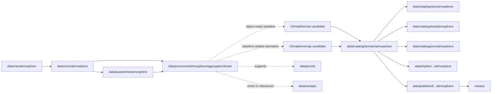

<!-- [KFM_META_BLOCK_V2]
doc_id: kfm://doc/data-processed-atmosphere-aggregate-climate-readme
title: data/processed/atmosphere/aggregate/climate/README.md — Atmosphere Aggregate Climate Processed Data README
version: v0.2
type: readme; data-lifecycle-sublane; processed-stage-guide; atmosphere-domain-lane; aggregate-climate-lane; object-ready-derivative-guide
status: draft; PROPOSED; data-root; processed-stage; atmosphere; aggregate; climate; release-gated; baseline-aware; source-role-aware; schema-scaffold-aware
owners: OWNER_TBD — Atmosphere steward · Climate steward · Aggregate-data steward · Data steward · Pipeline steward · Evidence steward · Policy steward · Release steward · Docs steward
created: NEEDS VERIFICATION — blank placeholder existed before v0.1 expansion
updated: 2026-07-25
policy_label: public-doc; data; processed; atmosphere; aggregate; climate; lifecycle; governed; release-gated
tags: [kfm, data, processed, atmosphere, aggregate, climate, ClimateNormal, ClimateAnomaly, baseline, comparability, lifecycle, RAW, WORK, QUARANTINE, CATALOG, TRIPLET, PUBLISHED, EvidenceBundle, SourceDescriptor, AggregationReceipt, ValidationReport, PolicyDecision, ReleaseManifest]
related:
  - ../../README.md
  - ../README.md
  - ../../../README.md
  - ../../../../README.md
  - ../../../../../docs/domains/atmosphere/README.md
  - ../../../../../docs/domains/atmosphere/CANONICAL_PATHS.md
  - ../../../../../contracts/domains/atmosphere/ClimateNormal.md
  - ../../../../../contracts/domains/atmosphere/ClimateAnomaly.md
  - ../../../../../schemas/contracts/v1/domains/atmosphere/ClimateNormal.schema.json
  - ../../../../../schemas/contracts/v1/domains/atmosphere/ClimateAnomaly.schema.json
  - ../../../../../policy/domains/atmosphere/
  - ../../../../../docs/doctrine/directory-rules.md
  - ../../../../../docs/doctrine/lifecycle-law.md
  - ../../../../../docs/doctrine/trust-membrane.md
  - ../../../../raw/atmosphere/
  - ../../../../work/atmosphere/
  - ../../../../quarantine/atmosphere/
  - ../../../../catalog/domain/atmosphere/README.md
  - ../../../../catalog/stac/atmosphere/
  - ../../../../catalog/dcat/atmosphere/
  - ../../../../catalog/prov/atmosphere/
  - ../../../../triplets/
  - ../../../../published/
  - ../../../../proofs/
  - ../../../../receipts/
  - ../../../../registry/
  - ../../../../../release/
  - ../../../../../pipelines/
  - ../../../../../tools/validators/
notes:
  - "This file preserves the existing `data/processed/atmosphere/aggregate/climate/` path and modernizes its processed-stage boundaries."
  - "This lane holds aggregate climate inputs and object-ready derivatives; it does not claim that permissive scaffold schemas currently enforce ClimateNormal or ClimateAnomaly records."
  - "ClimateNormal and ClimateAnomaly contracts define object meaning; paired schemas remain PROPOSED scaffolds with empty properties and additionalProperties enabled."
  - "Climate aggregates must preserve reference period, comparison period, variable, units, aggregation method, spatial and temporal support, missingness, uncertainty, correction lineage, and source role before downstream use."
  - "Rollback target for v0.2 is prior blob SHA `a8dd799435eff3cdccbe2bf42bfb7ed88c38d8f9`."
[/KFM_META_BLOCK_V2] -->

<a id="top"></a>

# data/processed/atmosphere/aggregate/climate

> Atmosphere PROCESSED-stage sublane for governed aggregate climate inputs and object-ready derivatives. It supports `ClimateNormal` baselines and `ClimateAnomaly` comparisons while remaining upstream of catalog, proof, release, and public map/API/UI surfaces.

<p>
  
  
  
  
  
  
  
</p>

**Status:** draft / PROPOSED  
**Owners:** OWNER_TBD — Atmosphere steward · Climate steward · Aggregate-data steward · Data steward · Pipeline steward · Evidence steward · Policy steward · Release steward · Docs steward  
**Path:** `data/processed/atmosphere/aggregate/climate/README.md`  
**Owning root:** `data/processed/`  
**Domain segment:** `atmosphere`  
**Sublane:** `aggregate/climate`  
**Primary object relationships:** aggregate inputs and object-ready derivatives for `ClimateNormal` and `ClimateAnomaly`  
**Lifecycle stage:** `PROCESSED`  
**Exposure posture:** not public by default; downstream use requires governed catalog, evidence, baseline and method disclosure, policy, release, correction, and rollback linkage  
**Truth posture:** CONFIRMED this path, parent aggregate lane, `ClimateNormal` and `ClimateAnomaly` contracts, and paired schema files exist · CONFIRMED paired schemas are permissive PROPOSED scaffolds with empty properties and `additionalProperties: true` · PROPOSED processed-lane field and validation expectations · NEEDS VERIFICATION for actual child inventory, enforceable schemas, validators, fixtures, receipts, CI enforcement, release linkage, and governed route behavior.

**Quick jumps:** [Purpose](#purpose) · [Lane identity](#lane-identity) · [Lifecycle boundary](#lifecycle-boundary) · [Repo fit](#repo-fit) · [Accepted contents](#accepted-contents) · [Exclusions](#exclusions) · [Aggregate climate requirements](#aggregate-climate-requirements) · [Comparability rules](#comparability-rules) · [Climate guardrails](#climate-guardrails) · [Directory map](#directory-map) · [Evidence ledger](#evidence-ledger) · [Validation checklist](#validation-checklist) · [Rollback](#rollback)

---

## Purpose

`data/processed/atmosphere/aggregate/climate/` holds normalized aggregate climate artifacts that have moved beyond RAW capture, WORK transforms, and QUARANTINE holds.

The lane supports:

- declared reference-period baselines that may become `ClimateNormal` objects after contract, schema, validation, evidence, and release gates;
- baseline-relative derivatives that may become `ClimateAnomaly` objects after the same gates;
- climate aggregate products whose source role, variable, units, spatial support, temporal support, aggregation method, weighting, interpolation, missingness, uncertainty, and correction lineage remain visible;
- deterministic handoff into catalog, evidence, review, and release workflows.

It does **not** turn aggregate files into validated `ClimateNormal` or `ClimateAnomaly` records merely because they are stored here. The current paired schemas are scaffolds and do not yet enforce the contracts' recommended fields or invariants.

It is also not a public climate layer, climate-attribution service, trend-significance proof, hazard-impact record, damages estimate, or health/safety guidance source.

## Lane identity

| Question | Current answer | Status |
|---|---|---|
| Does this path exist? | Yes: `data/processed/atmosphere/aggregate/climate/`. | CONFIRMED |
| What does it own? | Processed aggregate climate inputs and object-ready derivatives. | PROPOSED operational boundary grounded in parent and contracts |
| Does it define `ClimateNormal` or `ClimateAnomaly` meaning? | No. Meaning remains in the semantic contracts. | CONFIRMED |
| Do current schemas enforce those objects? | No verified enforcement. Both paired schemas are permissive scaffolds. | CONFIRMED |
| Does presence here prove publication readiness? | No. Catalog, evidence, policy, review, release, correction, and rollback remain separate. | CONFIRMED |
| Can this lane establish climate attribution or trend significance? | No. Those require separate evidence, methods, and review. | CONFIRMED contract boundary |

> [!IMPORTANT]
> A processed aggregate may be **object-ready** without being a validated object instance. Do not label an artifact `ClimateNormal` or `ClimateAnomaly` as an enforced schema fact until the applicable schema, validator, fixtures, and validation result are verified.

## Lifecycle boundary

```text
RAW -> WORK / QUARANTINE -> PROCESSED -> CATALOG / TRIPLET -> PUBLISHED
```


```mermaid
flowchart LR
  RAW[data/raw/atmosphere] --> WORK[data/work/atmosphere]
  WORK --> QUAR[data/quarantine/atmosphere]
  WORK --> PROC[data/processed/atmosphere/aggregate/climate]
  QUAR --> PROC
  PROC -. object-ready baseline .-> NORMAL[ClimateNormal candidate]
  PROC -. baseline-relative derivative .-> ANOM[ClimateAnomaly candidate]
  NORMAL --> CAT[data/catalog/domain/atmosphere]
  ANOM --> CAT
  PROC -. supports .-> PROOF[data/proofs]
  PROC -. emits or references .-> RECEIPT[data/receipts]
  CAT --> STAC[data/catalog/stac/atmosphere]
  CAT --> DCAT[data/catalog/dcat/atmosphere]
  CAT --> PROV[data/catalog/prov/atmosphere]
  CAT --> TRIP[data/triplets/.../atmosphere]
  CAT --> PUB[data/published/.../atmosphere]
  PUB --> REL[release]
```

This lane is upstream of catalog, triplet, publication, and release. A file's presence here is not schema enforcement, evidence closure, catalog admission, public availability, or release approval.

## Repo fit

| Responsibility | Correct home | Rule |
|---|---|---|
| Raw climate, weather, station, grid, normal, anomaly, or model source payloads | `data/raw/atmosphere/` | Not this lane. |
| In-process aggregation, joins, scratch outputs, temporary baselines, or method experiments | `data/work/atmosphere/` | Not this lane. |
| Rights-unclear, baseline-unclear, malformed, unsupported, disputed, or unsafe climate aggregate material | `data/quarantine/atmosphere/` | Not this lane until resolved. |
| Normalized aggregate climate inputs and object-ready derivatives | `data/processed/atmosphere/aggregate/climate/` | This lane. |
| `ClimateNormal` meaning | `contracts/domains/atmosphere/ClimateNormal.md` | Semantic contract. |
| `ClimateAnomaly` meaning | `contracts/domains/atmosphere/ClimateAnomaly.md` | Semantic contract. |
| Machine shape | `schemas/contracts/v1/domains/atmosphere/ClimateNormal.schema.json` and `ClimateAnomaly.schema.json` | Current files are permissive scaffolds. |
| Atmosphere domain catalog records | `data/catalog/domain/atmosphere/` | Downstream catalog stage. |
| Atmosphere STAC/DCAT/PROV records | `data/catalog/{stac,dcat,prov}/atmosphere/` | Downstream catalog projections, if accepted. |
| Atmosphere triplet/graph projections | `data/triplets/.../atmosphere/` | Downstream graph stage. |
| Atmosphere public-safe products | `data/published/.../atmosphere/` | Downstream after release. |
| EvidenceBundle/proof records | `data/proofs/` | Separate proof family. |
| Source, run, transform, aggregation, validation, policy, correction, and release receipts | `data/receipts/` | Separate receipt family. |
| SourceDescriptor/source registry records | `data/registry/` | Separate registry family. |
| Release decisions, manifests, rollback cards, corrections, withdrawals | `release/` | Separate publication authority. |
| Policy, validators, tests, pipelines, apps, packages | `policy/`, `tools/validators/`, `tests/`, `pipelines/`, `apps/`, `packages/` | Separate roots. |

## Accepted contents

Subject to source rights, validation posture, and local conventions, processed aggregate climate data may include:

- reference-period baseline tables, rasters, grids, or vectors prepared for `ClimateNormal` review;
- baseline-relative tables, rasters, grids, or vectors prepared for `ClimateAnomaly` review;
- temperature, precipitation, or other supported climate-variable aggregates with declared parameter and unit semantics;
- monthly, seasonal, annual, climatological-normal, rolling-window, or reviewed reference-period summaries;
- station, station-network, grid-cell, county, region, basin-adjacent, climate-zone, or other governed spatial aggregates when the spatial support is explicit;
- method sidecars for weighting, interpolation, gap handling, completeness, quality, uncertainty, correction, and comparison rules when those sidecars are not receipts, proofs, schemas, policies, catalog records, or release objects;
- deterministic manifests or local indexes used to reconcile aggregate artifacts without becoming catalog authority;
- processed artifacts prepared for downstream catalog, EvidenceBundle support, validation, or release review.

## Exclusions

Do not store these under `data/processed/atmosphere/aggregate/climate/`:

- RAW source files, raw station observations, raw gridded products, source-native normals or anomalies, forecasts, model fields, screenshots, downloads, or source captures.
- WORK/scratch outputs that have not passed minimal processing gates.
- Quarantined, malformed, baseline-unclear, source-role-unclear, rights-unclear, unsupported, disputed, or unsafe climate aggregate material.
- Direct observations such as `TemperatureObservation`, `PrecipitationObservation`, `WeatherObservation`, station records, air-quality observations, AQI summaries, smoke/AOD rasters, advisory context, or forecast/model objects except as controlled lineage references.
- Objects labeled as schema-enforced `ClimateNormal` or `ClimateAnomaly` without verified validation evidence.
- Climate attribution claims, trend-significance claims, event or hazard truth, damages, health or safety claims, or policy conclusions.
- Catalog, STAC, DCAT, PROV, triplet, published, proof, receipt, registry, release, schema, policy, validator, test, pipeline, app, UI, or API artifacts.

## Aggregate climate requirements

The following requirements are semantic and **PROPOSED** until concrete schemas, validators, fixtures, and CI enforcement are verified:

| Requirement | Meaning |
|---|---|
| Stable identity | Artifacts should carry deterministic or steward-assigned IDs and content or method digests where practical. |
| Source trace | Each aggregate should trace to `SourceDescriptor` or source-registry context when source authority matters. |
| Parameter identity | Variable name, code, units, vertical level or height, and measurement/derivation character should be explicit. |
| Reference period | A climate-normal candidate must declare the baseline/reference period. |
| Comparison period | A climate-anomaly candidate must declare the period compared with the baseline. |
| Baseline anchor | An anomaly candidate must resolve to a `ClimateNormal` or equivalent reviewed baseline reference. |
| Aggregation disclosure | Spatial unit, temporal unit, weighting, interpolation, correction, completeness, missingness, and quality posture should resolve to method, receipt, or validation context. |
| Comparable semantics | Baseline and comparison values must use compatible variable, units, spatial support, temporal support, method, and quality rules, or disclose and review transformations. |
| Source-role preservation | Observations, model fields, forecasts, normals, anomalies, and other derived products must remain labeled as their actual role. |
| Uncertainty and caveats | Coverage limitations, interpolation, station changes, data gaps, uncertainty, and fitness-for-use caveats should remain visible. |
| Evidence linkage | Claims about baseline, anomaly, method, scope, uncertainty, correction, or release should resolve downstream to EvidenceBundle/proof context. |
| Correction lineage | Recomputed baselines or anomalies should preserve predecessor, supersession, correction reason, and affected derivative references. |
| Catalog readiness | Discovery-ready artifacts promote through Atmosphere catalog lanes, not directly to public use. |
| Release readiness | Public use requires policy, release state, published output path, correction path, and rollback target. |
| No attribution by default | Aggregate climate context does not prove cause, impact, damages, or trend significance without separate evidence and review. |

## Comparability rules

A baseline-relative comparison is only meaningful when the comparison surface is explicit.

| Dimension | Required posture |
|---|---|
| Variable | Same parameter or a reviewed and documented transformation. |
| Units | Same unit or deterministic conversion with recorded method. |
| Spatial support | Same station/grid/region support, or a reviewed crosswalk/generalization. |
| Temporal support | Comparable aggregation windows and calendar conventions. |
| Reference period | Declared, stable, and resolvable. |
| Missingness | Comparable completeness thresholds or disclosed differences. |
| Station/network composition | Changes must be documented where they affect comparability. |
| Interpolation/gridding | Method and version must be visible when used. |
| Corrections | Revisions must carry correction and supersession lineage. |

> [!CAUTION]
> A numerical difference alone is not a governed `ClimateAnomaly`. Baseline identity, comparability, method, uncertainty, evidence, and release posture must be inspectable.

## Climate guardrails

- A `ClimateNormal` is a declared reference-period baseline, not a direct sensor reading.
- A `ClimateAnomaly` is a baseline-relative derived/context statement, not a raw observation.
- A normal and anomaly must not silently use incompatible units, spatial supports, temporal windows, calendars, or station-network compositions.
- Model fields and forecasts remain model or forecast context unless a governed method explicitly supports another role.
- Schema shape is not evidence proof, and the current paired schemas do not yet enforce contract fields.
- Public climate products require baseline-period disclosure, aggregation and comparability disclosure, evidence, policy, release state, correction path, and rollback target.
- Focus Mode may summarize only released, evidence-bounded, baseline-aware, comparability-aware climate context. It must not invent attribution, trend significance, hazard impacts, damages, or health/safety guidance.
- Unreleased processed aggregate climate artifacts are not public merely because they exist under this directory.

## Directory map

Actual child inventory remains **NEEDS VERIFICATION**. The structure below is a proposed local pattern, not a statement that these directories exist:

```text
data/processed/atmosphere/aggregate/climate/
├── README.md
├── normals/                 # PROPOSED — object-ready baseline aggregates
├── anomalies/               # PROPOSED — object-ready baseline-relative derivatives
├── baselines/               # PROPOSED — reviewed baseline support and crosswalks
├── methods/                 # PROPOSED — local non-authoritative method metadata
├── comparability/           # PROPOSED — compatibility and crosswalk reports
├── quality/                 # PROPOSED — completeness, missingness, uncertainty summaries
└── corrections/             # PROPOSED — local correction/supersession indexes
```

Do not create these subdirectories solely because they appear in this README. Confirm current conventions, ownership, and validator expectations first.

## Evidence ledger

| Source | Status | Supports | Limits |
|---|---|---|---|
| Current target README | CONFIRMED | Existing path, v0.1 processed-stage boundary, parent and downstream references. | Does not prove child inventory or enforcement. |
| `data/processed/atmosphere/aggregate/README.md` | CONFIRMED | Parent aggregate lane and climate child-lane role. | Does not prove climate object validation. |
| `data/processed/atmosphere/README.md` | CONFIRMED | Atmosphere processed lane is upstream of catalog, publication, and release. | Does not prove runtime consumers. |
| `contracts/domains/atmosphere/ClimateNormal.md` | CONFIRMED semantic contract | Climate normal is a reference-period baseline and not an observation, anomaly, attribution proof, or release approval. | Contract is not machine enforcement. |
| `contracts/domains/atmosphere/ClimateAnomaly.md` | CONFIRMED semantic contract | Climate anomaly must anchor to a normal or reviewed baseline and is not attribution proof. | Contract is not machine enforcement. |
| Paired JSON Schemas | CONFIRMED scaffold files | Schema files exist and identify the contracts. | Both have empty properties and `additionalProperties: true`; enforcement remains unverified. |
| Directory and lifecycle doctrine | CONFIRMED doctrine | Data path encodes processed lifecycle and domain responsibility; promotion remains governed. | Does not prove CI or release behavior. |

## Validation checklist

- [ ] Confirm actual child directories and artifact inventory under this lane.
- [ ] Confirm each artifact's source identity, source role, rights posture, parameter, units, spatial support, temporal support, and reference period.
- [ ] Confirm anomaly candidates resolve to a reviewed baseline or `ClimateNormal` reference.
- [ ] Confirm baseline and comparison artifacts pass comparability checks for units, support, method, calendar, completeness, and network composition.
- [ ] Confirm paired schemas have graduated beyond permissive scaffolds before claiming schema enforcement.
- [ ] Confirm representative valid and invalid fixtures exist for normals, anomalies, missing baselines, incompatible units, mismatched periods, and incomplete coverage.
- [ ] Confirm deterministic validators and CI checks are present and no-network where appropriate.
- [ ] Confirm aggregation, transform, validation, policy, correction, and release receipts where applicable.
- [ ] Confirm stale, disputed, baseline-unclear, rights-unclear, unsupported, or non-comparable artifacts fail closed.
- [ ] Confirm catalog, STAC, DCAT, PROV, triplet, proof, receipt, registry, release, and published artifacts remain in their correct roots.
- [ ] Confirm public clients and Focus Mode cannot use this processed lane directly.
- [ ] Confirm release candidates provide evidence, baseline and method disclosure, policy decision, correction path, and rollback target.

## Rollback

Rollback is required if this lane becomes a raw source store, scratch workspace, quarantine bypass, semantic-contract substitute, schema-authority substitute, catalog root, proof store, receipt store, registry root, release authority, published-output root, public API shortcut, climate-attribution authority, hazard-impact authority, or health/safety guidance source.

Rollback target for this modernization: prior blob SHA `a8dd799435eff3cdccbe2bf42bfb7ed88c38d8f9`.

<p align="right"><a href="#top">Back to top</a></p>
