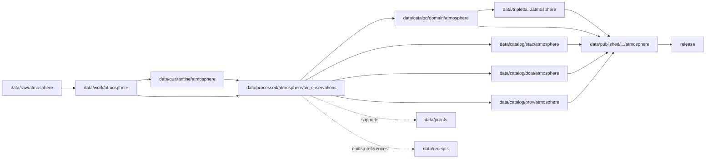

<!-- [KFM_META_BLOCK_V2]
doc_id: kfm://doc/data-processed-atmosphere-air-observations-readme
title: data/processed/atmosphere/air_observations/README.md — Atmosphere Air Observations Processed Data README
version: v0.1
type: readme; data-lifecycle-sublane; processed-stage-guide; atmosphere-domain-lane; air-observation-lane
status: draft; PROPOSED; data-root; processed-stage; atmosphere; air-observations; AirObservation; release-gated; source-role-aware
owners: OWNER_TBD — Atmosphere steward · Air-quality steward · Sensor steward · Data steward · Pipeline steward · Evidence steward · Policy steward · Release steward · Docs steward
created: NEEDS VERIFICATION — blank placeholder existed before v0.1 expansion
updated: 2026-06-25
policy_label: public-doc; data; processed; atmosphere; air-observations; lifecycle; governed; release-gated
tags: [kfm, data, processed, atmosphere, air-observations, AirObservation, AirStation, PM25Observation, OzoneObservation, lifecycle, RAW, WORK, QUARANTINE, CATALOG, TRIPLET, PUBLISHED, EvidenceBundle, SourceDescriptor, RunReceipt, ValidationReport, PolicyDecision, ReleaseManifest]
related:
  - ../README.md
  - ../../README.md
  - ../../../README.md
  - ../../../../docs/domains/atmosphere/README.md
  - ../../../../contracts/domains/atmosphere/AirObservation.md
  - ../../../../contracts/domains/atmosphere/AirStation.md
  - ../../../../contracts/domains/atmosphere/PM25Observation.md
  - ../../../../contracts/domains/atmosphere/OzoneObservation.md
  - ../../../../schemas/contracts/v1/domains/atmosphere/AirObservation.schema.json
  - ../../../../policy/domains/atmosphere/
  - ../../../../docs/doctrine/directory-rules.md
  - ../../../../docs/doctrine/lifecycle-law.md
  - ../../../../docs/doctrine/trust-membrane.md
  - ../../../raw/atmosphere/
  - ../../../work/atmosphere/
  - ../../../quarantine/atmosphere/
  - ../../../catalog/domain/atmosphere/README.md
  - ../../../catalog/stac/atmosphere/
  - ../../../catalog/dcat/atmosphere/
  - ../../../catalog/prov/atmosphere/
  - ../../../triplets/
  - ../../../published/
  - ../../../proofs/
  - ../../../receipts/
  - ../../../registry/
  - ../../../../release/
  - ../../../../pipelines/
  - ../../../../tools/validators/
notes:
  - "This file replaces a blank placeholder at `data/processed/atmosphere/air_observations/README.md`."
  - "This is the PROCESSED-stage sublane for normalized general AirObservation artifacts under Atmosphere. It is not RAW sensor feed storage, station metadata authority, pollutant-specific contract authority, AQI/report authority, proof storage, release authority, or public API/UI output."
  - "AirObservation artifacts must preserve observed-sensor role, station/network context, source role, units, observed time, retrieval time, QA/correction posture, low-cost-sensor caveats where applicable, evidence linkage, policy posture, and release state before public use."
  - "The AirObservation contract defines object meaning; this README does not create a second contract or schema authority."
  - "Rollback target for this expansion is previous blank blob SHA `8b137891791fe96927ad78e64b0aad7bded08bdc`."
[/KFM_META_BLOCK_V2] -->

<a id="top"></a>

# data/processed/atmosphere/air_observations

> Atmosphere PROCESSED-stage sublane for normalized `AirObservation` artifacts: governed general air-quality observations that remain distinct from PM2.5, ozone, AQI, model fields, AOD/smoke proxies, advisory guidance, proof, release, and public map/API/UI surfaces.

<p>
  
  
  
  
  
  
</p>

**Status:** draft / PROPOSED  
**Owners:** OWNER_TBD — Atmosphere steward · Air-quality steward · Sensor steward · Data steward · Pipeline steward · Evidence steward · Policy steward · Release steward · Docs steward  
**Path:** `data/processed/atmosphere/air_observations/README.md`  
**Owning root:** `data/processed/`  
**Domain segment:** `atmosphere`  
**Object-family segment:** `air_observations` / `AirObservation`  
**Lifecycle stage:** `PROCESSED`  
**Exposure posture:** not public by default; public use requires governed catalog, evidence, source-role/caveat posture, policy, release, correction, and rollback linkage  
**Truth posture:** CONFIRMED target was blank · CONFIRMED `AirObservation` contract and schema paths exist · CONFIRMED Atmosphere owns air-quality observations · PROPOSED air-observations processed-sublane details · NEEDS VERIFICATION for actual child inventory, validators, receipts, CI enforcement, release linkage, and governed route behavior.

**Quick jumps:** [Purpose](#purpose) · [Lifecycle boundary](#lifecycle-boundary) · [Repo fit](#repo-fit) · [Accepted contents](#accepted-contents) · [Exclusions](#exclusions) · [AirObservation requirements](#airobservation-requirements) · [Observation guardrails](#observation-guardrails) · [Directory map](#directory-map) · [Evidence ledger](#evidence-ledger) · [Validation checklist](#validation-checklist) · [Rollback](#rollback)

---

## Purpose

`data/processed/atmosphere/air_observations/` holds normalized general air-quality observation artifacts that have moved beyond RAW capture, WORK transforms, and QUARANTINE holds.

This lane is for processed `AirObservation` records or derivatives that preserve station/network context, observed-sensor role, source identity, source role, parameter/variable identity, units, observed time, retrieval time, QA/correction posture, low-cost-sensor caveats where applicable, evidence references, and downstream catalog readiness.

It is not a pollutant-specific semantic authority, AQI/report authority, model-field lane, advisory lane, proof store, receipt store, source registry, catalog, release, or public surface. It may support downstream catalog records, EvidenceBundle-backed UI payloads, public-safe air-quality layers, Focus Mode summaries, or release packages only after gates pass.

## Lifecycle boundary

```text
RAW -> WORK / QUARANTINE -> PROCESSED -> CATALOG / TRIPLET -> PUBLISHED
```



`data/processed/atmosphere/air_observations/` is upstream of catalog, triplet, publication, and release. It must not be used as a normal public map/API/UI/AI source.

## Repo fit

| Responsibility | Correct home | Rule |
|---|---|---|
| Raw sensor feeds, station payloads, source downloads, QA payloads, or logs | `data/raw/atmosphere/` | Not this lane. |
| In-process parsing, correction, QA, joins, scratch outputs, or method experiments | `data/work/atmosphere/` | Not this lane. |
| Rights-unclear, source-role-unclear, stale, malformed, unsupported, disputed, sensitive, or unsafe air-observation material | `data/quarantine/atmosphere/` | Not this lane until resolved. |
| Normalized general AirObservation processed artifacts | `data/processed/atmosphere/air_observations/` | This lane. |
| AirStation station/network semantics | `contracts/domains/atmosphere/AirStation.md` and paired schema | Object meaning/shape, not processed data. |
| PM2.5-specific processed artifacts | Domain-accepted PM2.5 processed lane, if present | Do not collapse into general AirObservation if pollutant-specific semantics apply. |
| Ozone-specific processed artifacts | Domain-accepted ozone processed lane, if present | Do not collapse into general AirObservation if pollutant-specific semantics apply. |
| Atmosphere domain catalog records | `data/catalog/domain/atmosphere/` | Downstream catalog stage. |
| Atmosphere STAC/DCAT/PROV records | `data/catalog/{stac,dcat,prov}/atmosphere/` | Downstream catalog projections, if accepted. |
| Atmosphere triplet/graph projections | `data/triplets/.../atmosphere/` | Downstream graph stage. |
| Atmosphere public-safe products | `data/published/.../atmosphere/` | Downstream after release. |
| EvidenceBundle/proof records | `data/proofs/` | Separate proof family. |
| Source, run, transform, validation, policy, correction, and release receipts | `data/receipts/` | Separate receipt family. |
| SourceDescriptor/source registry records | `data/registry/` | Separate registry family. |
| Release decisions, manifests, rollback cards, corrections, withdrawals | `release/` | Separate publication authority. |
| AirObservation semantic contract | `contracts/domains/atmosphere/AirObservation.md` | Object meaning; not data. |
| AirObservation schema | `schemas/contracts/v1/domains/atmosphere/AirObservation.schema.json` | Machine shape; not data. |
| Policy, validators, tests, pipelines, apps, packages | `policy/`, `tools/validators/`, `tests/`, `pipelines/`, `apps/`, `packages/` | Separate roots. |

## Accepted contents

Processed `AirObservation` data may include:

- normalized general air-quality observation records tied to an `AirStation` or comparable station/network context;
- source-role-preserving records for observed sensor values, parameter/variable identity, units, observed time, retrieval time, QA state, and correction lineage;
- low-cost sensor observations only when caveats, correction/confidence/limitation posture, source role, and review requirements are preserved;
- station/network context references when those references do not duplicate `AirStation` contract/schema or source registry authority;
- processed joins to PM2.5, ozone, smoke, AOD, weather, forecast, or advisory context when the knowledge-character boundary remains visible;
- quality, caveat, missingness, correction, uncertainty, freshness, and validation sidecars when those sidecars are not proofs, receipts, source registry records, catalog records, schemas, or policy rules;
- processed artifacts prepared for downstream domain catalog, STAC/DCAT/PROV packaging, EvidenceBundle support, triplet generation, or release review.

## Exclusions

Do not store these under `data/processed/atmosphere/air_observations/`:

- RAW sensor feeds, station payloads, source downloads, QA payloads, logs, screenshots, or source-native records.
- WORK/scratch outputs that have not passed processing gates.
- Quarantined, malformed, source-role-unclear, rights-unclear, stale, unsupported, disputed, sensitive, or unsafe air-observation material.
- `AirStation` canonical station metadata or station contract/schema material.
- PM2.5-specific or ozone-specific semantic records when dedicated object-family lanes or contracts apply.
- AQI/report semantics, regulatory archive semantics, model fields, AOD rasters, smoke masks, advisory context, health/safety guidance, exposure claims, regulatory exceedance claims, or impact claims.
- Domain catalog records, STAC records, DCAT records, PROV records, triplet/graph records, published outputs, proofs, receipts, source registry records, release records, schemas, policy rules, validators, tests, pipelines, app/UI/API code.

## AirObservation requirements

PROPOSED until concrete validators and CI enforcement are verified:

| Requirement | Meaning |
|---|---|
| Source trace | Every processed AirObservation artifact should trace to SourceDescriptor or source registry context when source authority matters. |
| Station/network context | Observations should identify or reference station/network context without turning station metadata into processed observation data. |
| Observed-sensor role | The record must preserve observed-sensor character unless admitted under a more specific or caveated source role. |
| Parameter and units | Parameter/variable identity and units must be explicit enough to prevent AQI, PM2.5, ozone, and generic observation collapse. |
| Time semantics | Observed time, retrieval time, correction time, freshness, and release time should remain distinguishable where material. |
| QA/correction posture | Quality flags, correction state, calibration/correction lineage, caveats, limitations, missingness, and confidence should remain visible. |
| Low-cost sensor caveats | Low-cost sensor observations require caveat, correction, confidence, limitation, policy posture, and source rights before public use. |
| Evidence linkage | Claims about observation value, source, time, station, QA, correction, or release should resolve downstream to EvidenceBundle/proof context. |
| Policy posture | Public display requires rights, source-role, freshness, caveat, sensitivity, and policy/admissibility posture. |
| Catalog readiness | Processed AirObservation artifacts intended for discovery should promote through Atmosphere catalog lanes, not directly to public use. |
| Release readiness | Public use requires release state, published output path, correction path, and rollback target. |

## Observation guardrails

- `AirObservation` is a general observed-sensor object, not a generic bucket for every air-related value.
- `AirObservation` is not PM2.5 or ozone unless represented by the dedicated object or explicit governed role.
- AQI is not raw concentration.
- AOD is not PM2.5 and smoke/AOD proxies are not ground sensor observations.
- Model fields and forecasts must remain labeled as model or forecast context.
- Advisory context and observations do not create emergency, medical, exposure, or life-safety instructions.
- Public display requires source rights, freshness, validation, policy, release record, correction path, and rollback target.
- Unreleased processed air-observation artifacts are not public merely because they exist under this directory.

> [!CAUTION]
> Do not use this lane as a shortcut from processed sensor observations to public health, exposure, regulatory, or emergency claims. AirObservation products must pass catalog, evidence, policy, validation, release, correction, and rollback gates before public use.

## Directory map

Actual child inventory remains **NEEDS VERIFICATION**. Use this as a proposed local organization pattern only after confirming current repo convention and validators.

```text
data/processed/atmosphere/air_observations/
├── README.md
├── normalized/              # PROPOSED — processed general AirObservation records
├── quality/                 # PROPOSED — QA, caveats, missingness, confidence, limitations
├── corrections/             # PROPOSED — correction/calibration lineage sidecars, not receipts
├── station_refs/            # PROPOSED — station/network context references, not station authority
├── joins/                   # PROPOSED — links to PM2.5, ozone, smoke, AOD, forecast, advisory context
├── _manifests/              # PROPOSED — lane-local non-release manifests only
└── _README_TODO.md          # PROPOSED — remove after actual child inventory is documented
```

## Evidence ledger

| Source | Status | Supports | Limits |
|---|---|---|---|
| Previous file | CONFIRMED | Target existed as a blank placeholder. | Did not define AirObservation PROCESSED-stage boundaries. |
| `data/processed/atmosphere/README.md` | CONFIRMED | Parent atmosphere processed lane exists as a greenfield stub. | Does not define parent Atmosphere processed boundaries yet. |
| `data/processed/README.md` | CONFIRMED | Parent processed lane is upstream of catalog, triplets, and publication and is not public by default. | Does not prove child inventory under this lane. |
| `data/catalog/domain/atmosphere/README.md` | CONFIRMED | Atmosphere catalog lane includes air observations downstream and preserves source-role guardrails. | Does not prove air-observation processed inventory or release behavior. |
| `docs/domains/atmosphere/README.md` | CONFIRMED doctrine / PROPOSED implementation | Atmosphere owns air-quality observations and source-role denials. | Implementation maturity and runtime behavior remain NEEDS VERIFICATION. |
| `contracts/domains/atmosphere/AirObservation.md` | CONFIRMED contract file | Defines AirObservation as governed general air-quality observation tied to station/network context, not AQI, PM2.5, ozone, model field, advisory, proof, or release approval by itself. | Contract does not prove schema enforcement, validator behavior, or release approval. |
| `schemas/contracts/v1/domains/atmosphere/AirObservation.schema.json` | CONFIRMED scaffold schema | Paired AirObservation schema exists with PROPOSED status. | Properties are currently empty; validator enforcement remains NEEDS VERIFICATION. |
| `docs/doctrine/directory-rules.md` | CONFIRMED doctrine / PROPOSED path specifics | Data paths encode lifecycle phase and domain segment; promotion is governed. | Does not prove runtime enforcement. |

## Validation checklist

- [ ] Confirm actual child directories under `data/processed/atmosphere/air_observations/`.
- [ ] Confirm accepted AirObservation source/domain path convention.
- [ ] Confirm `AirObservation` schema fields and title casing are updated beyond scaffold if needed.
- [ ] Confirm AirObservation processed validators and CI checks.
- [ ] Confirm SourceDescriptor/source registry linkage for each source-derived AirObservation artifact.
- [ ] Confirm AirStation context handling without duplicating station authority.
- [ ] Confirm pollutant-specific split for PM2.5 and ozone where dedicated objects apply.
- [ ] Confirm RunReceipt, TransformReceipt, ValidationReport, PolicyDecision, correction path, and rollback target where applicable.
- [ ] Confirm observed time, retrieval time, source role, units, QA/correction posture, caveats, limitations, missingness, confidence, station-location sensitivity, and freshness handling.
- [ ] Confirm low-cost sensor public-release controls: correction, caveats, confidence, limitations, policy posture, and source rights.
- [ ] Confirm no RAW, WORK, QUARANTINE, CATALOG, TRIPLET, PUBLISHED, proof, receipt, release, schema, policy, validator, package, pipeline, app, API, AQI/report, model, proxy, advisory, health/safety, exposure, or regulatory-claim artifacts are misplaced here.
- [ ] Confirm promotion flow from processed AirObservation data to catalog/triplet/published outputs is governed, source-role-safe, caveat-aware, evidence-backed, and reversible.
- [ ] Confirm public clients and Focus Mode cannot use this lane as a direct public health, exposure, regulatory, emergency, or life-safety source.

## Rollback

Rollback is required if this lane becomes an Atmosphere source-data root, AirStation authority root, pollutant-specific contract replacement, quarantine bypass, proof store, receipt store, catalog root, triplet root, source-registry root, release-decision root, published-output root, schema root, policy root, validator root, implementation root, public API shortcut, public exposure shortcut, public health/exposure source, regulatory-claim source, emergency instruction source, or life-safety guidance source.

Rollback target for this expansion: previous blank blob SHA `8b137891791fe96927ad78e64b0aad7bded08bdc`.

<p align="right"><a href="#top">Back to top</a></p>
