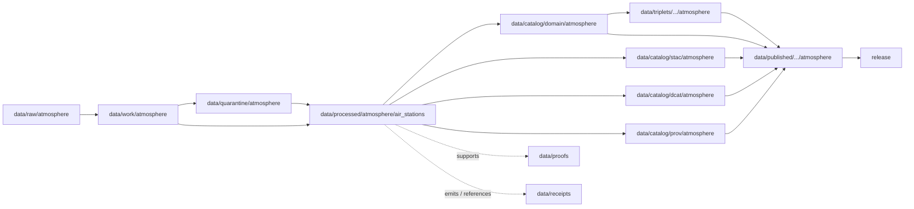

<!-- [KFM_META_BLOCK_V2]
doc_id: kfm://doc/data-processed-atmosphere-air-stations-readme
title: data/processed/atmosphere/air_stations/README.md — Atmosphere Air Stations Processed Data README
version: v0.1
type: readme; data-lifecycle-sublane; processed-stage-guide; atmosphere-domain-lane; air-station-lane
status: draft; PROPOSED; data-root; processed-stage; atmosphere; air-stations; AirStation; release-gated; station-siting-aware
owners: OWNER_TBD — Atmosphere steward · Air-quality steward · Station/network steward · Data steward · Pipeline steward · Evidence steward · Policy steward · Release steward · Docs steward
created: NEEDS VERIFICATION — blank placeholder existed before v0.1 expansion
updated: 2026-06-25
policy_label: public-doc; data; processed; atmosphere; air-stations; lifecycle; governed; release-gated; sensitive-siting-aware
tags: [kfm, data, processed, atmosphere, air-stations, AirStation, AirObservation, PM25Observation, OzoneObservation, lifecycle, RAW, WORK, QUARANTINE, CATALOG, TRIPLET, PUBLISHED, EvidenceBundle, SourceDescriptor, RunReceipt, ValidationReport, PolicyDecision, ReleaseManifest]
related:
  - ../README.md
  - ../../README.md
  - ../../../README.md
  - ../../../../docs/domains/atmosphere/README.md
  - ../../../../contracts/domains/atmosphere/AirStation.md
  - ../../../../contracts/domains/atmosphere/AirObservation.md
  - ../../../../contracts/domains/atmosphere/PM25Observation.md
  - ../../../../contracts/domains/atmosphere/OzoneObservation.md
  - ../../../../schemas/contracts/v1/domains/atmosphere/AirStation.schema.json
  - ../../../../policy/domains/atmosphere/
  - ../../../../policy/sensitivity/
  - ../../../../docs/doctrine/directory-rules.md
  - ../../../../docs/doctrine/lifecycle-law.md
  - ../../../../docs/doctrine/trust-membrane.md
  - ../../../raw/atmosphere/
  - ../../../work/atmosphere/
  - ../../../quarantine/atmosphere/
  - ../../../catalog/domain/atmosphere/README.md
  - ../../../catalog/stac/atmosphere/
  - ../../../catalog/dcat/atmosphere/
  - ../../../catalog/prov/atmosphere/
  - ../../../triplets/
  - ../../../published/
  - ../../../proofs/
  - ../../../receipts/
  - ../../../registry/
  - ../../../../release/
  - ../../../../pipelines/
  - ../../../../tools/validators/
notes:
  - "This file replaces a blank placeholder at `data/processed/atmosphere/air_stations/README.md`."
  - "This is the PROCESSED-stage sublane for normalized AirStation station/network/site-context artifacts under Atmosphere. It is not RAW station registry storage, observation-value storage, exact-coordinate publication, station ownership disclosure, proof storage, release authority, or public API/UI output."
  - "AirStation artifacts must preserve station/network identity, source lineage, siting class, geometry precision, ownership/operator sensitivity, active/inactive/relocated status, evidence linkage, policy posture, and release state before public use."
  - "The AirStation contract defines object meaning; this README does not create a second contract or schema authority."
  - "Rollback target for this expansion is previous blank blob SHA `8b137891791fe96927ad78e64b0aad7bded08bdc`."
[/KFM_META_BLOCK_V2] -->

<a id="top"></a>

# data/processed/atmosphere/air_stations

> Atmosphere PROCESSED-stage sublane for normalized `AirStation` artifacts: governed station, monitoring-site, sensor-site, and network/site context that remains distinct from observation values, exact public coordinates, station ownership exposure, proof, release, and public map/API/UI surfaces.

<p>
  
  
  
  
  
  
</p>

**Status:** draft / PROPOSED  
**Owners:** OWNER_TBD — Atmosphere steward · Air-quality steward · Station/network steward · Data steward · Pipeline steward · Evidence steward · Policy steward · Release steward · Docs steward  
**Path:** `data/processed/atmosphere/air_stations/README.md`  
**Owning root:** `data/processed/`  
**Domain segment:** `atmosphere`  
**Object-family segment:** `air_stations` / `AirStation`  
**Lifecycle stage:** `PROCESSED`  
**Exposure posture:** not public by default; public use requires governed catalog, evidence, siting/ownership sensitivity review, policy, release, correction, and rollback linkage  
**Truth posture:** CONFIRMED target was blank · CONFIRMED `AirStation` contract and schema paths exist · CONFIRMED Atmosphere owns station/network site context · PROPOSED air-stations processed-sublane details · NEEDS VERIFICATION for actual child inventory, validators, receipts, CI enforcement, release linkage, and governed route behavior.

**Quick jumps:** [Purpose](#purpose) · [Lifecycle boundary](#lifecycle-boundary) · [Repo fit](#repo-fit) · [Accepted contents](#accepted-contents) · [Exclusions](#exclusions) · [AirStation requirements](#airstation-requirements) · [Station guardrails](#station-guardrails) · [Directory map](#directory-map) · [Evidence ledger](#evidence-ledger) · [Validation checklist](#validation-checklist) · [Rollback](#rollback)

---

## Purpose

`data/processed/atmosphere/air_stations/` holds normalized station/network/site-context artifacts that have moved beyond RAW capture, WORK transforms, and QUARANTINE holds.

This lane is for processed `AirStation` records or derivatives that preserve station/network identity, source lineage, station class, siting class, geometry precision, active/inactive/relocated/decommissioned status, ownership/operator sensitivity, source rights, evidence references, and downstream catalog readiness.

It is not an observation-value lane. It is not a public station-location layer. It is not a source registry, proof store, receipt store, catalog, release, semantic contract, schema, policy, or public API/UI surface. It may support downstream catalog records, EvidenceBundle-backed UI payloads, generalized station layers, Focus Mode summaries, or release packages only after gates pass.

## Lifecycle boundary

```text
RAW -> WORK / QUARANTINE -> PROCESSED -> CATALOG / TRIPLET -> PUBLISHED
```



`data/processed/atmosphere/air_stations/` is upstream of catalog, triplet, publication, and release. It must not be used as a normal public map/API/UI/AI source.

## Repo fit

| Responsibility | Correct home | Rule |
|---|---|---|
| Raw station registries, source downloads, station metadata payloads, coordinates, ownership payloads, logs, or source-native records | `data/raw/atmosphere/` | Not this lane. |
| In-process station parsing, deduplication, geocoding, QA, joins, scratch outputs, or method experiments | `data/work/atmosphere/` | Not this lane. |
| Rights-unclear, source-role-unclear, exact-siting-sensitive, ownership-sensitive, malformed, unsupported, disputed, or unsafe station material | `data/quarantine/atmosphere/` | Not this lane until resolved. |
| Normalized AirStation processed artifacts | `data/processed/atmosphere/air_stations/` | This lane. |
| General AirObservation processed artifacts | `data/processed/atmosphere/air_observations/` | Observation values remain separate. |
| PM2.5/Ozone processed artifacts | Domain-accepted pollutant-specific processed lanes, if present | Pollutant-specific observation values remain separate. |
| Atmosphere domain catalog records | `data/catalog/domain/atmosphere/` | Downstream catalog stage. |
| Atmosphere STAC/DCAT/PROV records | `data/catalog/{stac,dcat,prov}/atmosphere/` | Downstream catalog projections, if accepted. |
| Atmosphere triplet/graph projections | `data/triplets/.../atmosphere/` | Downstream graph stage. |
| Atmosphere public-safe products | `data/published/.../atmosphere/` | Downstream after release. |
| EvidenceBundle/proof records | `data/proofs/` | Separate proof family. |
| Source, run, transform, validation, policy, sensitivity, correction, and release receipts | `data/receipts/` | Separate receipt family. |
| SourceDescriptor/source registry records | `data/registry/` | Separate registry family. |
| Release decisions, manifests, rollback cards, corrections, withdrawals | `release/` | Separate publication authority. |
| AirStation semantic contract | `contracts/domains/atmosphere/AirStation.md` | Object meaning; not data. |
| AirStation schema | `schemas/contracts/v1/domains/atmosphere/AirStation.schema.json` | Machine shape; not data. |
| Policy, validators, tests, pipelines, apps, packages | `policy/`, `tools/validators/`, `tests/`, `pipelines/`, `apps/`, `packages/` | Separate roots. |

## Accepted contents

Processed `AirStation` data may include:

- normalized station, monitoring-site, sensor-site, station-network, or station-location-context records;
- station identity, source/network lineage, operator/source references, station class, siting class, active/inactive/decommissioned/relocated status, and time-span metadata;
- public-safe generalized station geometry or generalized spatial tokens only when generated through governed processing and still pending catalog/release review;
- deduplication, merge/split, relocation, supersession, and correction lineage sidecars when those sidecars are not receipts, proofs, source registry records, catalog records, schemas, or policy rules;
- observation-linkage references to `AirObservation`, `PM25Observation`, `OzoneObservation`, or related observation families when station-vs-observation boundaries remain visible;
- quality, caveat, sensitivity, station-siting, ownership/operator, and rights sidecars when those sidecars are not proofs, receipts, source registry records, catalog records, schemas, or policy rules;
- processed artifacts prepared for downstream domain catalog, STAC/DCAT/PROV packaging, EvidenceBundle support, triplet generation, or release review.

## Exclusions

Do not store these under `data/processed/atmosphere/air_stations/`:

- RAW station registries, source downloads, station metadata payloads, coordinate payloads, ownership payloads, logs, screenshots, or source-native records.
- WORK/scratch outputs that have not passed processing gates.
- Quarantined, malformed, exact-siting-sensitive, ownership-sensitive, source-role-unclear, rights-unclear, unsupported, disputed, or unsafe station material.
- Observation values, PM2.5 measurements, ozone measurements, AQI reports, low-cost-sensor readings, model fields, AOD rasters, smoke masks, advisory context, health/safety guidance, exposure claims, regulatory exceedance claims, or impact claims.
- Exact public station coordinates, private-land context, infrastructure-sensitive siting, station ownership, station access details, or operator-sensitive details unless explicitly transformed and governed for downstream review.
- Domain catalog records, STAC records, DCAT records, PROV records, triplet/graph records, published outputs, proofs, receipts, source registry records, release records, schemas, policy rules, validators, tests, pipelines, app/UI/API code.

## AirStation requirements

PROPOSED until concrete validators and CI enforcement are verified:

| Requirement | Meaning |
|---|---|
| Source trace | Every processed AirStation artifact should trace to SourceDescriptor or source registry context when source authority matters. |
| Station identity | Station/network identity, external IDs, source IDs, merge/split status, relocation status, and decommissioning state should remain explicit where material. |
| Site context | Station class, network membership, siting class, geometry precision, spatial scope, and time span should remain visible. |
| Observation separation | Observation values belong to observation families; station records provide context and linkage. |
| Siting sensitivity | Exact station siting, private-land context, infrastructure-sensitive siting, ownership/operator detail, and access details require sensitivity and rights review before public use. |
| Generalization posture | Public station geometry should resolve to a redaction/generalization transform, review, policy, and release posture where exact siting is restricted. |
| Evidence linkage | Claims about station identity, network membership, siting, status, time span, correction, or release should resolve downstream to EvidenceBundle/proof context. |
| Policy posture | Public display requires rights, source-role, sensitivity, caveat, freshness/status, and policy/admissibility posture. |
| Catalog readiness | Processed AirStation artifacts intended for discovery should promote through Atmosphere catalog lanes, not directly to public use. |
| Release readiness | Public use requires release state, published output path, correction path, and rollback target. |

## Station guardrails

- `AirStation` is station/network/site context, not an observation value.
- Air observations, PM2.5 observations, ozone observations, and other value-bearing observations remain separate object families.
- Station identity does not prove instrument calibration, data quality, observation truth, exposure, health effect, regulatory exceedance, or impact.
- Exact station siting must not be public by default when sensitivity, ownership, private-land, infrastructure, or access concerns apply.
- Public station products require source rights, sensitivity review, coordinate generalization where needed, validation, release record, correction path, and rollback target.
- Unreleased processed station artifacts are not public merely because they exist under this directory.

> [!CAUTION]
> Do not use this lane as a shortcut from processed station context to exact public station maps, owner/operator exposure, observation truth, health/safety guidance, or regulatory claims. AirStation products must pass catalog, evidence, policy, validation, release, correction, and rollback gates before public use.

## Directory map

Actual child inventory remains **NEEDS VERIFICATION**. Use this as a proposed local organization pattern only after confirming current repo convention and validators.

```text
data/processed/atmosphere/air_stations/
├── README.md
├── normalized/              # PROPOSED — processed AirStation records
├── generalized/             # PROPOSED — public-safe generalized station geometry candidates
├── identity/                # PROPOSED — station IDs, merge/split, relocation, supersession sidecars
├── network_refs/            # PROPOSED — network/operator/source context references, not source registry authority
├── sensitivity/             # PROPOSED — siting/ownership/generalization sidecars, not policy decisions
├── joins/                   # PROPOSED — links to AirObservation, PM2.5, ozone, weather-station context
├── _manifests/              # PROPOSED — lane-local non-release manifests only
└── _README_TODO.md          # PROPOSED — remove after actual child inventory is documented
```

## Evidence ledger

| Source | Status | Supports | Limits |
|---|---|---|---|
| Previous file | CONFIRMED | Target existed as a blank placeholder. | Did not define AirStation PROCESSED-stage boundaries. |
| `data/processed/atmosphere/README.md` | CONFIRMED | Parent atmosphere processed lane exists as a greenfield stub. | Does not define parent Atmosphere processed boundaries yet. |
| `data/processed/README.md` | CONFIRMED | Parent processed lane is upstream of catalog, triplets, and publication and is not public by default. | Does not prove child inventory under this lane. |
| `data/catalog/domain/atmosphere/README.md` | CONFIRMED | Atmosphere catalog lane includes air stations downstream and preserves source-role guardrails. | Does not prove air-station processed inventory or release behavior. |
| `docs/domains/atmosphere/README.md` | CONFIRMED doctrine / PROPOSED implementation | Atmosphere owns air-quality observations and station/network context. | Implementation maturity and runtime behavior remain NEEDS VERIFICATION. |
| `contracts/domains/atmosphere/AirStation.md` | CONFIRMED contract file | Defines AirStation as station/network/site context, not observation value, exact public siting, proof, release approval, or health/safety guidance. | Contract does not prove schema enforcement, validator behavior, or release approval. |
| `schemas/contracts/v1/domains/atmosphere/AirStation.schema.json` | CONFIRMED scaffold schema | Paired AirStation schema exists with PROPOSED status. | Properties are currently empty; validator enforcement remains NEEDS VERIFICATION. |
| `docs/doctrine/directory-rules.md` | CONFIRMED doctrine / PROPOSED path specifics | Data paths encode lifecycle phase and domain segment; promotion is governed. | Does not prove runtime enforcement. |

## Validation checklist

- [ ] Confirm actual child directories under `data/processed/atmosphere/air_stations/`.
- [ ] Confirm accepted AirStation source/domain path convention.
- [ ] Confirm `AirStation` schema fields and title casing are updated beyond scaffold if needed.
- [ ] Confirm AirStation processed validators and CI checks.
- [ ] Confirm SourceDescriptor/source registry linkage for each source-derived AirStation artifact.
- [ ] Confirm station identity, external ID, merge/split, relocation, decommissioning, and supersession handling.
- [ ] Confirm observation-linkage handling without duplicating observation values.
- [ ] Confirm RunReceipt, TransformReceipt, ValidationReport, PolicyDecision, sensitivity/generalization review, correction path, and rollback target where applicable.
- [ ] Confirm exact siting, private-land context, infrastructure-sensitive siting, ownership/operator detail, access detail, source rights, geometry precision, and public generalization handling.
- [ ] Confirm no RAW, WORK, QUARANTINE, CATALOG, TRIPLET, PUBLISHED, proof, receipt, release, schema, policy, validator, package, pipeline, app, API, observation-value, exact-public-coordinate, health/safety, exposure, or regulatory-claim artifacts are misplaced here.
- [ ] Confirm promotion flow from processed AirStation data to catalog/triplet/published outputs is governed, sensitivity-aware, source-role-safe, evidence-backed, and reversible.
- [ ] Confirm public clients and Focus Mode cannot use this lane as a direct exact-coordinate, owner/operator exposure, observation-truth, regulatory, emergency, or life-safety source.

## Rollback

Rollback is required if this lane becomes an Atmosphere source-data root, observation-value root, exact-public-station-location root, station-ownership disclosure root, quarantine bypass, proof store, receipt store, catalog root, triplet root, source-registry root, release-decision root, published-output root, schema root, policy root, validator root, implementation root, public API shortcut, public exposure shortcut, public health/exposure source, regulatory-claim source, emergency instruction source, or life-safety guidance source.

Rollback target for this expansion: previous blank blob SHA `8b137891791fe96927ad78e64b0aad7bded08bdc`.

<p align="right"><a href="#top">Back to top</a></p>
