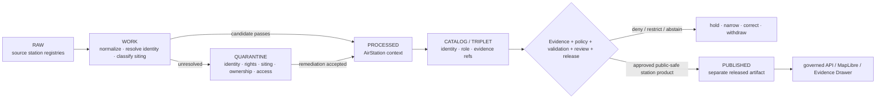

<!-- [KFM_META_BLOCK_V2]
doc_id: kfm://doc/data-processed-atmosphere-air-stations-readme
title: data/processed/atmosphere/air_stations/ — Atmosphere Air-Station Processed Data
version: v0.2.0
type: directory-readme
subtype: processed-atmosphere-air-stations-lane
status: repository-grounded draft; payload inventory, enforceable schema, validators, fixtures, receipts, proof, release, and runtime behavior remain bounded
owners:
  - "NEEDS VERIFICATION — Atmosphere domain steward"
  - "NEEDS VERIFICATION — air-quality station and network steward"
  - "NEEDS VERIFICATION — siting, privacy, infrastructure, source-role, and data-quality reviewers"
  - "NEEDS VERIFICATION — data, evidence, policy, release, correction, rollback, and docs stewards"
created: NEEDS VERIFICATION — blank placeholder existed before v0.1 expansion
updated: 2026-07-25
policy_label: public-doc; processed-stage; atmosphere; air-stations; network-and-site-context; siting-sensitive; source-role-aware; release-gated; no-direct-public-path
path: data/processed/atmosphere/air_stations/README.md
truth_posture: >
  CONFIRMED exact target path, prior blob, Directory Rules placement, current Atmosphere parent lane,
  AirStation semantic contract, paired scaffold schema posture, station-versus-observation boundary,
  exact-siting generalization requirement, and PROCESSED lifecycle boundary / PROPOSED lane-local
  admission profile, normalized station packet, relocation and supersession rules, and downstream
  promotion expectations / UNKNOWN recursive payload inventory, production validators, fixtures,
  receipts, proof closure, release instances, hosting, and public behavior / NEEDS VERIFICATION
  accountable owners, source/network identity rules, accepted station classes, siting sensitivity
  thresholds, correction propagation, cache invalidation, and rollback drills
evidence_snapshot:
  repository: bartytime4life/Kansas-Frontier-Matrix
  base_ref: main
  base_commit: ad54b673570eea363966a190fc403469dc14896e
  prior_blob: 24a64e8657794029265d46a9e1f3b8325b70b354
  directory_rules_blob: 2affb080e6f0043867c64c7f06c1ca52030fbd55
  atmosphere_parent_blob: e37ce206f396f832c414fc46a70dd9cd9b3f64e4
  air_station_contract_blob: 46d1908ba1308e67821960a77d6ab654e8bb58b4
related:
  - ../README.md
  - ../../README.md
  - ../../../README.md
  - ../../../../docs/domains/atmosphere/README.md
  - ../../../../docs/domains/atmosphere/CANONICAL_PATHS.md
  - ../../../../docs/domains/atmosphere/OBJECT_FAMILY_MAP.md
  - ../../../../docs/domains/atmosphere/POLICY.md
  - ../../../../docs/domains/atmosphere/SENSITIVITY.md
  - ../../../../docs/doctrine/directory-rules.md
  - ../../../../contracts/domains/atmosphere/AirStation.md
  - ../../../../contracts/domains/atmosphere/AirObservation.md
  - ../../../../contracts/domains/atmosphere/PM25Observation.md
  - ../../../../contracts/domains/atmosphere/OzoneObservation.md
  - ../../../../schemas/contracts/v1/domains/atmosphere/AirStation.schema.json
  - ../../../../policy/domains/atmosphere/README.md
  - ../../../raw/atmosphere/README.md
  - ../../../work/atmosphere/README.md
  - ../../../quarantine/atmosphere/README.md
  - ../../../catalog/domain/atmosphere/README.md
  - ../../../triplets/README.md
  - ../../../proofs/README.md
  - ../../../receipts/README.md
  - ../../../registry/sources/atmosphere/README.md
  - ../../../../release/candidates/atmosphere/README.md
  - ../../../../release/README.md
notes:
  - "Same-path Markdown modernization only; no station bytes, source state, contract, schema, policy, validator, workflow, proof, release, route, hosting, or KFM publication state changed."
  - "AirStation is network and site context, not an observation value, calibration result, exposure claim, health claim, regulatory determination, or release decision."
  - "Exact siting, private-land context, ownership/operator details, access information, and infrastructure-sensitive context remain restricted or generalized before public use."
  - "Rollback target for v0.2.0 is prior blob SHA `24a64e8657794029265d46a9e1f3b8325b70b354`."
[/KFM_META_BLOCK_V2] -->

# `data/processed/atmosphere/air_stations/` — Atmosphere air-station processed data

> **One-line purpose.** Hold normalized air-quality station, network, and site-context artifacts while preserving identity, siting, geometry precision, source lineage, status, sensitivity, observation linkage, correction, and downstream-use limits.

> [!IMPORTANT]
> **A station record is context, not an air-quality measurement.** Station identity, network membership, or apparent precision does not prove observation validity, instrument calibration, exposure, health effect, regulatory exceedance, or safe public siting.

**Path:** `data/processed/atmosphere/air_stations/README.md`  
**Owning root:** `data/`  
**Lifecycle phase:** `processed/`  
**Domain segment:** `atmosphere/`  
**Parent lane:** `data/processed/atmosphere/`  
**Lane role:** `AirStation` network, site, and siting context  
**Direct public access:** denied  
**Last reviewed:** 2026-07-25

**Quick navigation:** [Purpose](#purpose) · [Authority level](#authority-level) · [Status](#status) · [What belongs here](#what-belongs-here) · [What does NOT belong here](#what-does-not-belong-here) · [Inputs](#inputs) · [Outputs](#outputs) · [Validation](#validation) · [Review burden](#review-burden) · [Related folders](#related-folders) · [ADRs](#adrs) · [Last reviewed](#last-reviewed) · [AirStation admission profile](#airstation-admission-profile) · [Station identity, siting, and status](#station-identity-siting-and-status) · [Observation-linkage and source-role guardrails](#observation-linkage-and-source-role-guardrails) · [Lifecycle and promotion](#lifecycle-and-promotion) · [Correction and rollback](#correction-and-rollback)

---

## Purpose

This directory is the Atmosphere domain's **PROCESSED-stage lane for air-quality station, network, and site context**. It may hold normalized station records, station-network relationships, source-preserved external identifiers, siting classifications, status histories, relocation and supersession context, public-candidate generalized geometry, and observation-linkage references that have moved beyond RAW capture, WORK transformation, and QUARANTINE holds.

The lane exists to preserve the answer to six questions before downstream use:

1. Which station or site identity is represented, and which source/network identifiers support it?
2. Which network, operator, steward, station class, and site-context class apply?
3. Which exact and public-safe geometry representations exist, at what precision, and under what sensitivity posture?
4. Is the station active, inactive, temporary, mobile, relocated, merged, split, superseded, historical, or decommissioned?
5. Which observations may reference the station without duplicating or collapsing their value-bearing records?
6. Which evidence, rights, policy, correction, release, and rollback states govern downstream use?

It is not an observation-value store, calibration registry, public exact-location layer, source registry, proof store, receipt authority, catalog authority, release authority, health-advice service, or regulatory-compliance surface.

## Authority level

**Implementation-bearing lifecycle lane.** The target path is CONFIRMED in the repository and remains under `data/processed/atmosphere/`, consistent with Directory Rules' lifecycle and domain-placement rules.

Its authority is deliberately narrow:

- it may carry processed `AirStation` artifacts and lane-local explanatory metadata;
- it does not define `AirStation` meaning—that remains in the semantic contract;
- it does not define machine shape—the paired schema remains under `schemas/contracts/v1/domains/atmosphere/`;
- it does not decide siting sensitivity, ownership disclosure, admissibility, release, or public exposure;
- it does not prove attached observations, calibration, data quality, exposure, health effects, exceedances, or impacts;
- it does not authorize exact public coordinates, operator disclosure, access details, or infrastructure-sensitive context.

## Status

| Surface | Status | Evidence-bounded interpretation |
|---|---|---|
| This README and path | **CONFIRMED** | The file exists at the pinned base and is updated in place. |
| Parent Atmosphere processed lane | **CONFIRMED** | `data/processed/atmosphere/README.md` identifies `air_stations/` as the `AirStation` lane and denies direct public use. |
| `AirStation` semantic contract | **CONFIRMED repository document / draft** | Defines network-and-site context, station-versus-observation separation, siting sensitivity, status lineage, and non-release authority. |
| Paired `AirStation` schema | **CONFIRMED scaffold / not enforceable as verified** | File exists, but the contract reports empty properties, `additionalProperties: true`, and unresolved title casing. |
| Real processed station payload inventory | **UNKNOWN** | This documentation task did not inspect or expose station data payloads. |
| Validators, fixtures, and CI enforcement | **NEEDS VERIFICATION** | No accepted production `AirStation` validator suite was verified. |
| Receipts, proof, policy decisions, release instances, hosting, public behavior | **UNKNOWN / held** | Presence in this directory creates none of these states. |

## What belongs here

Good fits are processed station-context artifacts whose identity and transformation history remain inspectable, including:

- normalized air-quality station, monitoring-site, network-node, sensor-site, temporary-site, mobile-site, or historical-site records;
- stable KFM station identity plus source, network, operator, steward, and external identifier references;
- station class, network class, siting class, site-context class, instrument-hosting context, and operating-period metadata;
- active, inactive, temporary, mobile, relocated, merged, split, superseded, decommissioned, historical, unknown, or needs-review status history;
- exact internal geometry references and separate public-safe generalized, suppressed, binned, centroided, county, or regional location references where policy permits;
- relocation, merge, split, supersession, decommissioning, duplicate-resolution, and correction lineage;
- observation-linkage references to `AirObservation`, `PM25Observation`, `OzoneObservation`, or other accepted value-bearing families without copying observation values into station records;
- public-candidate generalized station derivatives that remain upstream of catalog and release review;
- quality, rights, caveat, siting-sensitivity, ownership/operator-sensitivity, and correction sidecars that are not proofs, receipts, policies, or release decisions;
- object-ready candidates prepared for future contract/schema validation, EvidenceBundle closure, catalog review, or release review;
- lane-local README or non-release manifest notes that explain artifact identity without becoming authority records.

## What does NOT belong here

Do not place these in `data/processed/atmosphere/air_stations/`:

- RAW station registries, source-native payloads, downloaded metadata, logs, screenshots, exact source geometry, operator files, or unprocessed network exports;
- WORK parsing, geocoding, deduplication, relocation matching, entity resolution, coordinate repair, QA experiments, temporary joins, notebooks, or scratch products;
- QUARANTINE material with unresolved rights, source role, identity, exact-siting sensitivity, ownership/operator sensitivity, infrastructure sensitivity, access details, dispute, or quality state;
- observation values, concentration readings, PM2.5 or ozone measurements, AQI reports, low-cost-sensor readings, model fields, forecasts, AOD rasters, smoke masks, advisories, or exposure estimates;
- calibration certificates, quality-assurance conclusions, regulatory exceedance determinations, health claims, impact claims, warnings, emergency instructions, or life-safety guidance;
- unrestricted exact public coordinates, private-land detail, operator contact data, access routes, infrastructure-sensitive siting, or ownership disclosure;
- semantic contracts, JSON Schemas, policy rules, validators, tests, fixtures, executable pipelines, source descriptors, catalogs, STAC/DCAT/PROV projections, triplets, proofs, receipts, releases, correction notices, rollback cards, or published artifacts;
- public map, tile, API, download, export, Focus Mode, Evidence Drawer, graph, search, or AI-answer payloads;
- transform secrets, generalization thresholds, exact offsets, linkage keys, access credentials, private agreements, access instructions, or details that could aid unauthorized access.

## Inputs

Inputs may enter this lane only through governed lifecycle transitions from:

- `data/work/atmosphere/` after source, identity, network, station class, status, siting, geometry precision, rights, sensitivity, evidence, and correction posture are recorded;
- `data/quarantine/atmosphere/` after the hold condition is resolved and the remediation decision is auditable;
- accepted Atmosphere pipelines or tools that preserve source bytes by reference, source/network identifiers, identity-resolution method, geometry lineage, status history, and correction state;
- approved observation-family relationships where station ownership remains in this lane and value-bearing observation ownership remains in the observation lane.

A connector-to-PROCESSED, watcher-to-PROCESSED, or public-upload-to-PROCESSED shortcut is not an accepted normal path. Connectors and watchers create source or candidate state; they do not publish or silently promote.

## Outputs

This lane may support downstream candidates for:

- `data/catalog/domain/atmosphere/` and accepted STAC/DCAT/PROV projections;
- `data/triplets/` or other relationship projections that preserve station identity, network role, siting precision, status, and evidence references;
- separate `data/proofs/` and `data/receipts/` objects;
- `release/candidates/atmosphere/` after identity, rights, sensitivity, validation, evidence, review, correction, and rollback obligations are met;
- a separately governed public-safe generalized station layer only through a release transition and separate published path;
- governed API, MapLibre, Evidence Drawer, export, or Focus Mode carriers only after public-safe release.

> [!CAUTION]
> Ordinary public clients must not read this directory directly. A processed station record is not a released public location or trustworthy observation merely because it has a familiar name, network code, or precise coordinate.

## Validation

No production `AirStation` validator suite was verified in this task. The paired schema is a PROPOSED scaffold with empty properties and `additionalProperties: true`; therefore this document does not claim field-level schema enforcement.

A credible `AirStation` validation profile should check, at minimum:

1. stable station identity and collision handling;
2. source, network, external identifier, operator, and steward lineage;
3. station class, site-context class, and controlled status vocabulary;
4. exact versus public-safe geometry separation and spatial-precision class;
5. rights, private-land, ownership/operator, infrastructure, access, and siting sensitivity;
6. active intervals, relocation intervals, decommissioning, supersession, merge, split, and correction chronology;
7. observation references without duplicated values or station/observation role collapse;
8. deterministic digest or identity closure where practical;
9. evidence references, policy posture, review state, release hold, correction path, and rollback target;
10. absence of direct public coordinates or sensitive operational details where policy denies them.

Fail closed or quarantine when identity, source, siting, rights, geometry precision, status chronology, sensitivity, evidence, or downstream-use posture is absent, contradictory, disputed, or unsafe.

## Review burden

Changes require review proportional to consequence:

| Change | Minimum review burden |
|---|---|
| README wording or navigation only | Docs steward plus Atmosphere or station-domain reviewer. |
| Identity, deduplication, merge/split, relocation, or supersession semantics | Atmosphere steward, station/network steward, contract/schema reviewer, and data-quality reviewer. |
| Exact/public geometry, operator, ownership, private-land, infrastructure, or access handling | Sensitivity, rights, privacy/security, policy, and domain review. |
| Observation-linkage semantics | Station and observation-family reviewers plus evidence and validation review. |
| Public layer, API, Focus Mode, export, or release linkage | Evidence, policy, release, correction, rollback, and domain review; independent approval where required. |
| Health, exposure, regulatory, emergency, or life-safety implication | Hold by default; require the owning authority and claim-specific evidence. |

## Related folders

| Responsibility | Path | Relationship |
|---|---|---|
| Atmosphere parent lane | [`../`](../README.md) | Parent PROCESSED-stage boundary. |
| AirStation meaning | [`../../../../contracts/domains/atmosphere/AirStation.md`](../../../../contracts/domains/atmosphere/AirStation.md) | Semantic authority; draft contract. |
| AirStation schema | [`../../../../schemas/contracts/v1/domains/atmosphere/AirStation.schema.json`](../../../../schemas/contracts/v1/domains/atmosphere/AirStation.schema.json) | Paired scaffold; not verified as enforceable. |
| AirObservation meaning | [`../../../../contracts/domains/atmosphere/AirObservation.md`](../../../../contracts/domains/atmosphere/AirObservation.md) | General value-bearing observation family. |
| Pollutant observations | [`../../../../contracts/domains/atmosphere/PM25Observation.md`](../../../../contracts/domains/atmosphere/PM25Observation.md), [`../../../../contracts/domains/atmosphere/OzoneObservation.md`](../../../../contracts/domains/atmosphere/OzoneObservation.md) | Specialized observation families that may reference stations. |
| Atmosphere policy | [`../../../../policy/domains/atmosphere/`](../../../../policy/domains/atmosphere/README.md) | Admissibility and siting controls; enforcement NEEDS VERIFICATION. |
| RAW / WORK / QUARANTINE | [`../../../raw/atmosphere/`](../../../raw/atmosphere/README.md), [`../../../work/atmosphere/`](../../../work/atmosphere/README.md), [`../../../quarantine/atmosphere/`](../../../quarantine/atmosphere/README.md) | Upstream lifecycle lanes. |
| Catalog | [`../../../catalog/domain/atmosphere/`](../../../catalog/domain/atmosphere/README.md) | Downstream catalog authority. |
| Proof and receipts | [`../../../proofs/`](../../../proofs/README.md), [`../../../receipts/`](../../../receipts/README.md) | Trust records remain separate. |
| Source registry | [`../../../registry/sources/atmosphere/`](../../../registry/sources/atmosphere/README.md) | SourceDescriptor authority. |
| Release | [`../../../../release/candidates/atmosphere/`](../../../../release/candidates/atmosphere/README.md), [`../../../../release/`](../../../../release/README.md) | Promotion, correction, withdrawal, and rollback authority. |

## ADRs

- Directory Rules and accepted schema-home decisions govern responsibility-root placement.
- No ADR was verified that makes this processed lane a public surface, a source registry, a proof store, or a release authority.
- Any new parallel station schema, contract, policy, source-registry, proof, receipt, release, or publication home requires explicit architectural authority.

## Last reviewed

**2026-07-25** — same-path repository modernization against `main@ad54b673570eea363966a190fc403469dc14896e`.

---

## AirStation admission profile

The following profile is **PROPOSED** until accepted contracts, schema fields, fixtures, validators, policy checks, and CI enforcement are verified.

| Field group | Minimum interpretation |
|---|---|
| Identity | Stable KFM station ID, source station code, external identifiers, network reference, and collision/duplicate posture. |
| Classification | Station type, network/site-context class, operating mode, mobility/temporary posture, and knowledge character. |
| Source and rights | Source descriptor, source role, network/operator/steward references, citation, license, derivative-use, and disclosure limits. |
| Geometry | Exact internal reference, public-safe reference where released, source/target CRS, precision class, and transform lineage. |
| Siting | Siting summary, sensitive-siting reason, private-land or infrastructure posture, access restriction, and approved public abstraction. |
| Status | Active interval, inactive or historical state, relocation, merge/split, supersession, decommissioning, and correction chronology. |
| Observation linkage | References to observation families without copied values, calibration claims, or observation-role collapse. |
| Evidence and governance | EvidenceRefs, validation posture, policy hold, review state, correction path, release hold, and rollback target. |

Absence of a material field does not imply permission. It should result in narrowed use, quarantine, restriction, or abstention.

## Station identity, siting, and status

- Station identity must survive source-code changes, network migrations, and label changes where the underlying site is the same.
- A physical relocation must not be represented as a silent coordinate update. Record the prior and successor site relationship, effective time, and evidence.
- A merged or split source record must preserve predecessor and successor identifiers rather than deleting lineage.
- Mobile and temporary sites must not be treated as fixed permanent stations.
- Decommissioned or historical status must remain visible; stale station records must not imply current operation.
- Exact location and public-safe location are different artifacts with different policy states.
- Public geometry must be generated through an auditable generalization or redaction process where exact siting is restricted.
- Hiding exact coordinates in a map style is not a sensitivity control.
- Operator, ownership, private-land, access, or infrastructure context must be disclosed only when rights and policy explicitly allow it.

## Observation-linkage and source-role guardrails

- `AirStation` has `NETWORK_AND_SITE_CONTEXT` character; it is not `OBSERVATION`.
- `AirObservation`, `PM25Observation`, and `OzoneObservation` remain value-bearing observation families with their own observation times, units, qualifiers, and evidence.
- A station may host multiple instruments and observation streams without those streams becoming one record.
- Network membership does not prove instrument calibration, method equivalence, or observation comparability.
- Low-cost, regulatory, research, temporary, mobile, and community-network sites must retain their actual station class and source role.
- Station identity does not prove AQI, concentration, exceedance, exposure, health effect, smoke impact, or hazard truth.
- Source, network, operator, and public-siting claims must remain scoped to their evidence and review state.
- Unclear identity, unresolved relocation, uncertain network membership, missing rights, or unsafe siting blocks public promotion.

## Lifecycle and promotion

```mermaid
flowchart LR
  RAW["RAW<br/>source station registries"] --> WORK["WORK<br/>normalize · resolve identity · classify siting"]
  WORK -->|unresolved| QUAR["QUARANTINE<br/>identity · rights · siting · ownership · access"]
  WORK -->|candidate passes| PROC["PROCESSED<br/>AirStation context"]
  QUAR -->|remediation accepted| PROC
  PROC --> CAT["CATALOG / TRIPLET<br/>identity · role · evidence refs"]
  CAT --> GATE{"Evidence + policy + validation + review + release"}
  GATE -->|deny / restrict / abstain| HOLD["hold · narrow · correct · withdraw"]
  GATE -->|approved public-safe station product| PUB["PUBLISHED<br/>separate released artifact"]
  PUB --> API["governed API / MapLibre / Evidence Drawer"]
```

Promotion is a governed state transition, not a file copy. A commit, merged pull request, catalog entry, schema match, generalized coordinate, or rendered map does not by itself create release approval.

## Correction and rollback

A correction may require more than changing a label or coordinate. Review all downstream products when:

- station identity was merged, split, or deduplicated incorrectly;
- a relocation was treated as a silent coordinate change;
- active/inactive/decommissioned status was wrong or stale;
- network, operator, or source lineage was misassigned;
- exact siting or access-sensitive context was exposed;
- a public-safe geometry transform was incorrect or insufficient;
- observations were linked to the wrong station;
- rights, sensitivity, or release posture changed.

A governed correction should identify the affected station IDs, predecessor/successor relations, observation links, catalog records, triplets, evidence bundles, map layers, exports, caches, AI summaries, release manifests, and rollback targets. Unsafe outputs should be withdrawn or denied before replacement artifacts are promoted.

Rollback target for this modernization: prior blob `24a64e8657794029265d46a9e1f3b8325b70b354`. After merge, revert the modernization commit rather than rewriting shared history.

<a href="#top">Back to top</a>

