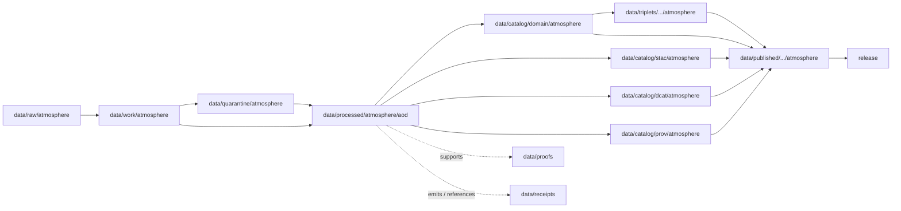

<!-- [KFM_META_BLOCK_V2]
doc_id: kfm://doc/data-processed-atmosphere-aod-readme
title: data/processed/atmosphere/aod/README.md — Atmosphere AOD Processed Data README
version: v0.1
type: readme; data-lifecycle-sublane; processed-stage-guide; atmosphere-domain-lane; aod-raster-lane
status: draft; PROPOSED; data-root; processed-stage; atmosphere; aod; AODRaster; release-gated; remote-sensing-proxy; source-role-aware
owners: OWNER_TBD — Atmosphere steward · Remote-sensing steward · AOD steward · Data steward · Pipeline steward · Evidence steward · Policy steward · Release steward · Docs steward
created: NEEDS VERIFICATION — blank placeholder existed before v0.1 expansion
updated: 2026-06-25
policy_label: public-doc; data; processed; atmosphere; aod; aerosol-optical-depth; lifecycle; governed; release-gated
tags: [kfm, data, processed, atmosphere, aod, AODRaster, aerosol-optical-depth, remote-sensing, raster, smoke, PM25Observation, lifecycle, RAW, WORK, QUARANTINE, CATALOG, TRIPLET, PUBLISHED, EvidenceBundle, SourceDescriptor, RunReceipt, ValidationReport, PolicyDecision, ReleaseManifest]
related:
  - ../README.md
  - ../../README.md
  - ../../../README.md
  - ../../../../docs/domains/atmosphere/README.md
  - ../../../../contracts/domains/atmosphere/AODRaster.md
  - ../../../../contracts/domains/atmosphere/SmokeContext.md
  - ../../../../contracts/domains/atmosphere/AirObservation.md
  - ../../../../contracts/domains/atmosphere/PM25Observation.md
  - ../../../../contracts/domains/atmosphere/ForecastContext.md
  - ../../../../schemas/contracts/v1/domains/atmosphere/AODRaster.schema.json
  - ../../../../policy/domains/atmosphere/
  - ../../../../policy/sensitivity/
  - ../../../../docs/doctrine/directory-rules.md
  - ../../../../docs/doctrine/lifecycle-law.md
  - ../../../../docs/doctrine/trust-membrane.md
  - ../../../raw/atmosphere/
  - ../../../work/atmosphere/
  - ../../../quarantine/atmosphere/
  - ../../../catalog/domain/atmosphere/README.md
  - ../../../catalog/stac/atmosphere/
  - ../../../catalog/dcat/atmosphere/
  - ../../../catalog/prov/atmosphere/
  - ../../../triplets/
  - ../../../published/
  - ../../../proofs/
  - ../../../receipts/
  - ../../../registry/
  - ../../../../release/
  - ../../../../pipelines/
  - ../../../../tools/validators/
notes:
  - "This file replaces a blank placeholder at `data/processed/atmosphere/aod/README.md`."
  - "This is the PROCESSED-stage sublane for normalized AODRaster / aerosol optical depth artifacts under Atmosphere. It is not RAW satellite-product storage, PM2.5 measurement authority, ground-observation authority, smoke-impact proof, proof storage, release authority, public tile output, or health/safety guidance."
  - "AOD artifacts must preserve source role, product lineage, raster footprint, resolution, retrieval time, quality bands, cloud/QA caveats, uncertainty, evidence linkage, policy posture, and release state before public use."
  - "The AODRaster contract defines object meaning; this README does not create a second contract or schema authority."
  - "Rollback target for this expansion is previous blank blob SHA `8b137891791fe96927ad78e64b0aad7bded08bdc`."
[/KFM_META_BLOCK_V2] -->

<a id="top"></a>

# data/processed/atmosphere/aod

> Atmosphere PROCESSED-stage sublane for normalized `AODRaster` artifacts: governed aerosol optical depth rasters and remote-sensing aerosol-opacity context that remains distinct from PM2.5, AQI, ground observations, forecasts, advisories, proof, release, public tiles, and health/safety guidance.

<p>
  
  
  
  
  
  
</p>

**Status:** draft / PROPOSED  
**Owners:** OWNER_TBD — Atmosphere steward · Remote-sensing steward · AOD steward · Data steward · Pipeline steward · Evidence steward · Policy steward · Release steward · Docs steward  
**Path:** `data/processed/atmosphere/aod/README.md`  
**Owning root:** `data/processed/`  
**Domain segment:** `atmosphere`  
**Object-family segment:** `aod` / `AODRaster`  
**Lifecycle stage:** `PROCESSED`  
**Exposure posture:** not public by default; public use requires governed catalog, evidence, source-role/QA posture, policy, release, correction, and rollback linkage  
**Truth posture:** CONFIRMED target was blank · CONFIRMED `AODRaster` contract and schema paths exist · CONFIRMED Atmosphere owns smoke/AOD remote-sensing context · PROPOSED AOD processed-sublane details · NEEDS VERIFICATION for actual child inventory, validators, receipts, CI enforcement, release linkage, and governed route behavior.

**Quick jumps:** [Purpose](#purpose) · [Lifecycle boundary](#lifecycle-boundary) · [Repo fit](#repo-fit) · [Accepted contents](#accepted-contents) · [Exclusions](#exclusions) · [AODRaster requirements](#aodraster-requirements) · [Remote-sensing guardrails](#remote-sensing-guardrails) · [Directory map](#directory-map) · [Evidence ledger](#evidence-ledger) · [Validation checklist](#validation-checklist) · [Rollback](#rollback)

---

## Purpose

`data/processed/atmosphere/aod/` holds normalized aerosol optical depth raster artifacts that have moved beyond RAW capture, WORK transforms, and QUARANTINE holds.

This lane is for processed `AODRaster` records or derivatives that preserve source identity, product lineage, platform/sensor or source-system label where allowed, source role, raster footprint, grid/projection, resolution, retrieval time, processing time, QA/cloud/quality bands, uncertainty/caveats, evidence references, and downstream catalog readiness.

It is not a PM2.5 lane. It is not a ground-observation lane. It is not a public health or smoke-impact proof lane. It is not a proof store, receipt store, source registry, catalog, release, semantic contract, schema, policy, tile service, or public API/UI surface. It may support downstream catalog records, EvidenceBundle-backed UI payloads, public-safe raster visualizations, Focus Mode summaries, or release packages only after gates pass.

## Lifecycle boundary

```text
RAW -> WORK / QUARANTINE -> PROCESSED -> CATALOG / TRIPLET -> PUBLISHED
```



`data/processed/atmosphere/aod/` is upstream of catalog, triplet, publication, and release. It must not be used as a normal public map/API/UI/AI source.

## Repo fit

| Responsibility | Correct home | Rule |
|---|---|---|
| Raw satellite products, source rasters, QA bands, source downloads, source-native tiles, or logs | `data/raw/atmosphere/` | Not this lane. |
| In-process raster clipping, reprojection, masking, cloud handling, QA extraction, joins, scratch outputs, or method experiments | `data/work/atmosphere/` | Not this lane. |
| Rights-unclear, source-role-unclear, stale, malformed, unsupported, disputed, sensitive, or unsafe AOD material | `data/quarantine/atmosphere/` | Not this lane until resolved. |
| Normalized AODRaster processed artifacts | `data/processed/atmosphere/aod/` | This lane. |
| Smoke-context processed artifacts | Domain-accepted smoke processed lane, if present | AOD may inform smoke context but does not replace it. |
| Ground air observations | `data/processed/atmosphere/air_observations/` and pollutant-specific lanes where accepted | AOD is not a ground sensor observation. |
| PM2.5-specific processed artifacts | Domain-accepted PM2.5 processed lane, if present | AOD is not PM2.5 concentration. |
| Atmosphere domain catalog records | `data/catalog/domain/atmosphere/` | Downstream catalog stage. |
| Atmosphere STAC/DCAT/PROV records | `data/catalog/{stac,dcat,prov}/atmosphere/` | Downstream catalog projections, if accepted. |
| Atmosphere triplet/graph projections | `data/triplets/.../atmosphere/` | Downstream graph stage. |
| Atmosphere public-safe products | `data/published/.../atmosphere/` | Downstream after release. |
| EvidenceBundle/proof records | `data/proofs/` | Separate proof family. |
| Source, run, transform, validation, policy, correction, and release receipts | `data/receipts/` | Separate receipt family. |
| SourceDescriptor/source registry records | `data/registry/` | Separate registry family. |
| Release decisions, manifests, rollback cards, corrections, withdrawals | `release/` | Separate publication authority. |
| AODRaster semantic contract | `contracts/domains/atmosphere/AODRaster.md` | Object meaning; not data. |
| AODRaster schema | `schemas/contracts/v1/domains/atmosphere/AODRaster.schema.json` | Machine shape; not data. |
| Policy, validators, tests, pipelines, apps, packages | `policy/`, `tools/validators/`, `tests/`, `pipelines/`, `apps/`, `packages/` | Separate roots. |

## Accepted contents

Processed `AODRaster` data may include:

- normalized aerosol optical depth rasters, raster descriptors, grid-aligned derivatives, or clipped/warped products generated through governed processing;
- source-role-preserving metadata for product name, source, platform/sensor or source system, collection/version, retrieval time, processing time, footprint, grid/projection, resolution, units/scale, valid range, and quality bands;
- QA/cloud/mask/uncertainty/caveat sidecars when those sidecars are not proofs, receipts, source registry records, catalog records, schemas, or policy rules;
- processed joins to `SmokeContext`, `AirObservation`, `PM25Observation`, weather, forecast, wind, or advisory context when the knowledge-character boundary remains visible;
- public-safe raster visualization candidates that still require catalog, policy, validation, release, and rollback review;
- processed artifacts prepared for downstream domain catalog, STAC/DCAT/PROV packaging, EvidenceBundle support, triplet generation, or release review.

## Exclusions

Do not store these under `data/processed/atmosphere/aod/`:

- RAW satellite products, source rasters, QA bands, source-native tiles, downloads, logs, screenshots, or source-native records.
- WORK/scratch outputs that have not passed processing gates.
- Quarantined, malformed, source-role-unclear, rights-unclear, stale, unsupported, disputed, sensitive, or unsafe AOD material.
- PM2.5 measurements, AQI reports, ground sensor observations, regulatory archive measurements, model fields by default, smoke-impact proof, exposure claims, visibility-impact claims, health/safety guidance, advisory instructions, or public-alerting behavior.
- Public tiles, public layer manifests, tile service code, app/UI/API output, or renderer implementation.
- Domain catalog records, STAC records, DCAT records, PROV records, triplet/graph records, published outputs, proofs, receipts, source registry records, release records, schemas, policy rules, validators, tests, pipelines, app/UI/API code.

## AODRaster requirements

PROPOSED until concrete validators and CI enforcement are verified:

| Requirement | Meaning |
|---|---|
| Source trace | Every processed AOD artifact should trace to SourceDescriptor or source registry context when source authority matters. |
| Product lineage | Product name, collection/version, source system, platform/sensor where allowed, retrieval time, processing time, and correction/supersession lineage should remain visible. |
| Raster metadata | Footprint, grid/projection, resolution, pixel semantics, units/scale, valid range, nodata handling, and QA/cloud bands should be explicit enough for downstream validation. |
| Source-role preservation | AOD must remain labeled as remote-sensing mask/proxy context unless a separately governed method admits another role. |
| Proxy boundary | AOD must not be presented as PM2.5, AQI, ground observation, exposure, smoke impact, or health/safety guidance by itself. |
| Evidence linkage | Claims about raster presence, source, extent, retrieval, quality, transform, correction, or release should resolve downstream to EvidenceBundle/proof context. |
| Policy posture | Public display requires rights, source-role, freshness, QA/caveat, sensitivity, and policy/admissibility posture. |
| Catalog readiness | Processed AOD artifacts intended for discovery should promote through Atmosphere catalog lanes, not directly to public use. |
| Release readiness | Public use requires release state, published output path, correction path, and rollback target. |

## Remote-sensing guardrails

- `AODRaster` is a remote-sensing mask/proxy object, not a ground observation.
- AOD is not PM2.5.
- AOD is not AQI.
- AOD does not prove smoke exposure, health effect, visibility impact, ground-level concentration, or hazard impact by itself.
- Model fields and forecasts must remain labeled as model or forecast context.
- Public raster display requires source rights, freshness, validation, policy, transform/release records, correction path, and rollback target.
- Unreleased processed AOD artifacts are not public merely because they exist under this directory.

> [!CAUTION]
> Do not use this lane as a shortcut from processed remote-sensing products to PM2.5, AQI, exposure, health, smoke-impact, hazard, or public-alerting claims. AOD products must pass catalog, evidence, policy, validation, release, correction, and rollback gates before public use.

## Directory map

Actual child inventory remains **NEEDS VERIFICATION**. Use this as a proposed local organization pattern only after confirming current repo convention and validators.

```text
data/processed/atmosphere/aod/
├── README.md
├── normalized/              # PROPOSED — processed AODRaster records / rasters
├── rasters/                 # PROPOSED — normalized raster derivatives, not published tiles
├── qa/                      # PROPOSED — QA/cloud/mask/uncertainty sidecars
├── lineage/                 # PROPOSED — product/version/retrieval/processing sidecars, not receipts
├── joins/                   # PROPOSED — links to smoke, PM2.5, air observation, forecast, advisory context
├── _manifests/              # PROPOSED — lane-local non-release manifests only
└── _README_TODO.md          # PROPOSED — remove after actual child inventory is documented
```

## Evidence ledger

| Source | Status | Supports | Limits |
|---|---|---|---|
| Previous file | CONFIRMED | Target existed as a blank placeholder. | Did not define AOD PROCESSED-stage boundaries. |
| `data/processed/atmosphere/README.md` | CONFIRMED | Parent atmosphere processed lane exists as a greenfield stub. | Does not define parent Atmosphere processed boundaries yet. |
| `data/processed/README.md` | CONFIRMED | Parent processed lane is upstream of catalog, triplets, and publication and is not public by default. | Does not prove child inventory under this lane. |
| `data/catalog/domain/atmosphere/README.md` | CONFIRMED | Atmosphere catalog lane includes AOD rasters downstream and preserves source-role guardrails. | Does not prove AOD processed inventory or release behavior. |
| `docs/domains/atmosphere/README.md` | CONFIRMED doctrine / PROPOSED implementation | Atmosphere owns smoke/AOD context and source-role denials. | Implementation maturity and runtime behavior remain NEEDS VERIFICATION. |
| `contracts/domains/atmosphere/AODRaster.md` | CONFIRMED contract file | Defines AODRaster as aerosol optical depth remote-sensing proxy, not PM2.5, AQI, ground observation, proof, release approval, or health/safety guidance. | Contract does not prove schema enforcement, validator behavior, or release approval. |
| `schemas/contracts/v1/domains/atmosphere/AODRaster.schema.json` | CONFIRMED scaffold schema | Paired AODRaster schema exists with PROPOSED status. | Properties are currently empty; validator enforcement remains NEEDS VERIFICATION. |
| `docs/doctrine/directory-rules.md` | CONFIRMED doctrine / PROPOSED path specifics | Data paths encode lifecycle phase and domain segment; promotion is governed. | Does not prove runtime enforcement. |

## Validation checklist

- [ ] Confirm actual child directories under `data/processed/atmosphere/aod/`.
- [ ] Confirm accepted AODRaster source/domain path convention.
- [ ] Confirm `AODRaster` schema fields and title casing are updated beyond scaffold if needed.
- [ ] Confirm AOD processed validators and CI checks.
- [ ] Confirm SourceDescriptor/source registry linkage for each source-derived AOD artifact.
- [ ] Confirm raster footprint, grid/projection, resolution, pixel semantics, units/scale, nodata, QA/cloud/mask bands, retrieval time, processing time, product version, uncertainty, and freshness handling.
- [ ] Confirm AOD-vs-PM2.5, AOD-vs-AQI, AOD-vs-ground-observation, and AOD-vs-model-field boundaries.
- [ ] Confirm RunReceipt, TransformReceipt, ValidationReport, PolicyDecision, correction path, and rollback target where applicable.
- [ ] Confirm no RAW, WORK, QUARANTINE, CATALOG, TRIPLET, PUBLISHED, proof, receipt, release, schema, policy, validator, package, pipeline, app, API, public tile, PM2.5, AQI, observation, exposure, health/safety, or smoke-impact artifacts are misplaced here.
- [ ] Confirm promotion flow from processed AOD data to catalog/triplet/published outputs is governed, source-role-safe, proxy-aware, evidence-backed, and reversible.
- [ ] Confirm public clients and Focus Mode cannot use this lane as a direct PM2.5, AQI, ground-observation, smoke-impact, exposure, emergency, or life-safety source.

## Rollback

Rollback is required if this lane becomes an Atmosphere source-data root, public tile root, PM2.5 substitute, AQI substitute, ground-observation substitute, smoke-impact proof, quarantine bypass, proof store, receipt store, catalog root, triplet root, source-registry root, release-decision root, published-output root, schema root, policy root, validator root, implementation root, public API shortcut, public exposure shortcut, public health/exposure source, emergency instruction source, or life-safety guidance source.

Rollback target for this expansion: previous blank blob SHA `8b137891791fe96927ad78e64b0aad7bded08bdc`.

<p align="right"><a href="#top">Back to top</a></p>
