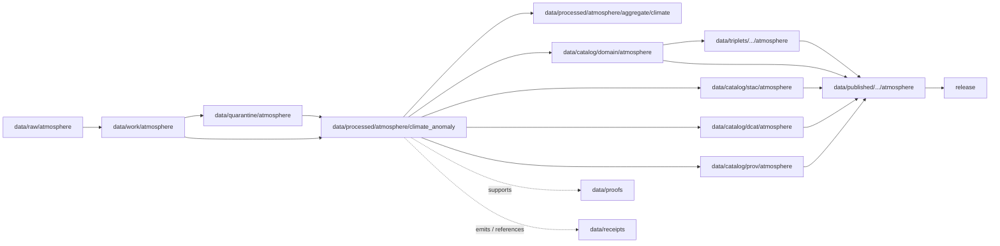

<!-- [KFM_META_BLOCK_V2]
doc_id: kfm://doc/data-processed-atmosphere-climate-anomaly-readme
title: data/processed/atmosphere/climate_anomaly/README.md — Atmosphere ClimateAnomaly Processed Data README
version: v0.1
type: readme; data-lifecycle-sublane; processed-stage-guide; atmosphere-domain-lane; climate-anomaly-lane
status: draft; PROPOSED; data-root; processed-stage; atmosphere; climate-anomaly; ClimateAnomaly; release-gated; baseline-aware; aggregation-aware; source-role-aware
owners: OWNER_TBD — Atmosphere steward · Climate steward · Anomaly steward · Data steward · Pipeline steward · Evidence steward · Policy steward · Release steward · Docs steward
created: NEEDS VERIFICATION — blank placeholder existed before v0.1 expansion
updated: 2026-06-25
policy_label: public-doc; data; processed; atmosphere; climate-anomaly; lifecycle; governed; release-gated
tags: [kfm, data, processed, atmosphere, climate-anomaly, ClimateAnomaly, ClimateNormal, baseline, aggregation, lifecycle, RAW, WORK, QUARANTINE, CATALOG, TRIPLET, PUBLISHED, EvidenceBundle, SourceDescriptor, AggregationReceipt, ValidationReport, PolicyDecision, ReleaseManifest]
related:
  - ../README.md
  - ../aggregate/climate/README.md
  - ../../README.md
  - ../../../README.md
  - ../../../../docs/domains/atmosphere/README.md
  - ../../../../contracts/domains/atmosphere/ClimateAnomaly.md
  - ../../../../contracts/domains/atmosphere/ClimateNormal.md
  - ../../../../contracts/domains/atmosphere/TemperatureObservation.md
  - ../../../../contracts/domains/atmosphere/PrecipitationObservation.md
  - ../../../../schemas/contracts/v1/domains/atmosphere/ClimateAnomaly.schema.json
  - ../../../../schemas/contracts/v1/domains/atmosphere/ClimateNormal.schema.json
  - ../../../../policy/domains/atmosphere/
  - ../../../../docs/doctrine/directory-rules.md
  - ../../../../docs/doctrine/lifecycle-law.md
  - ../../../../docs/doctrine/trust-membrane.md
  - ../../../raw/atmosphere/
  - ../../../work/atmosphere/
  - ../../../quarantine/atmosphere/
  - ../../../catalog/domain/atmosphere/README.md
  - ../../../catalog/stac/atmosphere/
  - ../../../catalog/dcat/atmosphere/
  - ../../../catalog/prov/atmosphere/
  - ../../../triplets/
  - ../../../published/
  - ../../../proofs/
  - ../../../receipts/
  - ../../../registry/
  - ../../../../release/
  - ../../../../pipelines/
  - ../../../../tools/validators/
notes:
  - "This file replaces a blank placeholder at `data/processed/atmosphere/climate_anomaly/README.md`."
  - "This is the PROCESSED-stage sublane for normalized ClimateAnomaly artifacts under Atmosphere. It is not raw observation storage, baseline authority, climate attribution proof, trend-significance proof, proof storage, release authority, or public climate layer output."
  - "ClimateAnomaly artifacts must preserve baseline/ClimateNormal reference, aggregation method, spatial/temporal scope, variable, units, uncertainty/caveats, evidence linkage, policy posture, and release state before public use."
  - "The ClimateAnomaly contract defines object meaning; this README does not create a second contract or schema authority."
  - "The sibling `data/processed/atmosphere/aggregate/climate/` lane covers broader aggregate climate products; this object-named lane must not become a parallel truth store without a documented convention."
  - "Rollback target for this expansion is previous blank blob SHA `8b137891791fe96927ad78e64b0aad7bded08bdc`."
[/KFM_META_BLOCK_V2] -->

<a id="top"></a>

# data/processed/atmosphere/climate_anomaly

> Atmosphere PROCESSED-stage sublane for normalized `ClimateAnomaly` artifacts: governed baseline-relative climate anomaly context that remains distinct from raw observations, climate normals, forecasts, model fields, attribution claims, proof, release, and public climate surfaces.

<p>
  
  
  
  
  
  
</p>

**Status:** draft / PROPOSED  
**Owners:** OWNER_TBD — Atmosphere steward · Climate steward · Anomaly steward · Data steward · Pipeline steward · Evidence steward · Policy steward · Release steward · Docs steward  
**Path:** `data/processed/atmosphere/climate_anomaly/README.md`  
**Owning root:** `data/processed/`  
**Domain segment:** `atmosphere`  
**Object-family segment:** `climate_anomaly` / `ClimateAnomaly`  
**Lifecycle stage:** `PROCESSED`  
**Exposure posture:** not public by default; public use requires governed catalog, evidence, baseline/aggregation disclosure, policy, release, correction, and rollback linkage  
**Truth posture:** CONFIRMED target was blank · CONFIRMED `ClimateAnomaly` contract and schema paths exist · CONFIRMED `ClimateAnomaly` must anchor to `ClimateNormal` or a reviewed baseline · PROPOSED climate-anomaly processed-sublane details · NEEDS VERIFICATION for actual child inventory, validators, receipts, CI enforcement, release linkage, and governed route behavior.

**Quick jumps:** [Purpose](#purpose) · [Naming and compatibility note](#naming-and-compatibility-note) · [Lifecycle boundary](#lifecycle-boundary) · [Repo fit](#repo-fit) · [Accepted contents](#accepted-contents) · [Exclusions](#exclusions) · [ClimateAnomaly requirements](#climateanomaly-requirements) · [Anomaly guardrails](#anomaly-guardrails) · [Directory map](#directory-map) · [Evidence ledger](#evidence-ledger) · [Validation checklist](#validation-checklist) · [Rollback](#rollback)

---

## Purpose

`data/processed/atmosphere/climate_anomaly/` holds normalized baseline-relative climate anomaly artifacts that have moved beyond RAW capture, WORK transforms, and QUARANTINE holds.

This lane is for processed `ClimateAnomaly` records or derivatives that preserve source identity, source role, baseline or `ClimateNormal` anchor, reference period, aggregation method, variable, units, spatial scope, temporal scope, anomaly value semantics, uncertainty/caveats, evidence references, and downstream catalog readiness.

It is not a raw observation lane. It is not a climate-normal baseline authority. It is not a climate-attribution proof lane. It is not a trend-significance proof lane. It is not a proof store, receipt store, source registry, catalog, release, semantic contract, schema, policy, public layer, or public API/UI surface. It may support downstream catalog records, EvidenceBundle-backed UI payloads, public-safe climate context layers, Focus Mode summaries, or release packages only after gates pass.

## Naming and compatibility note

The repo also contains the broader aggregate climate lane:

```text
data/processed/atmosphere/aggregate/climate/README.md
```

That sibling lane covers aggregate climate products, including `ClimateNormal`, `ClimateAnomaly`-ready derivatives, baselines, normals, anomalies, and climate-context aggregate products. This `climate_anomaly/` README is intentionally object-named and should be treated as one of these until maintainers settle the convention:

| Naming option | Meaning | Required action |
|---|---|---|
| `aggregate/climate/` | Broad aggregate climate sublane. | Keep as canonical for mixed climate aggregate artifacts if repo convention prefers aggregate-family lanes. |
| `climate_anomaly/` | Object-family sublane mirroring `ClimateAnomaly`. | Keep as canonical for anomaly-only artifacts if repo convention prefers object-family lanes. |
| Both paths | Transitional / compatibility state. | Add a drift or verification note before storing real data in both. |

> [!CAUTION]
> Do not let `aggregate/climate/` and `climate_anomaly/` become parallel truth stores. If both paths remain, define which one owns anomaly artifacts and which one is an alias, index, compatibility shim, or deprecated path.

## Lifecycle boundary

```text
RAW -> WORK / QUARANTINE -> PROCESSED -> CATALOG / TRIPLET -> PUBLISHED
```



`data/processed/atmosphere/climate_anomaly/` is upstream of catalog, triplet, publication, and release. It must not be used as a normal public map/API/UI/AI source.

## Repo fit

| Responsibility | Correct home | Rule |
|---|---|---|
| Raw climate, weather, station, grid, normal, anomaly, or model source payloads | `data/raw/atmosphere/` | Not this lane. |
| In-process anomaly calculations, temporary baselines, joins, scratch outputs, or method experiments | `data/work/atmosphere/` | Not this lane. |
| Rights-unclear, baseline-unclear, malformed, unsupported, disputed, stale, or unsafe anomaly material | `data/quarantine/atmosphere/` | Not this lane until resolved. |
| Normalized ClimateAnomaly processed artifacts | `data/processed/atmosphere/climate_anomaly/` | This lane, if object-family naming is accepted. |
| Broader aggregate climate processed artifacts | `data/processed/atmosphere/aggregate/climate/` | Sibling; must not become a parallel truth store. |
| ClimateNormal baseline artifacts | `data/processed/atmosphere/aggregate/climate/` or accepted baseline lane | Anomaly artifacts must not define baseline implicitly. |
| Atmosphere domain catalog records | `data/catalog/domain/atmosphere/` | Downstream catalog stage. |
| Atmosphere STAC/DCAT/PROV records | `data/catalog/{stac,dcat,prov}/atmosphere/` | Downstream catalog projections, if accepted. |
| Atmosphere triplet/graph projections | `data/triplets/.../atmosphere/` | Downstream graph stage. |
| Atmosphere public-safe products | `data/published/.../atmosphere/` | Downstream after release. |
| EvidenceBundle/proof records | `data/proofs/` | Separate proof family. |
| Source, run, transform, aggregation, validation, policy, correction, and release receipts | `data/receipts/` | Separate receipt family. |
| SourceDescriptor/source registry records | `data/registry/` | Separate registry family. |
| Release decisions, manifests, rollback cards, corrections, withdrawals | `release/` | Separate publication authority. |
| ClimateAnomaly semantic contract | `contracts/domains/atmosphere/ClimateAnomaly.md` | Object meaning; not data. |
| ClimateAnomaly schema | `schemas/contracts/v1/domains/atmosphere/ClimateAnomaly.schema.json` | Machine shape; not data. |
| Policy, validators, tests, pipelines, apps, packages | `policy/`, `tools/validators/`, `tests/`, `pipelines/`, `apps/`, `packages/` | Separate roots. |

## Accepted contents

Processed `ClimateAnomaly` data may include:

- normalized baseline-relative anomaly records anchored to a declared `ClimateNormal` or reviewed baseline;
- processed anomaly values for temperature, precipitation, drought/climate context, or other supported atmosphere/climate variables when source role, units, baseline, aggregation window, and method are preserved;
- spatial anomaly products such as county, region, grid, tile-safe, station-network, basin-adjacent, or other governed aggregate units when the spatial unit is documented;
- temporal anomaly products such as monthly, seasonal, annual, rolling-window, or reference-period comparisons when the temporal unit is documented;
- uncertainty, caveat, quality, missingness, station coverage, interpolation, baseline, and method metadata sidecars when those sidecars are not proofs, receipts, source registry records, catalog records, schemas, or policy rules;
- processed artifacts prepared for downstream domain catalog, STAC/DCAT/PROV packaging, EvidenceBundle support, triplet generation, or release review.

## Exclusions

Do not store these under `data/processed/atmosphere/climate_anomaly/`:

- RAW source files, raw station observations, raw gridded products, source-native climate normals, source-native anomaly products, forecasts, model fields, screenshots, or downloads.
- WORK/scratch outputs that have not passed processing gates.
- Quarantined, malformed, baseline-unclear, source-role-unclear, rights-unclear, unsupported, disputed, stale, or unsafe climate anomaly material.
- ClimateNormal baseline authority unless only referenced as the anomaly anchor.
- Direct observation records such as `TemperatureObservation`, `PrecipitationObservation`, `WeatherObservation`, station records, air-quality observations, AQI summaries, smoke/AOD rasters, advisory context, or forecast/model objects unless only referenced as lineage and stored in their correct lanes.
- Climate attribution claims, trend-significance claims, event/hazard truth, damages, health/safety claims, or policy conclusions.
- Domain catalog records, STAC records, DCAT records, PROV records, triplet/graph records, published outputs, proofs, receipts, source registry records, release records, schemas, policy rules, validators, tests, pipelines, app/UI/API code.

## ClimateAnomaly requirements

PROPOSED until concrete validators and CI enforcement are verified:

| Requirement | Meaning |
|---|---|
| Source trace | Every processed ClimateAnomaly artifact should trace to SourceDescriptor or source registry context when source authority matters. |
| Baseline anchor | Every anomaly should identify its `ClimateNormal` or reviewed baseline; it must not define its baseline implicitly. |
| Baseline disclosure | Reference period, baseline identity, baseline source, and baseline construction method should remain visible where material. |
| Aggregation receipt | Aggregation method, spatial unit, temporal unit, variable, units, weighting, interpolation, missingness, and quality posture should resolve to receipt or validation context. |
| Source-role preservation | Observations, model fields, forecasts, normals, anomalies, and derived products must remain labeled as their actual role. |
| Evidence linkage | Claims about anomaly value, baseline, method, scope, uncertainty, correction, or release should resolve downstream to EvidenceBundle/proof context. |
| Policy posture | Public display requires rights, source-role, baseline, aggregation, caveat, and policy/admissibility posture. |
| Catalog readiness | Processed ClimateAnomaly artifacts intended for discovery should promote through Atmosphere catalog lanes, not directly to public use. |
| Release readiness | Public use requires release state, published output path, correction path, and rollback target. |
| No attribution by default | ClimateAnomaly context does not prove cause, impact, damages, or trend significance without separate evidence and review. |
| Path convention | If `aggregate/climate/` and `climate_anomaly/` both exist, maintainers must decide whether one is canonical and record the decision before storing real artifacts in both. |

## Anomaly guardrails

- `ClimateAnomaly` is a baseline-relative derived/context statement, not a raw observation.
- `ClimateAnomaly` must anchor to `ClimateNormal` or a reviewed baseline.
- A climate anomaly does not prove climate attribution, cause, impact, damages, or trend significance by itself.
- Model fields and forecasts must remain labeled as model or forecast context.
- Public climate-anomaly products require baseline-period disclosure, aggregation/method disclosure, evidence, policy, release state, correction path, and rollback target.
- Focus Mode may summarize ClimateAnomaly context only as evidence-bounded, baseline-aware, aggregation-aware, and release-aware context. It must not invent attribution, trend significance, hazard impacts, damages, or health/safety guidance.
- Unreleased processed ClimateAnomaly artifacts are not public merely because they exist under this directory.

> [!CAUTION]
> Do not use this lane as a shortcut from processed anomaly data to attribution, trend-significance, hazard-impact, damages, or health/safety claims. ClimateAnomaly products must pass catalog, evidence, policy, validation, release, correction, and rollback gates before public use.

## Directory map

Actual child inventory remains **NEEDS VERIFICATION**. Use this as a proposed local organization pattern only after confirming current repo convention and validators.

```text
data/processed/atmosphere/climate_anomaly/
├── README.md
├── normalized/              # PROPOSED — processed ClimateAnomaly records
├── baseline_refs/           # PROPOSED — references to ClimateNormal/reviewed baseline, not baseline authority
├── anomalies/               # PROPOSED — anomaly derivative products
├── quality/                 # PROPOSED — missingness, coverage, uncertainty, caveats
├── methods/                 # PROPOSED — local method summaries, not canonical receipts
├── joins/                   # PROPOSED — links to observations, normals, forecasts, context objects
├── _manifests/              # PROPOSED — lane-local non-release manifests only
└── _README_TODO.md          # PROPOSED — remove after actual child inventory is documented
```

## Evidence ledger

| Source | Status | Supports | Limits |
|---|---|---|---|
| Previous file | CONFIRMED | Target existed as a blank placeholder. | Did not define ClimateAnomaly PROCESSED-stage boundaries. |
| `data/processed/atmosphere/aggregate/climate/README.md` | CONFIRMED sibling README | Existing aggregate climate child lane and climate guardrails. | Does not decide whether `aggregate/climate/` or `climate_anomaly/` is canonical. |
| `data/processed/atmosphere/README.md` | CONFIRMED | Parent atmosphere processed lane exists as a greenfield stub. | Does not define parent Atmosphere processed boundaries yet. |
| `data/processed/README.md` | CONFIRMED | Parent processed lane is upstream of catalog, triplets, and publication and is not public by default. | Does not prove child inventory under this lane. |
| `data/catalog/domain/atmosphere/README.md` | CONFIRMED | Atmosphere catalog lane includes climate anomalies downstream and preserves source-role guardrails. | Does not prove ClimateAnomaly processed inventory or release behavior. |
| `docs/domains/atmosphere/README.md` | CONFIRMED doctrine / PROPOSED implementation | Atmosphere owns climate context, normals, anomalies, and source-role denials. | Implementation maturity and runtime behavior remain NEEDS VERIFICATION. |
| `contracts/domains/atmosphere/ClimateAnomaly.md` | CONFIRMED contract file | Defines ClimateAnomaly as governed baseline-relative context anchored to a normal/baseline, not observation, attribution, proof, release, or health/safety guidance. | Contract does not prove schema enforcement, validator behavior, or release approval. |
| `contracts/domains/atmosphere/ClimateNormal.md` | CONFIRMED contract file | Defines ClimateNormal as reference-period baseline context for anomaly comparison. | Contract does not prove schema enforcement, validator behavior, or release approval. |
| `schemas/contracts/v1/domains/atmosphere/ClimateAnomaly.schema.json` | CONFIRMED scaffold schema | Paired ClimateAnomaly schema exists with PROPOSED status. | Properties are currently empty; validator enforcement remains NEEDS VERIFICATION. |
| `docs/doctrine/directory-rules.md` | CONFIRMED doctrine / PROPOSED path specifics | Data paths encode lifecycle phase and domain segment; promotion is governed. | Does not prove runtime enforcement. |

## Validation checklist

- [ ] Confirm actual child directories under `data/processed/atmosphere/climate_anomaly/`.
- [ ] Decide whether `aggregate/climate/` or `climate_anomaly/` is the canonical processed sublane for `ClimateAnomaly` artifacts.
- [ ] Confirm accepted ClimateAnomaly source/domain path convention.
- [ ] Confirm `ClimateAnomaly` schema fields and title casing are updated beyond scaffold if needed.
- [ ] Confirm ClimateAnomaly processed validators and CI checks.
- [ ] Confirm SourceDescriptor/source registry linkage for each source-derived ClimateAnomaly artifact.
- [ ] Confirm `ClimateNormal`/baseline anchor handling without duplicating baseline authority.
- [ ] Confirm RunReceipt, TransformReceipt, AggregationReceipt, ValidationReport, PolicyDecision, correction path, and rollback target where applicable.
- [ ] Confirm baseline period, baseline source, aggregation method, spatial unit, temporal unit, variable, units, uncertainty, caveats, missingness, and source-role handling.
- [ ] Confirm no RAW, WORK, QUARANTINE, CATALOG, TRIPLET, PUBLISHED, proof, receipt, release, schema, policy, validator, package, pipeline, app, API, attribution, trend-significance, hazard-impact, or health/safety artifacts are misplaced here.
- [ ] Confirm promotion flow from processed ClimateAnomaly data to catalog/triplet/published outputs is governed, baseline-aware, aggregation-aware, source-role-safe, evidence-backed, and reversible.
- [ ] Confirm public clients and Focus Mode cannot use this lane as a direct climate-attribution, trend-significance, hazard-impact, damages, or health/safety source.

## Rollback

Rollback is required if this lane becomes an Atmosphere source-data root, duplicate truth store beside `aggregate/climate/`, baseline authority root, climate-attribution source, trend-significance source, hazard-impact source, quarantine bypass, proof store, receipt store, catalog root, triplet root, source-registry root, release-decision root, published-output root, schema root, policy root, validator root, implementation root, public API shortcut, public exposure shortcut, or health/safety guidance source.

Rollback target for this expansion: previous blank blob SHA `8b137891791fe96927ad78e64b0aad7bded08bdc`.

<p align="right"><a href="#top">Back to top</a></p>
