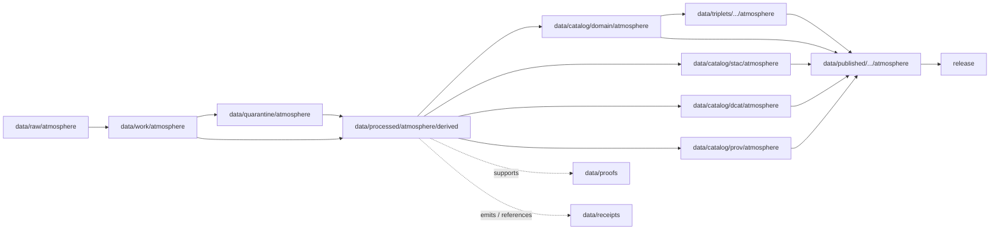

<!-- [KFM_META_BLOCK_V2]
doc_id: kfm://doc/data-processed-atmosphere-derived-readme
title: data/processed/atmosphere/derived/README.md — Atmosphere Derived Processed Data README
version: v0.1
type: readme; data-lifecycle-sublane; processed-stage-guide; atmosphere-domain-lane; derived-parent-lane
status: draft; PROPOSED; data-root; processed-stage; atmosphere; derived; release-gated; source-role-aware; evidence-aware
owners: OWNER_TBD — Atmosphere steward · Derived-products steward · Data steward · Pipeline steward · Evidence steward · Policy steward · Release steward · Docs steward
created: NEEDS VERIFICATION — blank placeholder existed before v0.1 expansion
updated: 2026-06-25
policy_label: public-doc; data; processed; atmosphere; derived; lifecycle; governed; release-gated
tags: [kfm, data, processed, atmosphere, derived, air-quality, weather, smoke, AOD, climate, forecast, advisory, lifecycle, RAW, WORK, QUARANTINE, CATALOG, TRIPLET, PUBLISHED, EvidenceBundle, SourceDescriptor, LayerManifest, RunReceipt, ValidationReport, PolicyDecision, ReleaseManifest]
related:
  - ../README.md
  - ../aggregate/README.md
  - ../aggregate/climate/README.md
  - ../air_observations/README.md
  - ../air_stations/README.md
  - ../aod/README.md
  - ../advisory/README.md
  - ../advisory_context/README.md
  - ../../README.md
  - ../../../README.md
  - ../../../../docs/domains/atmosphere/README.md
  - ../../../../data/catalog/domain/atmosphere/README.md
  - ../../../../contracts/domains/atmosphere/
  - ../../../../schemas/contracts/v1/domains/atmosphere/
  - ../../../../policy/domains/atmosphere/
  - ../../../../docs/doctrine/directory-rules.md
  - ../../../../docs/doctrine/lifecycle-law.md
  - ../../../../docs/doctrine/trust-membrane.md
  - ../../../raw/atmosphere/
  - ../../../work/atmosphere/
  - ../../../quarantine/atmosphere/
  - ../../../catalog/stac/atmosphere/
  - ../../../catalog/dcat/atmosphere/
  - ../../../catalog/prov/atmosphere/
  - ../../../triplets/
  - ../../../published/
  - ../../../proofs/
  - ../../../receipts/
  - ../../../registry/
  - ../../../../release/
  - ../../../../pipelines/
  - ../../../../tools/validators/
notes:
  - "This file replaces a blank placeholder at `data/processed/atmosphere/derived/README.md`."
  - "This is the parent PROCESSED-stage derived-products lane for Atmosphere artifacts. It organizes derived products without becoming a catalog, proof, receipt, source registry, release, schema, policy, public layer, API, UI, or tile-service authority."
  - "Derived Atmosphere artifacts must preserve source role, derivation method, input lineage, spatial/temporal scope, units, uncertainty/caveats, source trace, evidence linkage, policy posture, and release state before public use."
  - "Derived products are downstream of processed inputs but still upstream of catalog, triplet, published, and release gates."
  - "Rollback target for this expansion is previous blank blob SHA `8b137891791fe96927ad78e64b0aad7bded08bdc`."
[/KFM_META_BLOCK_V2] -->

<a id="top"></a>

# data/processed/atmosphere/derived

> Parent Atmosphere PROCESSED-stage lane for derived artifacts: normalized derivative products, layer candidates, time-series candidates, evidence-drawer payload candidates, generalized/redacted derivatives, and analysis-ready outputs that remain upstream of catalog, proof, release, and public map/API/UI surfaces.

<p>
  
  
  
  
  
  
</p>

**Status:** draft / PROPOSED  
**Owners:** OWNER_TBD — Atmosphere steward · Derived-products steward · Data steward · Pipeline steward · Evidence steward · Policy steward · Release steward · Docs steward  
**Path:** `data/processed/atmosphere/derived/README.md`  
**Owning root:** `data/processed/`  
**Domain segment:** `atmosphere`  
**Sublane:** `derived`  
**Lifecycle stage:** `PROCESSED`  
**Exposure posture:** not public by default; public use requires governed catalog, evidence, policy, release, correction, and rollback linkage  
**Truth posture:** CONFIRMED target was blank · CONFIRMED Atmosphere scope includes public-safe derived products · CONFIRMED parent `data/processed/` lane is not a public surface · PROPOSED derived-parent processed-lane details · NEEDS VERIFICATION for actual child inventory, schemas/profiles, validators, receipts, CI enforcement, release linkage, LayerManifest behavior, and governed route behavior.

**Quick jumps:** [Purpose](#purpose) · [Lifecycle boundary](#lifecycle-boundary) · [Repo fit](#repo-fit) · [Accepted contents](#accepted-contents) · [Exclusions](#exclusions) · [Derived-product requirements](#derived-product-requirements) · [Source-role guardrails](#source-role-guardrails) · [Child lanes](#child-lanes) · [Directory map](#directory-map) · [Evidence ledger](#evidence-ledger) · [Validation checklist](#validation-checklist) · [Rollback](#rollback)

---

## Purpose

`data/processed/atmosphere/derived/` holds normalized derived Atmosphere/Air artifacts that have moved beyond RAW capture, WORK transforms, and QUARANTINE holds.

This parent lane groups processed derivatives across Atmosphere object families: air-quality derived products, weather/mesonet derivatives, smoke/AOD context derivatives, climate context derivatives, forecast/advisory context derivatives, generalized public-safe candidates, time-series candidates, layer-candidate payloads, and Evidence Drawer payload candidates.

It is not a catalog lane, proof store, receipt store, source registry, release authority, public layer root, tile-service root, API root, UI root, or model-answer source. It is a governed lifecycle handoff lane that may support downstream catalog records, EvidenceBundle-backed UI payloads, LayerManifest creation, public-safe derived products, Focus Mode summaries, or release packages after gates pass.

## Lifecycle boundary

```text
RAW -> WORK / QUARANTINE -> PROCESSED -> CATALOG / TRIPLET -> PUBLISHED
```



`data/processed/atmosphere/derived/` is upstream of catalog, triplet, publication, and release. It must not be used as a normal public map/API/UI/AI source.

## Repo fit

| Responsibility | Correct home | Rule |
|---|---|---|
| Raw atmosphere source payloads | `data/raw/atmosphere/` | Not this lane. |
| In-process derivations, scratch joins, temporary tiles, temporary notebooks, model experiments, or method experiments | `data/work/atmosphere/` | Not this lane. |
| Rights-unclear, source-role-unclear, malformed, unsupported, disputed, sensitive, stale, or unsafe derived material | `data/quarantine/atmosphere/` | Not this lane until resolved. |
| Normalized derived Atmosphere processed artifacts | `data/processed/atmosphere/derived/` | This parent lane. |
| Aggregate Atmosphere processed artifacts | `data/processed/atmosphere/aggregate/` | Sibling lane for aggregate rollups/summaries. |
| Object-family processed artifacts | `data/processed/atmosphere/<object-family>/` | Use object-family lane when artifact is primarily a normalized object-family record. |
| Atmosphere domain catalog records | `data/catalog/domain/atmosphere/` | Downstream catalog stage. |
| Atmosphere STAC/DCAT/PROV records | `data/catalog/{stac,dcat,prov}/atmosphere/` | Downstream catalog projections, if accepted. |
| Atmosphere triplet/graph projections | `data/triplets/.../atmosphere/` | Downstream graph stage. |
| Atmosphere public-safe products | `data/published/.../atmosphere/` | Downstream after release. |
| EvidenceBundle/proof records | `data/proofs/` | Separate proof family. |
| Source, run, transform, derivation, validation, policy, correction, and release receipts | `data/receipts/` | Separate receipt family. |
| SourceDescriptor/source registry records | `data/registry/` | Separate registry family. |
| Release decisions, manifests, rollback cards, corrections, withdrawals | `release/` | Separate publication authority. |
| Layer manifests and public layer contracts | Release/layer/published homes after verification | Not this processed lane unless only a non-release candidate sidecar. |
| Atmosphere semantic contracts | `contracts/domains/atmosphere/` | Object meaning; not data. |
| Atmosphere schemas | `schemas/contracts/v1/domains/atmosphere/` | Machine shape; not data. |
| Policy, validators, tests, pipelines, apps, packages | `policy/`, `tools/validators/`, `tests/`, `pipelines/`, `apps/`, `packages/` | Separate roots. |

## Accepted contents

Processed derived Atmosphere data may include:

- normalized derivative products generated from governed Atmosphere inputs after RAW/WORK/QUARANTINE handling;
- derived layer candidates, generalized/redacted spatial derivatives, time-series candidates, chart/table candidates, and Evidence Drawer payload candidates that still require catalog and release review;
- derived weather, climate, air-quality, smoke/AOD, model-context, forecast-context, advisory-context, or cross-object context products when source role and knowledge character remain visible;
- public-safe candidates produced by redaction, generalization, aggregation, clipping, tiling-prep, normalization, alignment, enrichment, or caveat-generation transforms when release has not yet occurred;
- uncertainty, caveat, quality, missingness, station coverage, interpolation, correction, lineage, and method metadata sidecars when those sidecars are not proofs, receipts, source registry records, catalog records, schemas, or policy rules;
- processed artifacts prepared for downstream domain catalog, STAC/DCAT/PROV packaging, EvidenceBundle support, triplet generation, LayerManifest creation, or release review.

## Exclusions

Do not store these under `data/processed/atmosphere/derived/`:

- RAW source files, source-native products, screenshots, downloads, feeds, station payloads, advisory payloads, source rasters, source tiles, source notebooks, or logs.
- WORK/scratch outputs that have not passed processing gates.
- Quarantined, malformed, source-role-unclear, rights-unclear, unsupported, disputed, stale, sensitive, or unsafe derived material.
- Canonical object-family records when a narrower object-family lane exists and is the accepted home.
- Aggregate summaries when `data/processed/atmosphere/aggregate/` is the accepted home.
- Public layers, public tile outputs, app/UI/API payloads, public downloads, public Focus Mode payloads, or model-answer/runtime outputs.
- Domain catalog records, STAC records, DCAT records, PROV records, triplet/graph records, published outputs, proofs, receipts, source registry records, release records, schemas, policy rules, validators, tests, pipelines, app/UI/API code.
- Climate attribution claims, trend-significance claims, event/hazard truth, damages, health/safety claims, exposure claims, regulatory conclusions, emergency instructions, public alerting behavior, or policy conclusions.

## Derived-product requirements

PROPOSED until concrete validators and CI enforcement are verified:

| Requirement | Meaning |
|---|---|
| Source trace | Every processed derived artifact should trace to SourceDescriptor or source registry context when source authority matters. |
| Input lineage | Inputs, object-family sources, source roles, method versions, and transform steps should be recoverable through receipts or sidecar lineage. |
| Derivation disclosure | Derivation method, spatial unit, temporal unit, variable, units, transforms, redaction/generalization, caveats, and uncertainty should be explicit enough for downstream validation. |
| Source-role preservation | Observations, reports/indexes, model fields, forecasts, satellite proxies, advisories, normals, anomalies, aggregates, and derived products must remain labeled as their actual role. |
| Deterministic identity | Derived artifacts should have stable IDs, content digests, or method-linked identities where practical. |
| Evidence linkage | Claims about derived value, scope, source, method, uncertainty, correction, or release should resolve downstream to EvidenceBundle/proof context. |
| Policy posture | Public display requires rights, source-role, caveat, freshness where applicable, sensitivity, and policy/admissibility posture. |
| Catalog readiness | Processed derived artifacts intended for discovery should promote through Atmosphere catalog lanes, not directly to public use. |
| Release readiness | Public use requires release state, published output path, correction path, and rollback target. |
| No overclaim by default | Derived context does not prove cause, impact, damages, trend significance, exposure, hazard truth, regulatory status, or health/safety guidance without separate evidence and review. |

## Source-role guardrails

- Derivation does not turn processed data into truth, proof, or publication authority.
- AQI is not raw concentration.
- AOD is not PM2.5.
- Model fields and forecasts must remain labeled as model or forecast context.
- Advisory context must keep official-source and role boundaries visible.
- Low-cost sensor derived products require correction, caveats, confidence, limitations, policy posture, and source rights before public use.
- Public derived products require source-role disclosure, method disclosure, evidence, policy, release state, correction path, and rollback target.
- Unreleased processed derived artifacts are not public merely because they exist under this directory.

> [!CAUTION]
> Do not use this lane as a shortcut from processed derived data to public claims, public layers, public tiles, Focus Mode outputs, API/UI payloads, health/safety guidance, regulatory claims, exposure claims, or emergency behavior. Derived products must pass catalog, evidence, policy, validation, release, correction, and rollback gates before public use.

## Child lanes

No child lane is confirmed by this README beyond the placeholder itself. Candidate future child lanes are **PROPOSED** until verified:

| Candidate lane | Proposed purpose | Caution |
|---|---|---|
| `layers/` | Derived layer candidates before publication. | Must not contain public LayerManifest/release authority or published tiles. |
| `time_series/` | Derived time-series candidates for UI/Evidence Drawer. | Must preserve source role, time semantics, and release posture. |
| `evidence_drawer/` | Candidate evidence payloads derived from processed data. | EvidenceBundle/proof records still belong in `data/proofs/`. |
| `generalized/` | Redacted/generalized public-safe candidates. | Generalization candidates still require policy and release review. |
| `cross_context/` | Derived cross-object context joins. | Must not collapse object-family truth or source roles. |

Do not create child lanes as parallel truth stores. Each child must explain what it owns, what it excludes, which object families it touches, and how it promotes downstream.

## Directory map

Actual child inventory remains **NEEDS VERIFICATION**. Use this as a proposed local organization pattern only after confirming current repo convention and validators.

```text
data/processed/atmosphere/derived/
├── README.md
├── layers/                  # PROPOSED — processed layer candidates, not published layers
├── time_series/             # PROPOSED — time-series candidates, not public API payloads
├── evidence_drawer/         # PROPOSED — payload candidates, not EvidenceBundle/proofs
├── generalized/             # PROPOSED — redacted/generalized candidates, not releases
├── cross_context/           # PROPOSED — cross-object context derivatives with source-role boundaries
├── methods/                 # PROPOSED — local method summaries, not canonical receipts
├── quality/                 # PROPOSED — missingness, coverage, uncertainty, caveats
├── _manifests/              # PROPOSED — lane-local non-release manifests only
└── _README_TODO.md          # PROPOSED — remove after actual child inventory is documented
```

## Evidence ledger

| Source | Status | Supports | Limits |
|---|---|---|---|
| Previous file | CONFIRMED | Target existed as a blank placeholder. | Did not define derived PROCESSED-stage boundaries. |
| `data/processed/atmosphere/README.md` | CONFIRMED | Parent atmosphere processed lane exists as a greenfield stub. | Does not define parent Atmosphere processed boundaries yet. |
| `data/processed/README.md` | CONFIRMED | Parent processed lane is upstream of catalog, triplets, and publication and is not public by default. | Does not prove child inventory under this lane. |
| `data/catalog/domain/atmosphere/README.md` | CONFIRMED | Atmosphere catalog is downstream, supports discovery/release closure, and does not make claims true or public by itself. | Does not prove derived processed inventory or release behavior. |
| `docs/domains/atmosphere/README.md` | CONFIRMED doctrine / PROPOSED implementation | Atmosphere scope includes public-safe derived products and source-role denials. | Implementation maturity and runtime behavior remain NEEDS VERIFICATION. |
| `docs/doctrine/directory-rules.md` | CONFIRMED doctrine / PROPOSED path specifics | Data paths encode lifecycle phase and domain segment; promotion is governed. | Does not prove runtime enforcement. |

## Validation checklist

- [ ] Confirm actual child directories under `data/processed/atmosphere/derived/`.
- [ ] Confirm accepted derived product profiles for each child lane.
- [ ] Confirm derived artifact schemas/profiles and LayerManifest relationship where applicable.
- [ ] Confirm derived processed validators and CI checks.
- [ ] Confirm SourceDescriptor/source registry linkage for each source-derived artifact.
- [ ] Confirm input lineage, transform receipts, method versions, redaction/generalization records, validation reports, policy decisions, correction paths, and rollback targets where applicable.
- [ ] Confirm object-family boundaries and source-role labels for all derived cross-context products.
- [ ] Confirm no RAW, WORK, QUARANTINE, CATALOG, TRIPLET, PUBLISHED, proof, receipt, release, schema, policy, validator, package, pipeline, app, API, public tile, public layer, Focus Mode public payload, model-answer, exposure, regulatory, attribution, hazard-impact, or health/safety artifacts are misplaced here.
- [ ] Confirm promotion flow from processed derived data to catalog/triplet/published outputs is governed, source-role-safe, method-aware, evidence-backed, policy-reviewed, and reversible.
- [ ] Confirm public clients and Focus Mode cannot use this lane as a direct public claim, public layer, public API/UI payload, alerting, attribution, trend-significance, hazard-impact, exposure, regulatory, or health/safety source.

## Rollback

Rollback is required if this lane becomes an Atmosphere source-data root, canonical object-family root, aggregate root, quarantine bypass, proof store, receipt store, catalog root, triplet root, source-registry root, release-decision root, published-output root, public tile root, public layer root, LayerManifest authority root, schema root, policy root, validator root, implementation root, public API shortcut, public UI shortcut, public exposure shortcut, climate-attribution source, trend-significance source, hazard-impact source, regulatory-claim source, public-alerting source, or health/safety guidance source.

Rollback target for this expansion: previous blank blob SHA `8b137891791fe96927ad78e64b0aad7bded08bdc`.

<p align="right"><a href="#top">Back to top</a></p>
