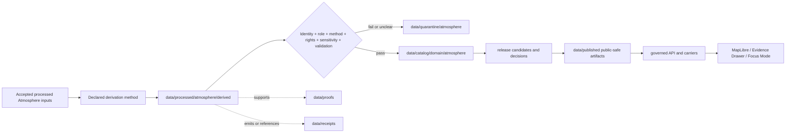

<!-- [KFM_META_BLOCK_V2]
doc_id: kfm://doc/data-processed-atmosphere-derived-readme
title: data/processed/atmosphere/derived/ — Atmosphere Derived Processed Data
version: v0.2.0
type: directory-readme
subtype: processed-atmosphere-derived-parent-lane
status: repository-grounded draft; payload inventory, accepted profiles, validators, fixtures, receipts, proof, release, and runtime behavior remain bounded
owners:
  - "NEEDS VERIFICATION — Atmosphere domain steward"
  - "NEEDS VERIFICATION — derived-products and cross-object-method steward"
  - "NEEDS VERIFICATION — source-role, sensitivity, data-quality, and scientific-method reviewers"
  - "NEEDS VERIFICATION — data, evidence, policy, release, correction, rollback, and docs stewards"
created: NEEDS VERIFICATION — blank placeholder existed before v0.1 expansion
updated: 2026-07-25
policy_label: public-doc; processed-stage; atmosphere; derived-parent; source-role-aware; method-aware; claim-bounded; release-gated; no-direct-public-path
path: data/processed/atmosphere/derived/README.md
truth_posture: >
  CONFIRMED exact target path, prior blob, Directory Rules placement, current Atmosphere parent lane,
  current aggregate, AOD, air-station, and climate-anomaly adjacent lanes, Atmosphere doctrine, and
  PROCESSED lifecycle boundary / PROPOSED derived admission profile, normalized derivative packet,
  claim-character rules, and downstream promotion expectations / UNKNOWN recursive payload inventory,
  accepted derived schemas or profiles, production validators, fixtures, receipts, proof closure,
  release instances, hosting, and public behavior / NEEDS VERIFICATION accountable owners, canonical
  child-lane inventory, derived-product vocabulary, LayerManifest relationship, scientific fitness,
  correction propagation, cache invalidation, and rollback drills
evidence_snapshot:
  repository: bartytime4life/Kansas-Frontier-Matrix
  base_ref: main
  base_commit: 38841dea3d89d87908f20dd0bc1be9c35d0adbe9
  prior_blob: 85b98b0baa305f04a651e38d254ea8bed7027292
  directory_rules_blob: 2affb080e6f0043867c64c7f06c1ca52030fbd55
  atmosphere_parent_blob: e37ce206f396f832c414fc46a70dd9cd9b3f64e4
related:
  - ../README.md
  - ../aggregate/README.md
  - ../aggregate/climate/README.md
  - ../air_observations/README.md
  - ../air_stations/README.md
  - ../aod/README.md
  - ../climate_anomaly/README.md
  - ../advisory/README.md
  - ../advisory_context/README.md
  - ../../README.md
  - ../../../README.md
  - ../../../../docs/domains/atmosphere/README.md
  - ../../../../docs/domains/atmosphere/CANONICAL_PATHS.md
  - ../../../../docs/domains/atmosphere/OBJECT_FAMILY_MAP.md
  - ../../../../docs/domains/atmosphere/POLICY.md
  - ../../../../docs/domains/atmosphere/PUBLICATION_POSTURE.md
  - ../../../../docs/domains/atmosphere/SENSITIVITY.md
  - ../../../../docs/doctrine/directory-rules.md
  - ../../../../contracts/domains/atmosphere/README.md
  - ../../../../schemas/contracts/v1/domains/atmosphere/README.md
  - ../../../../policy/domains/atmosphere/README.md
  - ../../../raw/atmosphere/README.md
  - ../../../work/atmosphere/README.md
  - ../../../quarantine/atmosphere/README.md
  - ../../../catalog/domain/atmosphere/README.md
  - ../../../triplets/README.md
  - ../../../proofs/README.md
  - ../../../receipts/README.md
  - ../../../registry/sources/atmosphere/README.md
  - ../../../../release/candidates/atmosphere/README.md
  - ../../../../release/README.md
notes:
  - "Same-path Markdown modernization only; no derived bytes, source state, contract, schema, policy, validator, workflow, proof, release, route, hosting, or KFM publication state changed."
  - "Derived artifacts are transformations or combinations of governed inputs; they do not become source truth, evidence proof, catalog authority, release state, or public payloads by existing here."
  - "Object-family, aggregate, model, observation, proxy, forecast, advisory, regulatory, and derived knowledge characters must remain distinguishable."
  - "Rollback target for v0.2.0 is prior blob SHA `85b98b0baa305f04a651e38d254ea8bed7027292`."
[/KFM_META_BLOCK_V2] -->

<a id="top"></a>

# `data/processed/atmosphere/derived/` — Atmosphere derived processed data

> **One-line purpose.** Hold normalized Atmosphere derivative candidates while preserving every input, source role, method, claim character, spatial and temporal support, uncertainty, policy posture, correction lineage, and downstream-use limit.

[](#status)
[](#authority-level)
[](#what-belongs-here)
[](#outputs)
[](#derived-admission-profile)
[](#validation)

> [!IMPORTANT]
> **Derived does not mean authoritative, public-safe, or release-ready.** A polished layer, chart, time series, score, join, summary, or payload candidate can remain non-comparable, role-collapsed, rights-unclear, weakly supported, policy-held, scientifically unfit, or unsafe for public use.

**Path:** `data/processed/atmosphere/derived/README.md`  
**Owning root:** `data/`  
**Lifecycle phase:** `processed/`  
**Domain segment:** `atmosphere/`  
**Lane role:** parent lane for governed derived-product candidates  
**Direct public access:** denied  
**Last reviewed:** 2026-07-25

**Quick navigation:** [Purpose](#purpose) · [Authority level](#authority-level) · [Status](#status) · [What belongs here](#what-belongs-here) · [What does NOT belong here](#what-does-not-belong-here) · [Inputs](#inputs) · [Outputs](#outputs) · [Validation](#validation) · [Review burden](#review-burden) · [Related folders](#related-folders) · [ADRs](#adrs) · [Last reviewed](#last-reviewed) · [Derived admission profile](#derived-admission-profile) · [Knowledge-character and claim guardrails](#knowledge-character-and-claim-guardrails) · [Artifact-family boundaries](#artifact-family-boundaries) · [Lifecycle and promotion](#lifecycle-and-promotion) · [Correction and rollback](#correction-and-rollback)

---

## Purpose

This directory is the Atmosphere domain's **PROCESSED-stage parent lane for derived-product candidates**. It may hold normalized outputs created from one or more governed Atmosphere inputs after RAW capture, WORK transformation, and QUARANTINE holds have been addressed.

The lane exists to preserve the answer to seven questions before downstream use:

1. Which exact input artifacts and source roles contributed?
2. Which method, code/configuration version, parameters, and transforms produced the derivative?
3. What object family and knowledge character does the output retain or introduce?
4. What spatial, temporal, variable, unit, coverage, and uncertainty support apply?
5. What claim can the output support—and what claims must it not support?
6. Which rights, sensitivity, evidence, validation, policy, correction, and review states apply?
7. Which downstream uses are allowed, restricted, narrowed, delayed, or denied?

It is not a catalog lane, source registry, proof store, receipt authority, release authority, public layer root, tile root, UI payload store, AI answer store, or shortcut around canonical object-family lanes.

## Authority level

**Implementation-bearing lifecycle lane.** The target path is CONFIRMED in the repository and remains under `data/processed/atmosphere/`, consistent with Directory Rules' lifecycle and domain-placement rules.

Its authority is deliberately narrow:

- it may carry processed derivative candidates and lane-local explanatory metadata;
- it does not define canonical object meaning—that remains in semantic contracts;
- it does not define machine shape—that remains in accepted schemas or profiles;
- it does not replace object-family, aggregate, observation, model, forecast, proxy, advisory, or regulatory lanes;
- it does not decide scientific fitness, admissibility, evidence closure, release, or public exposure;
- it does not turn an analysis-ready or render-ready artifact into public truth.

## Status

| Surface | Status | Evidence-bounded interpretation |
|---|---|---|
| This README and path | **CONFIRMED** | The file exists at the pinned base and is updated in place. |
| Parent Atmosphere processed lane | **CONFIRMED** | `data/processed/atmosphere/README.md` identifies `derived/` as a derived-products lane and denies direct public use. |
| Adjacent processed lanes | **CONFIRMED paths** | Aggregate, aggregate-climate, AOD, air-station, climate-anomaly, observation, and advisory lanes exist as distinct responsibilities. |
| Real derived payload inventory | **UNKNOWN** | This documentation task did not inspect or expose derived data payloads. |
| Accepted derived schemas or profiles | **NEEDS VERIFICATION** | No universal accepted derived-product contract/schema profile was verified. |
| Validators, fixtures, and CI enforcement | **NEEDS VERIFICATION** | No accepted production derived-product validator suite was verified. |
| Receipts, proof, policy decisions, release instances, LayerManifest behavior, hosting, public behavior | **UNKNOWN / held** | Presence in this directory creates none of these states. |

## What belongs here

Good fits are processed derivatives whose inputs, methods, identity, and claim limits remain inspectable, including:

- cross-object Atmosphere products that genuinely combine multiple accepted input families and do not have a narrower canonical object lane;
- normalized layer, table, chart, time-series, index, summary, overlay, comparison, or analysis candidates that remain upstream of catalog and release;
- generalized, redacted, suppressed, clipped, resampled, aggregated, aligned, enriched, or caveat-bearing public-candidate derivatives that remain unreleased;
- observation-derived products that remain labeled observation-derived and do not become observations, models, forecasts, or regulatory claims;
- model-derived or forecast-derived products that remain explicitly modeled or forecast context;
- proxy-derived products that preserve proxy identity—for example, AOD-derived context must not become PM2.5 truth;
- advisory-derived context that preserves official-source referral and does not become KFM-issued guidance;
- method, quality, coverage, missingness, uncertainty, correction, and lineage sidecars that are not receipts, proofs, policies, catalogs, or release records;
- object-ready candidates prepared for contract/schema validation, EvidenceBundle closure, catalog review, LayerManifest generation, or release review;
- lane-local README or non-release manifest notes that explain derivative identity without becoming authority records.

## What does NOT belong here

Do not place these in `data/processed/atmosphere/derived/`:

- RAW feeds, source downloads, screenshots, station payloads, source rasters, source tiles, logs, notebooks, or source-native products;
- WORK experiments, temporary joins, exploratory notebooks, model tuning, scratch tiles, ad hoc summaries, or incomplete transformations;
- QUARANTINE material with unresolved rights, source role, method, input identity, sensitivity, staleness, dispute, quality, or scientific-fitness state;
- canonical object-family records when a narrower accepted lane owns them;
- aggregate products when `data/processed/atmosphere/aggregate/` or an accepted aggregate child lane owns them;
- public layers, PMTiles, public downloads, governed API payloads, UI state, Focus Mode carriers, Evidence Drawer payloads, AI answers, search indexes, or runtime caches;
- catalogs, STAC/DCAT/PROV projections, triplets, source descriptors, proofs, receipts, policies, schemas, validators, tests, executable pipelines, releases, correction notices, or rollback cards;
- derived outputs that silently relabel AQI as concentration, AOD as PM2.5, model/forecast as observation, advisory context as KFM guidance, climate anomaly as attribution, or station context as measurement truth;
- climate attribution, trend-significance, hazard, impact, damage, exposure, health, regulatory, emergency, or life-safety conclusions unsupported by separate evidence and authority;
- transform secrets, private thresholds, exact restricted locations, credentials, internal access details, or parameters whose disclosure would weaken a sensitivity control.

## Inputs

Inputs may enter this lane only through governed lifecycle transitions from:

- accepted `data/processed/atmosphere/<object-family>/` lanes when a derivative combines or transforms those records without replacing their identity;
- `data/processed/atmosphere/aggregate/` when an accepted derivative builds from aggregate inputs and preserves aggregate method and support;
- `data/work/atmosphere/` after input identities, method, source roles, rights, support, uncertainty, sensitivity, validation, and correction posture are recorded;
- `data/quarantine/atmosphere/` after the hold condition is resolved and the remediation decision is auditable;
- approved cross-domain context where ownership remains with the source domain and the relationship is explicit, evidence-backed, policy-reviewed, and non-authoritative for the source domain.

A connector-to-PROCESSED, watcher-to-PROCESSED, public-upload-to-PROCESSED, or renderer-to-PROCESSED shortcut is not an accepted normal path. Connectors, watchers, renderers, and AI systems do not silently promote or originate canonical truth.

## Outputs

This lane may support downstream candidates for:

- `data/catalog/domain/atmosphere/` and accepted STAC/DCAT/PROV projections;
- `data/triplets/` or other relationship projections that preserve every contributing object, source role, method, and evidence reference;
- separate `data/proofs/` and `data/receipts/` objects;
- candidate LayerManifest or layer-registry inputs in their proper authority roots;
- `release/candidates/atmosphere/` after identity, rights, method, sensitivity, scientific fitness, validation, evidence, review, correction, and rollback obligations are met;
- `data/published/` only through a governed release transition and separate released artifact path;
- governed API, MapLibre, Evidence Drawer, export, Focus Mode, or AI carriers only after public-safe release.

> [!CAUTION]
> Ordinary public clients must not read this directory directly. Renderability, analysis readiness, or apparent usefulness does not establish release state or public truth.

## Validation

No complete Atmosphere derived-product production validator suite was verified in this task. Until accepted contracts or profiles, schemas, fixtures, validators, policy checks, and CI evidence exist, field-level enforcement claims must remain bounded.

A credible derived-product validation profile should check, at minimum:

1. stable derivative identity and content/method digest where practical;
2. complete input inventory and resolvable input identities;
3. source role and knowledge character for every input and output;
4. method name, implementation/configuration version, parameters, and transform order;
5. variable, units, spatial support, temporal support, resolution, extent, and coverage;
6. aggregation, interpolation, resampling, clipping, redaction, generalization, suppression, and missingness rules where applicable;
7. uncertainty, caveats, residual error, quality flags, and scientific-fitness limits;
8. rights, license, attribution, sensitivity, and re-identification posture;
9. evidence references, validation result, policy decision, review state, correction path, release hold, and rollback target;
10. denial of direct public routes and denial of role-collapsed or unsupported claims.

Fail closed or quarantine when a material input, role, method, unit, support, uncertainty, right, sensitivity, evidence, or release dependency is absent, contradictory, stale, unsupported, or unsafe for the requested use.

## Review burden

| Change | Minimum review burden |
|---|---|
| README wording or navigation only | Docs steward plus Atmosphere/domain reviewer. |
| New derived product family or child-lane admission | Atmosphere steward, affected object-family stewards, data/pipeline steward, and Directory Rules review. |
| Scientific method, aggregation, interpolation, model, forecast, proxy, exposure, or uncertainty semantics | Appropriate scientific reviewer plus contract/schema and validation reviewers. |
| Cross-domain derivative | Reviewers from every truth-owning domain plus evidence and policy review. |
| Public-facing layer, API, Focus Mode, Evidence Drawer, export, or AI carrier | Evidence, policy, release, correction, rollback, and independent review where required. |
| Health, regulatory, hazard, exposure, attribution, or life-safety implication | Hold by default; require the owning authority/domain and significance-appropriate evidence. |

## Related folders

- [`../README.md`](../README.md) — parent Atmosphere processed lane.
- [`../aggregate/README.md`](../aggregate/README.md) — aggregate products, not a synonym for derived.
- [`../air_observations/README.md`](../air_observations/README.md) — value-bearing air observations.
- [`../air_stations/README.md`](../air_stations/README.md) — station and network context.
- [`../aod/README.md`](../aod/README.md) — aerosol proxy context.
- [`../climate_anomaly/README.md`](../climate_anomaly/README.md) — baseline-relative climate context.
- [`../../../catalog/domain/atmosphere/README.md`](../../../catalog/domain/atmosphere/README.md) — downstream catalog authority.
- [`../../../proofs/README.md`](../../../proofs/README.md) and [`../../../receipts/README.md`](../../../receipts/README.md) — trust-bearing evidence and process memory.
- [`../../../../release/README.md`](../../../../release/README.md) — release, correction, withdrawal, and rollback authority.

## ADRs

- Directory Rules and accepted lifecycle/schema-home ADRs govern placement.
- A new derived child lane, parallel contract/schema/profile home, or public-payload authority requires the applicable ADR or migration note.
- No ADR was created or decided by this README update.

## Last reviewed

**2026-07-25.** Re-review when a derived schema/profile, validator, child lane, LayerManifest relationship, public carrier, or release workflow is accepted or changed.

## Derived admission profile

A derived candidate should carry or resolve to this minimum packet before consequential downstream use:

| Category | Required context |
|---|---|
| Identity | `derived_artifact_id`, artifact family, version, digest, supersession state. |
| Inputs | Complete ordered/unordered input set as method requires, input IDs/digests, source roles, object families, vintages. |
| Method | Method name, code/config version, parameters, transform sequence, deterministic/non-deterministic posture. |
| Semantics | Output knowledge character, claim character, variable, units, spatial/temporal support, resolution, extent. |
| Quality | Coverage, missingness, uncertainty, calibration/validation context, caveats, residual risk. |
| Governance | Rights, attribution, sensitivity, policy state, review state, release hold, correction path, rollback target. |
| Evidence | EvidenceRefs that resolve downstream to the applicable EvidenceBundle and receipts. |

This is **PROPOSED** until paired contracts/profiles, schemas, fixtures, validators, and policy enforcement are accepted.

## Knowledge-character and claim guardrails

- Derivation never upgrades source authority.
- A derivative must retain the distinction between observation, model, forecast, proxy, advisory, regulatory, aggregate, normal, anomaly, station context, and derived context.
- A multi-input product must identify which parts are measured, modeled, inferred, aggregated, generalized, or generated.
- `AQI` remains an index/report posture, not a concentration value.
- `AOD` remains a remote-sensing proxy, not PM2.5.
- Forecasts and model fields remain forecasts/models, not observations.
- Climate anomalies remain baseline-relative context, not attribution or trend proof.
- Advisory context remains authority referral, not KFM-issued guidance.
- AI-generated language, labels, classifications, or summaries remain interpretive and cannot become source, proof, policy, or release authority.
- When the evidence supports only a narrower statement, narrow the derivative's claim or abstain.

## Artifact-family boundaries

| Artifact | This lane? | Boundary |
|---|---:|---|
| Canonical Atmosphere object record | Usually no | Store in the accepted object-family lane. |
| Aggregate rollup or summary | Usually no | Store in the accepted aggregate lane unless it is a distinct downstream derivative with documented ownership. |
| Cross-object analytical candidate | Yes, conditionally | Inputs, method, claim character, and source roles must remain explicit. |
| Public-safe generalized candidate | Yes, conditionally | Still requires policy, validation, release, correction, and rollback. |
| Evidence Drawer/API/UI payload | No | Generate from released governed carriers; do not use this lane as a payload store. |
| LayerManifest or release manifest | No | Place in the accepted registry/release authority root. |
| Published tile, layer, export, or cache | No | Place in released artifact/runtime homes after release. |
| AI answer or generated narrative | No | Governed answer/provenance surface only; evidence remains authoritative. |

## Lifecycle and promotion

```text
RAW -> WORK / QUARANTINE -> PROCESSED -> CATALOG / TRIPLET -> PUBLISHED
```


```mermaid
flowchart LR
  INPUTS[Accepted processed Atmosphere inputs] --> METHOD[Declared derivation method]
  METHOD --> DER[data/processed/atmosphere/derived]
  DER --> GATE{Identity + role + method + rights + sensitivity + validation}
  GATE -->|fail or unclear| QUAR[data/quarantine/atmosphere]
  GATE -->|pass| CAT[data/catalog/domain/atmosphere]
  DER -. supports .-> PROOF[data/proofs]
  DER -. emits or references .-> RECEIPT[data/receipts]
  CAT --> REL[release candidates and decisions]
  REL --> PUB[data/published public-safe artifacts]
  PUB --> API[governed API and carriers]
  API --> UI[MapLibre / Evidence Drawer / Focus Mode]
```

Promotion is a governed state transition, not a copy, render, export, commit, merge, or file move. Each derivative must preserve its inputs and method so correction or withdrawal can find every affected downstream carrier.

## Correction and rollback

A correction to any input, method, unit, time window, geometry, generalization, source role, policy decision, or evidence dependency must trigger impact analysis across derived IDs, catalog entries, proof bundles, receipts, releases, caches, tiles, exports, API payloads, and citations.

Rollback or quarantine is required when this lane becomes:

- a shadow canonical object-family or aggregate store;
- a catalog, proof, receipt, registry, policy, schema, or release authority;
- a public layer, tile, API, UI, Focus Mode, Evidence Drawer, search, cache, or AI-answer store;
- a path that hides input lineage, method, uncertainty, rights, sensitivity, or correction state;
- a role-collapse path that turns proxy/model/forecast/advisory/index context into observation or authority truth;
- an unsupported attribution, trend, exposure, health, regulatory, hazard, impact, emergency, or life-safety claim source.

**Rollback target:** prior blob `85b98b0baa305f04a651e38d254ea8bed7027292`. Before merge, close the draft PR and abandon the branch. After merge, revert the modernization commit; do not rewrite shared history.

<p align="right"><a href="#top">Back to top</a></p>
