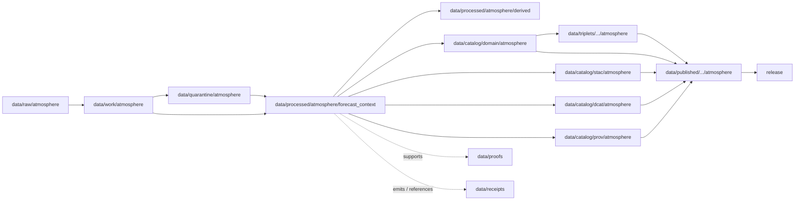

<!-- [KFM_META_BLOCK_V2]
doc_id: kfm://doc/data-processed-atmosphere-forecast-context-readme
title: data/processed/atmosphere/forecast_context/README.md — Atmosphere ForecastContext Processed Data README
version: v0.1
type: readme; data-lifecycle-sublane; processed-stage-guide; atmosphere-domain-lane; forecast-context-lane
status: draft; PROPOSED; data-root; processed-stage; atmosphere; forecast-context; ForecastContext; release-gated; model-field-aware; uncertainty-aware; source-role-aware
owners: OWNER_TBD — Atmosphere steward · Forecast/model steward · Data steward · Pipeline steward · Evidence steward · Policy steward · Release steward · Docs steward
created: NEEDS VERIFICATION — one-character placeholder existed before v0.1 expansion
updated: 2026-06-25
policy_label: public-doc; data; processed; atmosphere; forecast-context; lifecycle; governed; release-gated
tags: [kfm, data, processed, atmosphere, forecast-context, ForecastContext, atmospheric-model-field, model-field, forecast, uncertainty, lifecycle, RAW, WORK, QUARANTINE, CATALOG, TRIPLET, PUBLISHED, EvidenceBundle, SourceDescriptor, ModelRunReceipt, ValidationReport, PolicyDecision, ReleaseManifest]
related:
  - ../README.md
  - ../derived/README.md
  - ../advisory_context/README.md
  - ../aod/README.md
  - ../air_observations/README.md
  - ../climate_anomaly/README.md
  - ../climate_normals/README.md
  - ../../README.md
  - ../../../README.md
  - ../../../../docs/domains/atmosphere/README.md
  - ../../../../contracts/domains/atmosphere/ForecastContext.md
  - ../../../../contracts/domains/atmosphere/WindField.md
  - ../../../../contracts/domains/atmosphere/SmokeContext.md
  - ../../../../contracts/domains/atmosphere/AODRaster.md
  - ../../../../contracts/domains/atmosphere/AirObservation.md
  - ../../../../contracts/domains/atmosphere/WeatherObservation.md
  - ../../../../contracts/domains/atmosphere/TemperatureObservation.md
  - ../../../../contracts/domains/atmosphere/PrecipitationObservation.md
  - ../../../../contracts/domains/atmosphere/AdvisoryContext.md
  - ../../../../schemas/contracts/v1/domains/atmosphere/ForecastContext.schema.json
  - ../../../../policy/domains/atmosphere/
  - ../../../../docs/doctrine/directory-rules.md
  - ../../../../docs/doctrine/lifecycle-law.md
  - ../../../../docs/doctrine/trust-membrane.md
  - ../../../raw/atmosphere/
  - ../../../work/atmosphere/
  - ../../../quarantine/atmosphere/
  - ../../../catalog/domain/atmosphere/README.md
  - ../../../catalog/stac/atmosphere/
  - ../../../catalog/dcat/atmosphere/
  - ../../../catalog/prov/atmosphere/
  - ../../../triplets/
  - ../../../published/
  - ../../../proofs/
  - ../../../receipts/
  - ../../../registry/
  - ../../../../release/
  - ../../../../pipelines/
  - ../../../../tools/validators/
notes:
  - "This file replaces a one-character placeholder at `data/processed/atmosphere/forecast_context/README.md`."
  - "This is the PROCESSED-stage sublane for normalized ForecastContext artifacts under Atmosphere. It is not RAW model-product storage, observation storage, advisory authority, official forecast substitution, proof storage, release authority, public layer output, or life-safety guidance."
  - "ForecastContext artifacts must preserve model/forecast source role, model-run lineage, initialization time, valid time, forecast horizon, product lineage, uncertainty, evidence linkage, policy posture, and release state before public use."
  - "The ForecastContext contract defines object meaning; this README does not create a second contract or schema authority."
  - "Forecast context may inform advisory context, smoke context, AOD context, wind fields, or public-safe derived products only when source-role boundaries remain visible."
  - "Rollback target for this expansion is previous placeholder blob SHA `e25f1814e51579d5f55c0f1fe0135ddb28a47f4a`."
[/KFM_META_BLOCK_V2] -->

<a id="top"></a>

# data/processed/atmosphere/forecast_context

> Atmosphere PROCESSED-stage sublane for normalized `ForecastContext` artifacts: governed model-run, forecast-run, modeled atmospheric field, and forecast-derived context that remains distinct from observed sensor readings, official advisories, evidence proof, release approval, public layers, and life-safety guidance.

<p>
  
  
  
  
  
  
</p>

**Status:** draft / PROPOSED  
**Owners:** OWNER_TBD — Atmosphere steward · Forecast/model steward · Data steward · Pipeline steward · Evidence steward · Policy steward · Release steward · Docs steward  
**Path:** `data/processed/atmosphere/forecast_context/README.md`  
**Owning root:** `data/processed/`  
**Domain segment:** `atmosphere`  
**Object-family segment:** `forecast_context` / `ForecastContext`  
**Lifecycle stage:** `PROCESSED`  
**Exposure posture:** not public by default; public use requires governed catalog, evidence, model-run/uncertainty disclosure, policy, release, correction, and rollback linkage  
**Truth posture:** CONFIRMED target was a one-character placeholder · CONFIRMED `ForecastContext` contract and schema paths exist · CONFIRMED `ForecastContext` is model/forecast context, not observation or advisory guidance · PROPOSED forecast-context processed-sublane details · NEEDS VERIFICATION for actual child inventory, validators, receipts, CI enforcement, release linkage, and governed route behavior.

**Quick jumps:** [Purpose](#purpose) · [Lifecycle boundary](#lifecycle-boundary) · [Repo fit](#repo-fit) · [Accepted contents](#accepted-contents) · [Exclusions](#exclusions) · [ForecastContext requirements](#forecastcontext-requirements) · [Forecast guardrails](#forecast-guardrails) · [Directory map](#directory-map) · [Evidence ledger](#evidence-ledger) · [Validation checklist](#validation-checklist) · [Rollback](#rollback)

---

## Purpose

`data/processed/atmosphere/forecast_context/` holds normalized forecast/model-context artifacts that have moved beyond RAW capture, WORK transforms, and QUARANTINE holds.

This lane is for processed `ForecastContext` records or derivatives that preserve source identity, source role, model-run lineage, initialization time, run time, valid time, forecast horizon, product lineage, spatial scope, temporal scope, variable, units, uncertainty/caveats, evidence references, and downstream catalog readiness.

It is not a raw model-product lane. It is not an observation lane. It is not an advisory authority. It is not official forecast substitution. It is not a proof store, receipt store, source registry, catalog, release, semantic contract, schema, policy, public layer, public API/UI surface, or life-safety guidance source. It may support downstream catalog records, EvidenceBundle-backed UI payloads, public-safe model-field visualizations, Focus Mode summaries, advisory referrals, or release packages only after gates pass.

## Lifecycle boundary

```text
RAW -> WORK / QUARANTINE -> PROCESSED -> CATALOG / TRIPLET -> PUBLISHED
```



`data/processed/atmosphere/forecast_context/` is upstream of catalog, triplet, publication, and release. It must not be used as a normal public map/API/UI/AI source.

## Repo fit

| Responsibility | Correct home | Rule |
|---|---|---|
| Raw model products, GRIB/NetCDF/Zarr/COG exports, source downloads, model-run payloads, QA payloads, or logs | `data/raw/atmosphere/` | Not this lane. |
| In-process model parsing, reprojection, variable extraction, derived layers, joins, scratch outputs, or method experiments | `data/work/atmosphere/` | Not this lane. |
| Rights-unclear, source-role-unclear, stale, malformed, unsupported, disputed, uncertainty-missing, or unsafe forecast/model material | `data/quarantine/atmosphere/` | Not this lane until resolved. |
| Normalized ForecastContext processed artifacts | `data/processed/atmosphere/forecast_context/` | This lane. |
| Derived model-field products | `data/processed/atmosphere/derived/` or accepted child lane | Use this lane only when the primary artifact is ForecastContext. |
| AdvisoryContext processed artifacts | `data/processed/atmosphere/advisory_context/` | Advisory/referral context remains separate. |
| Observed sensor/weather/air observations | Object-family processed lanes such as `air_observations/` or weather lanes if present | Forecast/model fields must not impersonate observations. |
| AOD/smoke remote-sensing context | `data/processed/atmosphere/aod/` and smoke lanes if accepted | Remote-sensing masks remain distinct from model fields. |
| Climate normals/anomalies | `data/processed/atmosphere/climate_normals/`, `climate_anomaly/`, or accepted climate lane | Forecast context is run/valid-time context, not reference-period climate context. |
| Atmosphere domain catalog records | `data/catalog/domain/atmosphere/` | Downstream catalog stage. |
| Atmosphere STAC/DCAT/PROV records | `data/catalog/{stac,dcat,prov}/atmosphere/` | Downstream catalog projections, if accepted. |
| Atmosphere triplet/graph projections | `data/triplets/.../atmosphere/` | Downstream graph stage. |
| Atmosphere public-safe products | `data/published/.../atmosphere/` | Downstream after release. |
| EvidenceBundle/proof records | `data/proofs/` | Separate proof family. |
| Source, run, model-run, transform, validation, policy, correction, and release receipts | `data/receipts/` | Separate receipt family. |
| SourceDescriptor/source registry records | `data/registry/` | Separate registry family. |
| Release decisions, manifests, rollback cards, corrections, withdrawals | `release/` | Separate publication authority. |
| ForecastContext semantic contract | `contracts/domains/atmosphere/ForecastContext.md` | Object meaning; not data. |
| ForecastContext schema | `schemas/contracts/v1/domains/atmosphere/ForecastContext.schema.json` | Machine shape; not data. |
| Policy, validators, tests, pipelines, apps, packages | `policy/`, `tools/validators/`, `tests/`, `pipelines/`, `apps/`, `packages/` | Separate roots. |

## Accepted contents

Processed `ForecastContext` data may include:

- normalized model-run, forecast-run, modeled atmospheric field, or forecast-derived context records;
- source-role-preserving metadata for model source, product name, model run, initialization time, run time, valid time, forecast horizon, variable, units, grid/projection, resolution, and uncertainty;
- processed forecast/model-field derivatives prepared for downstream catalog, public-safe visualization, Focus Mode, or Evidence Drawer review when release has not yet occurred;
- stale-state, supersession, correction, reprocessing, model-run lineage, uncertainty, and caveat sidecars when those sidecars are not proofs, receipts, source registry records, catalog records, schemas, or policy rules;
- processed joins to wind, smoke, AOD, weather observation, air observation, climate context, or advisory context when the knowledge-character boundary remains visible;
- processed artifacts prepared for downstream domain catalog, STAC/DCAT/PROV packaging, EvidenceBundle support, triplet generation, LayerManifest creation, or release review.

## Exclusions

Do not store these under `data/processed/atmosphere/forecast_context/`:

- RAW model products, GRIB/NetCDF/Zarr/COG exports, source downloads, source-native model-run payloads, QA payloads, logs, screenshots, or source-native records.
- WORK/scratch outputs that have not passed processing gates.
- Quarantined, malformed, stale, source-role-unclear, rights-unclear, uncertainty-missing, unsupported, disputed, or unsafe forecast/model material.
- Observed sensor readings, regulatory archive observations, station records, AQI reports, PM2.5 or ozone measurements, AOD rasters, remote-sensing masks, climate normals, climate anomalies, or advisory/referral records unless only referenced as context and stored in their correct lanes.
- Official advisory issuance, official forecast substitution, emergency instructions, life-safety guidance, exposure claims, hazard-impact claims, damages, health/safety claims, or policy conclusions.
- Public layers, public tile outputs, app/UI/API payloads, public downloads, public Focus Mode payloads, or model-answer/runtime outputs.
- Domain catalog records, STAC records, DCAT records, PROV records, triplet/graph records, published outputs, proofs, receipts, source registry records, release records, schemas, policy rules, validators, tests, pipelines, app/UI/API code.

## ForecastContext requirements

PROPOSED until concrete validators and CI enforcement are verified:

| Requirement | Meaning |
|---|---|
| Source trace | Every processed ForecastContext artifact should trace to SourceDescriptor or source registry context when source authority matters. |
| Model-run trace | Model source, model/product name, run/initialization time, valid time, forecast horizon, product version, and correction/supersession lineage should remain visible. |
| Source-role preservation | Forecast/model context must remain labeled as `ATMOSPHERIC_MODEL_FIELD` or its governed role; it must not be presented as `OBSERVED_SENSOR` by default. |
| Time semantics | Initialization time, run time, valid time, retrieval time, release time, stale-state, correction time, and supersession time should remain distinguishable where material. |
| Uncertainty disclosure | Uncertainty, ensemble/probabilistic posture, caveats, limitations, confidence, and model assumptions should remain visible before public use. |
| Evidence linkage | Claims about forecast/model value, source, run, valid time, uncertainty, correction, or release should resolve downstream to EvidenceBundle/proof context. |
| Policy posture | Public display requires rights, source-role, freshness, uncertainty, caveat, sensitivity, and policy/admissibility posture. |
| Catalog readiness | Processed ForecastContext artifacts intended for discovery should promote through Atmosphere catalog lanes, not directly to public use. |
| Release readiness | Public use requires release state, published output path, correction path, and rollback target. |
| No life-safety by default | ForecastContext does not produce official advisories, emergency instructions, exposure claims, or health/safety guidance without separate authority and review. |

## Forecast guardrails

- `ForecastContext` is modeled/forecast context, not an observed sensor reading.
- Forecast/model fields must not be presented as observations, regulatory archive measurements, or station records.
- Forecast context may inform advisory context, but it does not create official advisory issuance or life-safety instructions.
- Public model-field visualization requires source rights, model-run receipt, uncertainty disclosure, validation, policy, release record, correction path, and rollback target.
- Forecast context does not prove exposure, hazard, impact, damages, health effect, climate attribution, trend significance, or regulatory status by itself.
- Model fields and forecasts must remain labeled as model or forecast context.
- Unreleased processed forecast artifacts are not public merely because they exist under this directory.

> [!CAUTION]
> Do not use this lane as a shortcut from processed forecast/model products to observations, official advisories, public warnings, exposure claims, health/safety guidance, public layers, or public API/UI payloads. ForecastContext products must pass catalog, evidence, policy, validation, release, correction, and rollback gates before public use.

## Directory map

Actual child inventory remains **NEEDS VERIFICATION**. Use this as a proposed local organization pattern only after confirming current repo convention and validators.

```text
data/processed/atmosphere/forecast_context/
├── README.md
├── normalized/              # PROPOSED — processed ForecastContext records
├── model_runs/              # PROPOSED — model-run lineage sidecars, not receipts
├── valid_times/             # PROPOSED — valid-time partitions / summaries
├── uncertainty/             # PROPOSED — uncertainty/caveat sidecars
├── stale_state/             # PROPOSED — stale/superseded/corrected state sidecars
├── joins/                   # PROPOSED — links to wind, smoke, AOD, observations, advisories, climate context
├── _manifests/              # PROPOSED — lane-local non-release manifests only
└── _README_TODO.md          # PROPOSED — remove after actual child inventory is documented
```

## Evidence ledger

| Source | Status | Supports | Limits |
|---|---|---|---|
| Previous file | CONFIRMED | Target existed as a one-character placeholder. | Did not define ForecastContext PROCESSED-stage boundaries. |
| `data/processed/atmosphere/README.md` | CONFIRMED | Parent atmosphere processed lane exists as a greenfield stub. | Does not define parent Atmosphere processed boundaries yet. |
| `data/processed/README.md` | CONFIRMED | Parent processed lane is upstream of catalog, triplets, and publication and is not public by default. | Does not prove child inventory under this lane. |
| `data/catalog/domain/atmosphere/README.md` | CONFIRMED | Atmosphere catalog lane includes forecast context downstream and preserves source-role guardrails. | Does not prove ForecastContext processed inventory or release behavior. |
| `docs/domains/atmosphere/README.md` | CONFIRMED doctrine / PROPOSED implementation | Atmosphere owns model/advisory context and denies model-as-observation. | Implementation maturity and runtime behavior remain NEEDS VERIFICATION. |
| `contracts/domains/atmosphere/ForecastContext.md` | CONFIRMED contract file | Defines ForecastContext as governed model/forecast context, not observation, advisory, life-safety instruction, proof, public layer, or release approval. | Contract does not prove schema enforcement, validator behavior, or release approval. |
| `schemas/contracts/v1/domains/atmosphere/ForecastContext.schema.json` | CONFIRMED scaffold schema | Paired ForecastContext schema exists with PROPOSED status. | Properties are currently empty; validator enforcement remains NEEDS VERIFICATION. |
| `docs/doctrine/directory-rules.md` | CONFIRMED doctrine / PROPOSED path specifics | Data paths encode lifecycle phase and domain segment; promotion is governed. | Does not prove runtime enforcement. |

## Validation checklist

- [ ] Confirm actual child directories under `data/processed/atmosphere/forecast_context/`.
- [ ] Confirm accepted ForecastContext source/domain path convention.
- [ ] Confirm `ForecastContext` schema fields and title casing are updated beyond scaffold if needed.
- [ ] Confirm ForecastContext processed validators and CI checks.
- [ ] Confirm SourceDescriptor/source registry linkage for each source-derived ForecastContext artifact.
- [ ] Confirm model source, model/product name, initialization time, run time, valid time, forecast horizon, product version, uncertainty, caveats, stale-state, correction, and supersession handling.
- [ ] Confirm model-field-vs-observation, forecast-vs-advisory, forecast-vs-AOD/smoke, and forecast-vs-climate-context boundaries.
- [ ] Confirm RunReceipt, ModelRunReceipt, TransformReceipt, ValidationReport, PolicyDecision, correction path, and rollback target where applicable.
- [ ] Confirm no RAW, WORK, QUARANTINE, CATALOG, TRIPLET, PUBLISHED, proof, receipt, release, schema, policy, validator, package, pipeline, app, API, public layer, observation, advisory, official warning, exposure, health/safety, or regulatory-claim artifacts are misplaced here.
- [ ] Confirm promotion flow from processed ForecastContext data to catalog/triplet/published outputs is governed, source-role-safe, uncertainty-aware, evidence-backed, and reversible.
- [ ] Confirm public clients and Focus Mode cannot use this lane as a direct observation, official advisory, public warning, exposure, emergency, regulatory, or life-safety source.

## Rollback

Rollback is required if this lane becomes an Atmosphere source-data root, observation substitute, advisory authority root, official warning/public-alerting root, quarantine bypass, proof store, receipt store, catalog root, triplet root, source-registry root, release-decision root, published-output root, public layer root, public tile root, schema root, policy root, validator root, implementation root, public API shortcut, public exposure shortcut, public health/exposure source, regulatory-claim source, emergency instruction source, or life-safety guidance source.

Rollback target for this expansion: previous placeholder blob SHA `e25f1814e51579d5f55c0f1fe0135ddb28a47f4a`.

<p align="right"><a href="#top">Back to top</a></p>
