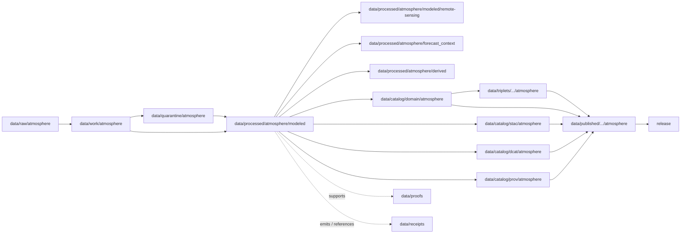

<!-- [KFM_META_BLOCK_V2]
doc_id: kfm://doc/data-processed-atmosphere-modeled-readme
title: data/processed/atmosphere/modeled/README.md — Atmosphere Modeled Processed Data README
version: v0.1
type: readme; data-lifecycle-sublane; processed-stage-guide; atmosphere-domain-lane; modeled-parent-lane
status: draft; PROPOSED; data-root; processed-stage; atmosphere; modeled; release-gated; model-field-aware; uncertainty-aware; source-role-aware
owners: OWNER_TBD — Atmosphere steward · Forecast/model steward · Remote-sensing steward · Data steward · Pipeline steward · Evidence steward · Policy steward · Release steward · Docs steward
created: NEEDS VERIFICATION — one-character placeholder existed before v0.1 expansion
updated: 2026-06-25
policy_label: public-doc; data; processed; atmosphere; modeled; lifecycle; governed; release-gated
tags: [kfm, data, processed, atmosphere, modeled, ForecastContext, WindField, SmokeContext, AODRaster, atmospheric-model-field, remote-sensing-mask, lifecycle, RAW, WORK, QUARANTINE, CATALOG, TRIPLET, PUBLISHED, EvidenceBundle, SourceDescriptor, ModelRunReceipt, ValidationReport, PolicyDecision, ReleaseManifest]
related:
  - ../README.md
  - ./remote-sensing/README.md
  - ../forecast_context/README.md
  - ../aod/README.md
  - ../derived/README.md
  - ../aggregate/README.md
  - ../../README.md
  - ../../../README.md
  - ../../../../docs/domains/atmosphere/README.md
  - ../../../../contracts/domains/atmosphere/ForecastContext.md
  - ../../../../contracts/domains/atmosphere/WindField.md
  - ../../../../contracts/domains/atmosphere/SmokeContext.md
  - ../../../../contracts/domains/atmosphere/AODRaster.md
  - ../../../../contracts/domains/atmosphere/AirObservation.md
  - ../../../../contracts/domains/atmosphere/WeatherObservation.md
  - ../../../../contracts/domains/atmosphere/AdvisoryContext.md
  - ../../../../schemas/contracts/v1/domains/atmosphere/ForecastContext.schema.json
  - ../../../../schemas/contracts/v1/domains/atmosphere/AODRaster.schema.json
  - ../../../../policy/domains/atmosphere/
  - ../../../../docs/doctrine/directory-rules.md
  - ../../../../docs/doctrine/lifecycle-law.md
  - ../../../../docs/doctrine/trust-membrane.md
  - ../../../raw/atmosphere/
  - ../../../work/atmosphere/
  - ../../../quarantine/atmosphere/
  - ../../../catalog/domain/atmosphere/README.md
  - ../../../catalog/stac/atmosphere/
  - ../../../catalog/dcat/atmosphere/
  - ../../../catalog/prov/atmosphere/
  - ../../../triplets/
  - ../../../published/
  - ../../../proofs/
  - ../../../receipts/
  - ../../../registry/
  - ../../../../release/
  - ../../../../pipelines/
  - ../../../../tools/validators/
notes:
  - "This file replaces a one-character placeholder at `data/processed/atmosphere/modeled/README.md`."
  - "This is the parent PROCESSED-stage sublane for modeled Atmosphere artifacts. It organizes modeled products without becoming RAW model storage, observation storage, advisory authority, proof storage, release authority, public layer output, public API/UI output, or life-safety guidance."
  - "Modeled Atmosphere artifacts must preserve model/forecast source role, model-run lineage, initialization time, valid time, forecast horizon, product lineage, uncertainty, evidence linkage, policy posture, and release state before public use."
  - "The child `remote-sensing/` lane covers modeled remote-sensing products that combine model-field and remote-sensing proxy roles while preserving role separation."
  - "ForecastContext and related Atmosphere contracts define object meaning; this README does not create a second contract or schema authority."
  - "Rollback target for this expansion is previous placeholder blob SHA `e25f1814e51579d5f55c0f1fe0135ddb28a47f4a`."
[/KFM_META_BLOCK_V2] -->

<a id="top"></a>

# data/processed/atmosphere/modeled

> Parent Atmosphere PROCESSED-stage lane for modeled artifacts: governed model-run, forecast-run, modeled atmospheric field, forecast-derived, and model-context products that remain distinct from observations, remote-sensing proxies, advisories, evidence proof, release approval, public layers, and life-safety guidance.

<p>
  
  
  
  
  
  
</p>

**Status:** draft / PROPOSED  
**Owners:** OWNER_TBD — Atmosphere steward · Forecast/model steward · Remote-sensing steward · Data steward · Pipeline steward · Evidence steward · Policy steward · Release steward · Docs steward  
**Path:** `data/processed/atmosphere/modeled/README.md`  
**Owning root:** `data/processed/`  
**Domain segment:** `atmosphere`  
**Sublane:** `modeled`  
**Lifecycle stage:** `PROCESSED`  
**Exposure posture:** not public by default; public use requires governed catalog, evidence, model-run/uncertainty disclosure, policy, release, correction, and rollback linkage  
**Truth posture:** CONFIRMED target was a one-character placeholder · CONFIRMED `modeled/remote-sensing/README.md` exists · CONFIRMED `ForecastContext` and `AODRaster` contracts exist · PROPOSED modeled parent processed-lane details · NEEDS VERIFICATION for actual child inventory, validators, receipts, CI enforcement, release linkage, and governed route behavior.

**Quick jumps:** [Purpose](#purpose) · [Lifecycle boundary](#lifecycle-boundary) · [Repo fit](#repo-fit) · [Accepted contents](#accepted-contents) · [Exclusions](#exclusions) · [Modeled-product requirements](#modeled-product-requirements) · [Model guardrails](#model-guardrails) · [Child lanes](#child-lanes) · [Directory map](#directory-map) · [Evidence ledger](#evidence-ledger) · [Validation checklist](#validation-checklist) · [Rollback](#rollback)

---

## Purpose

`data/processed/atmosphere/modeled/` holds normalized modeled Atmosphere/Air artifacts that have moved beyond RAW capture, WORK transforms, and QUARANTINE holds.

This parent lane groups processed model and forecast products across Atmosphere object families: `ForecastContext`, modeled wind fields, model-informed smoke context, model-informed AOD or remote-sensing comparisons, forecast-derived context products, stale/superseded model products, uncertainty-aware model layers, and public-safe model-field visualization candidates.

It is not a raw model-product lane. It is not an observation lane. It is not an advisory authority. It is not official forecast substitution. It is not a proof store, receipt store, source registry, catalog, release, semantic contract, schema, policy, public layer, tile-service, public API/UI surface, or life-safety guidance source. It may support downstream catalog records, EvidenceBundle-backed UI payloads, public-safe model-field visualizations, Focus Mode summaries, advisory referrals, or release packages only after gates pass.

## Lifecycle boundary

```text
RAW -> WORK / QUARANTINE -> PROCESSED -> CATALOG / TRIPLET -> PUBLISHED
```



`data/processed/atmosphere/modeled/` is upstream of catalog, triplet, publication, and release. It must not be used as a normal public map/API/UI/AI source.

## Repo fit

| Responsibility | Correct home | Rule |
|---|---|---|
| Raw model products, GRIB/NetCDF/Zarr/COG exports, source downloads, model-run payloads, QA payloads, source-native tiles, or logs | `data/raw/atmosphere/` | Not this lane. |
| In-process model parsing, variable extraction, reprojection, masking, model/satellite joins, derived layers, scratch outputs, notebooks, or method experiments | `data/work/atmosphere/` | Not this lane. |
| Rights-unclear, source-role-unclear, stale, malformed, unsupported, disputed, uncertainty-missing, QA-missing, or unsafe model material | `data/quarantine/atmosphere/` | Not this lane until resolved. |
| Processed modeled Atmosphere artifacts | `data/processed/atmosphere/modeled/` | This parent lane. |
| Forecast/model-context artifacts | `data/processed/atmosphere/forecast_context/` | Use when the primary artifact is `ForecastContext`. |
| Modeled remote-sensing artifacts | `data/processed/atmosphere/modeled/remote-sensing/` | Child lane for products combining model-field and remote-sensing-mask roles. |
| AOD/remote-sensing proxy artifacts | `data/processed/atmosphere/aod/` | Use when the primary artifact is `AODRaster`, not modeled comparison. |
| Derived cross-context products | `data/processed/atmosphere/derived/` | Use when the product is a general derived candidate. |
| Observed sensor/weather/air observations | Object-family processed lanes such as `air_observations/` or weather lanes if present | Model fields must not impersonate observations. |
| AdvisoryContext processed artifacts | `data/processed/atmosphere/advisory_context/` | Advisory/referral context remains separate. |
| Climate normals/anomalies | `data/processed/atmosphere/climate_normals/`, `climate_anomaly/`, or accepted climate lane | Modeled context is run/valid-time context, not reference-period climate context. |
| Atmosphere domain catalog records | `data/catalog/domain/atmosphere/` | Downstream catalog stage. |
| Atmosphere STAC/DCAT/PROV records | `data/catalog/{stac,dcat,prov}/atmosphere/` | Downstream catalog projections, if accepted. |
| Atmosphere triplet/graph projections | `data/triplets/.../atmosphere/` | Downstream graph stage. |
| Atmosphere public-safe products | `data/published/.../atmosphere/` | Downstream after release. |
| EvidenceBundle/proof records | `data/proofs/` | Separate proof family. |
| Source, run, model-run, transform, validation, QA, policy, correction, and release receipts | `data/receipts/` | Separate receipt family. |
| SourceDescriptor/source registry records | `data/registry/` | Separate registry family. |
| Release decisions, manifests, rollback cards, corrections, withdrawals | `release/` | Separate publication authority. |
| Atmosphere semantic contracts | `contracts/domains/atmosphere/` | Object meaning; not data. |
| Atmosphere schemas | `schemas/contracts/v1/domains/atmosphere/` | Machine shape; not data. |
| Policy, validators, tests, pipelines, apps, packages | `policy/`, `tools/validators/`, `tests/`, `pipelines/`, `apps/`, `packages/` | Separate roots. |

## Accepted contents

Processed modeled Atmosphere data may include:

- normalized model-run, forecast-run, modeled atmospheric field, or forecast-derived context records;
- source-role-preserving metadata for model source, product name, model run, initialization time, run time, valid time, forecast horizon, variable, units, grid/projection, resolution, uncertainty, and caveats;
- modeled wind, smoke, air-quality, forecast, weather, or context products when the source role remains explicit;
- model-informed remote-sensing comparison products when `ATMOSPHERIC_MODEL_FIELD` and `REMOTE_SENSING_MASK` roles remain distinguishable;
- processed model-field derivatives prepared for downstream catalog, public-safe visualization, Focus Mode, or Evidence Drawer review when release has not yet occurred;
- stale-state, supersession, correction, reprocessing, model-run lineage, uncertainty, quality, and caveat sidecars when those sidecars are not proofs, receipts, source registry records, catalog records, schemas, or policy rules;
- processed artifacts prepared for downstream domain catalog, STAC/DCAT/PROV packaging, EvidenceBundle support, triplet generation, LayerManifest creation, or release review.

## Exclusions

Do not store these under `data/processed/atmosphere/modeled/`:

- RAW model products, GRIB/NetCDF/Zarr/COG exports, source downloads, source-native model-run payloads, QA payloads, logs, screenshots, source-native tiles, or source-native records.
- WORK/scratch outputs that have not passed processing gates.
- Quarantined, malformed, stale, source-role-unclear, rights-unclear, uncertainty-missing, QA-missing, unsupported, disputed, or unsafe model material.
- Observed sensor readings, regulatory archive observations, station records, AQI reports, PM2.5 or ozone measurements, AOD rasters, remote-sensing masks, climate normals, climate anomalies, or advisory/referral records unless only referenced as context and stored in their correct lanes.
- Official advisory issuance, official forecast substitution, emergency instructions, life-safety guidance, exposure claims, hazard-impact claims, damages, health/safety claims, regulatory conclusions, or policy conclusions.
- Public layers, public tile outputs, app/UI/API payloads, public downloads, public Focus Mode payloads, or model-answer/runtime outputs.
- Domain catalog records, STAC records, DCAT records, PROV records, triplet/graph records, published outputs, proofs, receipts, source registry records, release records, schemas, policy rules, validators, tests, pipelines, app/UI/API code.

## Modeled-product requirements

PROPOSED until concrete validators and CI enforcement are verified:

| Requirement | Meaning |
|---|---|
| Source trace | Every processed modeled artifact should trace to SourceDescriptor or source registry context when source authority matters. |
| Model-run trace | Model source, model/product name, run/initialization time, valid time, forecast horizon, product version, and correction/supersession lineage should remain visible. |
| Source-role preservation | Model context must remain labeled as `ATMOSPHERIC_MODEL_FIELD` or its governed role; it must not be presented as `OBSERVED_SENSOR` by default. |
| Time semantics | Initialization time, run time, valid time, retrieval time, release time, stale-state, correction time, and supersession time should remain distinguishable where material. |
| Spatial/model metadata | Footprint, grid/projection, resolution, variable, units, nodata handling, QA/model quality, and uncertainty should be explicit enough for downstream validation. |
| Uncertainty disclosure | Uncertainty, ensemble/probabilistic posture, caveats, limitations, confidence, and model assumptions should remain visible before public use. |
| Evidence linkage | Claims about model value, source, run, valid time, uncertainty, correction, or release should resolve downstream to EvidenceBundle/proof context. |
| Policy posture | Public display requires rights, source-role, freshness, uncertainty, caveat, sensitivity, and policy/admissibility posture. |
| Catalog readiness | Processed modeled artifacts intended for discovery should promote through Atmosphere catalog lanes, not directly to public use. |
| Release readiness | Public use requires release state, published output path, correction path, and rollback target. |
| No life-safety by default | Modeled products do not produce official advisories, emergency instructions, exposure claims, or health/safety guidance without separate authority and review. |

## Model guardrails

- Modeled context is not an observed sensor reading.
- Forecast/model fields must not be presented as observations, regulatory archive measurements, or station records.
- Modeled context may inform advisory context, but it does not create official advisory issuance or life-safety instructions.
- Modeled remote-sensing products must preserve whether each input is model context, remote-sensing proxy, observation, advisory context, or another governed role.
- Public model-field visualization requires source rights, model-run receipt, uncertainty disclosure, validation, policy, release record, correction path, and rollback target.
- Modeled context does not prove exposure, hazard, impact, damages, health effect, climate attribution, trend significance, or regulatory status by itself.
- Unreleased processed modeled artifacts are not public merely because they exist under this directory.

> [!CAUTION]
> Do not use this lane as a shortcut from processed model products to observations, official advisories, public warnings, exposure claims, health/safety guidance, public layers, public tiles, or public API/UI payloads. Modeled products must pass catalog, evidence, policy, validation, release, correction, and rollback gates before public use.

## Child lanes

| Child lane | Status | Purpose |
|---|---|---|
| `remote-sensing/` | draft / PROPOSED | Processed products that intentionally combine model-field and remote-sensing-mask/proxy roles while preserving source-role separation. |

Additional child lanes are **PROPOSED** until verified. Candidate future lanes may include:

| Candidate lane | Proposed purpose | Caution |
|---|---|---|
| `forecast-fields/` | Modeled forecast fields and model-run context. | May duplicate `forecast_context/` unless convention is settled. |
| `wind/` | Modeled wind-field products. | Wind can be observed or modeled; role must remain explicit. |
| `smoke/` | Modeled smoke-context products. | Smoke context is not hazards event truth or life-safety alerting. |
| `uncertainty/` | Shared model uncertainty/caveat products. | Must not become proof, policy, or release authority. |

Do not create child lanes as parallel truth stores. Each child must explain what it owns, what it excludes, which object families it touches, and how it promotes downstream.

## Directory map

Actual child inventory remains **NEEDS VERIFICATION**. Use this as a proposed local organization pattern only after confirming current repo convention and validators.

```text
data/processed/atmosphere/modeled/
├── README.md
├── remote-sensing/          # CONFIRMED child README exists; modeled/proxy comparison lane
├── forecast-fields/         # PROPOSED — model-field products; avoid duplicate forecast_context authority
├── wind/                    # PROPOSED — modeled wind products
├── smoke/                   # PROPOSED — modeled smoke context, not hazards truth
├── uncertainty/             # PROPOSED — model uncertainty/caveat sidecars, not proofs
├── model_runs/              # PROPOSED — run lineage sidecars, not receipts
├── quality/                 # PROPOSED — model QA/validation sidecars
├── _manifests/              # PROPOSED — lane-local non-release manifests only
└── _README_TODO.md          # PROPOSED — remove after actual child inventory is documented
```

## Evidence ledger

| Source | Status | Supports | Limits |
|---|---|---|---|
| Previous file | CONFIRMED | Target existed as a one-character placeholder. | Did not define modeled PROCESSED-stage boundaries. |
| `data/processed/atmosphere/modeled/remote-sensing/README.md` | CONFIRMED child README | Child lane exists for model-field and remote-sensing-mask/proxy products. | Child lane does not prove all parent modeled inventory or release behavior. |
| `data/processed/atmosphere/forecast_context/README.md` | CONFIRMED sibling README | Forecast/model context processed boundaries and model-is-not-observation posture. | Does not make `modeled/` canonical by itself. |
| `data/processed/atmosphere/aod/README.md` | CONFIRMED sibling README | AOD/remote-sensing proxy processed boundaries and AOD-is-not-PM2.5 posture. | Does not make `modeled/` canonical by itself. |
| `data/processed/atmosphere/derived/README.md` | CONFIRMED sibling README | Derived product boundary for public-safe candidates upstream of release. | Does not decide all modeled-product placement. |
| `data/processed/README.md` | CONFIRMED | Parent processed lane is upstream of catalog, triplets, and publication and is not public by default. | Does not prove child inventory under this lane. |
| `data/catalog/domain/atmosphere/README.md` | CONFIRMED | Atmosphere catalog lane includes forecast/model context downstream and preserves source-role guardrails. | Does not prove modeled processed inventory or release behavior. |
| `docs/domains/atmosphere/README.md` | CONFIRMED doctrine / PROPOSED implementation | Atmosphere owns model/advisory context, public-safe derived products, and source-role denials. | Implementation maturity and runtime behavior remain NEEDS VERIFICATION. |
| `contracts/domains/atmosphere/ForecastContext.md` | CONFIRMED contract file | Defines ForecastContext as governed model/forecast context, not observation, advisory, life-safety instruction, proof, public layer, or release approval. | Contract does not prove schema enforcement, validator behavior, or release approval. |
| `contracts/domains/atmosphere/AODRaster.md` | CONFIRMED contract file | Defines AODRaster as aerosol optical depth remote-sensing proxy, not PM2.5, AQI, ground observation, proof, release approval, or health/safety guidance. | Contract does not prove schema enforcement, validator behavior, or release approval. |
| `docs/doctrine/directory-rules.md` | CONFIRMED doctrine / PROPOSED path specifics | Data paths encode lifecycle phase and domain segment; promotion is governed. | Does not prove runtime enforcement. |

## Validation checklist

- [ ] Confirm actual child directories under `data/processed/atmosphere/modeled/`.
- [ ] Confirm whether `modeled/`, `forecast_context/`, `aod/`, and `derived/` placement conventions are canonical, aliases, compatibility lanes, or transitional lanes.
- [ ] Confirm accepted modeled source/domain path convention.
- [ ] Confirm schemas/profiles for modeled derivatives and their relation to `ForecastContext`, `WindField`, `SmokeContext`, and `AODRaster`.
- [ ] Confirm processed validators and CI checks.
- [ ] Confirm SourceDescriptor/source registry linkage for every source-derived modeled artifact.
- [ ] Confirm model-run lineage, valid/retrieval/processing time, product version, uncertainty, QA/model-quality handling, stale-state, correction, and supersession handling.
- [ ] Confirm model-field-vs-observation, forecast-vs-advisory, model-vs-remote-sensing, AOD-vs-PM2.5, and model-vs-climate-context boundaries.
- [ ] Confirm RunReceipt, ModelRunReceipt, TransformReceipt, ValidationReport, PolicyDecision, correction path, and rollback target where applicable.
- [ ] Confirm no RAW, WORK, QUARANTINE, CATALOG, TRIPLET, PUBLISHED, proof, receipt, release, schema, policy, validator, package, pipeline, app, API, public layer, public tile, observation, PM2.5, AQI, advisory, official warning, exposure, health/safety, or regulatory-claim artifacts are misplaced here.
- [ ] Confirm promotion flow from processed modeled data to catalog/triplet/published outputs is governed, source-role-safe, uncertainty-aware, evidence-backed, and reversible.
- [ ] Confirm public clients and Focus Mode cannot use this lane as a direct observation, PM2.5, AQI, official advisory, public warning, exposure, emergency, regulatory, or life-safety source.

## Rollback

Rollback is required if this lane becomes an Atmosphere source-data root, ForecastContext replacement, AODRaster replacement, observation substitute, PM2.5 substitute, AQI substitute, advisory authority root, official warning/public-alerting root, quarantine bypass, proof store, receipt store, catalog root, triplet root, source-registry root, release-decision root, published-output root, public layer root, public tile root, schema root, policy root, validator root, implementation root, public API shortcut, public exposure shortcut, public health/exposure source, regulatory-claim source, emergency instruction source, or life-safety guidance source.

Rollback target for this expansion: previous placeholder blob SHA `e25f1814e51579d5f55c0f1fe0135ddb28a47f4a`.

<p align="right"><a href="#top">Back to top</a></p>
